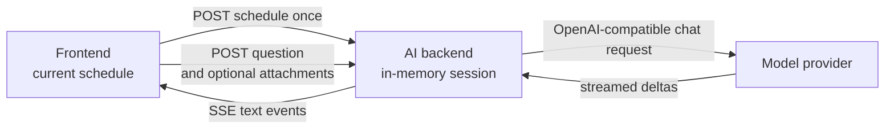

# Experimental AI Assistant Backend

The AI assistant is a separate FastAPI application that answers text questions
about one schedule snapshot. Its ASGI entry point is
`nurse_scheduling.ai_serve:app`. It does not import the optimization server or
use its Redis data.

Image and UTF-8 text document attachments are enabled by default and can be
disabled independently. Supported documents are TXT, Markdown, and CSV. This
version excludes PDF, XLSX, retrieval, tools, YAML proposals, and schedule
mutation.

## Run locally

Copy the secret-free template from the repository root:

```sh
cp .env.ai.example .env.ai
```

Review the values in `.env.ai`. Set the provider URL, API key, model, and other
settings for your environment, then start the service:

```sh
./scripts/start_ai_backend.sh
curl http://localhost:8001/health
```

The launcher reads `.env.ai` automatically. Set `AI_ENV_FILE` to load another
path. Port `8001` avoids the normal backend on `8000`. Use another port for a
local documentation server when both services run at the same time. The
documented local MkDocs port is `8003`.

During local development, the frontend calls port `8001` on the browser's
current hostname. This avoids buffering SSE through a Next.js development
rewrite. Set `NEXT_PUBLIC_AI_API_URL` before starting the frontend when the
browser must use another AI backend URL. Production uses the same-origin `/ai`
route through NGINX.

## Architecture



The browser receives an HTTP-only owner cookie and an unguessable session UUID.
The backend stores the YAML snapshot and completed conversation turns. Each
provider request includes the stored YAML, recent history, and current
question. Enabled attachments are included only in the active provider
request. **Images and document contents are not included in subsequent chat
history.** This is intentional to avoid repeatedly consuming provider context
tokens. History retains only attachment markers and document filenames.
Schedules and attachments are labeled as untrusted data in the system prompt.

The provider boundary uses OpenAI-compatible chat completions. The
[Cloudflare Tunnel example](https://github.com/j3soon/local-llm-notes/tree/main/examples/basic-secure-api/cloudflare)
shows one compatible deployment pattern.

## Configuration

| Variable | Default | Purpose |
| --- | --- | --- |
| `AI_PROVIDER_BASE_URL` | Required | OpenAI-compatible API base URL. |
| `AI_PROVIDER_API_KEY` | Required | Provider bearer token. Never commit it. |
| `AI_PROVIDER_MODEL` | `local-model` | Model value sent to chat completions. |
| `AI_PROVIDER_TIMEOUT_SECONDS` | `120` | Provider request timeout. |
| `AI_BACKEND_PORT` | `8001` | Port used by the development launcher. |
| `AI_COOKIE_SECURE` | `0` in the launcher | Use `0` for local HTTP and `1` for public HTTPS. |
| `AI_SESSION_TTL_SECONDS` | `3600` | Idle session lifetime. |
| `AI_MAX_SESSIONS` | `1000` | Maximum process-local sessions. |
| `AI_MAX_HISTORY_MESSAGES` | `20` | Conversation messages retained per session. |
| `AI_MAX_MESSAGE_CHARS` | `8000` | Maximum question length. |
| `AI_MAX_SCHEDULE_BYTES` | `1000000` | Maximum UTF-8 YAML snapshot size. |
| `AI_MAX_CONCURRENT_REQUESTS` | `4` | Maximum simultaneous provider streams. |
| `AI_ATTACHMENT_MODE` | `images` | Use `none` to disable image attachments. |
| `AI_MAX_IMAGE_FILES` | `4` | Maximum images attached to one question. |
| `AI_MAX_IMAGE_BYTES` | `5000000` | Maximum bytes per image. |
| `AI_DOCUMENT_ATTACHMENT_MODE` | `text` | Use `none` to disable TXT, Markdown, and CSV attachments. |
| `AI_MAX_DOCUMENT_FILES` | `4` | Maximum text documents attached to one question. |
| `AI_MAX_DOCUMENT_BYTES` | `50000` | Maximum UTF-8 bytes per text document. |

## Run in the development container

Build the existing all-in-one development image from the repository root:

```sh
docker build -f docker/Dockerfile -t nurse-scheduling:dev .
docker run --rm -it \
  --name nurse-scheduling-dev \
  --network=host \
  --env-file .env.ai \
  -v "$(pwd):/app" \
  nurse-scheduling:dev
```

Start the AI backend inside the container:

```sh
./scripts/start_ai_backend.sh
```

Start the frontend from another host terminal:

```sh
docker exec -it -w /app nurse-scheduling-dev \
  ./scripts/start_frontend.sh --hostname 0.0.0.0
```

The normal optimization backend is optional for this chat flow.

## Production proxy

Disable response buffering on the streaming AI route. See the
[NGINX proxy buffering directive](https://nginx.org/en/docs/http/ngx_http_proxy_module.html#proxy_buffering).

```nginx
location /ai/ {
    proxy_pass http://ai-backend:8001/;
    proxy_http_version 1.1;
    proxy_buffering off;
    proxy_cache off;
}
```

## HTTP API

| Endpoint | Purpose |
| --- | --- |
| `GET /health` | Process and service identity check. |
| `GET /ready` | Required configuration accepted at startup. |
| `GET /capabilities` | Enabled optional features and their public limits. |
| `POST /sessions` | Store a YAML snapshot and create a browser-owned session. |
| `POST /sessions/{id}/messages` | Stream one answer. Accepts JSON text or multipart text and attachments. |

Multipart requests use one `message` field, repeated `images` file fields, and
repeated `documents` file fields. Sessions are process-local. Use one AI
backend instance until shared AI storage is added.

## Security notes

- Keep `.env.ai` private. Git ignores it, while `.env.ai.example` contains only
  placeholders.
- Use `AI_COOKIE_SECURE=0` only for local HTTP. Set it to `1` when the public
  browser route uses HTTPS, even if NGINX uses internal HTTP to the container.
- The owner cookie contains an opaque UUID, not the provider key. It is not a
  replacement for future account authentication.
- The complete schedule is sent to the configured provider. Use an approved
  provider and anonymize sensitive schedules when required.
- Accepted images are signature-checked and bounded before they are sent to the
  provider. Configure a matching request-body limit at the public reverse proxy.
- Accepted documents are bounded and checked for a matching supported filename
  extension, declared MIME type, and strict UTF-8 text content.
- A failed or cancelled answer is not added to conversation history.

## Troubleshoot local development

| Problem | What to check |
| --- | --- |
| Send fails immediately | Start the AI backend and request `http://localhost:8001/health`. |
| Provider unavailable | Check `AI_PROVIDER_BASE_URL`, `AI_PROVIDER_API_KEY`, and provider availability. |
| An attachment is rejected | Check its supported type and the configured size and count limits. Text documents must use UTF-8. |
| An answer stops early | Retry it. Cancelled and failed answers are not added to backend history. |

### Capability-gated controls

Optional controls stay hidden when the backend disables every attachment type
or capability discovery fails. Image mode defaults to `images`, while document
mode defaults to `text`. Confirm these were not changed to `none`, then compare
the direct and browser-facing responses:

```sh
curl http://127.0.0.1:8001/capabilities
curl http://localhost:8001/capabilities
```

Use the hostname that is open in the browser for the second command. If local
capability discovery fails, check that port `8001` is reachable and accepts the
frontend origin. In production, check `/ai/capabilities` through NGINX instead.
When developing in a container, also test the container address used by the
browser. A loopback-only test can miss a blocked Next.js development origin,
CORS failure, or incomplete hydration.

## Validate

Run the focused checks inside the development container:

```sh
cd /app/core
ruff check nurse_scheduling/ai nurse_scheduling/ai_serve.py tests/test_ai_basic.py
pytest -q tests/test_ai_basic.py

cd /app/web-frontend
bun run test -- \
  src/app/experimental-ai/aiClient.test.ts \
  src/app/experimental-ai/page.test.tsx \
  src/components/Navigation.test.tsx
bun run build
bun run test:e2e:affected -- e2e/experimental-ai-basic.spec.ts
```
