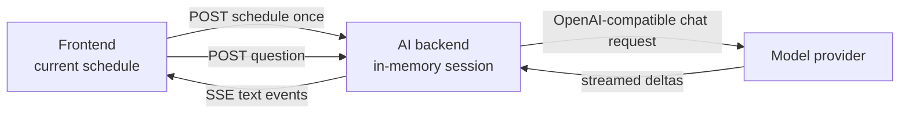

# Experimental AI Assistant Backend

The AI assistant is a separate FastAPI application that answers text questions
about one schedule snapshot. Its ASGI entry point is
`nurse_scheduling.ai_serve:app`. It does not import the optimization server or
use its Redis data.

This first version excludes attachments, retrieval, tools, YAML proposals, and
schedule mutation.

## Run locally

Copy the secret-free template from the repository root:

```sh
cp .env.ai.example .env.ai
```

Review the values in `.env.ai`. Set the provider URL, API key, model, and other
settings for your environment, then start the service:

```sh
./scripts/start_ai_backend.sh
curl http://localhost:8001/health
```

The launcher reads `.env.ai` automatically. Set `AI_ENV_FILE` to load another
path. Port `8001` avoids the normal backend on `8000`. Use another port for a
local documentation server when both services run at the same time.

The frontend automatically selects `http://localhost:8001` during local
development. Set `NEXT_PUBLIC_AI_API_URL` before starting or building the
frontend when it must use another AI backend URL.

## Architecture



The browser receives an HTTP-only owner cookie and an unguessable session UUID.
The backend stores the YAML snapshot and completed conversation turns. Each
provider request includes the stored YAML, recent history, and current
question. Schedule contents are labeled as untrusted data in the system
prompt.

The provider boundary uses OpenAI-compatible chat completions. The
[Cloudflare Tunnel example](https://github.com/j3soon/local-llm-notes/tree/main/examples/basic-secure-api/cloudflare)
shows one compatible deployment pattern.

## Configuration

| Variable | Default | Purpose |
| --- | --- | --- |
| `AI_PROVIDER_BASE_URL` | Required | OpenAI-compatible API base URL. |
| `AI_PROVIDER_API_KEY` | Required | Provider bearer token. Never commit it. |
| `AI_PROVIDER_MODEL` | `local-model` | Model value sent to chat completions. |
| `AI_PROVIDER_TIMEOUT_SECONDS` | `120` | Provider request timeout. |
| `AI_BACKEND_PORT` | `8001` | Port used by the development launcher. |
| `AI_COOKIE_SECURE` | `0` in the launcher | Use `0` for local HTTP and `1` for public HTTPS. |
| `AI_SESSION_TTL_SECONDS` | `3600` | Idle session lifetime. |
| `AI_MAX_SESSIONS` | `1000` | Maximum process-local sessions. |
| `AI_MAX_HISTORY_MESSAGES` | `20` | Conversation messages retained per session. |
| `AI_MAX_MESSAGE_CHARS` | `8000` | Maximum question length. |
| `AI_MAX_SCHEDULE_BYTES` | `1000000` | Maximum UTF-8 YAML snapshot size. |
| `AI_MAX_CONCURRENT_REQUESTS` | `4` | Maximum simultaneous provider streams. |

## Run in the development container

Build the existing all-in-one development image from the repository root:

```sh
docker build -f docker/Dockerfile -t nurse-scheduling:dev .
docker run --rm -it \
  --name nurse-scheduling-dev \
  --network=host \
  --env-file .env.ai \
  -v "$(pwd):/app" \
  nurse-scheduling:dev
```

Start the AI backend inside the container:

```sh
./scripts/start_ai_backend.sh
```

Start the frontend from another host terminal:

```sh
docker exec -it -w /app nurse-scheduling-dev \
  ./scripts/start_frontend.sh --hostname 0.0.0.0
```

The normal optimization backend is optional for this text-only chat flow.

## HTTP API

| Endpoint | Purpose |
| --- | --- |
| `GET /health` | Process and service identity check. |
| `GET /ready` | Required configuration accepted at startup. |
| `POST /sessions` | Store a YAML snapshot and create a browser-owned session. |
| `POST /sessions/{id}/messages` | Stream one answer as `delta`, `done`, or `error` SSE events. |

Sessions are process-local. Use one AI backend instance until shared AI storage
is added.

## Security notes

- Keep `.env.ai` private. Git ignores it, while `.env.ai.example` contains only
  placeholders.
- Use `AI_COOKIE_SECURE=0` only for local HTTP. Set it to `1` when the public
  browser route uses HTTPS, even if NGINX uses internal HTTP to the container.
- The owner cookie contains an opaque UUID, not the provider key. It is not a
  replacement for future account authentication.
- The complete schedule is sent to the configured provider. Use an approved
  provider and anonymize sensitive schedules when required.
- A failed or cancelled answer is not added to conversation history.

## Validate

Run the focused checks inside the development container:

```sh
cd /app/core
ruff check nurse_scheduling/ai nurse_scheduling/ai_serve.py tests/test_ai_basic.py
pytest -q tests/test_ai_basic.py

cd /app/web-frontend
bun run test -- \
  src/app/experimental-ai/aiClient.test.ts \
  src/app/experimental-ai/page.test.tsx \
  src/components/Navigation.test.tsx
bun run build
bun run test:e2e:affected -- e2e/experimental-ai-basic.spec.ts
```
