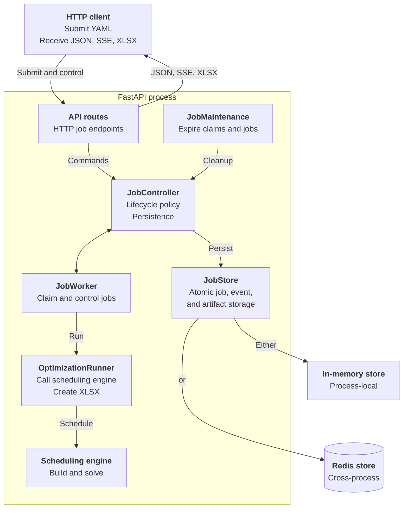
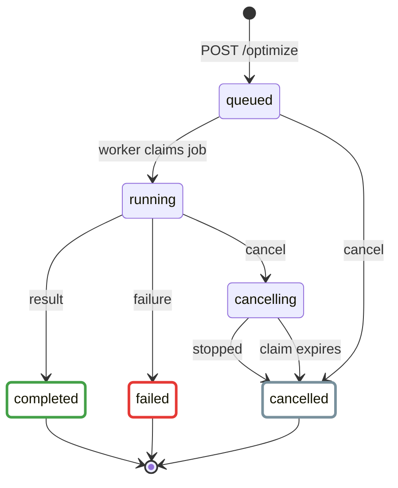

# Backend Server

The backend server is an asynchronous FastAPI service. It accepts scheduling
YAML, retains job state and events, runs jobs in the background, and serves the
resulting XLSX artifact.

This page covers only the HTTP server and its job infrastructure. The CLI,
scheduling model, solver implementations, and frontend are out of scope.

## Run Locally

After installing the core dependencies, start the development server from the
repository root:

```sh
./scripts/start_backend.sh
```

Verify the process and its dependencies:

```sh
export API_URL="${API_URL:-http://localhost:8000}"

curl "$API_URL/ready"
curl "$API_URL/health"
```

`/ready` returns a minimal readiness result. `/health` also includes the API and
application versions. Interactive OpenAPI documentation is available at
`$API_URL/docs`, with the schema at `$API_URL/openapi.json`.

## Architecture



| Component | Responsibility |
| --- | --- |
| `server/app.py` | Constructs the FastAPI app, dependencies, background services, health checks, and error handlers. |
| `server/api/` | Translates HTTP requests and responses, including the SSE event stream. |
| `server/jobs/controller.py` | Owns job lifecycle policy independently of HTTP and persistence. |
| `server/job_store.py` | Defines the atomic persistence contract implemented by memory and Redis stores. |
| `server/jobs/worker.py` | Owns the process-local claim loop. It renews leases, forwards controls and events, invokes the runner, and reports the terminal outcome. |
| `server/jobs/runner.py` | Adapts one blocking job execution to the synchronous scheduler. It normalizes progress and results and creates the XLSX artifact without knowing HTTP or persistence. |
| `server/maintenance.py` | Expires lost worker claims and retained terminal jobs. |

`nurse_scheduling.serve:app` is the public ASGI entry point. Each application
process owns one worker thread and one maintenance thread. The worker renews its
claim lease while a job is running.

The worker owns job lifecycle orchestration. The runner owns one scheduler
invocation and its output conversion.

## Job Lifecycle



`completed`, `cancelled`, and `failed` are terminal states. A completed job may
be optimal, feasible, or infeasible. An XLSX artifact is available only when a
schedule was produced.

Cancellation of a running job and early completion require cooperative stop
support. Early completion sets a control flag without adding another lifecycle
state. If a current result is available, the job later becomes `completed`.

## HTTP API

| Method | Path | Purpose |
| --- | --- | --- |
| `GET` | `/` | Return API identity and version information. |
| `GET` | `/health` | Check the store and worker, including version information. |
| `GET` | `/ready` | Return a minimal readiness result for routing and deployment probes. |
| `POST` | `/optimize` | Validate multipart input and enqueue a job. |
| `GET` | `/optimize/{job_id}` | Return the current job representation. |
| `GET` | `/optimize/{job_id}/events` | Replay and stream job events over SSE. |
| `POST` | `/optimize/{job_id}/cancel` | Cancel a queued job or request cooperative cancellation. |
| `POST` | `/optimize/{job_id}/finish-now` | Request the current feasible result when supported. |
| `GET` | `/optimize/{job_id}/xlsx` | Download a completed schedule artifact. |
| `DELETE` | `/optimize/{job_id}` | Delete a terminal job and its retained data. |

Prepare the input using the [Scheduling Data](scheduling-data.md) contract.
Submit either a YAML file or a YAML string, but not both:

```sh
curl -i \
  -F file=@core/tests/testcases/basics/01_1nurse_1shift_1day.yaml \
  -F timeout=60 \
  "$API_URL/optimize"
```

The server returns `202 Accepted`, the job representation, a `Location` header,
and `Retry-After: 1`. Use the returned job ID to follow events and download the
result:

```sh
export JOB_ID="<job_id>"

curl -N "$API_URL/optimize/$JOB_ID/events"
curl -OJ "$API_URL/optimize/$JOB_ID/xlsx"

# Delete retained data after the job reaches a terminal state.
curl -i -X DELETE "$API_URL/optimize/$JOB_ID"
```

The server persists and replays `job.state_changed`, `job.phase_changed`,
`job.progressed`, `job.control_changed`, and `job.result_available` events. Send
`Last-Event-ID` when reconnecting to continue after the last received event.
Disconnecting from the stream does not stop the job.

Job submission sets a seven-day, HTTP-only client correlation cookie for
diagnostics. It does not control access to a job or its lifetime. Browser CORS
access is limited to local origins and `nursescheduling.org` subdomains.

Lifecycle and storage errors use a stable JSON envelope:

```json
{
  "error": {
    "code": "job_not_found",
    "message": "Job was not found"
  }
}
```

Request parsing and validation errors retain FastAPI's standard error format.
Common status codes include `404` for missing resources, `409` for invalid job
operations, `413` for oversized YAML, and `429` when job capacity is exhausted.

## Storage and Scaling

| Backend | Intended use | Behavior |
| --- | --- | --- |
| Memory | Local development and one server process | Jobs, inputs, events, and artifacts are process-local and are lost on restart. |
| Redis | Multiple server processes or machines | Job data and claims are shared. Durability depends on the configured Redis persistence policy. |

Do not use memory mode with multiple Uvicorn workers. A later request may reach
a different process that does not contain the job. Redis mode coordinates job
claims across processes. Each process still executes at most one job at a time.

Example with three server processes:

```sh
cd core
JOB_BACKEND=redis \
JOB_REDIS_URL=redis://localhost:6379/0 \
uvicorn nurse_scheduling.serve:app \
  --workers 3 \
  --host 0.0.0.0 \
  --port 8000 \
  --no-access-log
```

## Configuration

All server settings are read once when the application is constructed.

| Environment variable | Default | Purpose |
| --- | --- | --- |
| `JOB_BACKEND` | `memory` | Select `memory` or `redis` storage. |
| `JOB_REDIS_URL` | `redis://localhost:6379/0` | Set the Redis connection URL. |
| `JOB_REDIS_KEY_PREFIX` | `nurse_scheduling:jobs:v0` | Namespace and schema version for Redis keys. |
| `JOB_MAX_PENDING` | `8` | Limit queued, running, and cancelling jobs. |
| `JOB_MAX_RETAINED` | `128` | Limit all retained jobs, including terminal jobs. |
| `JOB_RETENTION_SECONDS` | `86400` | Retain terminal jobs for this duration. |
| `JOB_MAX_EVENTS_PER_JOB` | `1000` | Limit replayable events retained per job. |
| `JOB_CLAIM_POLL_SECONDS` | `1` | Set the delay between attempts to claim work. |
| `JOB_CLAIM_LEASE_SECONDS` | `90` | Set how long a worker claim remains valid without renewal. |
| `JOB_MAINTENANCE_INTERVAL_SECONDS` | `30` | Set the delay between maintenance passes. |
| `JOB_SSE_KEEPALIVE_SECONDS` | `10` | Set the maximum SSE wait before a keepalive. |
| `OPTIMIZE_MAX_YAML_BYTES` | `2097152` | Limit the submitted YAML size. |
| `OPTIMIZE_DEFAULT_TIMEOUT_SECONDS` | `300` | Set the timeout used when a request omits one. |
| `OPTIMIZE_MAX_TIMEOUT_SECONDS` | `3600` | Limit the timeout accepted from a request. |
| `DISABLE_SENTRY` | unset | Disable backend error reporting when set to a non-empty value. |
| `SENTRY_RELEASE` | derived from the app version | Override the release reported to Sentry. |

Numeric values must be positive. `JOB_MAX_RETAINED` must be at least
`JOB_MAX_PENDING`, and the default optimization timeout must not exceed the
maximum timeout.

## Tests

Run the primary server tests from `core/`:

```sh
pytest --log-cli-level=INFO tests/test_serve.py
pytest --log-cli-level=INFO tests/test_optimize_job_backends.py
```

To include Redis integration coverage, start a local Redis instance and use a
dedicated database:

```sh
JOB_REDIS_TEST_URL=redis://localhost:6379/15 \
pytest --log-cli-level=INFO tests/test_optimize_job_backends.py
```
