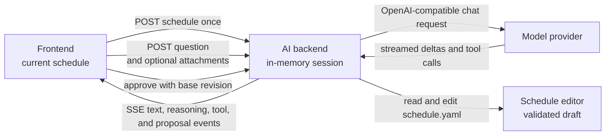

# Experimental AI Assistant Backend

The AI assistant is a separate FastAPI application that answers text questions
about one schedule snapshot. Its ASGI entry point is
`nurse_scheduling.ai_serve:app`. It does not import the optimization server or
use its Redis data.

Image and document attachments are enabled by default and can be disabled
independently. Supported documents are TXT, Markdown, CSV, PDF, and XLSX. The
assistant reads and edits the schedule through tools and can propose a new
schedule, which the browser applies only after the user approves it. This
version excludes retrieval and repository access.

## Run locally

Copy the secret-free template from the repository root:

```sh
cp .env.ai.example .env.ai
```

Review the values in `.env.ai`. Set the provider URL, API key, model, and other
settings for your environment, then start the service:

```sh
./scripts/start_ai_backend.sh
curl http://localhost:8001/health
```

The launcher reads `.env.ai` automatically. Set `AI_ENV_FILE` to load another
path. Port `8001` avoids the normal backend on `8000`. Use another port for a
local documentation server when both services run at the same time. The
documented local Zensical port is `8003`.

During local development, the frontend calls port `8001` on the browser's
current hostname. This avoids buffering SSE through a Next.js development
rewrite. Set `NEXT_PUBLIC_AI_API_URL` before starting the frontend when the
browser must use another AI backend URL. Production uses the same-origin `/ai`
route through NGINX.

## Architecture



The browser receives an HTTP-only owner cookie and an unguessable session UUID.
The backend stores the YAML snapshot and completed conversation turns. Each
provider request includes the stored YAML, recent history, and current
question. Enabled attachments are included only in the active provider
request. **Images and document contents are not included in subsequent chat
history.** This is intentional to avoid repeatedly consuming provider context
tokens. History retains only attachment markers and document filenames.
Schedules and attachments are labeled as untrusted data in the system prompt.

## Reasoning and tool activity

Providers stream reasoning in a field of its own, either `reasoning_content` or
`reasoning`, and the adapter forwards it as a separate event. It is never joined
to the answer text, never stored in conversation history, and never sent back to
the provider, so it cannot leak into an assistant message and costs nothing on
later turns.

The `tool` event carries the tool name, the arguments the model sent, the result
it received, and whether the call did what it was asked. Nothing is truncated on
the server. The browser reveals long output in portions instead.

## Evaluation

The assistant is evaluated against fixed cases with verifiable criteria. This is
evaluation, and is separate from the solver performance benchmark described in
the backend server guide.

`core/tests/ai_eval/cases/` holds the cases grouped by category, from questions
answerable from the prompt summary through schedule edits to requests that must
be refused. Each case states criteria over the schedule a run produces, so
grading does not depend on how the assistant reached it. Every run contacts the
configured provider, so this is a manual tool rather than part of CI.

The runner needs the same provider settings the service uses:

| Variable | Required | Purpose |
| --- | --- | --- |
| `AI_PROVIDER_BASE_URL` | Yes | OpenAI-compatible endpoint. |
| `AI_PROVIDER_API_KEY` | Yes | Provider bearer token. |
| `AI_PROVIDER_MODEL` | No | Defaults to `local-model`. |
| `AI_MAX_TOOL_CALLS` | No | Tool calls allowed for one case. |
| `AI_MAX_SCHEDULE_EDITS` | No | Failed edits allowed for one case. |
| `AI_EVAL_ARTIFACT_ROOT` | No | Report root, `artifacts` by default. |

The launcher reads them from `.env.ai`, so the shortest form is:

```sh
./scripts/run_ai_eval.sh
./scripts/run_ai_eval.sh --category 01-reading
```

To run it without the launcher, load the settings first:

```sh
set -a && . ./.env.ai && set +a
cd core && python -m tests.ai_eval.runner --category 01-reading
```

Select cases with `--case` and `--category`, both repeatable.

Every run writes a report to its own directory under
`artifacts/ai-evals/<timestamp>/`, alongside the performance benchmark reports,
and prints the path when it finishes. `summary.md` holds the pass count, median
seconds, provider turns, and tool calls per category, `results.jsonl` holds one
line per case, and `cases/<id>.json` holds the whole run for one case: the
prompt it was given, its reasoning, every tool call with its arguments and
result, the answer, the proposed schedule, and each criterion with its
outcome. Pass `--output-dir` to
choose the directory, which must not already exist, or set
`AI_EVAL_ARTIFACT_ROOT` to move the root.

## Proposal lifecycle

The assistant edits one virtual file, `schedule.yaml`, through three tools:
`view_schedule`, `edit_schedule`, and `write_schedule`. Every change is
validated against the schedule shapes the web frontend can edit, and the working
draft advances only when the result is valid. A failed edit spends one of
`AI_MAX_SCHEDULE_EDITS` attempts.

A finished run that changed the schedule leaves one pending proposal. The
browser receives its structural diff, never its YAML. `POST
/sessions/{id}/proposal/approve` requires the SHA-256 of the schedule the
browser holds, so a proposal built on an older schedule is discarded instead of
applied. The approved schedule is revalidated before it is returned, becomes the
session schedule, and the browser applies it through the normal YAML import path
as one undo step. `POST /sessions/{id}/proposal/reject` drops it, and `PUT
/sessions/{id}/schedule` replaces the snapshot when the schedule changed
elsewhere in the app, which also drops any pending proposal.

A run that fails, is cancelled, or is abandoned leaves no proposal. A run that
only answers a question never creates one.

The provider boundary uses OpenAI-compatible chat completions. The
[Cloudflare Tunnel example](https://github.com/j3soon/local-llm-notes/tree/main/examples/basic-secure-api/cloudflare)
shows one compatible deployment pattern.

## Configuration

| Variable | Default | Purpose |
| --- | --- | --- |
| `AI_PROVIDER_BASE_URL` | Required | OpenAI-compatible API base URL. |
| `AI_PROVIDER_API_KEY` | Required | Provider bearer token. Never commit it. |
| `AI_PROVIDER_MODEL` | `local-model` | Model value sent to chat completions. |
| `AI_PROVIDER_TIMEOUT_SECONDS` | `120` | Provider request timeout. |
| `AI_BACKEND_PORT` | `8001` | Port used by the development launcher. |
| `AI_COOKIE_SECURE` | `0` in the launcher | Use `0` for local HTTP and `1` for public HTTPS. |
| `AI_SESSION_TTL_SECONDS` | `3600` | Idle session lifetime. |
| `AI_MAX_SESSIONS` | `1000` | Maximum process-local sessions. |
| `AI_MAX_HISTORY_MESSAGES` | `20` | Conversation messages retained per session. |
| `AI_MAX_MESSAGE_CHARS` | `8000` | Maximum question length. |
| `AI_MAX_SCHEDULE_BYTES` | `1000000` | Maximum UTF-8 YAML snapshot size. |
| `AI_MAX_CONCURRENT_REQUESTS` | `4` | Maximum simultaneous provider streams. |
| `AI_MAX_TOOL_CALLS` | `5` | Maximum executed tool calls for one answer. Excess calls receive an error before one tool-free final response. |
| `AI_MAX_SCHEDULE_EDITS` | `5` | Failed schedule edits allowed before the assistant must stop. |
| `AI_ATTACHMENT_MODE` | `images` | Use `none` to disable image attachments. |
| `AI_MAX_IMAGE_FILES` | `4` | Maximum images attached to one question. |
| `AI_MAX_IMAGE_BYTES` | `5000000` | Maximum bytes per image. |
| `AI_DOCUMENT_ATTACHMENT_MODE` | `text` | Use `none` to disable document-to-text ingestion. |
| `AI_MAX_DOCUMENT_FILES` | `4` | Maximum documents attached to one question. |
| `AI_MAX_DOCUMENT_BYTES` | `5000000` | Maximum upload bytes per document. |
| `AI_MAX_DOCUMENT_TEXT_CHARS` | `50000` | Maximum extracted prompt characters per document. |
| `AI_MAX_PDF_PAGES` | `100` | Maximum pages per PDF. |
| `AI_MAX_XLSX_SHEETS` | `20` | Maximum worksheets per XLSX workbook. |
| `AI_MAX_XLSX_CELLS` | `100000` | Maximum rectangular cell span across an XLSX workbook. |
| `AI_MAX_XLSX_UNCOMPRESSED_BYTES` | `50000000` | Maximum total expanded XLSX archive bytes. |

`AI_MAX_AGENT_TURNS` remains accepted for compatibility when
`AI_MAX_TOOL_CALLS` is unset. The service subtracts one reserved final turn
from the former value to derive the tool-call limit.

## Run in the development container

Build the existing all-in-one development image from the repository root:

```sh
docker build -f docker/Dockerfile -t nurse-scheduling:dev .
docker run --rm -it \
  --name nurse-scheduling-dev \
  --network=host \
  --env-file .env.ai \
  -v "$(pwd):/app" \
  nurse-scheduling:dev
```

Start the AI backend inside the container:

```sh
./scripts/start_ai_backend.sh
```

Start the frontend from another host terminal:

```sh
docker exec -it -w /app nurse-scheduling-dev \
  ./scripts/start_frontend.sh --hostname 0.0.0.0
```

The normal optimization backend is optional for this chat flow.

## Production proxy

Disable response buffering on the streaming AI route. See the
[NGINX proxy buffering directive](https://nginx.org/en/docs/http/ngx_http_proxy_module.html#proxy_buffering).

```nginx
location /ai/ {
    proxy_pass http://ai-backend:8001/;
    proxy_http_version 1.1;
    proxy_buffering off;
    proxy_cache off;
}
```

## HTTP API

| Endpoint | Purpose |
| --- | --- |
| `GET /health` | Process and service identity check. |
| `GET /ready` | Required configuration accepted at startup. |
| `GET /capabilities` | Enabled optional features and their public limits. |
| `POST /sessions` | Store a YAML snapshot and create a browser-owned session. |
| `POST /sessions/{id}/messages` | Stream one answer. Accepts JSON text or multipart text and attachments. |

Multipart requests use one `message` field, repeated `images` file fields, and
repeated `documents` file fields. Sessions are process-local. Use one AI
backend instance until shared AI storage is added.

## Security notes

- Keep `.env.ai` private. Git ignores it, while `.env.ai.example` contains only
  placeholders.
- Use `AI_COOKIE_SECURE=0` only for local HTTP. Set it to `1` when the public
  browser route uses HTTPS, even if NGINX uses internal HTTP to the container.
- The owner cookie contains an opaque UUID, not the provider key. It is not a
  replacement for future account authentication.
- The complete schedule is sent to the configured provider. Use an approved
  provider and anonymize sensitive schedules when required.
- Accepted images are signature-checked and bounded before they are sent to the
  provider. Configure a matching request-body limit at the public reverse proxy.
- Accepted documents are bounded and checked for a matching supported filename
  extension, declared MIME type, and file signature where applicable. Text
  files require UTF-8. PDF extraction reads embedded text without OCR and
  rejects encrypted files. XLSX extraction disables external links, rejects
  encrypted or oversized archives, and uses hardened XML parsing.
- XLSX formulas are never evaluated. Extraction includes the formula text and
  the cached result last saved by a spreadsheet application. A missing cached
  result is marked as unavailable.
- Assistant answers use a safe Markdown renderer. Raw HTML is disabled and
  remote Markdown images are omitted to prevent third-party requests.
- Provider HTTP errors return a searchable error ID to the browser. The backend
  logs the upstream response body under that ID after redacting common
  credential forms.
- A failed or cancelled answer is not added to conversation history.

## Troubleshoot local development

| Problem | What to check |
| --- | --- |
| Send fails immediately | Start the AI backend and request `http://localhost:8001/health`. |
| Provider unavailable | Check `AI_PROVIDER_BASE_URL`, `AI_PROVIDER_API_KEY`, and provider availability. |
| An attachment is rejected | Check its supported type and configured byte, text, page, sheet, and cell limits. Text documents must use UTF-8. Encrypted PDF and XLSX files are unsupported. |
| An answer stops early | Retry it. Cancelled and failed answers are not added to backend history. |

For a provider HTTP failure, search the AI backend log using the error ID shown
in the browser. If the logged response is a Cloudflare `520`, inspect the
provider origin for an empty, malformed, or abruptly closed response. A `525`
means Cloudflare could not complete TLS with the provider origin. Correlate the
logged timestamp and Cloudflare Ray ID with the provider proxy, tunnel, and
origin logs. See Cloudflare's [520](https://developers.cloudflare.com/support/troubleshooting/http-status-codes/cloudflare-5xx-errors/error-520/)
and [525](https://developers.cloudflare.com/support/troubleshooting/http-status-codes/cloudflare-5xx-errors/error-525/)
guidance.

### Capability-gated controls

Optional controls stay hidden when the backend disables every attachment type
or capability discovery fails. Image mode defaults to `images`, while document
mode defaults to `text`. Confirm these were not changed to `none`, then compare
the direct and browser-facing responses:

```sh
curl http://127.0.0.1:8001/capabilities
curl http://localhost:8001/capabilities
```

Use the hostname that is open in the browser for the second command. If local
capability discovery fails, check that port `8001` is reachable and accepts the
frontend origin. In production, check `/ai/capabilities` through NGINX instead.
When developing in a container, also test the container address used by the
browser. A loopback-only test can miss a blocked Next.js development origin,
CORS failure, or incomplete hydration.

## Validate

Run the focused checks inside the development container:

```sh
cd /app/core
ruff check nurse_scheduling/ai nurse_scheduling/ai_serve.py \
  tests/test_ai_basic.py tests/test_ai_documents.py tests/test_ai_provider.py
pytest -q tests/test_ai_basic.py tests/test_ai_documents.py tests/test_ai_provider.py

cd /app/web-frontend
bun run test -- \
  src/app/experimental-ai/AssistantMarkdown.test.tsx \
  src/app/experimental-ai/aiClient.test.ts \
  src/app/experimental-ai/page.test.tsx \
  src/components/Navigation.test.tsx
bun run build
bun run test:e2e:affected -- e2e/experimental-ai-basic.spec.ts
```
