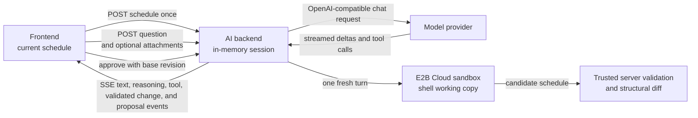

# Experimental AI Assistant Backend

The AI assistant is a separate FastAPI application that answers text questions
about one schedule snapshot. Its ASGI entry point is
`nurse_scheduling.ai_serve:app`. It does not import the optimization server or
use its Redis data.

Image and document attachments are enabled by default and can be disabled
independently. Supported documents are TXT, Markdown, CSV, PDF, and XLSX. The
assistant reads and edits the schedule in a disposable sandbox and can propose a new
schedule, which the browser applies only after the user approves it.
Each user message gets one temporary shell backed by E2B Cloud. This version
excludes retrieval and repository access.

## Run locally

Copy the secret-free template from the repository root:

```sh
cp .env.ai.example .env.ai
```

Review the values in `.env.ai`. Set the provider URL, API key, model, and other
settings for your environment, then start the service:

```sh
./scripts/start_ai_backend.sh
curl http://localhost:8001/health
```

The launcher reads `.env.ai` automatically. Set `AI_ENV_FILE` to load another
path. Port `8001` avoids the normal backend on `8000`. Use another port for a
local documentation server when both services run at the same time. The
documented local Zensical port is `8003`.

During local development, the frontend calls port `8001` on the browser's
current hostname. This avoids buffering SSE through a Next.js development
rewrite. Set `NEXT_PUBLIC_AI_API_URL` before starting the frontend when the
browser must use another AI backend URL. Production uses the same-origin `/ai`
route through NGINX.

## Architecture



The browser receives an HTTP-only owner cookie and an unguessable session UUID.
The backend stores the YAML snapshot and completed conversation turns. Each
provider request includes the stored YAML, recent history, and current
question. Enabled attachments are included only in the active provider
request. **Images and document contents are not included in subsequent chat
history.** This is intentional to avoid repeatedly consuming provider context
tokens. History retains only attachment markers and document filenames.
Schedules and attachments are labeled as untrusted data in the system prompt.

Sandbox and conversation state are separate. The backend copies the current
schedule to `/workspace/schedule.yaml` and searchable schema documentation to
`/reference`, runs every command for that user message in the same sandbox,
reads the candidate, and destroys the sandbox. A later message always starts a
new sandbox. Only conversation history, the canonical schedule revision, and a
pending validated proposal remain in application state.

When a turn fails, its provisional activity remains visible but is not added to
backend history. **Retry** resends the original text in a fresh sandbox. For a
request with attachments, **Prepare retry** restores the text and requires the
files to be attached again before sending.

## Reasoning and tool activity

Providers stream reasoning in a field of its own, either `reasoning_content` or
`reasoning`, and the adapter forwards it as a separate event. It is never joined
to the answer text, never stored in conversation history, and never sent back to
the provider, so it cannot leak into an assistant message and costs nothing on
later turns.

The `tool_start` event carries the tool name and arguments before execution, so
the UI and evaluation artifact retain a command even if the sandbox fails. A
later `tool` event carries its result and whether the call did what it was
asked. Sandbox backends return raw command output to the AI layer. The AI
`bash` adapter combines stdout and stderr, keeps the last 2,000 lines or 50 KB,
and stores the full output in the temporary sandbox when truncation occurs.
This policy stays outside the provider-neutral sandbox interface.

When a Bash command changes the schedule, the backend reads the working copy
and validates it outside the sandbox before emitting `schedule_change`. The
event contains that validated working copy. The browser compares it with the
previous working copy and renders the changed lines in red and green. These
intermediate previews do not create or apply a proposal. The final validated
candidate still follows the separate proposal and approval lifecycle.

## Evaluation

The assistant is evaluated against fixed cases with verifiable criteria. This is
evaluation, and is separate from the solver performance benchmark described in
the backend server guide.

`core/tests/ai_eval/cases/` holds the cases grouped by category, from questions
answerable from the prompt summary through schedule edits to requests that must
be refused. Each case states criteria over the schedule a run produces, so
grading does not depend on how the assistant reached it. Every run contacts the
configured provider, so this is a manual tool rather than part of CI.

The runner needs the same provider settings the service uses:

| Variable | Required | Purpose |
| --- | --- | --- |
| `AI_PROVIDER_BASE_URL` | Yes | OpenAI-compatible endpoint. |
| `AI_PROVIDER_API_KEY` | Yes | Provider bearer token. |
| `AI_PROVIDER_MODEL` | No | Defaults to `local-model`. |
| `AI_SANDBOX_BACKEND` | Yes | Use `e2b`. |
| `E2B_API_KEY` | Yes | E2B Cloud credential used by the trusted application. |
| `E2B_TEMPLATE` | No | Defaults to `nurse-scheduling-ai-sandbox`. |
| `AI_EVAL_ARTIFACT_ROOT` | No | Report root, `artifacts` by default. |

The launcher reads them from `.env.ai`, so the shortest form is:

```sh
./scripts/run_ai_eval.sh
./scripts/run_ai_eval.sh --category 01-reading
```

To run it without the launcher, load the settings first:

```sh
set -a && . ./.env.ai && set +a
cd core && python -m tests.ai_eval.runner --category 01-reading
```

Select cases with `--case` and `--category`, both repeatable. The runner creates
and destroys one E2B sandbox per case, so start with selected cases before
running the complete evaluation.

Every run writes a report to its own directory under
`artifacts/ai-evals/<timestamp>/`, alongside the performance benchmark reports,
and prints the path when it finishes. `summary.md` holds the pass count, median
seconds, LLM inference time, provider HTTP attempt and retry counts, and the
aggregate sandbox timing per category. It also includes per-case tables for
every sandbox timing and suspension metric. `results.jsonl` holds one line per case, and
`cases/<id>.json` holds the whole run for one case: the prompt it was given,
its reasoning, every tool call with its arguments and result, the answer, the
proposed schedule, timing breakdown, and each criterion with its outcome. Pass `--output-dir` to
choose the directory, which must not already exist, or set
`AI_EVAL_ARTIFACT_ROOT` to move the root.

Timing fields use wall-clock seconds. `end_to_end_seconds` covers the agent run.
`llm_inference_seconds` sums only time awaiting provider stream events.
`llm_turn_seconds` records that wait separately for each logical model turn.
`provider_requests` reports the underlying HTTP attempts, retries, retried
turns, and attempts per logical turn. A successful retry therefore remains
visible in both the case artifact and aggregate summary.
`sandbox.lifetime_seconds` covers the complete create-to-destroy lifecycle. Its
mutually exclusive components are provisioning, execution, pause transition,
warm waiting, suspended, resume wait, and teardown. Their sum equals the
sandbox lifetime. Resume wait is the blocking interval after work needs the
sandbox but before E2B has made it usable, and `max_resume_wait_seconds` exposes
the worst individual resume. The `sandbox.suspension` object reports pause and
resume counts. LLM inference can overlap warm waiting, pause transition, and
suspended time by design.

After each sandbox operation, the E2B backend schedules an explicit warm-memory
pause. Immediate follow-up activity cancels a pause that has not started, so
hydration and other consecutive operations stay together. Otherwise the pause
transition can overlap model inference, and E2B auto-resumes the same sandbox
when the next operation arrives. The memory snapshot is retained because five
fresh disk-only resume trials took 5.95 to 12.62 seconds, with an 8.01-second
median. Commands, file operations, pause/resume transitions, and close share
one serialized lifecycle lock.

The E2B creation timeout is not the hard deadline. E2B 2.46.0 testing showed
that an `on_timeout=kill` deadline did not kill a manually paused sandbox. The
application-level maximum agent-turn deadline and explicit kill in `finally`
are therefore the authoritative hard deadline. A separate live check confirms
that after this explicit kill, E2B rejects resume with `SandboxNotFoundException`.

## Agent capabilities

The model receives Pi's four default coding tools: `read`, `bash`, `edit`, and
`write`. `read` provides bounded text-file inspection with offsets. `edit`
applies one or more unique, non-overlapping exact-text replacements against the
same original file snapshot. `write` creates or overwrites one complete file.
`bash` remains available for searches, checks, and complex operations using
preinstalled Bash, Python with `ruamel.yaml`, ripgrep, grep, and diff. All
relative paths resolve from `/workspace`. The application hydrates separate
core, preference, and export schema documents under `/reference` for each turn.
Each document groups related variants so the model can retrieve the context for
one domain in one read instead of making a sequence of fine-grained lookups.

This follows the minimalism philosophy of the [Pi coding agent](https://pi.dev/):
prefer a small set of general file and shell capabilities with discoverable
documentation over a growing set of domain-specific tools. Nurse Scheduling
retains stricter service boundaries than a local coding agent. The workspace is
disposable, tool output is bounded, secrets and canonical storage stay outside
it, and a trusted application validates every possible schedule change and the
final candidate.

The model-tool loop has no count-based tool-call limit. Per-command and complete
agent-turn deadlines bound execution instead.

The model-facing tool schemas and text behavior are Python ports pinned to Pi
commit [`e266507`](https://github.com/earendil-works/pi/tree/e266507b606b9552fa277252644054afd4384b11/packages/coding-agent/src/core/tools).
Pi's image-read result is intentionally omitted because this service's tool
result channel is text-only. Image attachments continue through the existing
provider attachment path. The Nurse Scheduling adapter delegates file and
command operations to `SandboxBackend` and enforces the configured command
timeout ceiling. E2B returns completed stdout and stderr separately, so the
adapter concatenates them and cannot reproduce Pi's live stream interleaving
exactly.

## Proposal lifecycle

A finished run that changed the schedule leaves one pending proposal. The
browser receives its structural diff, never its YAML. `POST
/sessions/{id}/proposal/approve` requires the SHA-256 of the schedule the
browser holds, so a proposal built on an older schedule is discarded instead of
applied. The approved schedule is revalidated before it is returned, becomes the
session schedule, and the browser applies it through the normal YAML import path
as one undo step. `POST /sessions/{id}/proposal/reject` drops it, and `PUT
/sessions/{id}/schedule` replaces the snapshot when the schedule changed
elsewhere in the app, which also drops any pending proposal.

Approval and rejection add a backend-only user-action note to model history.
The rejection note says that every schedule change from the proposed turn was
discarded and that the next turn starts from a fresh copy of the canonical
schedule. It never includes the discarded YAML.

A run that fails, is cancelled, or is abandoned does not commit its user
message, assistant response, or candidate proposal. Its provisional activity
may remain visible in the browser, but the next turn starts from the last
successfully committed history and canonical schedule. A successful run that
only answers a question never creates a proposal.

If the final candidate fails trusted validation, the UI reports that every
schedule change from the turn was discarded and that the canonical schedule
was not changed. The failed turn does not add a history note.

After a Bash command changes the candidate, the trusted application returns an
intermediate validation result so the model can repair it. The backend reads
the final file as untrusted input and applies authoritative validation and a
structural diff. Validation inside the sandbox is feedback only. It is never
the acceptance boundary.

The provider boundary uses OpenAI-compatible chat completions. The
[Cloudflare Tunnel example](https://github.com/j3soon/local-llm-notes/tree/main/examples/basic-secure-api/cloudflare)
shows one compatible deployment pattern.

A provider request gets three total attempts by default. A timeout before the
first streamed event waits one second before the second attempt and two seconds
before the third. Once text, reasoning, token usage, or a tool call has reached
the application, the request is not replayed because that could duplicate
visible output or tool work. The complete sandbox-turn deadline still applies
across provider attempts and may end a turn before every retry is available.

Replay-safe E2B requests also get three total attempts with exponential
backoff. This covers file reads and replacements, pause, automatic resume, and
sandbox destruction. Pause and destruction use a two-second request timeout so
the cleanup deadline leaves room for retries. Retry logs include the operation,
sandbox ID, attempt, delay, and exception type without response contents.
Sandbox creation and Bash execution are not replayed because a failed response
cannot prove that the original operation did not take effect.

## Configuration

| Variable | Default | Purpose |
| --- | --- | --- |
| `AI_PROVIDER_BASE_URL` | Required | OpenAI-compatible API base URL. |
| `AI_PROVIDER_API_KEY` | Required | Provider bearer token. Never commit it. |
| `AI_PROVIDER_MODEL` | `local-model` | Model value sent to chat completions. |
| `AI_PROVIDER_TIMEOUT_SECONDS` | `120` | Provider request timeout. |
| `AI_PROVIDER_MAX_ATTEMPTS` | `3` | Total attempts for a provider request that times out before streaming begins. |
| `AI_PROVIDER_RETRY_BACKOFF_SECONDS` | `1` | Initial pre-stream timeout retry delay. The delay doubles after each failed attempt. |
| `AI_SANDBOX_BACKEND` | Required | Sandbox provider. Currently `e2b`. |
| `E2B_API_KEY` | Required for E2B | E2B Cloud credential used only by the trusted application. |
| `E2B_TEMPLATE` | `nurse-scheduling-ai-sandbox` | Prebuilt E2B template alias. |
| `AI_SANDBOX_COMMAND_TIMEOUT_SECONDS` | `10` | Default and maximum deadline for one shell command. |
| `AI_SANDBOX_TURN_TIMEOUT_SECONDS` | `300` | Deadline for the complete sandbox-backed user message. |
| `AI_SANDBOX_CLEANUP_TIMEOUT_SECONDS` | `10` | Deadline for destroying a sandbox. |
| `AI_SANDBOX_MAX_ATTEMPTS` | `3` | Total attempts for replay-safe E2B requests. |
| `AI_SANDBOX_RETRY_BACKOFF_SECONDS` | `0.5` | Initial E2B retry delay, doubled after each failure. |
| `AI_SANDBOX_CONTROL_REQUEST_TIMEOUT_SECONDS` | `2` | Per-attempt timeout for pause and destruction requests. |
| `AI_BACKEND_PORT` | `8001` | Port used by the development launcher. |
| `AI_COOKIE_SECURE` | `0` in the launcher | Use `0` for local HTTP and `1` for public HTTPS. |
| `AI_SESSION_TTL_SECONDS` | `3600` | Idle session lifetime. |
| `AI_MAX_SESSIONS` | `1000` | Maximum process-local sessions. |
| `AI_MAX_HISTORY_MESSAGES` | `20` | Conversation messages retained per session. |
| `AI_MAX_MESSAGE_CHARS` | `8000` | Maximum question length. |
| `AI_MAX_SCHEDULE_BYTES` | `1000000` | Maximum UTF-8 YAML snapshot size. |
| `AI_MAX_CONCURRENT_REQUESTS` | `4` | Maximum simultaneous provider streams. |
| `AI_ATTACHMENT_MODE` | `images` | Use `none` to disable image attachments. |
| `AI_MAX_IMAGE_FILES` | `4` | Maximum images attached to one question. |
| `AI_MAX_IMAGE_BYTES` | `5000000` | Maximum bytes per image. |
| `AI_DOCUMENT_ATTACHMENT_MODE` | `text` | Use `none` to disable document-to-text ingestion. |
| `AI_MAX_DOCUMENT_FILES` | `4` | Maximum documents attached to one question. |
| `AI_MAX_DOCUMENT_BYTES` | `5000000` | Maximum upload bytes per document. |
| `AI_MAX_DOCUMENT_TEXT_CHARS` | `50000` | Maximum extracted prompt characters per document. |
| `AI_MAX_PDF_PAGES` | `100` | Maximum pages per PDF. |
| `AI_MAX_XLSX_SHEETS` | `20` | Maximum worksheets per XLSX workbook. |
| `AI_MAX_XLSX_CELLS` | `100000` | Maximum rectangular cell span across an XLSX workbook. |
| `AI_MAX_XLSX_UNCOMPRESSED_BYTES` | `50000000` | Maximum total expanded XLSX archive bytes. |

## Run in the development container

Build the existing all-in-one development image from the repository root:

```sh
docker build -f docker/Dockerfile -t nurse-scheduling:dev .
docker run --rm -it \
  --name nurse-scheduling-dev \
  --network=host \
  --env-file .env.ai \
  -v "$(pwd):/app" \
  nurse-scheduling:dev
```

Start the AI backend inside the container:

```sh
./scripts/start_ai_backend.sh
```

Start the frontend from another host terminal:

```sh
docker exec -it -w /app nurse-scheduling-dev \
  ./scripts/start_frontend.sh --hostname 0.0.0.0
```

The normal optimization backend is optional for this chat flow.

## Production proxy

Disable response buffering on the streaming AI route. See the
[NGINX proxy buffering directive](https://nginx.org/en/docs/http/ngx_http_proxy_module.html#proxy_buffering).

```nginx
location /ai/ {
    proxy_pass http://ai-backend:8001/;
    proxy_http_version 1.1;
    proxy_buffering off;
    proxy_cache off;
}
```

## HTTP API

| Endpoint | Purpose |
| --- | --- |
| `GET /health` | Process and service identity check. |
| `GET /ready` | Required configuration accepted at startup. |
| `GET /capabilities` | Enabled optional features and their public limits. |
| `POST /sessions` | Store a YAML snapshot and create a browser-owned session. |
| `POST /sessions/{id}/messages` | Stream one answer. Accepts JSON text or multipart text and attachments. |

Multipart requests use one `message` field, repeated `images` file fields, and
repeated `documents` file fields. Sessions are process-local. Use one AI
backend instance until shared AI storage is added.

## Security notes

- Keep `.env.ai` private. Git ignores it, while `.env.ai.example` contains only
  placeholders.
- E2B Cloud is currently the only sandbox backend. The agent depends on the
  project `SandboxBackend` contract so a future self-hosted E2B or remote gVisor
  backend does not require changing model logic.
- The trusted application creates E2B sandboxes with outbound Internet access
  disabled. It does not pass the E2B key, model provider key, database
  credentials, host paths, or canonical storage into the sandbox.
- Treat shell commands and every sandbox file as untrusted. A sandbox can only
  return a candidate schedule. Trusted validation, proposal storage, revision
  checks, user approval, and canonical updates remain outside it.
- Use `AI_COOKIE_SECURE=0` only for local HTTP. Set it to `1` when the public
  browser route uses HTTPS, even if NGINX uses internal HTTP to the container.
- The owner cookie contains an opaque UUID, not the provider key. It is not a
  replacement for future account authentication.
- The complete schedule is sent to the configured provider. Use an approved
  provider and anonymize sensitive schedules when required.
- Accepted images are signature-checked and bounded before they are sent to the
  provider. Configure a matching request-body limit at the public reverse proxy.
- Accepted documents are bounded and checked for a matching supported filename
  extension, declared MIME type, and file signature where applicable. Text
  files require UTF-8. PDF extraction reads embedded text without OCR and
  rejects encrypted files. XLSX extraction disables external links, rejects
  encrypted or oversized archives, and uses hardened XML parsing.
- XLSX formulas are never evaluated. Extraction includes the formula text and
  the cached result last saved by a spreadsheet application. A missing cached
  result is marked as unavailable.
- Assistant answers use a safe Markdown renderer. Raw HTML is disabled and
  remote Markdown images are omitted to prevent third-party requests.
- Provider HTTP errors return a searchable error ID to the browser. The backend
  logs the upstream response body under that ID after redacting common
  credential forms.
- A failed or cancelled answer is not added to conversation history.

## Troubleshoot local development

| Problem | What to check |
| --- | --- |
| Send fails immediately | Start the AI backend and request `http://localhost:8001/health`. |
| Provider unavailable | Check `AI_PROVIDER_BASE_URL`, `AI_PROVIDER_API_KEY`, and provider availability. |
| An attachment is rejected | Check its supported type and configured byte, text, page, sheet, and cell limits. Text documents must use UTF-8. Encrypted PDF and XLSX files are unsupported. |
| An answer stops early | Retry it. Cancelled and failed answers are not added to backend history. |

For a provider HTTP failure, search the AI backend log using the error ID shown
in the browser. If the logged response is a Cloudflare `520`, inspect the
provider origin for an empty, malformed, or abruptly closed response. A `525`
means Cloudflare could not complete TLS with the provider origin. Correlate the
logged timestamp and Cloudflare Ray ID with the provider proxy, tunnel, and
origin logs. See Cloudflare's [520](https://developers.cloudflare.com/support/troubleshooting/http-status-codes/cloudflare-5xx-errors/error-520/)
and [525](https://developers.cloudflare.com/support/troubleshooting/http-status-codes/cloudflare-5xx-errors/error-525/)
guidance.

### Capability-gated controls

Optional controls stay hidden when the backend disables every attachment type
or capability discovery fails. Image mode defaults to `images`, while document
mode defaults to `text`. Confirm these were not changed to `none`, then compare
the direct and browser-facing responses:

```sh
curl http://127.0.0.1:8001/capabilities
curl http://localhost:8001/capabilities
```

Use the hostname that is open in the browser for the second command. If local
capability discovery fails, check that port `8001` is reachable and accepts the
frontend origin. In production, check `/ai/capabilities` through NGINX instead.
When developing in a container, also test the container address used by the
browser. A loopback-only test can miss a blocked Next.js development origin,
CORS failure, or incomplete hydration.

## Validate

Run the focused checks inside the development container:

```sh
cd /app/core
ruff check nurse_scheduling/ai nurse_scheduling/ai_serve.py \
  tests/test_ai_basic.py tests/test_ai_documents.py tests/test_ai_provider.py \
  tests/test_ai_sandbox.py tests/test_ai_sandbox_e2b.py \
  tests/test_ai_sandbox_agent.py tests/test_ai_pi_bash.py tests/test_ai_pi_edit.py \
  tests/test_ai_pi_read.py tests/test_ai_pi_write.py tests/test_ai_sandbox_tools.py
pytest -q tests/test_ai_basic.py tests/test_ai_documents.py tests/test_ai_provider.py \
  tests/test_ai_sandbox.py tests/test_ai_sandbox_e2b.py \
  tests/test_ai_sandbox_agent.py tests/test_ai_pi_bash.py tests/test_ai_pi_edit.py \
  tests/test_ai_pi_read.py tests/test_ai_pi_write.py tests/test_ai_sandbox_tools.py

cd /app/web-frontend
bun run test -- \
  src/app/experimental-ai/AssistantMarkdown.test.tsx \
  src/app/experimental-ai/aiClient.test.ts \
  src/app/experimental-ai/page.test.tsx \
  src/components/Navigation.test.tsx
bun run build
bun run test:e2e:affected -- e2e/experimental-ai-basic.spec.ts
```
