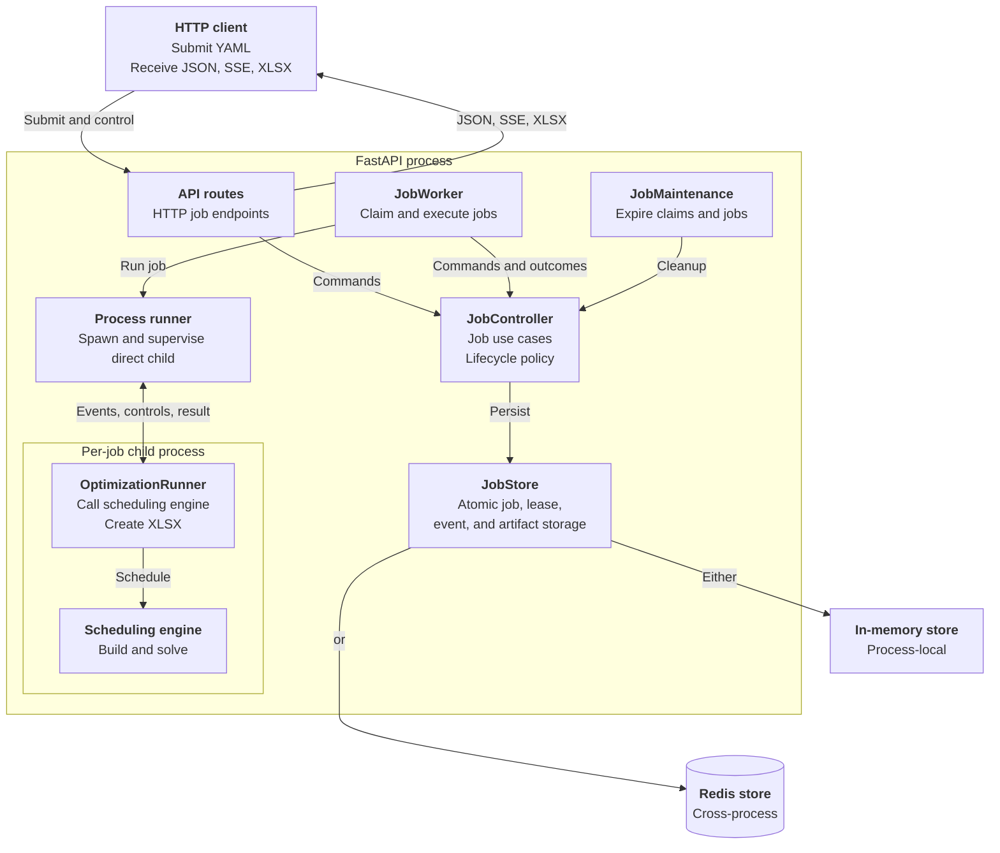
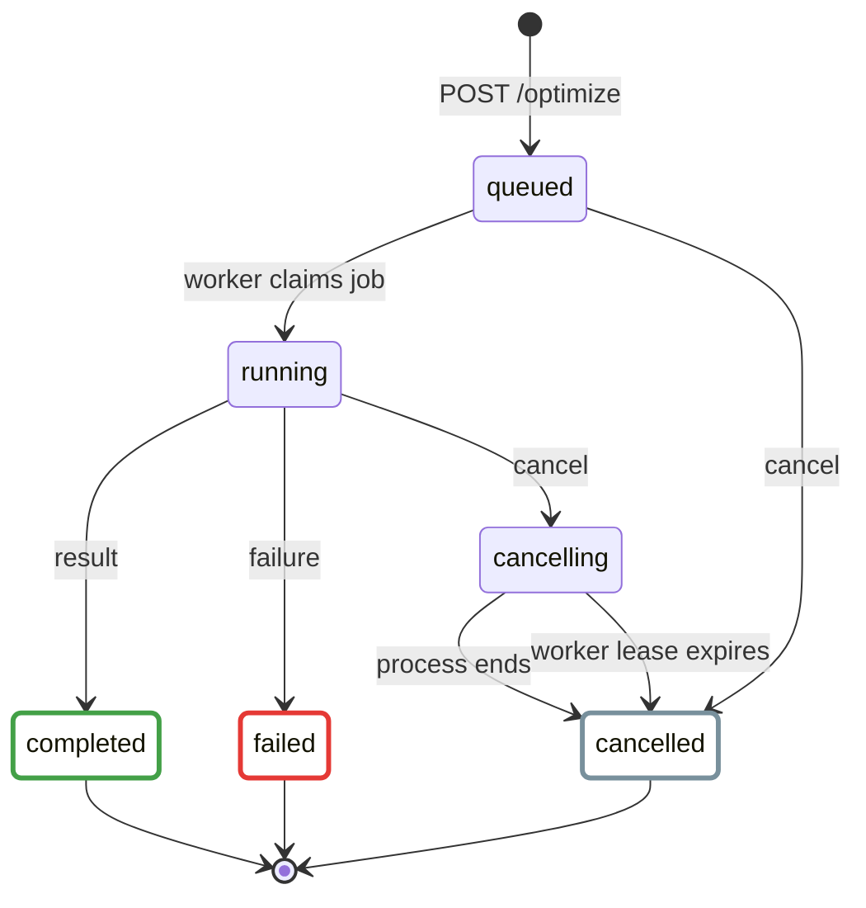

# Backend Server

The backend server is an asynchronous FastAPI service. It accepts scheduling
YAML, retains job state and events, runs jobs in the background, and serves the
resulting XLSX artifact.

This page covers only the HTTP server and its job infrastructure. The CLI,
scheduling model, solver implementations, and frontend are out of scope.

## Architecture



| Component | Control-flow role | Responsibility |
| --- | --- | --- |
| `server/app.py` | Bootstrap | Constructs the FastAPI app, dependencies, background services, health checks, and error handlers. |
| `server/api/` | Reactive driver | Translates incoming HTTP requests into controller operations and returns HTTP or SSE responses. |
| `server/jobs/controller.py` | Passive application service | Defines job use cases and lifecycle policy independently of HTTP, worker loops, and persistence implementations. |
| `server/job_store.py` | Passive persistence boundary | Defines the atomic job and lease contract implemented by memory and Redis stores. |
| `server/jobs/worker.py` | Active background driver | Owns the process-local claim and heartbeat loops, carries its current lease, coordinates execution, and reports outcomes through the controller. |
| `server/jobs/process_executor.py` | Invoked service | Runs one optimization in a spawned child process, bridges events and controls, and enforces timeout and cancellation boundaries without knowing about HTTP or persistence. |
| `server/jobs/runner.py` | Invoked adapter | Adapts one blocking job execution to the synchronous scheduler. It normalizes progress and results and creates the XLSX artifact without knowing HTTP or persistence. |
| `server/maintenance.py` | Active background driver | Periodically asks the controller to expire jobs owned by lost workers, worker leases, and retained terminal jobs. |

`nurse_scheduling.serve:app` is the public ASGI entry point. Each application
process owns one worker thread and one maintenance thread. The worker renews its
shared presence lease whether idle or running. Each optimization runs in a
separate child process.

The controller owns job lifecycle policy. The worker owns execution
orchestration. The process executor owns child process supervision. The runner
owns one scheduler invocation and its output conversion.

## Job Lifecycle



`completed`, `cancelled`, and `failed` are terminal states. A completed job may
be optimal, feasible, or infeasible. An XLSX artifact is available only when a
schedule was produced.

Cancellation is available for every running job. It immediately terminates the
optimization process tree, uses error code `cancelled`, and discards the result
and artifact. Early completion requires solver support and sets a control flag
without adding another lifecycle state. If a current result is available, the
job later becomes `completed`.

### Timeout enforcement

The server accepts a timeout for every solver and enforces it at two levels.
The selected solver runs in a child process and first receives the requested
limit so it can stop cleanly and return any result it supports. The hard server
watchdog starts when the child process starts and does not depend on a
`solving` phase event. Its deadline combines the requested timeout and a
90-second timeout grace period by default. The grace period covers startup,
model construction, and shutdown while still bounding a job that becomes stuck
before solving. If the process has not returned by the deadline, the server
terminates its optimization process tree. Tree cleanup is required for PuLP
command-line backends because they launch external solver executables. OR-Tools
runs inside the direct optimization child and does not require descendant
cleanup. A thread is not sufficient because Python cannot safely force-stop an
arbitrary worker thread.

A process that returns before the hard deadline follows its normal result path.
A feasible result returned at the solver limit uses termination reason
`solver_timeout`. Forced termination marks the job as `failed` with error code
`process_timeout` and produces no artifact, even if an incumbent score was
reported earlier. The error message records the requested timeout, timeout
grace, and forced termination. Preserving the last schedule would require
checkpointing it outside the child process.

```json
{
  "error": {
    "code": "process_timeout",
    "message": "The optimization process did not return within the requested 300-second timeout and 90-second timeout grace period. The server terminated the process."
  }
}
```

## HTTP API

Start and verify a local server with the commands in the [Core
README](developer-guide/reproduce/core.md#web-backend). Interactive OpenAPI documentation is
available at `$API_URL/docs`, with the schema at `$API_URL/openapi.json`.

| Method | Path | Purpose |
| --- | --- | --- |
| `GET` | `/` | Return API identity and version information. |
| `GET` | `/info` | Check readiness and report versions, job activity, online workers, and whether authentication is required. Always public. |
| `GET` | `/ready` | Return a minimal readiness result for routing and deployment probes. Always public. |
| `GET` | `/optimize/options` | Return the solver choices and run-option defaults accepted by this deployment. |
| `POST` | `/optimize` | Validate multipart input and enqueue a job. |
| `GET` | `/optimize/{job_id}` | Return the current job representation. |
| `GET` | `/optimize/{job_id}/events` | Replay and stream job events over SSE. |
| `POST` | `/optimize/{job_id}/cancel` | Cancel a queued or running job. |
| `POST` | `/optimize/{job_id}/finish-now` | Request the current feasible result when supported. |
| `GET` | `/optimize/{job_id}/xlsx` | Download a completed schedule artifact. |
| `DELETE` | `/optimize/{job_id}` | Delete a terminal job and its retained data. |

### Authentication

A deployment that sets `API_AUTH_TOKEN` or `API_AUTH_TOKENS` requires a bearer
key on every application route except `/info` and `/ready`. Those two stay
public so clients and deployment probes can discover the server without
credentials. `/info` reports the requirement:

```json
{ "auth": { "required": true, "scheme": "bearer" } }
```

Backends that predate this field omit it, and clients treat a missing
descriptor as an open server. Send the token as a bearer credential:

Use an `https://` API URL when authentication is enabled. A trusted reverse
proxy may terminate TLS before forwarding requests to the backend. TLS protects
both the bearer credential and the stream token from interception.

```sh
export API_AUTH_TOKEN="<token>"
curl -H "Authorization: Bearer $API_AUTH_TOKEN" "$API_URL/optimize/options"
```

`GET /optimize/{job_id}/events` also accepts a short-lived token in the URL,
because `EventSource` cannot send an `Authorization` header. Job responses embed
one in `links.events`, so a client opens the stream with the link as given:

```json
{ "links": { "events": "/optimize/<job_id>/events?token=<stream_token>" } }
```

The stream token is an HMAC of the job ID and an expiry signed with the matched
bearer key. It authorizes only that job's stream and is rejected on every
other route, which keeps the deployment key out of URLs, proxy logs, and
referrer headers. Its lifetime is `OPTIMIZE_MAX_TIMEOUT_SECONDS` plus
`OPTIMIZE_TIMEOUT_GRACE_SECONDS` plus a few seconds of slack, so it outlives the
longest run the deployment allows and expires shortly after. An expired stream
token makes the frontend fall back to polling the job.

A missing or incorrect key returns `401` with a `WWW-Authenticate: Bearer`
header. Configure multiple static keys with a JSON object mapping IDs to keys:

```dotenv
API_AUTH_TOKENS='{"institution-a":"first-key","person-b":"second-key"}'
```

IDs may contain letters, numbers, underscores, and hyphens. The `legacy` ID is
reserved for `API_AUTH_TOKEN`. IDs are recorded for administration, while
clients send only the key and never receive the ID. Requests use a keyed
fingerprint map for direct lookup followed by a constant-time comparison. Stream
links carry no credential hint, so the server verifies a stream token against
each configured key rather than putting a stable key-derived value in a URL. Remove a pair and restart the server to
revoke its bearer and stream tokens. `API_AUTH_TOKEN` remains
supported and may be used alongside identified keys during migration.

Identified keys attribute a request, they do not isolate one. Every configured
key reaches every protected route, so any key may read, cancel, finish, and
stream a job created with another key. Use separate deployments when callers
must not see each other's jobs.

When authentication is configured, the generated `/openapi.json`, `/docs`, and
`/redoc` routes are disabled and return `404`.

`API_AUTH_REQUIRED` makes authentication mandatory rather than optional. The
images built for deployment set it, so a container started without
either key setting fails with
`API_AUTH_REQUIRED is set, so API_AUTH_TOKEN or API_AUTH_TOKENS must not be empty`
instead of
serving openly. A server run outside those images leaves it unset, so setting
either key setting is enough to turn authentication on for local use.

Prepare the input as YAML. The repository includes a
[minimal scheduling example](https://github.com/j3soon/nurse-scheduling/blob/dev/core/tests/testcases/basics/01_1nurse_1shift_1day.yaml).
Submit either a YAML file or a YAML string, but not both:

```sh
curl -i \
  -H "Authorization: Bearer $API_AUTH_TOKEN" \
  -F file=@core/tests/testcases/basics/01_1nurse_1shift_1day.yaml \
  -F timeout=60 \
  "$API_URL/optimize"
```

The server returns `202 Accepted`, the job representation, a `Location` header,
and `Retry-After: 1`. Use the returned job ID to follow events and download the
result:

```sh
export JOB_ID="<job_id>"
export EVENTS_URL="/optimize/<job_id>/events?token=<stream_token>"

curl -N "$API_URL$EVENTS_URL"
curl -OJ -H "Authorization: Bearer $API_AUTH_TOKEN" \
  "$API_URL/optimize/$JOB_ID/xlsx"

# Delete retained data after the job reaches a terminal state.
curl -i -X DELETE -H "Authorization: Bearer $API_AUTH_TOKEN" \
  "$API_URL/optimize/$JOB_ID"
```

The server persists and replays `job.state_changed`, `job.phase_changed`,
`job.progressed`, `job.control_changed`, and `job.result_available` events. Send
`Last-Event-ID` when reconnecting to continue after the last received event.
Disconnecting from the stream does not stop the job.

Job submission sets a seven-day, HTTP-only client correlation cookie for
diagnostics. It does not control access to a job or its lifetime. Browser CORS
access is limited to local origins and `nursescheduling.org` subdomains.

Lifecycle and storage errors use a stable JSON envelope:

```json
{
  "error": {
    "code": "job_not_found",
    "message": "Job was not found"
  }
}
```

Request parsing and validation errors retain FastAPI's standard error format.
Common status codes include `404` for missing resources, `409` for invalid job
operations, `413` for oversized YAML, and `429` when job capacity is exhausted.

## Storage and Scaling

| Backend | Intended use | Behavior |
| --- | --- | --- |
| Memory | Local development and one server process | Jobs, inputs, events, and artifacts are process-local and are lost on restart. |
| Redis | Multiple server processes or machines | Job data and claims are shared. Durability depends on the configured Redis persistence policy. |

Do not use memory mode with multiple Uvicorn workers. A later request may reach
a different process that does not contain the job. Redis mode coordinates job
claims across processes. Each process still executes at most one job at a time.
Opaque lease tokens fence stale workers. Stores validate the job revision,
lease, and active-job association together before accepting worker updates.
Each execution retains the exact lease used to claim its job.

Example with three server processes:

```sh
cd core
JOB_BACKEND=redis \
JOB_REDIS_URL=redis://localhost:6379/0 \
uvicorn nurse_scheduling.serve:app \
  --workers 3 \
  --host 0.0.0.0 \
  --port 8000 \
  --no-access-log
```

## Configuration

All server settings are read once when the application is constructed. Local
defaults, behavior, and validation rules are documented in the [Core
README](developer-guide/reproduce/core.md#backend-configuration). Deployment values are set in
the `docker/.env` file, whose tracked template `docker/.env.example` documents
the deployment subset and is the source of truth for it.

## Inspect Redis with RedisInsight

The Redis-backed Compose deployment includes an optional RedisInsight service.
It listens only on the backend host's loopback interface and does not retain its
own settings. Start it from `docker/`:

```sh
docker compose -f compose.backend.yml --profile inspection run --rm --service-ports redisinsight
```

For a remote backend, forward the loopback port over SSH:

```sh
ssh -L 5540:127.0.0.1:5540 user@backend-host
```

Open `http://127.0.0.1:5540` and select the preconfigured
**Nurse Scheduling Redis** database. Job-store keys start with
`nurse_scheduling:jobs:v0:`. Usage-reporting keys start with
`nurse_scheduling:usage:v0:`. Use those prefixes in the key browser to narrow
the results.

RedisInsight connects with the same unrestricted access as the backend. Its
browser and CLI can change or delete production data, so use them only for
inspection. Press Ctrl+C when finished. Compose removes the temporary
RedisInsight container while the Redis service and its `redis-data` volume
remain intact.

For staging, pass `--env-file .env.staging` to the command. The
`compose.backend.memory.yml` variant has no Redis service and therefore no
RedisInsight inspector.

## Tests

Run the server test commands from `core/`, documented in the [Core
README](developer-guide/reproduce/core.md#tests). Redis integration coverage needs a local
Redis instance selected with `JOB_REDIS_TEST_URL`.
