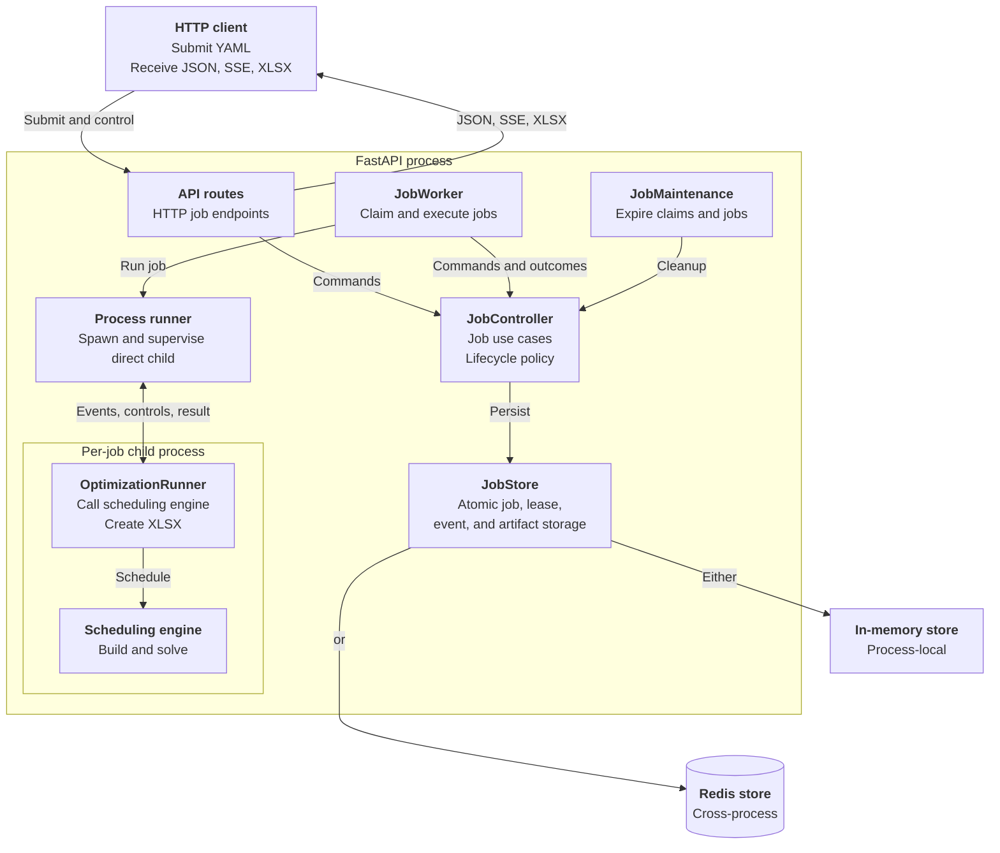
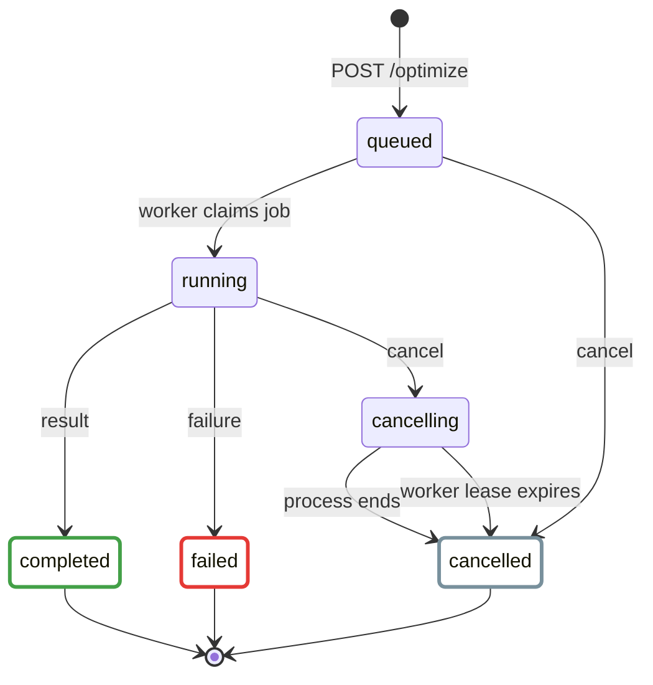

# Backend Server

The backend server is an asynchronous FastAPI service. It accepts scheduling
YAML, retains job state and events, runs jobs in the background, and serves the
resulting XLSX artifact.

This page covers only the HTTP server and its job infrastructure. The CLI,
scheduling model, solver implementations, and frontend are out of scope.

## Run Locally

After installing the core dependencies, start the development server from the
repository root:

```sh
./scripts/start_backend.sh
```

Verify the process and its dependencies:

```sh
export API_URL="${API_URL:-http://localhost:8000}"

curl "$API_URL/ready"
curl "$API_URL/info"
```

`/ready` returns a minimal readiness result. `/info` also includes the API and
application versions plus current worker status and activities.

Interactive OpenAPI documentation is available at `$API_URL/docs`, with the
schema at `$API_URL/openapi.json`.

## Architecture



| Component | Control-flow role | Responsibility |
| --- | --- | --- |
| `server/app.py` | Bootstrap | Constructs the FastAPI app, dependencies, background services, health checks, and error handlers. |
| `server/api/` | Reactive driver | Translates incoming HTTP requests into controller operations and returns HTTP or SSE responses. |
| `server/jobs/controller.py` | Passive application service | Defines job use cases and lifecycle policy independently of HTTP, worker loops, and persistence implementations. |
| `server/job_store.py` | Passive persistence boundary | Defines the atomic job and lease contract implemented by memory and Redis stores. |
| `server/jobs/worker.py` | Active background driver | Owns the process-local claim and heartbeat loops, carries its current lease, coordinates execution, and reports outcomes through the controller. |
| `server/jobs/process_executor.py` | Invoked service | Runs one optimization in a spawned child process, bridges events and controls, and enforces timeout and cancellation boundaries without knowing about HTTP or persistence. |
| `server/jobs/runner.py` | Invoked adapter | Adapts one blocking job execution to the synchronous scheduler. It normalizes progress and results and creates the XLSX artifact without knowing HTTP or persistence. |
| `server/maintenance.py` | Active background driver | Periodically asks the controller to expire jobs owned by lost workers, worker leases, and retained terminal jobs. |

`nurse_scheduling.serve:app` is the public ASGI entry point. Each application
process owns one worker thread and one maintenance thread. The worker renews its
shared presence lease whether idle or running. Each optimization runs in a
separate child process.

The controller owns job lifecycle policy. The worker owns execution
orchestration. The process executor owns child process supervision. The runner
owns one scheduler invocation and its output conversion.

## Job Lifecycle



`completed`, `cancelled`, and `failed` are terminal states. A completed job may
be optimal, feasible, or infeasible. An XLSX artifact is available only when a
schedule was produced.

Cancellation is available for every running job. It immediately terminates the
optimization process tree, uses error code `cancelled`, and discards the result
and artifact. Early completion requires solver support and sets a control flag
without adding another lifecycle state. If a current result is available, the
job later becomes `completed`.

### Timeout enforcement

The server accepts a timeout for every solver and enforces it at two levels.
The selected solver runs in a child process and first receives the requested
limit so it can stop cleanly and return any result it supports. The hard server
watchdog starts when the child process starts and does not depend on a
`solving` phase event. Its deadline combines the requested timeout and a
90-second timeout grace period by default. The grace period covers startup,
model construction, and shutdown while still bounding a job that becomes stuck
before solving. If the process has not returned by the deadline, the server
terminates its optimization process tree. Tree cleanup is required for PuLP
command-line backends because they launch external solver executables. OR-Tools
runs inside the direct optimization child and does not require descendant
cleanup. A thread is not sufficient because Python cannot safely force-stop an
arbitrary worker thread.

A process that returns before the hard deadline follows its normal result path.
A feasible result returned at the solver limit uses termination reason
`solver_timeout`. Forced termination marks the job as `failed` with error code
`process_timeout` and produces no artifact, even if an incumbent score was
reported earlier. The error message records the requested timeout, timeout
grace, and forced termination. Preserving the last schedule would require
checkpointing it outside the child process.

```json
{
  "error": {
    "code": "process_timeout",
    "message": "The optimization process did not return within the requested 300-second timeout and 90-second timeout grace period. The server terminated the process."
  }
}
```

## HTTP API

| Method | Path | Purpose |
| --- | --- | --- |
| `GET` | `/` | Return API identity and version information. |
| `GET` | `/info` | Check readiness and report versions, job activity, online workers, and whether authentication is required. Always public. |
| `GET` | `/ready` | Return a minimal readiness result for routing and deployment probes. Always public. |
| `GET` | `/optimize/options` | Return the solver choices and run-option defaults accepted by this deployment. |
| `POST` | `/optimize` | Validate multipart input and enqueue a job. |
| `GET` | `/optimize/{job_id}` | Return the current job representation. |
| `GET` | `/optimize/{job_id}/events` | Replay and stream job events over SSE. |
| `POST` | `/optimize/{job_id}/cancel` | Cancel a queued or running job. |
| `POST` | `/optimize/{job_id}/finish-now` | Request the current feasible result when supported. |
| `GET` | `/optimize/{job_id}/xlsx` | Download a completed schedule artifact. |
| `DELETE` | `/optimize/{job_id}` | Delete a terminal job and its retained data. |

### Authentication

A deployment that sets `API_AUTH_TOKEN` requires a bearer token on every
application route except `/info` and `/ready`. Those two stay public so clients
and deployment probes can discover the server without credentials. `/info`
reports the requirement:

```json
{ "auth": { "required": true, "scheme": "bearer" } }
```

Backends that predate this field omit it, and clients treat a missing
descriptor as an open server. Send the token as a bearer credential:

Use an `https://` API URL when authentication is enabled. A trusted reverse
proxy may terminate TLS before forwarding requests to the backend. TLS protects
both the bearer credential and the stream token from interception.

```sh
export API_AUTH_TOKEN="<token>"
curl -H "Authorization: Bearer $API_AUTH_TOKEN" "$API_URL/optimize/options"
```

`GET /optimize/{job_id}/events` also accepts a short-lived token in the URL,
because `EventSource` cannot send an `Authorization` header. Job responses embed
one in `links.events`, so a client opens the stream with the link as given:

```json
{ "links": { "events": "/optimize/<job_id>/events?token=<stream_token>" } }
```

The stream token is an HMAC of the job ID and an expiry signed with
`API_AUTH_TOKEN`. It authorizes only that job's stream and is rejected on every
other route, which keeps the deployment's shared token out of URLs, proxy logs,
and referrer headers. Its lifetime is `OPTIMIZE_MAX_TIMEOUT_SECONDS` plus
`OPTIMIZE_TIMEOUT_GRACE_SECONDS` plus a few seconds of slack, so it outlives the
longest run the deployment allows and expires shortly after. An expired stream
token makes the frontend fall back to polling the job.

A missing or incorrect token returns `401` with a `WWW-Authenticate: Bearer`
header. Tokens are compared in constant time. The token is shared by every
client of the deployment, so rotate it by changing `API_AUTH_TOKEN` and
restarting the server.

When authentication is configured, the generated `/openapi.json`, `/docs`, and
`/redoc` routes are disabled and return `404`.

`API_AUTH_REQUIRED` makes authentication mandatory rather than optional. The
images built for deployment set it, so a container started without
`API_AUTH_TOKEN` fails with
`API_AUTH_REQUIRED is set, so API_AUTH_TOKEN must not be empty` instead of
serving openly. A server run outside those images leaves it unset, so setting
`API_AUTH_TOKEN` alone is still enough to turn authentication on for local use.

Prepare the input as YAML. The repository includes a
[minimal scheduling example](https://github.com/j3soon/nurse-scheduling/blob/dev/core/tests/testcases/basics/01_1nurse_1shift_1day.yaml).
Submit either a YAML file or a YAML string, but not both:

```sh
curl -i \
  -H "Authorization: Bearer $API_AUTH_TOKEN" \
  -F file=@core/tests/testcases/basics/01_1nurse_1shift_1day.yaml \
  -F timeout=60 \
  "$API_URL/optimize"
```

The server returns `202 Accepted`, the job representation, a `Location` header,
and `Retry-After: 1`. Use the returned job ID to follow events and download the
result:

```sh
export JOB_ID="<job_id>"
export EVENTS_URL="/optimize/<job_id>/events?token=<stream_token>"

curl -N "$API_URL$EVENTS_URL"
curl -OJ -H "Authorization: Bearer $API_AUTH_TOKEN" \
  "$API_URL/optimize/$JOB_ID/xlsx"

# Delete retained data after the job reaches a terminal state.
curl -i -X DELETE -H "Authorization: Bearer $API_AUTH_TOKEN" \
  "$API_URL/optimize/$JOB_ID"
```

The server persists and replays `job.state_changed`, `job.phase_changed`,
`job.progressed`, `job.control_changed`, and `job.result_available` events. Send
`Last-Event-ID` when reconnecting to continue after the last received event.
Disconnecting from the stream does not stop the job.

Job submission sets a seven-day, HTTP-only client correlation cookie for
diagnostics. It does not control access to a job or its lifetime. Browser CORS
access is limited to local origins and `nursescheduling.org` subdomains.

Lifecycle and storage errors use a stable JSON envelope:

```json
{
  "error": {
    "code": "job_not_found",
    "message": "Job was not found"
  }
}
```

Request parsing and validation errors retain FastAPI's standard error format.
Common status codes include `404` for missing resources, `409` for invalid job
operations, `413` for oversized YAML, and `429` when job capacity is exhausted.

### Suspicious request reporting

Missing routes and unauthenticated probes are internet background noise and are
not reported. Client errors that instead require knowledge of this API's
contract are sent to Sentry, because a scanner cannot produce them:

| Signal | Meaning | Level |
| --- | --- | --- |
| `forged_stream_token` | An event-stream token was well-formed and unexpired but failed verification, so it was constructed rather than issued. | error |
| `job_id_probe` | A job was requested through a real job route and does not exist. | warning |
| `rejected_bearer_token` | A request presented a bearer token that is not the configured one. | warning |
| `timeout_out_of_range` | An optimization timeout fell outside the range advertised by `GET /optimize/options`. | warning |

Responses are unchanged, so a caller cannot tell which requests were reported.
Each signal groups into its own Sentry issue, so repetition is visible from the
issue's event count without any server-side tracking.

Repeats of one signal from one address are counted within a rolling window, and a
signal that reaches `SUSPICION_ESCALATE_COUNT` is reported as an error rather
than a warning, carrying its `occurrences` count. Addresses are counted as a
salted digest, so the counters hold no record of who connected, and the salt is
per deployment launch. Redis deployments share counters across worker processes.
A memory deployment counts per process, so it reaches the threshold later.
Counting is advisory, and a storage failure leaves the report unescalated rather
than losing it.

A stale browser tab can produce `job_id_probe` after its job is deleted or
expires, and a mistyped token produces `rejected_bearer_token`, so both are
reported as warnings rather than errors.

Every event carries a `client.address` tag holding the address its request
connected from. Sentry's own attribution is left alone, and it infers the
address from the leftmost `X-Forwarded-For` entry, which the caller supplies.
Uvicorn resolves the address from the proxy chain it trusts instead, so a caller
claiming a different one shows up as a disagreement between the tag and the
reported address. A peer that is not an address, such as a Unix socket, is not
tagged.

The tag depends on `FORWARDED_ALLOW_IPS`, because `cloudflared` runs as a
separate container and Uvicorn's peer is a Compose-network address rather than
the caller. The Compose deployments set it to the private ranges the tunnel
connects from. Narrow it when publishing the API port directly rather than
through a tunnel.

Cloudflare appends the connecting address to whatever `X-Forwarded-For` a caller
sent, so the header arriving at the origin ends with the real address and may
begin with a claimed one. Uvicorn reads it from right to left and takes the
first entry outside the trusted ranges, which is why the tag holds the caller's
real address while Sentry, reading the leftmost entry, reports the claimed one.

## Storage and Scaling

| Backend | Intended use | Behavior |
| --- | --- | --- |
| Memory | Local development and one server process | Jobs, inputs, events, and artifacts are process-local and are lost on restart. |
| Redis | Multiple server processes or machines | Job data and claims are shared. Durability depends on the configured Redis persistence policy. |

Do not use memory mode with multiple Uvicorn workers. A later request may reach
a different process that does not contain the job. Redis mode coordinates job
claims across processes. Each process still executes at most one job at a time.
Opaque lease tokens fence stale workers. Stores validate the job revision,
lease, and active-job association together before accepting worker updates.
Each execution retains the exact lease used to claim its job.

Example with three server processes:

```sh
cd core
JOB_BACKEND=redis \
JOB_REDIS_URL=redis://localhost:6379/0 \
uvicorn nurse_scheduling.serve:app \
  --workers 3 \
  --host 0.0.0.0 \
  --port 8000 \
  --no-access-log
```

## Configuration

All server settings are read once when the application is constructed.

| Environment variable | Default | Purpose |
| --- | --- | --- |
| `JOB_BACKEND` | `memory` | Select `memory` or `redis` storage. |
| `JOB_REDIS_URL` | `redis://localhost:6379/0` | Set the Redis connection URL. |
| `JOB_REDIS_KEY_PREFIX` | `nurse_scheduling:jobs:v0` | Namespace and schema version for Redis keys. |
| `JOB_MAX_PENDING` | `32` | Limit queued, running, and cancelling jobs. |
| `JOB_MAX_RETAINED` | `128` | Limit all retained jobs, including terminal jobs. |
| `JOB_RETENTION_SECONDS` | `86400` | Retain terminal jobs for this duration. |
| `JOB_MAX_EVENTS_PER_JOB` | `1000` | Limit replayable events retained per job. |
| `JOB_CLAIM_POLL_SECONDS` | `1` | Set the delay between attempts to claim work. |
| `JOB_WORKER_LEASE_SECONDS` | `90` | Set how long a worker remains online without renewal. |
| `JOB_MAINTENANCE_INTERVAL_SECONDS` | `30` | Set the delay between maintenance passes. |
| `JOB_SSE_KEEPALIVE_SECONDS` | `10` | Set the maximum SSE wait before a keepalive. |
| `OPTIMIZE_MAX_YAML_BYTES` | `2097152` | Limit the submitted YAML size. |
| `OPTIMIZE_SOLVERS` | `ortools/cp-sat` | Set the ordered comma-separated solver allowlist. |
| `OPTIMIZE_DEFAULT_SOLVER` | `ortools/cp-sat` | Set the solver used when a request omits one. |
| `OPTIMIZE_MIN_TIMEOUT_SECONDS` | `1` | Set the smallest accepted timeout. |
| `OPTIMIZE_DEFAULT_TIMEOUT_SECONDS` | `300` | Set the timeout used when a request omits one. |
| `OPTIMIZE_MAX_TIMEOUT_SECONDS` | `3600` | Limit the timeout accepted from a request. |
| `OPTIMIZE_DEFAULT_PRETTIFY` | `true` | Set prettification when a request omits it. |
| `OPTIMIZE_TIMEOUT_GRACE_SECONDS` | `90` | Set the process grace added to the requested timeout before forced termination. |
| `CLAIMED_PERFORMANCE_SCORE` | unset | Publish the server's self-claimed normalized performance score. |
| `CLAIMED_PERFORMANCE_APP_VERSION` | unset | Record the app version used by the claimed-performance benchmark. |
| `CLAIMED_PERFORMANCE_MEASURED_AT` | unset | Record the benchmark report time as an ISO 8601 date and time with a timezone. |
| `API_AUTH_TOKEN` | unset | Require this shared bearer token on every application route except `/info` and `/ready`. |
| `API_AUTH_REQUIRED` | `false` | Require authentication, making an empty `API_AUTH_TOKEN` a startup failure. Set in the deployment images. |
| `SUSPICION_COUNTER_ENABLED` | `true` | Count repeats of one signal from one address and escalate them. |
| `SUSPICION_WINDOW_SECONDS` | `300` | Length of the window over which repeats are counted. |
| `SUSPICION_ESCALATE_COUNT` | `5` | Repeats within a window that make a signal an error. |
| `FORWARDED_ALLOW_IPS` | `127.0.0.1` | Trust `X-Forwarded-For` from these peers, read by Uvicorn. The Compose deployments set the private ranges their tunnel connects from. |
| `DISABLE_SENTRY` | unset | Disable error reporting for all Python services when set to a non-empty value. |
| `SENTRY_DSN` | shared development project | Select the Python services' shared Sentry project DSN. Docker maps this from `SENTRY_BACKEND_DSN`. |
| `SENTRY_ENVIRONMENT` | `development` | Set the Sentry environment for all Python services. The `app` tag separates backend, usage reporter, and diagnostic events. |
| `SENTRY_RELEASE` | derived from the app version | Override the release reported to Sentry. |

Numeric values must be positive. `JOB_MAX_RETAINED` must be at least
`JOB_MAX_PENDING`. The default solver must be advertised, and the timeout
default must remain within the configured minimum and maximum.

`API_AUTH_TOKEN` is optional and unset by default, so a locally run server
needs no credentials. Setting it turns on authentication for that deployment.
Use at least 16 characters. When `API_AUTH_REQUIRED=true`, the backend rejects a
shorter token. When it is `false`, a shorter token is accepted with a warning for
local testing.

The images under `docker/` set `API_AUTH_REQUIRED=true`, so a deployment that
publishes the backend refuses to start without a token. Serving one without
authentication requires `API_AUTH_REQUIRED=false`. See
[Authentication](#authentication).

The three `CLAIMED_PERFORMANCE_*` values are optional, but they must be set
together. A complete compute benchmark writes them to
`claimed-performance.env` beside its report. The API publishes the result at
`GET /info` as `claimed_performance`. The frontend displays it as
`Claimed performance` when that backend is selected.

## Tests

Run the primary server tests from `core/`:

```sh
pytest --log-cli-level=INFO tests/test_serve.py
pytest --log-cli-level=INFO tests/test_optimize_job_backends.py
```

To include Redis integration coverage, start a local Redis instance and use a
dedicated database:

```sh
JOB_REDIS_TEST_URL=redis://localhost:6379/15 \
pytest --log-cli-level=INFO tests/test_optimize_job_backends.py
```
