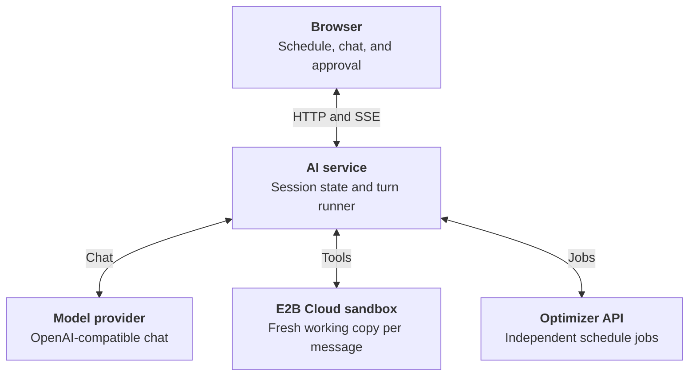
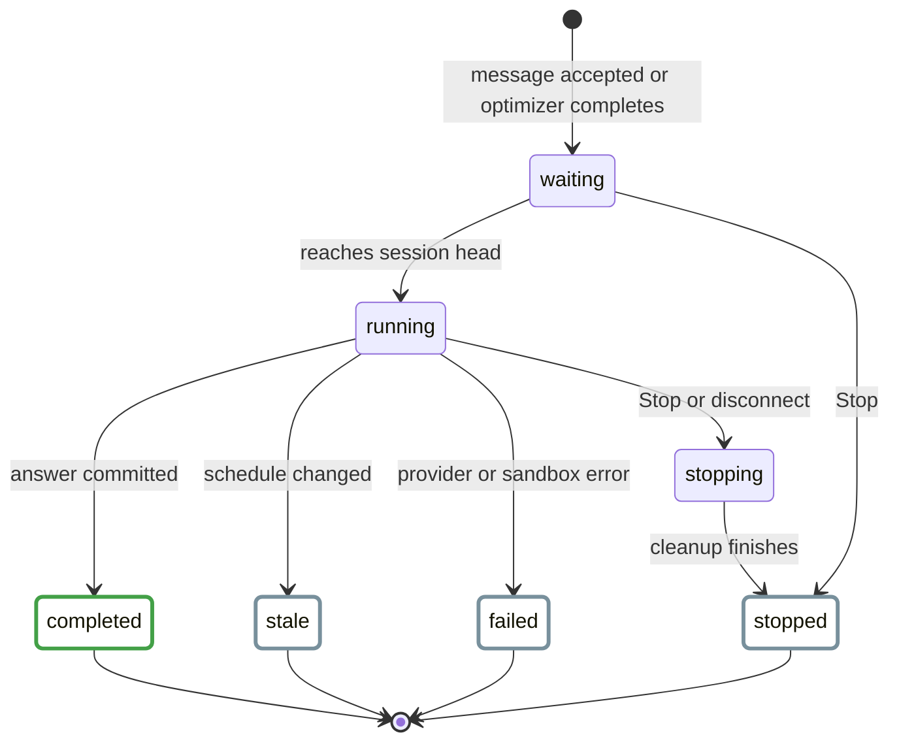
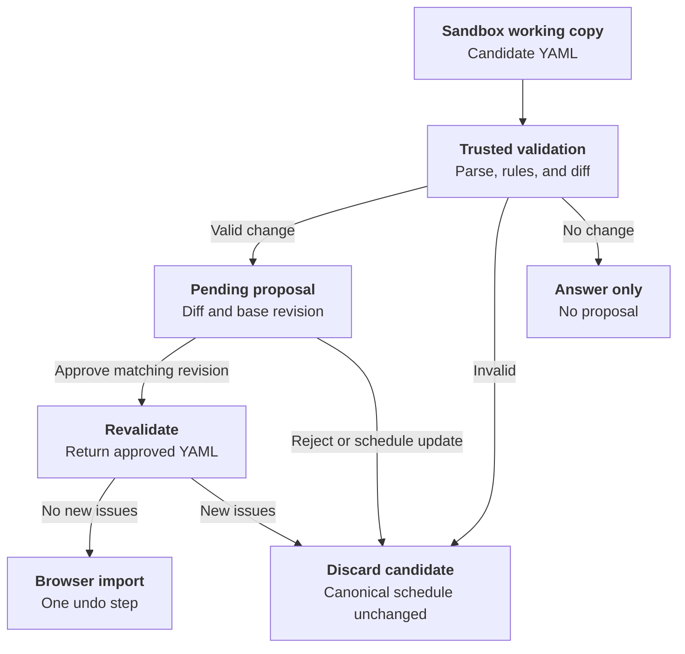

# AI Assistant Backend

The experimental AI assistant answers questions about a schedule and can
propose edits to it. It runs as a separate FastAPI application at
`nurse_scheduling.ai_serve:app`. The service keeps the current schedule in a
browser-owned session. Each message gets a fresh E2B Cloud sandbox where the
model can inspect a working copy. A changed schedule reaches the browser only
as a proposal that the user must approve.

This page follows a message from the browser through the assistant and back.
It also covers the HTTP API and the checks used to evaluate the assistant.
For setup commands, see the [Core README](reproduce/core.md#ai-backend). The
[user guide](../user-guide/experimental-ai.md) describes the browser controls.
The separate [backend server guide](backend-server.md) covers the optimizer API.

## Architecture



| Component | Responsibility |
| --- | --- |
| `ai/app.py` | Builds the app, authenticates requests, and exposes session and proposal routes. |
| `ai/lifecycle.py` and `ai/background.py` | Admit turns, run foreground and background responses, and deliver their events. |
| `ai/sandbox_agent.py` and `ai/sandbox/` | Prepare a disposable workspace, execute model tools, and read candidates for trusted validation. |
| `ai/optimizer.py` | Submit and monitor optimizer jobs without exposing their credentials to the sandbox. |
| `ai/history.py` | Optionally write chat audit records to PostgreSQL. |
| `web-frontend/src/app/experimental-ai/chatLifecycle.ts` | Track browser operations and ignore callbacks from superseded streams. |

Sessions, proposals, event replay, and optimizer monitors live in the AI
process. They do not use the optimization server's Redis store. Run one AI
backend instance until shared AI storage exists. A restart loses active
sessions, even when PostgreSQL audit logging is enabled.

## Turn Lifecycle

The browser creates a session with a YAML schedule snapshot. The response
includes an unguessable session ID, and an HTTP-only cookie identifies its
owner. A session expires after 48 hours of inactivity by default. Messages,
schedule updates, and proposal decisions renew that window. Checking the
session's remaining lifetime does not.



`SessionTurns` admits one assistant turn per session. A new foreground message
returns HTTP `409` while that session is busy. A follow-up triggered by an
optimizer result waits behind the active turn. Admission remains held until
sandbox and audit cleanup finish. A process-wide limit, set by
`AI_MAX_CONCURRENT_REQUESTS` and defaulting to four, bounds concurrent model
streams across sessions.

The same runner handles foreground messages and optimizer follow-ups. It
reserves the schedule, history, and a monotonic conversation version before
work begins. A changed schedule or a decision on a pending proposal advances
the version. If it changes during a turn, the result is stale and cannot
overwrite newer work, even if the schedule text later returns to its old value.

Stop cancels an assistant turn, including one waiting for admission. A browser
disconnect cancels its foreground turn. In either case, the service still
finishes resource and audit cleanup. Stop does not cancel an independent
optimizer job. A failed, stopped, or stale turn can leave provisional activity
visible in the browser, but its question, answer, and candidate do not enter
model conversation history. Retrying starts a new sandbox. Attachments must be
selected again.

### Workspace and model tools

The provider receives a schedule summary, recent committed history, and the
current question. It reads the full YAML through tools only when needed. The
service creates `/workspace/schedule.yaml`, places schema references under
`/reference`, and copies uploads below `/workspace/attachments` with a
manifest of safe paths and original filenames. Upload contents are available
for that turn only. Later prompts retain attachment names, not raw files.

The model has `read`, `bash`, `edit`, and `write` tools. `read` can inspect text
and supported images. The sandbox also provides helpers for XLSX and PDF
inspection. Independent reads in one model response can run concurrently.
Calls that include a file or shell mutation run in order. Tool output is
bounded before it returns to the provider. The service also bounds individual
commands, tool rounds, and the complete turn. File attachments are enabled by
default. Within configured size limits, arbitrary file types are copied into
the sandbox without being executed during upload handling. The model has no
repository or retrieval access.

E2B may pause the sandbox between tool activity and resume it for the next
operation. The application turn deadline and explicit sandbox destruction
provide the hard lifetime limit. If destruction is unconfirmed, a background
reaper retries it and scans for overdue application-owned sandboxes. To run one
cleanup pass while the AI service is offline, use:

```sh
python -m nurse_scheduling.ai.sandbox.reap
```

This command needs `E2B_API_KEY` and exits nonzero if listing fails or a
deletion remains unconfirmed. Schedule it externally if cleanup must continue
during a complete service outage.

## Schedule Proposals

The sandbox working copy is untrusted. After a tool changes it, the service
reads and validates it outside the sandbox before sending an intermediate
`schedule_change` preview. That preview does not change the session schedule.
At the end of a successful turn, the service validates the final file again
and computes a structural diff.



The final proposal event carries the diff, not the candidate YAML. Approval
supplies the SHA-256 revision of the schedule currently in the browser. A
mismatch discards the proposal. A matching proposal is revalidated and returned
for import as one undo step. Rejection and a schedule update elsewhere in the
app also drop the pending proposal. Approval or rejection records a short
action note for later model turns. If approval revalidation finds a new issue,
the proposal is discarded. A failed final validation discards all edits from
that turn.

The sandbox has no canonical storage, provider key, optimizer key, or database
credential. It has no outbound Internet access. The trusted application alone
stores proposals and decides whether a candidate can be applied. Uploads and
shell output remain untrusted input throughout this path.

## Optimizer Jobs and Events

The assistant can submit its current working YAML to the existing optimizer
API through a server-side tool. Before submission, the service replaces person
IDs and removes descriptions in the same way as the browser's Optimize and
Export flow. It keeps the reverse mapping and remote credential outside the
sandbox. Submission returns to the assistant immediately, while an independent
monitor follows the durable job.

When the job ends, the monitor restores person IDs in the workbook, retains a
size-bounded copy for a session-owned download, deletes the remote job, and
starts a background assistant turn with the result metadata. That turn and
later turns can inspect the retained workbook at
`/workspace/optimizer-results/optimized-schedule.xlsx`. Foreground chat can
continue while optimization runs. The resulting assistant turn still waits for
its session's turn slot.

Foreground answers use the message request's SSE response. Optimizer progress
and background answers use a separate session SSE stream. The latter supports
`Last-Event-ID` for reconnects and retains up to 1,000 turn events and 100
progress events per session. Its events include `turn_id`, so the browser can
attach replayed fragments to the right answer. A browser operation also has an
identity token, preventing an older stream callback from replacing newer
state.

| Event | Meaning |
| --- | --- |
| `delta`, `reasoning` | Answer text and a separate, nonpersistent reasoning stream. |
| `tool_start`, `tool` | Tool request and completed result, including success status. |
| `schedule_change`, `proposal` | Validated working-copy preview and final candidate diff. |
| `steering`, `history_trimmed` | Queued user input consumed at a model boundary and prompt-history reduction. |
| `optimization_progress`, `turn_start` | Session-stream updates for a remote job and a background turn. |
| `done`, `stopped`, `stale`, `error` | Terminal turn outcomes. |

Reasoning stays separate from answer text and is neither saved to conversation
history nor sent back to the provider on later turns. The service retries a
provider timeout only before it has received a streamed event, avoiding a
repeat of visible text or tool calls. Replay-safe E2B operations can also be
retried. Sandbox creation and shell execution are not replayed after an
uncertain response.

## HTTP API

| Method | Path | Purpose |
| --- | --- | --- |
| `GET` | `/health`, `/ready` | Check service identity and readiness. |
| `GET` | `/capabilities` | Discover attachment limits, session lifetime, and authentication requirement. |
| `POST` | `/sessions` | Create a session from `schedule_yaml`. |
| `GET` | `/sessions/{id}` | Check a session's remaining lifetime. |
| `POST` | `/sessions/{id}/messages` | Start a foreground SSE turn with JSON text or multipart text and attachments. |
| `POST` | `/sessions/{id}/messages/queue` | Queue steering text for the active turn's next model boundary. |
| `POST` | `/sessions/{id}/stop` | Stop the active assistant turn. |
| `GET` | `/sessions/{id}/events` | Replayable SSE for optimizer progress and background turns. |
| `PUT` | `/sessions/{id}/schedule` | Replace the session snapshot and discard a pending proposal. |
| `POST` | `/sessions/{id}/proposal/approve` | Revalidate and adopt a proposal against its base revision. |
| `POST` | `/sessions/{id}/proposal/reject` | Discard a proposal. |
| `GET` | `/sessions/{id}/optimizations/{job_id}/xlsx` | Download a retained optimizer workbook. |

For multipart messages, send one `message` field and repeat the `files` field
for attachments. The message and event routes return server-sent events.
`stop` and `messages/queue` return HTTP `202`. Creating a session sets its
owner cookie. Later session routes require that cookie. All session routes
also require a bearer key when bearer authentication is configured.

`/health`, `/ready`, and `/capabilities` are public. Set `AI_AUTH_TOKEN` or
`AI_AUTH_TOKENS` to require a bearer key for session routes. The latter is a
JSON map from administrative IDs to keys. The IDs appear in operator records,
while clients send only the key. Docker Compose sets `AI_AUTH_REQUIRED=true`,
so it refuses to start without a valid key unless that setting is explicitly
disabled. Native local runs may leave authentication off. The
[configuration reference](reproduce/core.md#ai-backend-configuration) gives
defaults and validation rules.

## Storage and Deployment

PostgreSQL chat logging is optional for native runs and included in both
backend Compose variants. It stores turn text, status, timestamps, usage when
available, attachment counts, and the administrative credential ID. It does
not store schedule snapshots, raw attachments, tool arguments or results, or
reasoning. User and assistant text can still contain staff information, so
database access is for operators. Audit records do not restore an active chat
after a restart.

An unavailable configured database prevents startup. If its initial write
fails, the request returns HTTP `503` before contacting the provider. If the
final write fails, a completed live turn reports `history_saved: false` and
logs the failure. Retention removes old turns according to
`AI_HISTORY_RETENTION_DAYS`. Backups need their own retention policy. Use the
optional pgAdmin Compose profile for inspection:

```sh
cd docker
docker compose -f compose.backend.yml --profile inspection run --rm --service-ports pgadmin
```

It listens on the backend host's loopback port `5050`. For a remote host,
forward that port with `ssh -L 5050:127.0.0.1:5050 user@backend-host`.
The Compose variant using a process-local optimizer uses
`compose.backend.memory.yml` instead. The [backend deployment guide](backend-deployment.md)
covers the Compose services and environment file.

The production NGINX proxy routes `/ai/*` to the AI service and other paths to
the optimizer API. It must disable response buffering for streaming routes.
With `proxy_pass http://ai:8001/;`, the trailing slash strips `/ai` before
FastAPI receives the request. Set `AI_COOKIE_SECURE=1` for a public HTTPS
browser route, even when the proxy talks to the container over HTTP. The CORS
origin allowlist still controls credentialed browser requests.

The complete schedule reaches the AI service, and selected content reaches
the model provider through tool results. Use approved services and anonymize
sensitive schedules as needed. The browser keeps the AI bearer key in memory
unless the user chooses to store it on the device. AI and optimizer keys are
configured independently. Keep `docker/.env` private.

## Tests

Run the affected AI checks from the [Core README](reproduce/core.md#focused-ai-checks).
Its [AI evaluation section](reproduce/core.md#ai-evaluation) covers the manual
case runner, selection, and reports.
