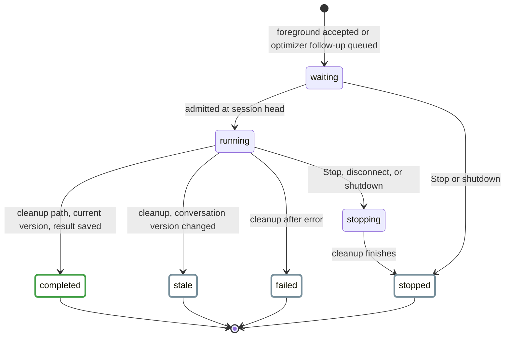
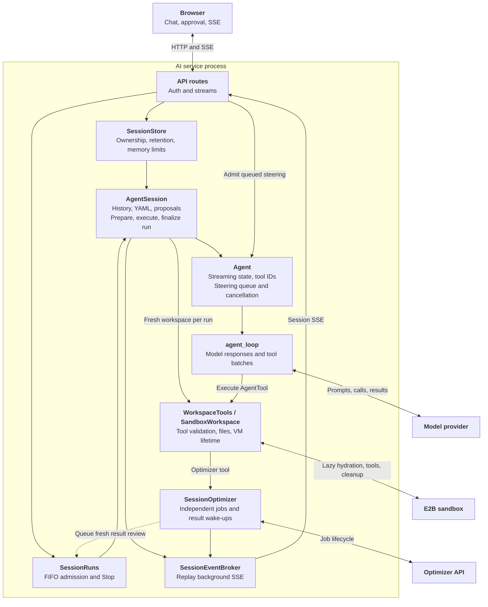
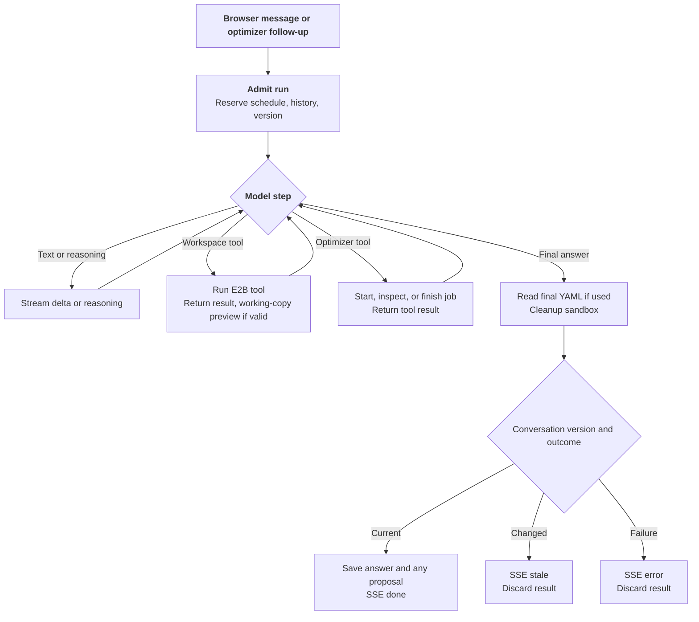
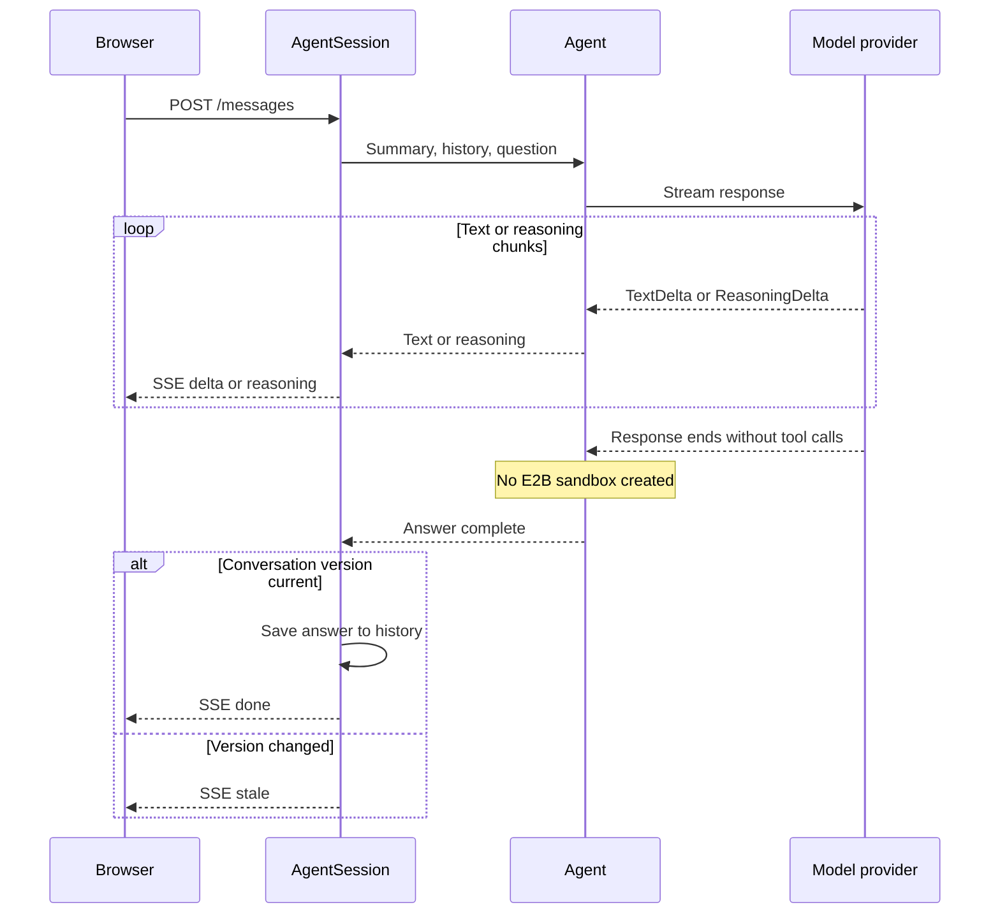
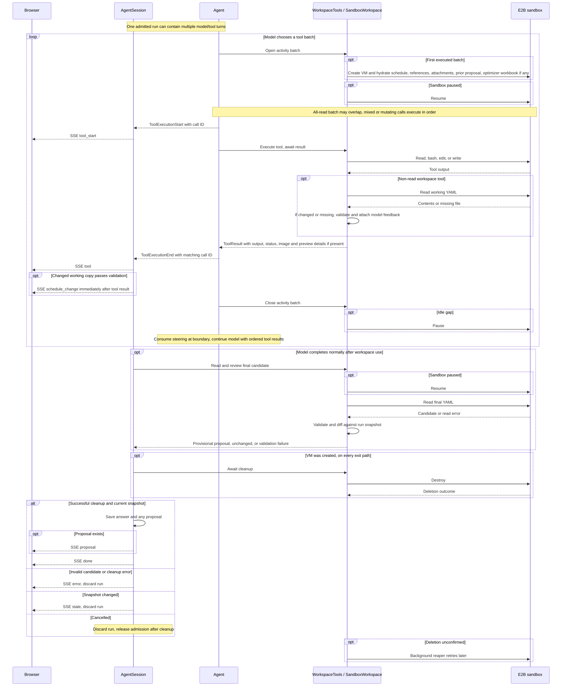

# AI Assistant Backend

The experimental AI assistant answers questions about a schedule and can
propose edits to it. It runs as a separate FastAPI application at
`nurse_scheduling.ai_serve:app`. The service keeps the current schedule in a
browser-owned session. When a tool needs a workspace, the run gets a fresh
E2B Cloud sandbox with a working copy. Assistant edits change the canonical
browser schedule only after the user approves a proposal.

A **run** spans one complete answer, including cleanup and saving its result.
A **turn**, following Pi terminology, is one model response plus its requested
tool executions. An **AgentSession** persists across runs. Existing SSE fields
such as `turn_id` and `turn_start` still identify a complete run for compatibility.

This page follows a run from admission through the model, workspace, and
optimizer paths. It also covers proposals, the HTTP API, and operational checks.
For setup commands, see the [Core README](reproduce/core.md#ai-backend). The
[user guide](../user-guide/experimental-ai.md) describes the browser controls.
The separate [backend server guide](backend-server.md) covers the optimizer API.
Scroll wide diagrams sideways to read their labels.

**Diagram key:** Solid arrows are calls. Dashed arrows are returned results or
SSE events. `opt` is conditional, `alt` shows alternative outcomes, and a loop
may repeat within one run. Arrow style does not encode synchronous versus
background work.

<style>
.ai-pi-mapping table {
  min-width: 680px;
}
.ai-diagram--wide {
  overflow-x: auto;
}
.ai-diagram.ai-diagram--wide .mermaid {
  min-width: 1080px;
}
@media (max-width: 48rem) {
  .ai-diagram {
    overflow-x: auto;
  }
  .ai-diagram .mermaid {
    min-width: 680px;
  }
}
</style>

## Run Lifecycle {#turn-lifecycle}

<div class="ai-diagram" markdown="1" tabindex="0">



</div>

These are the effective phases of `SessionRuns` and `AgentSession.run`.
They are derived from execution and finalization, rather than a stored enum. A session admits one run at a time. Background optimizer
follow-ups wait in its FIFO queue, while a second foreground request gets HTTP
`409`. The process-wide model-stream limit defaults to four.

A session begins with a browser-supplied YAML snapshot, an unguessable ID, and
an HTTP-only owner cookie. It expires after 48 hours of inactivity by default.
Messages, schedule updates, and proposal decisions renew that window. Checking
remaining lifetime does not. Each run reserves a conversation version. A
changed schedule or decision on a pending proposal advances it, so an older
result becomes stale even if the YAML later returns to the same text.

## Architecture

<div class="ai-diagram ai-diagram--wide" markdown="1" tabindex="0">



</div>

The provider and E2B paths run inside an assistant run. The optimizer monitor
can outlive that run and queue a follow-up when the job ends. Session state,
run admission, replay, and job monitors are process-local, separate from the
optimizer server's Redis store. Run one AI backend instance until shared AI
storage exists. A restart loses active sessions even when PostgreSQL logging is
enabled.

| Diagram component | Code |
| --- | --- |
| API routes / session registry | `ai/app.py`, `ai/sessions.py` |
| SessionRuns / AgentRun / RunSnapshot | `ai/lifecycle.py` |
| AgentSession / SSE projection | `ai/agent_session.py` |
| Agent / model-tool loop / event types | `ai/agent.py`, `ai/agent_loop.py`, `ai/agent_types.py` |
| Workspace tools / SandboxWorkspace | `ai/workspace_tools.py`, `ai/workspace.py`, `ai/sandbox/` |
| Background event replay | `ai/session_events.py` |
| SessionOptimizer | `ai/optimizer.py` |
| Browser operation lifecycle | `web-frontend/src/app/experimental-ai/chatLifecycle.ts` |

### Mapping to Pi

This comparison follows Pi's public agent loop and coding-agent session at
revision `d6af72e`. Links are pinned to that revision. These are architectural
counterparts, not identical APIs or a mapping of Pi's separate harness runtime.

<div class="ai-pi-mapping" markdown="1">

| Our component | Pi counterpart | Similarity and differences |
| --- | --- | --- |
| `Agent` / `AgentState` | [Agent][pi-agent], [AgentState][pi-state] | Both own streaming state, pending tool IDs, steering, and cancellation. Our model context is passed per run and successful history is committed by the session. Pi also keeps model, tools, transcript, and partial messages in agent state. |
| `agent_loop` | [agentLoop][pi-loop] | Both repeat model responses and tool execution, consuming steering at boundaries. We parallelize only all-read batches and enforce tool budgets. Pi supports configurable execution modes and a separate follow-up queue. |
| `AgentTool` / `ToolResult` | [AgentTool / AgentToolResult][pi-tools] | Both bind tool definitions to execution and return model content plus UI details. Ours accepts raw JSON arguments and returns text, an optional image, and explicit success status. Pi passes parsed parameters, call ID, cancellation signal, and a partial-update callback. |
| `AgentSession` / `RunOutput` | [AgentSession][pi-session] | Both layer application behavior over `Agent`. Ours owns snapshot and proposal transitions, accumulates provisional output, and saves history and proposals after cleanup. `SessionStore` wraps mutations with ownership, expiry, and memory checks. Pi's coding session adds persistence, compaction, retries, and extension handling. |
| `SessionRuns` / `AgentRun` / `RunSnapshot` | [ActiveRun and run lifecycle][pi-agent] | Both track active execution and cancellation. Our service adds per-session FIFO admission, queued background runs, and a versioned commit capability. These three types have no direct counterpart in this Pi path. |
| Steering queue | [steer / followUp][pi-agent] | Both deliver queued input at execution boundaries. Our steering drains all admitted messages, deduplicates IDs, and closes atomically when the answer ends. Optimizer follow-ups enter `SessionRuns` as fresh runs. Pi's follow-up queue continues the current run when it would otherwise finish. |
| `WorkspaceTools` / `SandboxWorkspace` | [AgentTool execution boundary][pi-tools] | Both provide executable tools to the loop. Our integration additionally owns a disposable E2B VM, hydration, pause/resume, YAML validation, and teardown. Pi's generic tool interface does not prescribe a workspace lifetime. |
| `SessionEventBroker` / SSE projection | [AgentEvent][pi-events], [Agent.subscribe][pi-agent] | Both expose execution events. We translate typed events to the existing SSE contract and retain background events for cursor replay. Pi's agent uses subscribers and includes agent, turn, message, and tool lifecycle events. |
| `SessionOptimizer` | [Tool execution][pi-tools] and [followUp][pi-agent] are the nearest boundaries | Our optimizer owns independent remote jobs, progress, late-submission cleanup, and fresh review runs. This service has no direct counterpart in the compared Pi agent/session path. |
| API routes / `SessionStore` / browser lifecycle | [AgentSession][pi-session] is the nearest application boundary | Our browser service adds HTTP authentication, cookie ownership, session expiry, memory limits, SSE reconnection, and schedule approval. These have no one-to-one mapping to Pi's coding-agent session. |

</div>

[pi-agent]: https://github.com/earendil-works/pi/blob/d6af72e1857cfb10b41d8ff8e69f0d72b4cf6d31/packages/agent/src/agent.ts#L188
[pi-state]: https://github.com/earendil-works/pi/blob/d6af72e1857cfb10b41d8ff8e69f0d72b4cf6d31/packages/agent/src/types.ts#L378
[pi-loop]: https://github.com/earendil-works/pi/blob/d6af72e1857cfb10b41d8ff8e69f0d72b4cf6d31/packages/agent/src/agent-loop.ts#L37
[pi-tools]: https://github.com/earendil-works/pi/blob/d6af72e1857cfb10b41d8ff8e69f0d72b4cf6d31/packages/agent/src/types.ts#L420
[pi-session]: https://github.com/earendil-works/pi/blob/d6af72e1857cfb10b41d8ff8e69f0d72b4cf6d31/packages/coding-agent/src/core/agent-session.ts#L331
[pi-events]: https://github.com/earendil-works/pi/blob/d6af72e1857cfb10b41d8ff8e69f0d72b4cf6d31/packages/agent/src/types.ts#L485

## One Run at a Glance {#one-turn-at-a-glance}

<div class="ai-diagram" markdown="1" tabindex="0">



</div>

| Browser action during a foreground run | Result |
| --- | --- |
| Queue the next message | HTTP `202` injects it at the next model boundary. If the run is closing, HTTP `409` makes the browser send it as a new run later. |
| Stop the current answer | The browser clears its locally queued messages, aborts the foreground SSE stream, and sends `POST /stop` (HTTP `202`). The service cancels the active run and every queued follow-up run. Cleanup still finishes. |
| Start a second answer directly | HTTP `409` leaves the current run running. |
| Disconnect the foreground SSE stream | Cancels only the active run. Cleanup still finishes. Queued follow-up runs run once admitted. |

A lost background event connection instead resumes from `Last-Event-ID` while
the server run continues.

The three paths below show a model step in detail. Text and tool requests can
occur in the same provider response, and a run may loop through several model
responses. A failed, stopped, or stale run can leave provisional activity in
the browser, but its answer and candidate do not enter model conversation
history.

### Text-only response

<div class="ai-diagram" markdown="1" tabindex="0">



</div>

Reasoning is streamed separately from answer text. It is not saved to
conversation history or sent back to the provider on later runs.

### Workspace and model tools

<div class="ai-diagram ai-diagram--wide" markdown="1" tabindex="0">



</div>

The model waits for each tool batch. The reaper runs later. Approving or
rejecting a pending proposal happens after the run and is drawn in the
Schedule Proposals flowchart below.

The model can use `read`, `bash`, `edit`, and `write`. `read` handles text and
supported images. Workspace helpers inspect XLSX and PDF files. Tool output,
individual commands, tool rounds, and the full run are bounded. The provider
sees a schedule summary and reads full YAML through tools only when needed.

Hydration copies the files below into the sandbox. The model inspects and edits
them with the four basic tools, and runs the inspect helpers through `bash`.

| Sandbox path | Content |
| --- | --- |
| `/workspace/schedule.yaml` | The session schedule snapshot. |
| `/workspace/pending-proposal.yaml`, `/workspace/pending-proposal.diff` | The pending proposal's full candidate YAML and its frozen diff against the canonical schedule, if any. Read-only reference, and the new diff is computed by the server at run end. |
| `/workspace/attachments/` | Uploaded files plus a `manifest.json` with safe paths and original filenames. |
| `/workspace/optimizer-results/optimized-schedule.xlsx` | A retained optimizer workbook, if any. |
| `/reference/` | Schema and guide references, plus `tools/inspect_xlsx.py` and `tools/inspect_pdf.py`. |

Attachment contents last only in this run's sandbox. Later prompts retain only
the filenames. The sandbox has no repository or retrieval access and no
outbound Internet access.

A sandbox belongs to one run. If deletion cannot be confirmed, the background
reaper retries and scans for overdue application-owned sandboxes. To run one
cleanup pass while the AI service is offline:

```sh
python -m nurse_scheduling.ai.sandbox.reap
```

The command needs `E2B_API_KEY` and exits nonzero if listing fails or deletion
remains unconfirmed. Schedule it externally if cleanup must continue during a
complete service outage.

## Optimizer Jobs and Events

<div class="ai-diagram ai-diagram--wide" markdown="1" tabindex="0">


</div>

A job is independent of the run that started it. Its monitor is a separate
background task, so stopping or disconnecting a run does not cancel a job
whose ID was returned. The service still reviews the result when the job ends,
while a job still being submitted when its run is cancelled is retired. The
monitor then cancels and deletes the remote job.

The optimizer credential and reverse person-ID mapping stay in the AI service,
outside E2B.

A retained workbook is mounted for the review run at
`/workspace/optimizer-results/optimized-schedule.xlsx`. The browser can also
download it through the session-owned route.

Foreground answers use the message request's SSE stream. Optimizer progress
and result-review runs use replayable session SSE with `Last-Event-ID`. The
broker retains up to 1,000 run events and 100 progress events per session.
Events carry `turn_id` so the browser can attach replayed fragments to the
right answer. Browser operation tokens prevent an older stream callback from
replacing newer state.

| Event | Meaning |
| --- | --- |
| `delta`, `reasoning` | Answer text and separate reasoning stream. |
| `tool_start`, `tool` | Tool request and completed result, including success status. |
| `schedule_change`, `proposal` | Working-copy preview and final candidate diff. |
| `steering`, `history_trimmed` | Queued input consumed and prompt-history reduction. |
| `optimization`, `optimization_progress`, `turn_start` | Job state, progress, and a background review run. |
| `done`, `stopped`, `stale`, `error` | Terminal run outcomes. |

The service retries a provider timeout only before receiving a streamed event,
avoiding a repeat of visible text or tool calls. Replay-safe E2B operations can
also be retried. Sandbox creation and shell execution are not replayed after an
uncertain response.

## Schedule Proposals

<div class="ai-diagram" markdown="1" tabindex="0">


</div>

A preview from a tool is provisional and never changes the canonical schedule.
Approval and rejection record short action notes for later model runs. The
sandbox has no canonical storage,
provider key, optimizer key, or database credential. Uploads and shell output
remain untrusted throughout review.

## HTTP API

| Method | Path | Purpose |
| --- | --- | --- |
| `GET` | `/health`, `/ready` | Check service identity and readiness. |
| `GET` | `/capabilities` | Discover attachment limits, session lifetime, and authentication requirement. |
| `POST` | `/sessions` | Create a session from `schedule_yaml`. |
| `GET` | `/sessions/{id}` | Check a session's remaining lifetime. |
| `POST` | `/sessions/{id}/messages` | Start a foreground SSE run with JSON text or multipart text and attachments. |
| `POST` | `/sessions/{id}/messages/queue` | Queue steering text for the active run's next model boundary. |
| `POST` | `/sessions/{id}/stop` | Stop the active assistant run. |
| `GET` | `/sessions/{id}/events` | Replayable SSE for optimizer progress and background runs. |
| `PUT` | `/sessions/{id}/schedule` | Replace the session snapshot and discard a pending proposal. |
| `POST` | `/sessions/{id}/proposal/approve` | Revalidate and adopt a proposal against its base revision. |
| `POST` | `/sessions/{id}/proposal/reject` | Discard a proposal. |
| `GET` | `/sessions/{id}/optimizations/{job_id}/xlsx` | Download a retained optimizer workbook. |

For multipart messages, send one `message` field and repeat the `files` field
for attachments. The message and event routes return server-sent events.
`stop` and `messages/queue` return HTTP `202`. Creating a session sets its
owner cookie. Later session routes require that cookie. All session routes
also require a bearer key when bearer authentication is configured.

`/health`, `/ready`, and `/capabilities` are public. Set `AI_AUTH_TOKEN` or
`AI_AUTH_TOKENS` to require a bearer key for session routes. The latter is a
JSON map from administrative IDs to keys. The IDs appear in operator records,
while clients send only the key. Docker Compose sets `AI_AUTH_REQUIRED=true`,
so it refuses to start without a valid key unless that setting is explicitly
disabled. Native local runs may leave authentication off. The
[configuration reference](reproduce/core.md#ai-backend-configuration) gives
defaults and validation rules.

## Storage and Deployment

PostgreSQL chat logging is optional for native runs and included in both
backend Compose variants. It stores run text, status, timestamps, usage when
available, attachment counts, and the administrative credential ID. It does
not store schedule snapshots, raw attachments, tool arguments or results, or
reasoning. User and assistant text can still contain staff information, so
database access is for operators. History records do not restore an active chat
after a restart.

An unavailable configured database prevents startup. If its initial write
fails, the request returns HTTP `503` before contacting the provider. If the
final write fails, a completed live run reports `history_saved: false` and
logs the failure. Retention removes old runs according to
`AI_HISTORY_RETENTION_DAYS`. Backups need their own retention policy. Use the
optional pgAdmin Compose profile for inspection:

```sh
cd docker
docker compose -f compose.backend.yml --profile inspection run --rm --service-ports pgadmin
```

It listens on the backend host's loopback port `5050`. For a remote host,
forward that port with `ssh -L 5050:127.0.0.1:5050 user@backend-host`.
The Compose variant using a process-local optimizer uses
`compose.backend.memory.yml` instead. The [backend deployment guide](backend-deployment.md)
covers the Compose services and environment file.

The production NGINX proxy routes `/ai/*` to the AI service and other paths to
the optimizer API. It must disable response buffering for streaming routes.
With `proxy_pass http://ai:8001/;`, the trailing slash strips `/ai` before
FastAPI receives the request. Set `AI_COOKIE_SECURE=1` for a public HTTPS
browser route, even when the proxy talks to the container over HTTP. The
service only sees the proxy's plain-HTTP connection, so the flag is what marks
the owner cookie `Secure`. The CORS origin allowlist separately controls which
browser origins may make credentialed requests with it.

The complete schedule reaches the AI service, and selected content reaches
the model provider through tool results. Use approved services and anonymize
sensitive schedules as needed. The browser keeps the AI bearer key in memory
unless the user chooses to store it on the device. AI and optimizer keys are
configured independently. Keep `docker/.env` private.

## Tests

Run the affected AI checks from the [Core README](reproduce/core.md#focused-ai-checks).
Its [AI evaluation section](reproduce/core.md#ai-evaluation) covers the manual
case runner, selection, and reports.
