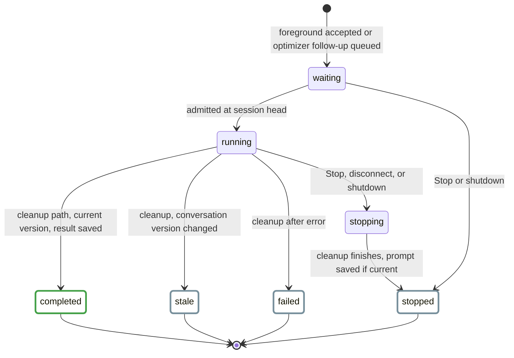
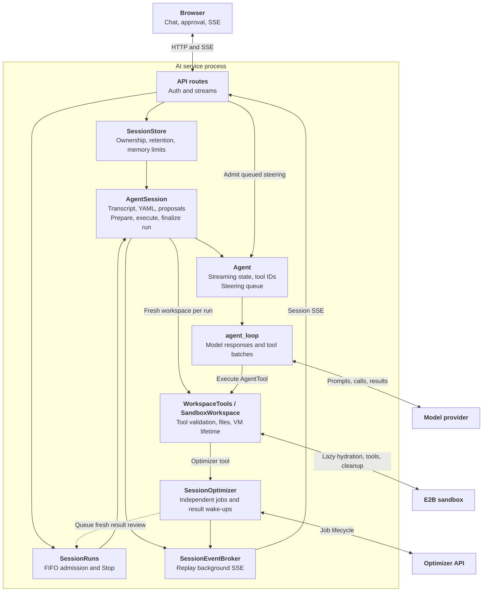
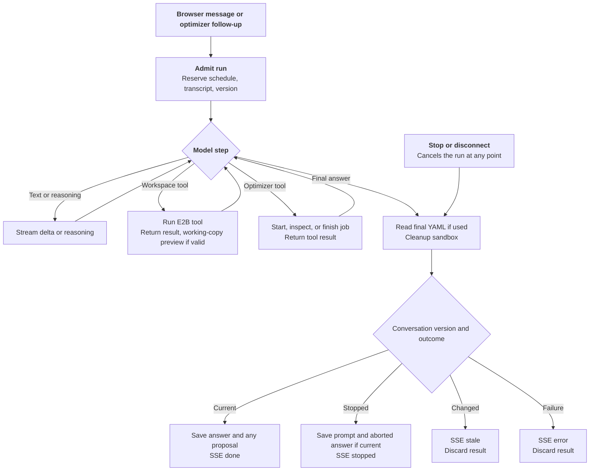
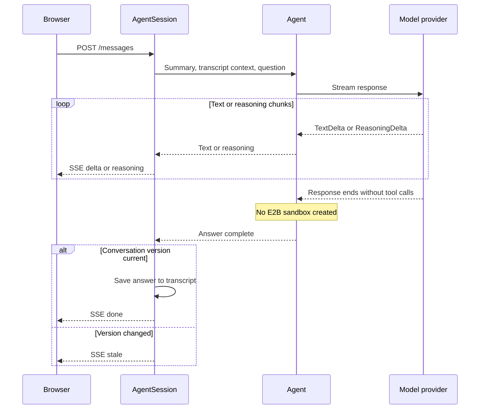
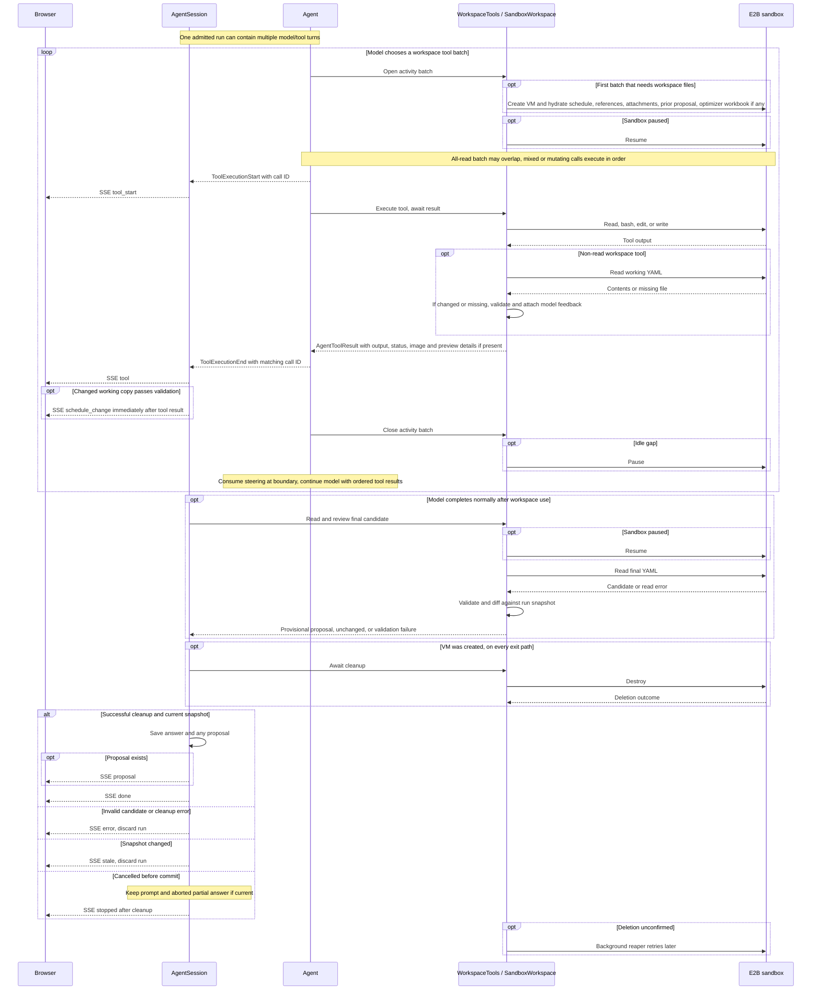
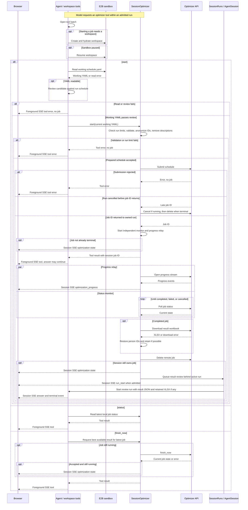

# AI Assistant Backend

The experimental AI assistant answers questions about a schedule and can
propose edits to it. It runs as a separate FastAPI application at
`nurse_scheduling.ai_serve:app`. The service keeps the current schedule in a
browser-owned session. When a tool needs a workspace, the run gets a fresh
E2B Cloud sandbox with a working copy. Assistant edits change the canonical
browser schedule only after the user approves a proposal.

A **run** spans one complete answer, including cleanup and saving its result.
A **turn**, following Pi terminology, is one model response plus its requested
tool executions. An **AgentSession** persists across runs. Code, SSE events, and
chat history name the complete answer a run, such as `run_id` and `run_start`.

This page follows a run from admission through the model, workspace, and
optimizer paths. It also covers proposals, the HTTP API, and operational checks.
For setup commands, see the [Core README](reproduce/core.md#ai-backend). The
[user guide](../user-guide/experimental-ai.md) describes the browser controls.
The separate [backend server guide](backend-server.md) covers the optimizer API.
Scroll wide diagrams sideways to read their labels.

**Diagram key:** Solid arrows are calls. Dashed arrows are returned results or
SSE events. `opt` is conditional, `alt` shows alternative outcomes, and a loop
may repeat within one run. Arrow style does not encode synchronous versus
background work.

<style>
.ai-pi-mapping table {
  min-width: 720px;
}
.ai-diagram--wide {
  overflow-x: auto;
}
.ai-diagram.ai-diagram--wide .mermaid {
  min-width: 1080px;
}
@media (max-width: 48rem) {
  .ai-diagram {
    overflow-x: auto;
  }
  .ai-diagram .mermaid {
    min-width: 680px;
  }
}
</style>

## Run Lifecycle {#turn-lifecycle}

<div class="ai-diagram" markdown="1" tabindex="0">



</div>

These are the effective phases of `SessionRuns` and `AgentSession.run`.
They are derived from execution and finalization, rather than a stored enum. A session admits one run at a time. Background optimizer
follow-ups wait in its FIFO queue, while a second foreground request gets HTTP
`409`. The process-wide model-stream limit defaults to four.

A session begins with a browser-supplied YAML snapshot, an unguessable ID, and
an HTTP-only owner cookie. It expires after 48 hours of inactivity by default.
Messages, schedule updates, and proposal decisions renew that window. Checking
remaining lifetime does not. Each run reserves a conversation version. A
changed schedule or decision on a pending proposal advances it, so an older
result becomes stale even if the YAML later returns to the same text.

## Architecture

<div class="ai-diagram ai-diagram--wide" markdown="1" tabindex="0">



</div>

The provider and E2B paths run inside an assistant run. The optimizer monitor
can outlive that run and queue a follow-up when the job ends. Session state,
run admission, replay, and job monitors are process-local, separate from the
optimizer server's Redis store. Run one AI backend instance until shared AI
storage exists. A restart loses active sessions even when PostgreSQL logging is
enabled.

| Diagram component | Code |
| --- | --- |
| API routes / session registry | `ai/app.py`, `ai/sessions.py` |
| SessionRuns / AgentRun / RunSnapshot | `ai/lifecycle.py` |
| AgentSession / SSE projection | `ai/agent_session.py` |
| Agent messages / model context | `ai/transcript.py`, `ai/context.py` |
| Agent / model-tool loop / event types | `ai/agent.py`, `ai/agent_loop.py`, `ai/agent_types.py` |
| Workspace tools / SandboxWorkspace | `ai/workspace_tools.py`, `ai/workspace.py`, `ai/sandbox/` |
| Background event replay | `ai/session_events.py` |
| SessionOptimizer | `ai/optimizer.py` |
| Browser operation lifecycle | `web-frontend/src/app/experimental-ai/chatLifecycle.ts` |
| Browser stream output reducer | `web-frontend/src/app/experimental-ai/assistantEvents.ts` |

### Mapping to Pi

This comparison follows Pi's public agent loop and coding-agent session at
revision `d6af72e`. Links are pinned to that revision. These are architectural
counterparts, not identical APIs or a mapping of Pi's separate harness runtime.
Each row lists shared behavior first, then what only one side has.

<div class="ai-pi-mapping" markdown="1">

| Component | Shared | Ours only | Pi only |
| --- | --- | --- | --- |
| `Agent` / `AgentState`<br/>Pi: [Agent][pi-agent], [AgentState][pi-state] | Streaming flag, pending tool call IDs, in-run messages, the steering queue, and refusal of a second concurrent prompt. | Context arrives per run, and the session commits its retained transcript after cleanup. `AgentRun`, not `Agent`, owns cancellation, so Stop also reaches queued runs and cannot interrupt cleanup. | State also holds the model, thinking level, tools, persistent transcript, and partial streaming message. Awaited subscribers settle each run. |
| `agent_loop`<br/>Pi: [agentLoop][pi-loop] | Repeats model responses and tool batches. Steering enters after a tool batch, or continues the run when it arrives as the answer ends. Tool calls from a response cut off by the output limit fail without running. | A batch runs concurrently only when every call is read-only. Round and call budgets end with an answer-only request, and a refused truncated batch spends a round. Each request passes through one context projection. | Parallel execution by default with per-tool sequential overrides, before and after tool-call hooks, context transform hooks, and early termination requested by tool results. |
| `AgentTool` / `AgentToolResult`<br/>Pi: [AgentTool / AgentToolResult][pi-tools] | A model-facing definition bound to execution. Results carry model content and UI details, and start and end events correlate by `tool_call_id`. | Tools receive raw JSON arguments, return text, an optional image, and an explicit success flag, and declare whether they are read-only. | Schema-validated parameters, the call ID, an abort signal, and partial-update callbacks. Tools throw on failure instead of encoding it. |
| `AgentSession` / `RunOutput` / `AgentMessage`<br/>Pi: [AgentSession][pi-session], [AgentMessage][pi-messages] | An application layer over `Agent`. Runs produce `UserMessage`, `AssistantMessage`, and `ToolResultMessage` records shaped like Pi's messages, with Pi's stop reasons, persisted in order. Context projection keeps aborted answers out of replayed model input. | Snapshot-versioned commits after sandbox cleanup, schedule revisions, and proposal decision entries. The in-memory session keeps only prompts, answer text, and decisions, and a stopped prompt stays with an interruption note. The persisted log is an audit record keyed by run, not a resumable session. | A persistent, branchable JSONL session with model and label entries, automatic compaction into summary entries, automatic retry of retryable errors, and extensions. |
| `SessionRuns` / `AgentRun` / `RunSnapshot`<br/>Pi: [ActiveRun and run lifecycle][pi-agent] | One active run with a cancellation handle, settled before the next run starts. | Per-session FIFO admission, queued background runs, Stop that also cancels queued runs, and a versioned commit capability. | The agent's own `AbortController`, passed to tools, with a single-run guard instead of a queue. |
| Steering queue<br/>Pi: [steer / followUp][pi-agent] | Queued input reaches the model at a boundary without starting a new run. | One queue serves both roles. It drains every message, deduplicates retried POSTs by ID, and closes atomically with the answer. Optimizer wake-ups enter `SessionRuns` as fresh runs. | Separate steering and follow-up queues, each draining one message at a time or all at once. |
| `WorkspaceTools` / `SandboxWorkspace`<br/>Pi: [read, bash, edit, write][pi-coding-tools] | Pi's default `read`, `bash`, `edit`, and `write` contracts and model-facing wording, ported under `ai/pi`. | A lazy, disposable E2B VM per run with hydration, pause and resume, trusted YAML validation after each change, and teardown before commit. | Tools act on the user's local working directory, which persists across runs. Optional `find`, `grep`, and `ls` tools extend the default four. |
| SSE projection / `RunEvents` / `SessionEventBroker`<br/>Pi: [AgentEvent][pi-events], [Agent.subscribe][pi-agent] | Typed text, reasoning, and tool events with call IDs, a message end for each model response, and exactly one terminal outcome per run. | Events map onto a stable SSE contract. Foreground output is a bounded stream that disconnect cancels. Background output is a journal replayed with `Last-Event-ID`. | In-process subscribers receive agent, turn, message, and tool lifecycle events, including partial tool updates. |
| `SessionOptimizer`<br/>Pi: no counterpart | Exposed to the model as one `AgentTool`. | Independent remote jobs, progress, anonymization, late-submission cleanup, and fresh review runs. | None. |
| API routes / `SessionStore` / browser lifecycle<br/>Pi: nearest is [AgentSession][pi-session] | A session boundary that owns conversation lifetime. | HTTP authentication, cookie ownership, expiry, global memory limits, SSE reconnection, a browser-owned canonical schedule, and proposal approval. | Local single-user sessions stored on disk that can be resumed and branched. |

</div>

### Retention and Context

Each run produces canonical entries shaped like Pi's messages: `user`,
`assistant` for each model response with its text, reasoning, tool calls, and
stop reason, `tool_result`, and this service's `proposal_decision`. Every
destination is a projection of them. The chat history log stores them all as
ordered rows under the run. The session transcript keeps prompts, answer text,
stop reasons, and decisions, because later model context never replays a
disposable sandbox's tools. Model context merges the responses between two
prompts into the answer the user saw. Trimming for memory, the message cap, or
the prompt budget removes whole exchanges, so an answer or proposal decision is
never left without its prompt.

During a run, `AgentState.messages` holds the messages the loop produces.
`context.py` projects them for each provider request. `RunOutput` projects the
same events onto SSE. History omits image bytes from tool results, and the
session retains only the entries useful to later questions.

| Content | Later model context | Session transcript | Browser and export | Chat history log |
| --- | --- | --- | --- | --- |
| Answer text | Yes, within the history budget | Yes | Yes | Yes |
| Reasoning | No | No | Yes | Yes |
| Tool calls and results | Only within their run | No | Yes, by `tool_call_id` | Yes |
| Queued steering | Yes | Yes | Yes | Yes, in run order |
| Stopped answer | Prompt and an interruption note | Prompt and aborted partial answer | Partial output, stopped status | Yes, `aborted` in a `cancelled` run |
| Failed or stale answer | No | No | Failed output with retry, or a stale notice | Yes, with run status |
| Attachment filenames | Yes, in the prompt note | Yes | Yes | Yes, in the prompt |
| Proposal decision | Yes | Yes | Yes | Yes, under the proposing run |

The investigated alternatives below were not adopted:

- **One event journal for both transports.** Foreground output is bounded and
  backpressured for its single reader, and disconnect cancels the run.
  Background output must outlive readers, replay by cursor, and also carry
  optimizer progress. Both already share `RunOutput` projection and
  `TERMINAL_EVENTS`. A single journal would add replay cost to every answer or
  drop backpressure.
- **Separate steering and follow-up queues.** The browser offers one queue
  action. Optimizer results start a fresh run because they can arrive after the
  run ends and must see the current schedule.
- **Summary compaction.** Every run re-sends the canonical schedule, so older
  exchanges carry less state than a coding transcript. Trimming the oldest
  complete exchanges avoids an extra provider call with its cost, latency, and
  failure mode.
- **Central schema validation of tool arguments.** The ported Pi tools already
  validate with Pi's wording and accept the compatibility shapes Pi's
  `prepareArguments` accepts, such as a legacy single edit. A generic schema
  check would reject those shapes first. A contract test instead requires every
  offered tool to refuse malformed arguments before any sandbox command, file
  change, or optimizer submission.
- **Recording failed attempts in the transcript.** Retry resends the question,
  so a recorded attempt would duplicate it in model context. The browser also
  replaces the failed pair on retry, so the question appears once and an old
  Retry button cannot resend it again. The chat history log keeps each
  attempt's outcome and ordered transcript as its lineage.

[pi-agent]: https://github.com/earendil-works/pi/blob/d6af72e1857cfb10b41d8ff8e69f0d72b4cf6d31/packages/agent/src/agent.ts#L188
[pi-state]: https://github.com/earendil-works/pi/blob/d6af72e1857cfb10b41d8ff8e69f0d72b4cf6d31/packages/agent/src/types.ts#L378
[pi-loop]: https://github.com/earendil-works/pi/blob/d6af72e1857cfb10b41d8ff8e69f0d72b4cf6d31/packages/agent/src/agent-loop.ts#L37
[pi-tools]: https://github.com/earendil-works/pi/blob/d6af72e1857cfb10b41d8ff8e69f0d72b4cf6d31/packages/agent/src/types.ts#L420
[pi-session]: https://github.com/earendil-works/pi/blob/d6af72e1857cfb10b41d8ff8e69f0d72b4cf6d31/packages/coding-agent/src/core/agent-session.ts#L331
[pi-events]: https://github.com/earendil-works/pi/blob/d6af72e1857cfb10b41d8ff8e69f0d72b4cf6d31/packages/agent/src/types.ts#L485
[pi-messages]: https://github.com/earendil-works/pi/blob/d6af72e1857cfb10b41d8ff8e69f0d72b4cf6d31/packages/agent/src/types.ts#L370
[pi-coding-tools]: https://github.com/earendil-works/pi/tree/d6af72e1857cfb10b41d8ff8e69f0d72b4cf6d31/packages/coding-agent/src/core/tools

## One Run at a Glance {#one-turn-at-a-glance}

<div class="ai-diagram" markdown="1" tabindex="0">



</div>

| Browser action during a foreground run | Result |
| --- | --- |
| Queue the next message | HTTP `202` injects it at the next model boundary. If the run is closing, HTTP `409` makes the browser send it as a new run later. |
| Stop the current answer | The browser clears its locally queued messages, aborts the foreground SSE stream, and sends `POST /stop` (HTTP `202`). The service cancels the active run and every queued follow-up run. Cleanup still finishes. |
| Start a second answer directly | HTTP `409` leaves the current run running. |
| Disconnect the foreground SSE stream | Cancels only the active run. Cleanup still finishes. Queued follow-up runs run once admitted. |

A lost background event connection instead resumes from `Last-Event-ID` while
the server run continues.

The three paths below show a model step in detail. Text and tool requests can
occur in the same provider response, and a run may loop through several model
responses. A failed or stale run can leave provisional activity in the
browser, but its prompt, answer, and candidate do not enter the session
transcript. A stopped run keeps its prompt so a follow-up can refer to it. Its
partial answer is stored as aborted, and model context replaces it with a short
interruption note, much as Pi skips aborted assistant messages. The candidate
is discarded with the sandbox. Every run ends with one terminal event. The
browser keeps a stopped response's partial output under a stopped status and
marks unfinished tool calls interrupted.

### Text-only response

<div class="ai-diagram" markdown="1" tabindex="0">



</div>

Reasoning is streamed separately from answer text. It is not saved to the
session transcript or sent back to the provider on later runs.

### Workspace and model tools

<div class="ai-diagram ai-diagram--wide" markdown="1" tabindex="0">



</div>

The model waits for each tool batch. The reaper runs later. Approving or
rejecting a pending proposal happens after the run and is drawn in the
Schedule Proposals flowchart below.

The model can use `read`, `bash`, `edit`, and `write`. `read` handles text and
supported images. Workspace helpers inspect XLSX and PDF files. Tool output,
individual commands, tool rounds, and the full run are bounded. The provider
sees a schedule summary and reads full YAML through tools only when needed.

Hydration copies the files below into the sandbox. The model inspects and edits
them with the four basic tools, and runs the inspect helpers through `bash`.

| Sandbox path | Content |
| --- | --- |
| `/workspace/schedule.yaml` | The session schedule snapshot. |
| `/workspace/pending-proposal.yaml`, `/workspace/pending-proposal.diff` | The pending proposal's full candidate YAML and its frozen diff against the canonical schedule, if any. Read-only reference, and the new diff is computed by the server at run end. |
| `/workspace/attachments/` | Uploaded files plus a `manifest.json` with safe paths and original filenames. |
| `/workspace/optimizer-results/optimized-schedule.xlsx` | A retained optimizer workbook, if any. |
| `/reference/` | Schema and guide references, plus `tools/inspect_xlsx.py` and `tools/inspect_pdf.py`. |

Attachment contents last only in this run's sandbox. Later prompts retain only
the filenames. The sandbox has no repository or retrieval access and no
outbound Internet access.

A sandbox belongs to one run. If deletion cannot be confirmed, the background
reaper retries and scans for overdue application-owned sandboxes. To run one
cleanup pass while the AI service is offline:

```sh
python -m nurse_scheduling.ai.sandbox.reap
```

The command needs `E2B_API_KEY` and exits nonzero if listing fails or deletion
remains unconfirmed. Schedule it externally if cleanup must continue during a
complete service outage.

## Optimizer Jobs and Events

<div class="ai-diagram ai-diagram--wide" markdown="1" tabindex="0">



</div>

A job is independent of the run that started it. Its monitor is a separate
background task, so stopping or disconnecting a run does not cancel a job
whose ID was returned. The service still reviews the result when the job ends,
while a job still being submitted when its run is cancelled is retired. The
monitor then cancels and deletes the remote job.

The `status` and `finish_now` actions use service-held job state and do not
create an E2B sandbox when they are the only tools in a batch.

The optimizer credential and reverse person-ID mapping stay in the AI service,
outside E2B.

A retained workbook is mounted for the review run at
`/workspace/optimizer-results/optimized-schedule.xlsx`. The browser can also
download it through the session-owned route.

Foreground answers use the message request's SSE stream. Optimizer progress
and result-review runs use replayable session SSE with `Last-Event-ID`. The
broker retains up to 1,000 run events and 100 progress events per session.
Events carry `run_id` so the browser can attach replayed fragments to the
right answer. Browser operation tokens prevent an older stream callback from
replacing newer state.

| Event | Meaning |
| --- | --- |
| `delta`, `reasoning`, `truncated` | Answer text, a separate reasoning stream, and a marker that the answer stopped at the output limit. |
| `tool_start`, `tool` | Tool request and completed result, correlated by `tool_call_id` and including success status. |
| `schedule_change`, `proposal` | Working-copy preview and final candidate diff. |
| `steering`, `history_trimmed` | Queued input consumed and prompt-history reduction. |
| `optimization`, `optimization_progress`, `run_start` | Job state, progress, and a background review run. |
| `done`, `stopped`, `stale`, `error` | Terminal run outcomes. |

The service retries a provider timeout only before receiving a streamed event,
avoiding a repeat of visible text or tool calls. Replay-safe E2B operations can
also be retried. Sandbox creation and shell execution are not replayed after an
uncertain response.

## Schedule Proposals

<div class="ai-diagram" markdown="1" tabindex="0">


</div>

A preview from a tool is provisional and never changes the canonical schedule.
Approval and rejection record short action notes for later model runs. The
sandbox has no canonical storage,
provider key, optimizer key, or database credential. Uploads and shell output
remain untrusted throughout review.

## HTTP API

| Method | Path | Purpose |
| --- | --- | --- |
| `GET` | `/health`, `/ready` | Check service identity and readiness. |
| `GET` | `/capabilities` | Discover attachment limits, session lifetime, and authentication requirement. |
| `POST` | `/sessions` | Create a session from `schedule_yaml`. |
| `GET` | `/sessions/{id}` | Check a session's remaining lifetime. |
| `POST` | `/sessions/{id}/messages` | Start a foreground SSE run with JSON text or multipart text and attachments. |
| `POST` | `/sessions/{id}/messages/queue` | Queue steering text for the active run's next model boundary. |
| `POST` | `/sessions/{id}/stop` | Stop the active assistant run. |
| `GET` | `/sessions/{id}/events` | Replayable SSE for optimizer progress and background runs. |
| `PUT` | `/sessions/{id}/schedule` | Replace the session snapshot and discard a pending proposal. |
| `POST` | `/sessions/{id}/proposal/approve` | Revalidate and adopt a proposal against its base revision. |
| `POST` | `/sessions/{id}/proposal/reject` | Discard a proposal. |
| `GET` | `/sessions/{id}/optimizations/{job_id}/xlsx` | Download a retained optimizer workbook. |

For multipart messages, send one `message` field and repeat the `files` field
for attachments. The message and event routes return server-sent events.
`stop` and `messages/queue` return HTTP `202`. Creating a session sets its
owner cookie. Later session routes require that cookie. All session routes
also require a bearer key when bearer authentication is configured.

`/health`, `/ready`, and `/capabilities` are public. Set `AI_AUTH_TOKEN` or
`AI_AUTH_TOKENS` to require a bearer key for session routes. The latter is a
JSON map from administrative IDs to keys. The IDs appear in operator records,
while clients send only the key. Docker Compose sets `AI_AUTH_REQUIRED=true`,
so it refuses to start without a valid key unless that setting is explicitly
disabled. Native local runs may leave authentication off. The
[configuration reference](reproduce/core.md#ai-backend-configuration) gives
defaults and validation rules.

## Storage and Deployment

### Durable chat logging

PostgreSQL chat logging is optional for native runs and included in both
backend Compose variants. `chat_runs` keeps run metadata: status, error code,
model, timestamps, usage when available, and attachment count.
`chat_run_entries` stores each run's agent messages in order, keyed by
`(run_id, seq)`, with a `type` and a JSON `payload` holding the fields of the
matching `transcript.py` type. The prompt is written when the run starts, then
every model response, tool result, and queued steering message when it ends. A
later proposal decision is appended to the run that proposed it. Sessions keep
the administrative credential ID. Raw attachment files and images are not
stored, but tool results can contain schedule and attachment text. Entries can
contain staff information, so database access is for operators. History records
do not restore an active chat after a restart. Upgrading a database from the
earlier experimental `chat_turns` schema drops that history.

An unavailable configured database prevents startup. If its initial write
fails, the request returns HTTP `503` before contacting the provider. If the
final write fails, a completed live run reports `history_saved: false` and
logs the failure. Retention removes old runs according to
`AI_HISTORY_RETENTION_DAYS`. Backups need their own retention policy. Use the
optional pgAdmin Compose profile for inspection.

### Inspect chat history with pgAdmin

Start pgAdmin from `docker/` with the same Compose file and environment file
used by the deployment:

```sh
cd docker
docker compose -f compose.backend.yml --profile inspection run --rm --service-ports pgadmin
```

It listens on the backend host's loopback port `5050`. For a remote host,
forward that port with `ssh -L 5050:127.0.0.1:5050 user@backend-host`.
The Compose variant using a process-local optimizer uses
`compose.backend.memory.yml` instead. The [backend deployment guide](backend-deployment.md)
covers the Compose services and environment file.

Open `http://127.0.0.1:5050` and sign in with
`admin@nursescheduling.org` / `pgadmin`. Under **Nurse Scheduling**, connect
to **AI chat history** with database password `ai_history`. The server
definition is preloaded. In **Tools > Query Tool**, inspect recent entries:

```sql
SELECT r.started_at, s.auth_credential_id, r.status, r.model,
       e.seq, e.type, e.payload
FROM chat_runs AS r
JOIN chat_sessions AS s ON s.id = r.session_id
JOIN chat_run_entries AS e ON e.run_id = r.id
ORDER BY r.started_at DESC, e.seq
LIMIT 100;
```

Press Ctrl+C when finished. Compose removes the temporary pgAdmin container;
the PostgreSQL service and its `postgres-ai-data` volume remain intact.

The production NGINX proxy routes `/ai/*` to the AI service and other paths to
the optimizer API. It must disable response buffering for streaming routes.
With `proxy_pass http://ai:8001/;`, the trailing slash strips `/ai` before
FastAPI receives the request. Set `AI_COOKIE_SECURE=1` for a public HTTPS
browser route, even when the proxy talks to the container over HTTP. The
service only sees the proxy's plain-HTTP connection, so the flag is what marks
the owner cookie `Secure`. The CORS origin allowlist separately controls which
browser origins may make credentialed requests with it.

The complete schedule reaches the AI service, and selected content reaches
the model provider through tool results. Use approved services and anonymize
sensitive schedules as needed. The browser keeps the AI bearer key in memory
unless the user chooses to store it on the device. AI and optimizer keys are
configured independently. Keep `docker/.env` private.

## Tests

Run the affected AI checks from the [Core README](reproduce/core.md#focused-ai-checks).
Its [AI evaluation section](reproduce/core.md#ai-evaluation) covers the manual
case runner, selection, and reports.
