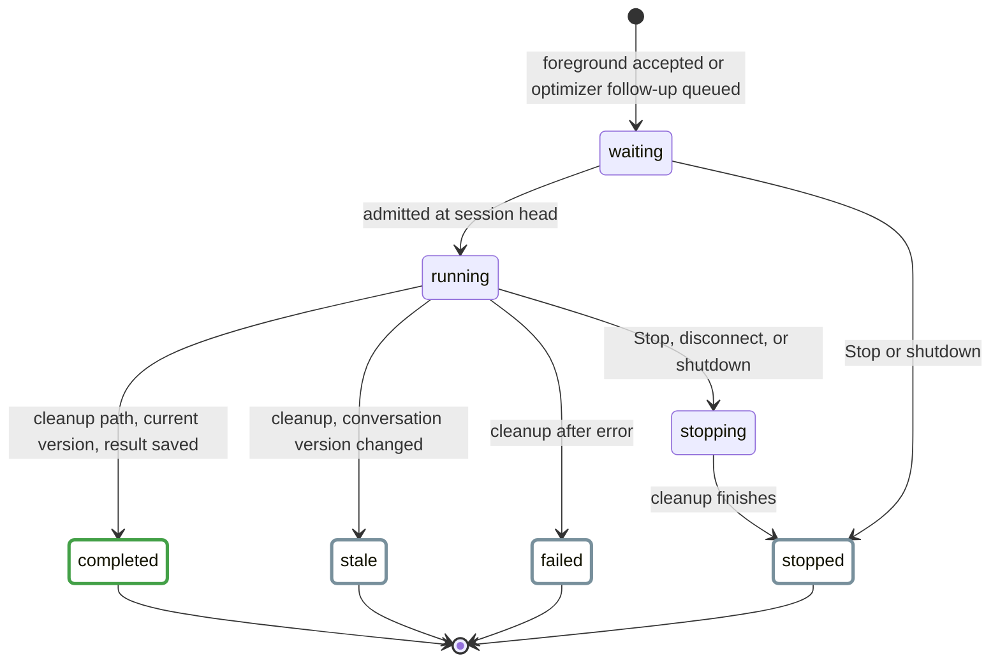
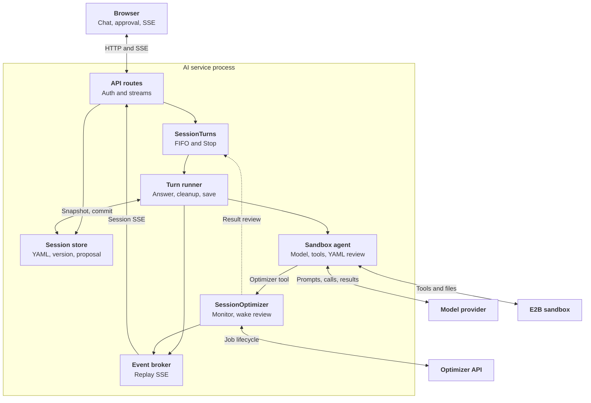
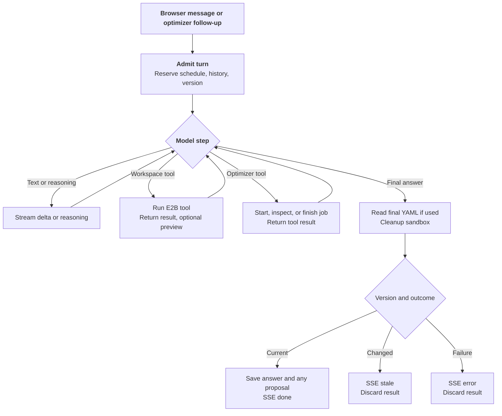
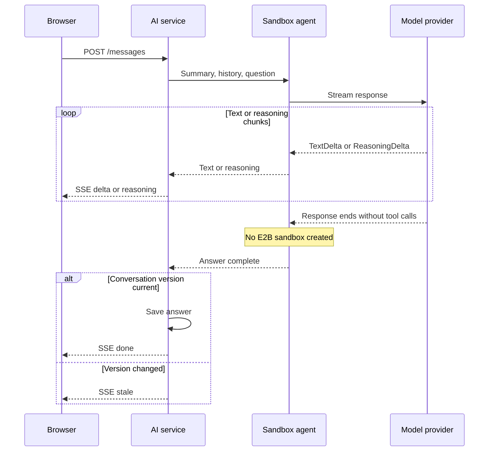
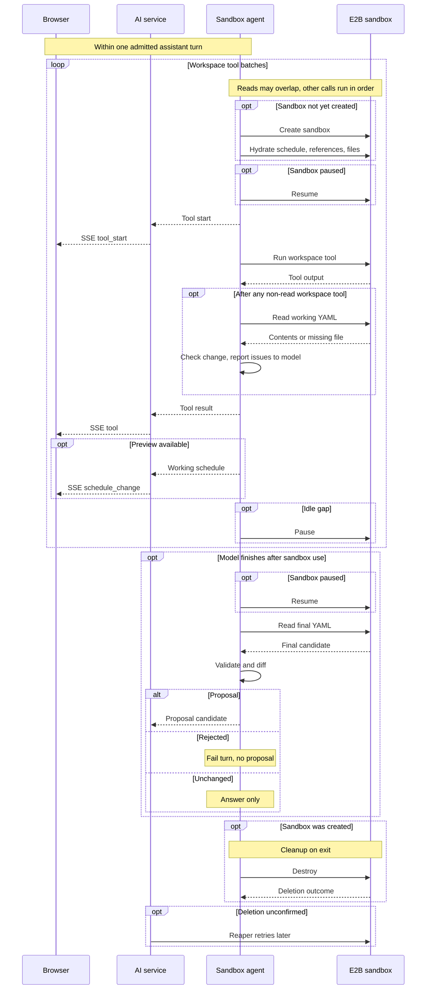
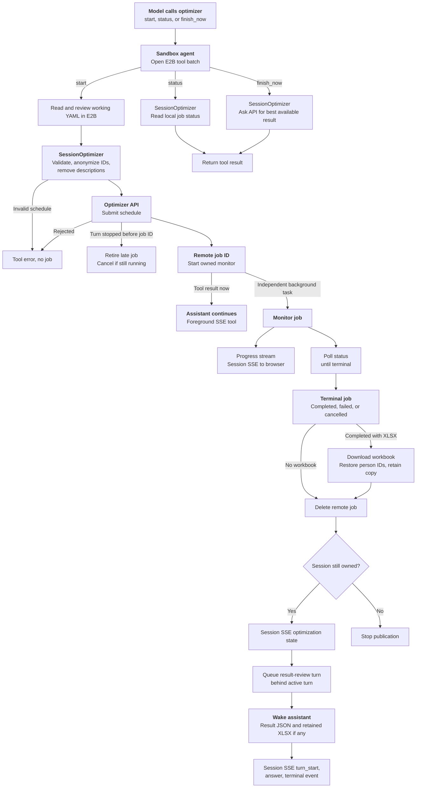
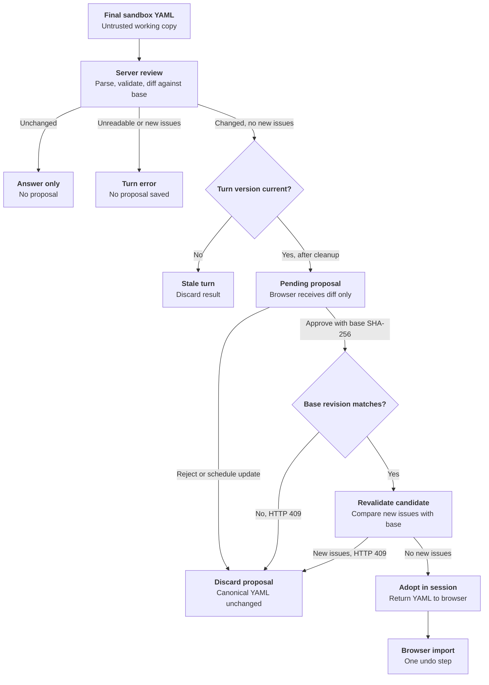

# AI Assistant Backend

The experimental AI assistant answers questions about a schedule and can
propose edits to it. It runs as a separate FastAPI application at
`nurse_scheduling.ai_serve:app`. The service keeps the current schedule in a
browser-owned session. When a tool needs a workspace, the turn gets a fresh
E2B Cloud sandbox with a working copy. Assistant edits change the canonical
browser schedule only after the user approves a proposal.

This page follows a turn from admission through the model, workspace, and
optimizer paths. It also covers proposals, the HTTP API, and operational checks.
For setup commands, see the [Core README](reproduce/core.md#ai-backend). The
[user guide](../user-guide/experimental-ai.md) describes the browser controls.
The separate [backend server guide](backend-server.md) covers the optimizer API.
On narrow screens, scroll the diagrams sideways to read their labels.

<style>
@media (max-width: 48rem) {
  .ai-diagram {
    overflow-x: auto;
  }
  .ai-diagram .mermaid {
    min-width: 680px;
  }
}
</style>

## Turn Lifecycle

<div class="ai-diagram" markdown="1" tabindex="0">



</div>

These are the effective phases of `SessionTurns` and the turn runner, not a
stored state enum. A session admits one turn at a time. Background optimizer
follow-ups wait in its FIFO queue, while a second foreground request gets HTTP
`409`. The process-wide model-stream limit defaults to four.

A session begins with a browser-supplied YAML snapshot, an unguessable ID, and
an HTTP-only owner cookie. It expires after 48 hours of inactivity by default.
Messages, schedule updates, and proposal decisions renew that window. Checking
remaining lifetime does not. Each turn reserves a conversation version. A
changed schedule or decision on a pending proposal advances it, so an older
result becomes stale even if the YAML later returns to the same text.

## Architecture

<div class="ai-diagram" markdown="1" tabindex="0">



</div>

The provider and E2B paths run inside an assistant turn. The optimizer monitor
can outlive that turn and queue a follow-up when the job ends. Session state,
turn admission, replay, and job monitors are process-local, separate from the
optimizer server's Redis store. Run one AI backend instance until shared AI
storage exists. A restart loses active sessions even when PostgreSQL logging is
enabled.

| Diagram component | Code |
| --- | --- |
| API routes and session store | `ai/app.py` |
| SessionTurns | `ai/lifecycle.py` |
| Turn runner and event broker | `ai/background.py` |
| Sandbox agent and workspace | `ai/sandbox_agent.py`, `ai/sandbox/` |
| SessionOptimizer | `ai/optimizer.py` |
| Browser operation lifecycle | `web-frontend/src/app/experimental-ai/chatLifecycle.ts` |

## One Turn at a Glance

<div class="ai-diagram" markdown="1" tabindex="0">



</div>

| Browser action during a foreground turn | Result |
| --- | --- |
| Queue the next message | HTTP `202` injects it at the next model boundary. If the turn is closing, HTTP `409` makes the browser send it as a new turn later. |
| Stop the current answer | HTTP `202` cancels the active turn and queued follow-ups. Cleanup finishes, and locally queued text is cleared. An optimizer job whose ID was returned continues. |
| Start a second answer directly | HTTP `409` leaves the current turn running. |
| Disconnect the foreground stream | Cancels the turn and completes cleanup. |

A lost background event connection instead resumes from `Last-Event-ID` while
the server turn continues.

The three paths below show a model step in detail. Text and tool requests can
occur in the same provider response, and a turn may loop through several model
responses. A failed, stopped, or stale turn can leave provisional activity in
the browser, but its answer and candidate do not enter model conversation
history.

### Text-only response

<div class="ai-diagram" markdown="1" tabindex="0">



</div>

Reasoning is streamed separately from answer text. It is not saved to
conversation history or sent back to the provider on later turns.

### Workspace and model tools

<div class="ai-diagram" markdown="1" tabindex="0">



</div>

**Diagram key:** Solid arrows are calls. Dashed arrows are returned results or
SSE events. `opt` is conditional, `alt` shows alternative outcomes, and the
loop may repeat within one turn. Arrow style does not encode synchronous versus
background work. The model waits for each tool batch. The reaper runs later.

The model can use `read`, `bash`, `edit`, and `write`. `read` handles text and
supported images. Workspace helpers inspect XLSX and PDF files. Tool output,
individual commands, tool rounds, and the full turn are bounded. The provider
sees a schedule summary and reads full YAML through tools only when needed.

Hydration puts `schedule.yaml` under `/workspace`, schema and guide references
under `/reference`, and uploaded files under `/workspace/attachments`. An
attachment manifest records safe paths and original filenames. Pending proposal
files and a retained optimizer workbook are copied when present. Upload bytes
last only for this turn. Later prompts retain their filenames. The sandbox has
no repository or retrieval access and no outbound Internet access.

A sandbox belongs to one turn. If deletion cannot be confirmed, the background
reaper retries and scans for overdue application-owned sandboxes. To run one
cleanup pass while the AI service is offline:

```sh
python -m nurse_scheduling.ai.sandbox.reap
```

The command needs `E2B_API_KEY` and exits nonzero if listing fails or deletion
remains unconfirmed. Schedule it externally if cleanup must continue during a
complete service outage.

## Optimizer Jobs and Events

<div class="ai-diagram" markdown="1" tabindex="0">



</div>

The optimizer credential and reverse person-ID mapping stay in the AI service,
outside E2B.

A retained workbook is mounted for the review turn at
`/workspace/optimizer-results/optimized-schedule.xlsx`. The browser can also
download it through the session-owned route.

Foreground answers use the message request's SSE stream. Optimizer progress
and result-review turns use replayable session SSE with `Last-Event-ID`. The
broker retains up to 1,000 turn events and 100 progress events per session.
Events carry `turn_id` so the browser can attach replayed fragments to the
right answer. Browser operation tokens prevent an older stream callback from
replacing newer state.

| Event | Meaning |
| --- | --- |
| `delta`, `reasoning` | Answer text and separate reasoning stream. |
| `tool_start`, `tool` | Tool request and completed result, including success status. |
| `schedule_change`, `proposal` | Working-copy preview and final candidate diff. |
| `steering`, `history_trimmed` | Queued input consumed and prompt-history reduction. |
| `optimization`, `optimization_progress`, `turn_start` | Job state, progress, and a background review turn. |
| `done`, `stopped`, `stale`, `error` | Terminal turn outcomes. |

The service retries a provider timeout only before receiving a streamed event,
avoiding a repeat of visible text or tool calls. Replay-safe E2B operations can
also be retried. Sandbox creation and shell execution are not replayed after an
uncertain response.

## Schedule Proposals

<div class="ai-diagram" markdown="1" tabindex="0">



</div>

A preview from a tool is provisional and never changes the canonical schedule.
Approval and rejection record short action notes for later model turns. The
sandbox has no canonical storage,
provider key, optimizer key, or database credential. Uploads and shell output
remain untrusted throughout review.

## HTTP API

| Method | Path | Purpose |
| --- | --- | --- |
| `GET` | `/health`, `/ready` | Check service identity and readiness. |
| `GET` | `/capabilities` | Discover attachment limits, session lifetime, and authentication requirement. |
| `POST` | `/sessions` | Create a session from `schedule_yaml`. |
| `GET` | `/sessions/{id}` | Check a session's remaining lifetime. |
| `POST` | `/sessions/{id}/messages` | Start a foreground SSE turn with JSON text or multipart text and attachments. |
| `POST` | `/sessions/{id}/messages/queue` | Queue steering text for the active turn's next model boundary. |
| `POST` | `/sessions/{id}/stop` | Stop the active assistant turn. |
| `GET` | `/sessions/{id}/events` | Replayable SSE for optimizer progress and background turns. |
| `PUT` | `/sessions/{id}/schedule` | Replace the session snapshot and discard a pending proposal. |
| `POST` | `/sessions/{id}/proposal/approve` | Revalidate and adopt a proposal against its base revision. |
| `POST` | `/sessions/{id}/proposal/reject` | Discard a proposal. |
| `GET` | `/sessions/{id}/optimizations/{job_id}/xlsx` | Download a retained optimizer workbook. |

For multipart messages, send one `message` field and repeat the `files` field
for attachments. The message and event routes return server-sent events.
`stop` and `messages/queue` return HTTP `202`. Creating a session sets its
owner cookie. Later session routes require that cookie. All session routes
also require a bearer key when bearer authentication is configured.

`/health`, `/ready`, and `/capabilities` are public. Set `AI_AUTH_TOKEN` or
`AI_AUTH_TOKENS` to require a bearer key for session routes. The latter is a
JSON map from administrative IDs to keys. The IDs appear in operator records,
while clients send only the key. Docker Compose sets `AI_AUTH_REQUIRED=true`,
so it refuses to start without a valid key unless that setting is explicitly
disabled. Native local runs may leave authentication off. The
[configuration reference](reproduce/core.md#ai-backend-configuration) gives
defaults and validation rules.

## Storage and Deployment

PostgreSQL chat logging is optional for native runs and included in both
backend Compose variants. It stores turn text, status, timestamps, usage when
available, attachment counts, and the administrative credential ID. It does
not store schedule snapshots, raw attachments, tool arguments or results, or
reasoning. User and assistant text can still contain staff information, so
database access is for operators. History records do not restore an active chat
after a restart.

An unavailable configured database prevents startup. If its initial write
fails, the request returns HTTP `503` before contacting the provider. If the
final write fails, a completed live turn reports `history_saved: false` and
logs the failure. Retention removes old turns according to
`AI_HISTORY_RETENTION_DAYS`. Backups need their own retention policy. Use the
optional pgAdmin Compose profile for inspection:

```sh
cd docker
docker compose -f compose.backend.yml --profile inspection run --rm --service-ports pgadmin
```

It listens on the backend host's loopback port `5050`. For a remote host,
forward that port with `ssh -L 5050:127.0.0.1:5050 user@backend-host`.
The Compose variant using a process-local optimizer uses
`compose.backend.memory.yml` instead. The [backend deployment guide](backend-deployment.md)
covers the Compose services and environment file.

The production NGINX proxy routes `/ai/*` to the AI service and other paths to
the optimizer API. It must disable response buffering for streaming routes.
With `proxy_pass http://ai:8001/;`, the trailing slash strips `/ai` before
FastAPI receives the request. Set `AI_COOKIE_SECURE=1` for a public HTTPS
browser route, even when the proxy talks to the container over HTTP. The CORS
origin allowlist still controls credentialed browser requests.

The complete schedule reaches the AI service, and selected content reaches
the model provider through tool results. Use approved services and anonymize
sensitive schedules as needed. The browser keeps the AI bearer key in memory
unless the user chooses to store it on the device. AI and optimizer keys are
configured independently. Keep `docker/.env` private.

## Tests

Run the affected AI checks from the [Core README](reproduce/core.md#focused-ai-checks).
Its [AI evaluation section](reproduce/core.md#ai-evaluation) covers the manual
case runner, selection, and reports.
