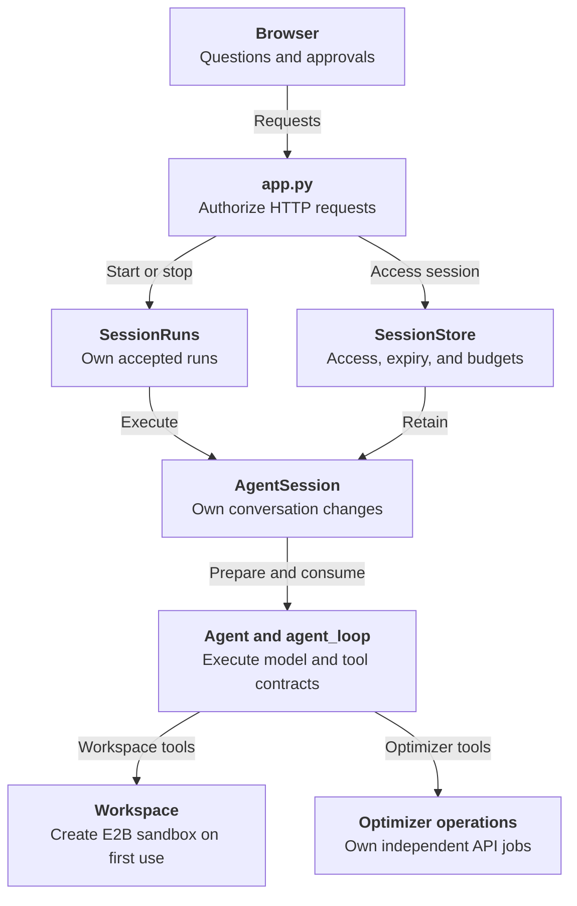
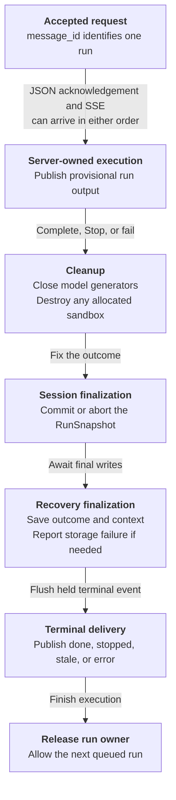
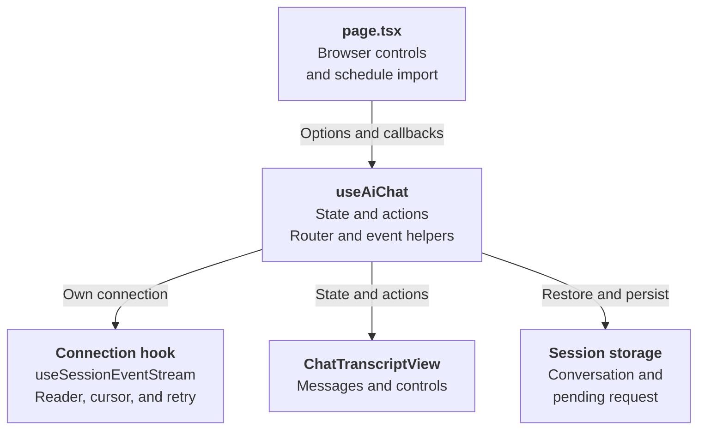
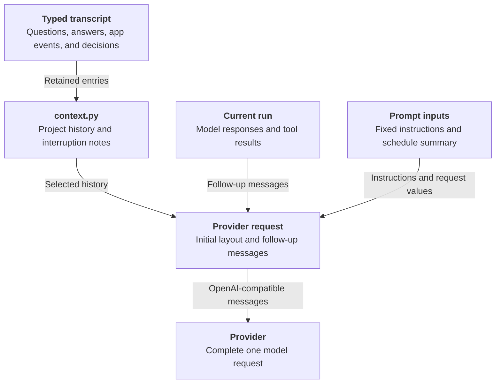
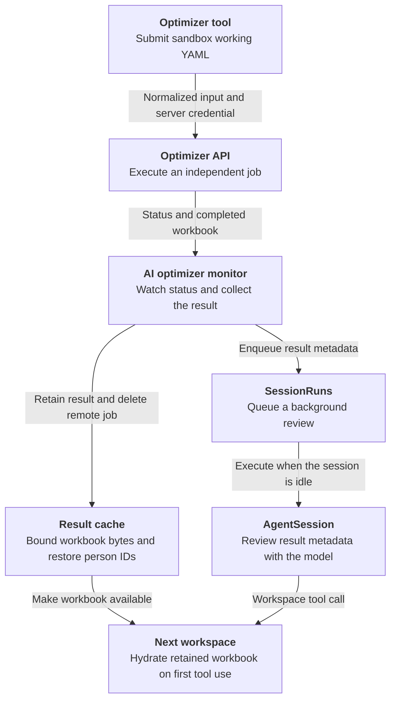
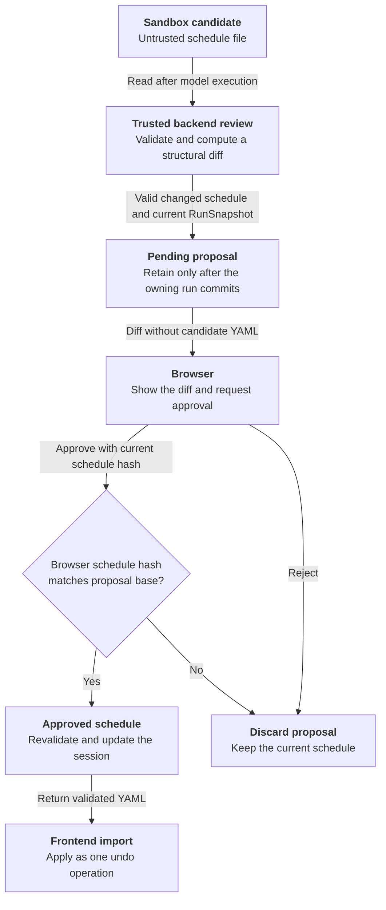

# Experimental AI Assistant Backend

The AI assistant is a separate FastAPI application that answers text questions
about one schedule snapshot. Its ASGI entry point is
`nurse_scheduling.ai_serve:app`. It does not import the optimization server or
use its Redis data.

File attachments are enabled by default. The frontend accepts arbitrary file
types and copies them into the disposable sandbox without executing them. The
assistant reads and edits the schedule in that sandbox and can propose a new
schedule, which the browser applies only after the user approves it.
Each run owns a workspace. It creates an E2B Cloud sandbox on the first
workspace tool call. This version excludes retrieval and repository access.

## Run locally

See the [core instructions](reproduce/core.md#run-locally) for this task.

## Architecture

Foreground questions and optimizer-result reviews use the same `AgentSession`
execution path. The HTTP routes authorize and validate requests before handing
them to the session. The model loop receives executable tool contracts with
their concurrency policy.

| Component | Responsibility |
| --- | --- |
| `app.py` | HTTP routes, authentication, and application startup and shutdown. |
| `agent_session.py` | Conversation changes, steering, proposal decisions, and the shared run path. |
| `sessions.py`, `lifecycle.py` | `SessionStore` access and budgets, plus `SessionRuns` ownership through cleanup and persistence. |
| `agent.py`, `agent_loop.py`, `agent_types.py` | Observable execution state, the model loop, and executable tool contracts. |
| `workspace.py`, `workspace_tools.py` | Lazy sandbox allocation and hydration, tool binding, and trusted schedule review. |
| `transcript.py`, `context.py` | Typed conversation entries, provider requests, history selection, and application event presentation. |
| `optimizer.py`, `optimizer_tool.py`, `optimizer_http.py` | Job ownership and operations, model-facing arguments and replies, and HTTP transport. |
| `session_events.py`, `session_event_projection.py` | Typed public events, tool call identity, text batching, and terminal publication after finalization. |
| `recovery.py`, `history.py`, `session_event_stream.py` | Ordered persistence, bounded session replay, and restart recovery. |

<figure markdown="1" id="ai-components">

**Figure 1. Backend execution and resource owners.**


```mermaid
flowchart TB
    Browser["<b>Browser</b><br/>Questions and approvals"]
    Routes["<b>app.py</b><br/>Authorize HTTP requests"]
    Runs["<b>SessionRuns</b><br/>Own accepted runs"]
    Store["<b>SessionStore</b><br/>Access, expiry, and budgets"]
    Session["<b>AgentSession</b><br/>Own conversation changes"]
    Agent["<b>Agent and agent_loop</b><br/>Execute model and tool contracts"]
    Workspace["<b>Workspace</b><br/>Create E2B sandbox on first use"]
    Optimizer["<b>Optimizer operations</b><br/>Own independent API jobs"]
    Browser -->|Requests| Routes
    Routes -->|Start or stop| Runs
    Routes -->|Access session| Store
    Runs -->|Execute| Session
    Store -->|Retain| Session
    Session -->|Prepare and consume| Agent
    Agent -->|Workspace tools| Workspace
    Agent -->|Optimizer tools| Optimizer
```

</figure>

### Run completion

Foreground questions and optimizer-result reviews use the same owner. A
foreground request is rejected while another run owns the session. Background
reviews wait in queue order. A disconnected browser does not cancel that owner.

<figure markdown="1" id="ai-run-completion">

**Figure 2. Run output, cleanup, persistence, and terminal delivery.**


```mermaid
flowchart TB
    Accept["<b>Accepted request</b><br/>message_id identifies one run"]
    Execute["<b>Server-owned execution</b><br/>Publish provisional run output"]
    Cleanup["<b>Cleanup</b><br/>Close model generators<br/>Destroy any allocated sandbox"]
    Commit["<b>Session finalization</b><br/>Commit or abort the RunSnapshot"]
    Recovery["<b>Recovery finalization</b><br/>Save outcome and context<br/>Report storage failure if needed"]
    Terminal["<b>Terminal delivery</b><br/>Publish done, stopped, stale, or error"]
    Release["<b>Release run owner</b><br/>Allow the next queued run"]
    Accept -->|JSON acknowledgement and SSE<br/>can arrive in either order| Execute
    Execute -->|Complete, Stop, or fail| Cleanup
    Cleanup -->|Fix the outcome| Commit
    Commit -->|Await final writes| Recovery
    Recovery -->|Flush held terminal event| Terminal
    Terminal -->|Finish execution| Release
```

</figure>

`AgentRun.cancelled` records a cancellation request. `finishing` prevents a
late Stop from changing a result after cleanup has fixed its outcome. These
flags and queue ownership are separate from the browser's running, stopping,
and interrupted phases. `RunEvents` holds terminal events until finalization
finishes, including when recovery storage reports a failure.

### Frontend controller

The page owns credentials, composer files, speech, scrolling, and browser
download URLs. `useAiChat` owns chat state, saved conversation restoration,
message submission, steering, session expiry, and proposal actions.
`ChatTranscriptView` renders that state through explicit props and callbacks.

<figure markdown="1" id="ai-frontend">

**Figure 3. Frontend state, connection ownership, and rendering.**


```mermaid
flowchart TB
    Page["<b>page.tsx</b><br/>Browser controls<br/>and schedule import"]
    Controller["<b>useAiChat</b><br/>State and actions<br/>Router and event helpers"]
    Reader["<b>Connection hook</b><br/>useSessionEventStream<br/>Reader, cursor, and retry"]
    Transcript["<b>ChatTranscriptView</b><br/>Messages and controls"]
    Saved["<b>Session storage</b><br/>Conversation and<br/>pending request"]
    Page -->|Options and callbacks| Controller
    Controller -->|Own connection| Reader
    Controller -->|State and actions| Transcript
    Controller -->|Restore and persist| Saved
```


</figure>

The reader hook revokes callbacks from a closed connection and owns its retry
timer. Accepted deferred events remain scoped to the conversation. A cursor
reconnect continues the active reply after steering. A replacement snapshot
rebuilds the run from its original reply and preserves surrounding message
positions. `ChatLifecycle` owns browser operation phases and busy state.

### Session and model context

<figure markdown="1" id="ai-context">

**Figure 4. Retained conversation and the next provider request.**


```mermaid
flowchart TB
    Transcript["<b>Typed transcript</b><br/>Questions, answers, app events, and decisions"]
    Context["<b>context.py</b><br/>Project history and interruption notes"]
    Current["<b>Current run</b><br/>Model responses and tool results"]
    Prompt["<b>Prompt inputs</b><br/>Fixed instructions and schedule summary"]
    Request["<b>Provider request</b><br/>Initial layout and follow-up messages"]
    Provider["<b>Provider</b><br/>Complete one model request"]
    Transcript -->|Retained entries| Context
    Context -->|Selected history| Request
    Current -->|Follow-up messages| Request
    Prompt -->|Instructions and request values| Request
    Request -->|OpenAI-compatible messages| Provider
```

</figure>

`build_provider_messages` builds the initial layout. The model loop calls
`prepare_provider_request` for each follow-up, combining that layout with
current run entries. Session retention, model context selection, and event
replay have separate limits.

The browser receives an HTTP-only owner cookie and an unguessable session UUID.
Active sessions expire after 30 days of inactivity by default. Sending or
queueing a message, synchronizing a changed schedule, or deciding a proposal
renews that window. The browser can retain the conversation within its current
tab and verify the session without extending its lifetime.
The session records typed questions, assistant responses, app events, and proposal
decisions. Tool results and reasoning belong to the current run and are released
when it ends. Stop and failed runs retain their questions with an interruption
note. Later model context excludes claims from their discarded workspace.
Recovery stores typed entries, including their origin and interruption state.
Existing text history remains readable when the service restores older sessions.
New questions receive a JSON acknowledgement with their `run_id`. Foreground and
optimizer output use the same session GET event stream. Repeated requests with the
same `message_id` return the accepted run without executing the question again.
The browser buffers events received before acknowledgement and routes them by
`run_id`. A disconnected reader reconnects without cancelling server work.
Expired cursors receive a replacement `session_reset` snapshot. Replay has separate
event-count and serialized-byte limits for each session and for the process.
When an earlier snapshot cannot prove an acknowledged run is active or complete,
the browser requests `GET /sessions/{session_id}/events?reset=true`. The fresh
snapshot resolves expiry without rejecting a run accepted after the earlier reset.
Replacement replay keeps answers beside their original questions.
The service applies queued steering before each follow-up model request, including
requests after refused tool calls. It requires provider completion before tools
run and rejects conflicting finish reasons or further output after completion.

The backend stores the YAML snapshot and retained conversation turns. Each
provider request includes a schedule summary, recent history, and the current
question. The complete YAML stays in the sandbox until the model reads relevant
content through a tool. Uploaded files remain in process memory for later turns
until removed or the session expires. A server restart can remove them without
prior notice. Conversation context keeps filenames and attachment markers,
while recovery entries can retain inspected document content and tool output.
The prompt gives the agent workspace paths for schedules and attachments.

### Optimizer jobs and result reviews

<figure markdown="1" id="ai-optimizer">

**Figure 5. Independent optimization and serialized result review.**


```mermaid
flowchart TB
    Tool["<b>Optimizer tool</b><br/>Submit sandbox working YAML"]
    Jobs["<b>Optimizer API</b><br/>Execute an independent job"]
    Monitor["<b>AI optimizer monitor</b><br/>Watch status and collect the result"]
    Cache["<b>Result cache</b><br/>Bound workbook bytes and restore person IDs"]
    Runs["<b>SessionRuns</b><br/>Queue a background review"]
    Review["<b>AgentSession</b><br/>Review result metadata with the model"]
    Workspace["<b>Next workspace</b><br/>Hydrate retained workbook on first tool use"]
    Tool -->|Normalized input and server credential| Jobs
    Jobs -->|Status and completed workbook| Monitor
    Monitor -->|Retain result and delete remote job| Cache
    Monitor -->|Enqueue result metadata| Runs
    Runs -->|Execute when the session is idle| Review
    Cache -->|Make workbook available| Workspace
    Review -->|Workspace tool call| Workspace
```

</figure>

The server-side `optimizer` tool submits a copy of the current sandbox working
YAML to the existing optimizer API. It replaces person IDs and removes
descriptions as the browser's Optimize and Export flow does, while retaining the
reverse ID mapping server-side. It returns immediately and keeps
the remote credential and job ID outside the sandbox. A process-local monitor
waits for terminal status, restores person IDs in the output workbook, retains
the size-bounded workbook for an authenticated browser download, deletes the
remote optimizer job, and starts a new assistant turn with result metadata.
The restored workbook is copied to
`/workspace/optimizer-results/optimized-schedule.xlsx` in that turn and later
chat turns while retained. It is separate from user attachments. The browser
keeps one replayable session stream open for foreground answers, optimizer status,
and background reviews. The event journal and recovery projection each retain up
to 1,000 required events, with a separate limit of 100 transient progress updates.
Each list's serialized size is limited to 4 MiB per session. Together, the lists
are limited to 64 MiB across the process. Expired cursors receive a replacement
snapshot. PostgreSQL stores accepted questions before execution and saves
non-progress publications through an asynchronous writer. It queues completed
model entries before tool execution.
Consecutive text fragments can share a storage row. The browser reattaches with
the same client message ID and replaces partial output with the snapshot.
It does not start another model run.
Foreground chat and optimization can proceed at the same time. Assistant turns
remain serialized per session. The Stop control cancels either a foreground or
background assistant turn and waits for the server outcome. It names the client
message ID so a question stopped before arrival cannot start later. After a
connection failure, the browser sends the Stop again before it reconnects. A delayed
Stop for an earlier message does not cancel a later turn. A Stop without a
message ID cancels every active assistant turn in the session. No Stop cancels
the independent optimizer run.

Sandbox and conversation state are separate. The backend copies the current
schedule to `/workspace/schedule.yaml` and searchable schema documentation to
`/reference`. It writes uploads below `/workspace/attachments` under safe paths
prefixed with their upload IDs. The backend then runs every command for that
user message in the same sandbox,
reads the candidate, and destroys the sandbox. A later run creates a new
sandbox when it calls a workspace tool. Only conversation history, the current schedule revision, and a
pending validated proposal remain in application state.

When a turn fails, its provisional activity remains visible but is not added to
model conversation history. Optional PostgreSQL logging retains failed turns
for operators. **Retry** resends the original text in a fresh sandbox. Uploaded
files stay available for that retry. If an upload did not finish, **Prepare retry**
restores the text and requires the files to be attached again before sending.

## Reasoning and tool activity

Providers stream reasoning in a field of its own, either `reasoning_content` or
`reasoning`, and the adapter forwards it as a separate event. It is never joined
to the answer text, never stored in conversation history, and never sent back to
the provider, so it cannot leak into an assistant message and costs nothing on
later turns.

The `tool_start` event carries the tool name and arguments before execution, so
the UI and evaluation artifact retain a command even if the sandbox fails. A
later `tool` event carries its result and whether the call did what it was
asked. Sandbox backends return raw command output to the AI layer. The AI
`bash` adapter combines stdout and stderr, keeps the last 2,000 lines or 50 KB,
and stores the full output in the temporary sandbox when truncation occurs.
This policy stays outside the provider-neutral sandbox interface.

When one model response requests multiple reads, the reads run concurrently
and their results are returned in the model's original call order. Batches that
contain `bash`, `edit`, or `write` remain sequential so filesystem mutations
have deterministic ordering. E2B stays active for either kind of batch and
pauses again before the next provider reasoning turn.

When a Bash command changes the schedule, the backend reads the working copy
and validates it outside the sandbox before emitting `schedule_change`. The
event contains that validated working copy. The browser compares it with the
previous working copy and renders the changed lines in red and green. These
intermediate previews do not create or apply a proposal. The final validated
candidate still follows the separate proposal and approval lifecycle.

## Recovery database upgrade

Deploy the matching client and server together for the session stream contract.
Migration `004_unified_session_recovery.sql` preserves the existing recovery
sessions, owners, expiry, schedules, proposals, accepted message IDs, named Stop
requests, and saved output. It converts independent foreground and background
cursors into publication order. Restored streams replace old browser cursors.
Typed snapshots preserve entry origin. Older text histories retain the information
available in their saved format, which cannot distinguish user text identical to
an application event.

Before upgrading, stop every old AI service instance and back up the PostgreSQL
database. Apply the migration through service initialization, then start the matching
frontend. The migration runs in one transaction under the existing advisory lock.
Verify restoration of a saved session and retry its accepted message ID before
allowing traffic.

Reverting code alone cannot restore the old table layout. To roll back, stop the
new AI instances, restore the backup into an isolated database, and deploy the old
server and frontend against it. The backup does not include conversations written
after the upgrade. Keep the upgraded database until those records are no longer needed.

## Evaluation

See the [core instructions](reproduce/core.md#evaluation) for this task.

## Agent capabilities

The model receives Pi's four default coding tools: `read`, `bash`, `edit`, and
`write`. `read` provides bounded text-file inspection with offsets and returns
supported images as multimodal tool results. `edit`
applies one or more unique, non-overlapping exact-text replacements against the
same original file snapshot. `write` creates or overwrites one complete file.
`bash` remains available for searches, checks, and complex operations using
preinstalled Bash, Python with `ruamel.yaml` and PyYAML, ripgrep, grep, and diff. All
relative paths resolve from `/workspace`. The application hydrates separate
core, preference, and export schema documents under `/reference` for each turn.
Each document groups related variants so the model can retrieve the context for
one domain in one read instead of making a sequence of fine-grained lookups.

This follows the minimalism philosophy of the [Pi coding agent](https://pi.dev/):
prefer a small set of general file and shell capabilities with discoverable
documentation over a growing set of domain-specific tools. Nurse Scheduling
retains stricter service boundaries than a local coding agent. The workspace is
disposable, tool output is bounded, secrets and the stored schedule stay outside
it, and a trusted application validates every possible schedule change and the
final candidate.

Configured tool-round and tool-call limits bound the model-tool loop alongside
per-command and complete agent-turn deadlines.

The model-facing tool schemas and behavior are Python ports pinned to
[Pi v1.0.0](https://github.com/earendil-works/pi/tree/a13d35a742c6ef8462812a28fbe1d8c8b7431c32/packages/coding-agent/src/core/tools).
The read tool recognizes JPEG, PNG, GIF, WebP, and BMP files. Its multimodal
result lets the model inspect an image extracted from another file. The sandbox
also includes optional helpers: `inspect_xlsx.py` reads every worksheet by
default and shows formulas alongside their last-saved cached values, while
`inspect_pdf.py` extracts text by page and can render a selected page. The agent
can write a focused parser in its sandbox when these helpers are insufficient.
The Nurse Scheduling adapter delegates file and command operations to
`SandboxBackend` and enforces the configured command timeout ceiling. E2B
returns completed stdout and stderr separately, so the adapter concatenates
them and cannot reproduce Pi's live
stream interleaving exactly. Nonzero and missing command exit codes produce
failed tool results that the agent can read before continuing. GIF detection
requires a complete GIF87a or GIF89a signature.

The v1.0.0 comparison covers all four tools, image detection and processing,
and head/tail truncation. Edit/write execution and image processing are unchanged
from the previous pin. Pi also adds programmatic Bash output and model-specific
image resize profiles. This service exposes model-facing results only and keeps
Pi's default 2000-pixel and 4.5 MB base64 image limits. Pillow replaces Photon's
image codec and rejects oversized source images before decoding. Pi's terminal
renderers and middle truncation are not used by these tools.

## Proposal lifecycle

A finished run that changed the schedule leaves one pending proposal. The
browser receives its structural diff, never its YAML. `POST
/sessions/{id}/proposal/approve` requires the SHA-256 of the schedule the
browser holds, so a proposal built on an older schedule is discarded instead of
applied. The approved schedule is revalidated before it is returned, becomes the
session schedule, and the browser applies it through the normal YAML import path
as one undo step. `POST /sessions/{id}/proposal/reject` drops it, and `PUT
/sessions/{id}/schedule` replaces the snapshot when the schedule changed
elsewhere in the app, which also drops any pending proposal.

<figure markdown="1" id="ai-proposals">

**Figure 6. Trusted proposal review and browser approval.**


```mermaid
flowchart TB
    Candidate["<b>Sandbox candidate</b><br/>Untrusted schedule file"]
    Validation["<b>Trusted backend review</b><br/>Validate and compute a structural diff"]
    Pending["<b>Pending proposal</b><br/>Retain only after the owning run commits"]
    Browser["<b>Browser</b><br/>Show the diff and request approval"]
    Base{"Browser schedule hash<br/>matches proposal base?"}
    Approved["<b>Approved schedule</b><br/>Revalidate and update the session"]
    Import["<b>Frontend import</b><br/>Apply as one undo operation"]
    Discard["<b>Discard proposal</b><br/>Keep the current schedule"]
    Candidate -->|Read after model execution| Validation
    Validation -->|Valid changed schedule and current RunSnapshot| Pending
    Pending -->|Diff without candidate YAML| Browser
    Browser -->|Approve with current schedule hash| Base
    Base -->|Yes| Approved
    Approved -->|Return validated YAML| Import
    Base -->|No| Discard
    Browser -->|Reject| Discard
```

</figure>

With PostgreSQL, each of these requests saves the session state for recovery.
The server applies an approval or rejection before it saves it, so a failed
save returns `history_saved: false` and the browser shows a warning. The next
message saves the change again before it starts. A schedule update that is not
saved returns HTTP 503, and the browser sends it again with the next message.

Approval and rejection add a backend-only user-action note to model history.
The rejection note says that every schedule change from the proposed turn was
discarded and that the next turn starts from a fresh copy of the current
schedule. It never includes the discarded YAML.

A run that fails, is cancelled, or is abandoned retains its user message and
an interrupted assistant entry. It discards its candidate proposal and
workspace changes. Its provisional activity may remain visible in the browser.
Later model context replaces the interrupted assistant entry with
`ABORTED_RESPONSE_HISTORY` and excludes discarded workspace claims. A successful
run that only answers a question never creates a proposal.

If the final candidate fails trusted validation, the UI reports that every
schedule change from the turn was discarded and that the current schedule
was not changed. The failed turn retains its question and an interrupted
assistant entry, which later model context replaces with `ABORTED_RESPONSE_HISTORY`.

After a Bash command changes the candidate, the trusted application returns an
intermediate validation result so the model can repair it. The backend reads
the final file as untrusted input and applies authoritative validation and a
structural diff. Validation inside the sandbox is feedback only. It is never
the acceptance boundary.

The provider boundary uses OpenAI-compatible chat completions. The
[Cloudflare Tunnel example](https://github.com/j3soon/local-llm-notes/tree/main/examples/basic-secure-api/cloudflare)
shows one compatible deployment pattern.

A provider request gets three total attempts by default. A timeout before the
first streamed event waits one second before the second attempt and two seconds
before the third. Once text, reasoning, token usage, or a tool call has reached
the application, the request is not replayed because that could duplicate
visible output or tool work. The complete sandbox-turn deadline still applies
across provider attempts and may end a turn before every retry is available.

Replay-safe E2B requests also get three total attempts with exponential
backoff. This covers file reads and replacements, automatic resume, and sandbox
destruction. Auto-resume attempts also have an application-enforced control
request deadline. Idle pause is attempted once because it is optional and a
failed response cannot prove whether E2B accepted it. Retry logs include the
operation, sandbox ID, attempt, delay, and exception type without response
contents. Sandbox creation and Bash execution are not replayed because a failed
response cannot prove that the original operation did not take effect.

## Configuration

See the [core instructions](reproduce/core.md#configuration) for this task.

## Run in the development container

See the [core instructions](reproduce/core.md#run-in-the-development-container) for this task.

## Run with Docker Compose

Follow the [Compose startup instructions](reproduce/core.md#run-with-docker-compose).

### Session recovery storage

Both Compose variants include PostgreSQL with the `postgres-ai-data` volume and
no published database port. Native runs enable recovery storage when
`AI_HISTORY_POSTGRES_URL` is set. Startup applies numbered migrations
transactionally. Recovery is the only database history.

Sessions store the hash of the browser owner cookie, the administrative
credential ID when authentication is enabled, creation time, expiry, schedule,
proposal, and conversation context. Foreground and background turns store the
accepted question, model, credential ID, attachment count, token usage, error
code, start and finish times, and execution status. Entries store answer text,
reasoning, tool activity, and other replayable UI content. Binary uploads and
downloads remain in memory. They can disappear without prior notice after a
server restart or when a full service unloads an idle session. Keep original
files.

This data can contain staff information, schedules, and inspected document
content. Session and turn metadata excludes service bearer keys and the raw owner cookie. Database access
is for operators only. Use a separate read-only role for inspection. Question
previews are also logged to stdout when `AI_REQUEST_LOG_ENABLED` is enabled.
Configure deployment log and backup retention separately.

A session expires after `AI_SESSION_TTL_SECONDS` of inactivity, 30 days by
default. Session activity renews the expiry. Startup and hourly maintenance
delete expired sessions and their turns, entries, and Stop requests together.
There is no database byte or message-count cap. A continuously active session
can accumulate history beyond 30 days.

Startup fails if configured storage is unavailable. Failed initial recovery
writes return HTTP 503 before contacting the provider. A failed final write
keeps the live answer, emits a warning, and sets `history_saved: false` on
`done`. This field describes recovery storage. The next save of that session
retries the final write with the current state. A process crash recovers the
accepted question and saved output but does not rerun interrupted model calls
or mutating tools. Without PostgreSQL, recovery is process-local.

Completed foreground replay and background snapshots have separate memory
cache budgets, each set by `AI_MAX_SESSION_BYTES`. PostgreSQL supplies output
that was evicted from these caches. Without PostgreSQL, the foreground cache
keeps the newest turn of each session, and a background snapshot drops its
oldest output. Active or unsaved foreground turns can exceed the budget. The
caches do not limit database retention.

### History entries and streaming

Recovery storage separates durable content from live SSE fragments:

| Table | Stored data |
| --- | --- |
| `chat_recovery_sessions` | Owner hash, expiry, schedule and conversation context, creation time, and credential ID. |
| `chat_recovery_turns` | Accepted question, server turn UUID, client request ID, turn order, execution status, model, credential ID, attachment count, usage, error code, and lifecycle times. |
| `chat_recovery_entries` | Typed content, stable `sequence`, creation time, owning turn, stream channel, first and last SSE cursors. |
| `chat_recovery_stops` | Request IDs stopped before acceptance. |

An entry keeps its identity when adjacent answer or reasoning fragments extend
its text. Adjacent context-usage updates retain the latest value. Tool calls,
proposals, terminal events, and writes from another channel start separate
entries. A session row lock serializes entry writes across foreground and
background streams. Repeated cursors do not append the same text twice.
Terminal output, execution status, and final conversation context commit in
one transaction. Background optimizer progress remains transient.

`sequence` identifies a durable entry. `event_id` and `last_event_id` describe
its range in one stream channel. They have different purposes. For example,
an answer entry can cover cursors 2 through 40. Replaying its complete text as
a delta to a browser that already received cursor 39 would duplicate output.
Streams restored from PostgreSQL therefore send replacement snapshots when
the browser is behind the restored cursor. Live streams still use bounded
delta buffers. A cursor older than those buffers also receives a complete
snapshot, loaded from PostgreSQL when necessary. Recovery selects entries by
their last cursor so an entry crossing the replay tail boundary is retained.

Migration `003_chat_recovery.sql` creates the complete recovery schema and
drops the old audit tables, including their rows. Recovery starts with new
sessions and accepted turns. Entries receive their identity and timestamp when
first written. Each channel replays in cursor order.

#### Alignment with Pi v1.0.0

The reference is [Pi v1.0.0](https://github.com/earendil-works/pi/tree/a13d35a742c6ef8462812a28fbe1d8c8b7431c32),
checked out locally under the ignored `artifacts/pi-v1.0.0/` directory.
The survey covers both the coding agent and its separate durable package:

- [SessionManager](https://github.com/earendil-works/pi/blob/a13d35a742c6ef8462812a28fbe1d8c8b7431c32/packages/coding-agent/src/core/session-manager.ts)
  stores typed JSONL entries with an ID, parent ID, and timestamp.
  [AgentSession](https://github.com/earendil-works/pi/blob/a13d35a742c6ef8462812a28fbe1d8c8b7431c32/packages/coding-agent/src/core/agent-session.ts)
  saves regular messages on `message_end`.
- The [agent loop](https://github.com/earendil-works/pi/blob/a13d35a742c6ef8462812a28fbe1d8c8b7431c32/packages/agent/src/agent-loop.ts)
  updates the current assistant message as deltas arrive, then emits its final
  message. The provider [EventStream](https://github.com/earendil-works/pi/blob/a13d35a742c6ef8462812a28fbe1d8c8b7431c32/packages/ai/src/utils/event-stream.ts)
  queues live events and exposes a final result. That queue does not provide
  persistent browser replay.
- The [durable SQLite schema](https://github.com/earendil-works/pi/blob/a13d35a742c6ef8462812a28fbe1d8c8b7431c32/packages/durable/src/storage/sqlite/migrations.ts)
  stores identified entries with commit order, tasks with explicit status,
  and submissions with request IDs. Its [generation harness](https://github.com/earendil-works/pi/blob/a13d35a742c6ef8462812a28fbe1d8c8b7431c32/packages/durable/src/harness/generation.ts)
  appends completed assistant messages as entries. This is a separate execution
  framework, not the coding agent's JSONL persistence path.

| Pi principle | Project choice and reason |
| --- | --- |
| Keep content entries separate from live deltas. | Store combined content blocks and rebuild complete replay snapshots. Retain UI event kinds so tool activity, proposals, and steering keep their existing frontend behavior. |
| Give entries identity and order. | Use PostgreSQL identity sequences and timestamps. Keep per-channel SSE cursors for the browser protocol. |
| Store task and submission state explicitly. | Keep accepted questions and unique client request IDs in turns. Store foreground and background execution status directly. The existing Stop records handle requests that arrive before acceptance. |
| Save completed messages. | Queue typed session entries when model responses end and save live publications through an asynchronous replay writer. Final outcome writes include the resulting state and pending entries. A failed recovery write produces a warning and remains eligible for retry. |
| Support session branches and a general durable task framework. | Keep linear conversations and the existing agent and optimizer workers. Branches, generic tasks, watches, documents, and Pi's SQLite runtime add machinery this app does not need. |
| Store content with associated metadata. | Keep one recovery history. Store reporting metadata on sessions and turns, without separate copies of questions and answers in audit tables. |

This aligns the storage and replay principles without importing Pi's runtime
or changing the frontend protocol. A browser disconnect leaves the accepted
agent running. A backend process crash recovers saved content and marks
interrupted work failed. It does not rerun model calls or mutating tools.

### Inspect chat history with pgAdmin

The optional pgAdmin service listens only on the backend host's loopback
interface. Start it from `docker/` with the same Compose file and environment
file used by that deployment:

```sh
docker compose -f compose.backend.yml --profile inspection run --rm --service-ports pgadmin
```

For a remote backend, forward the loopback port over SSH:

```sh
ssh -L 5050:127.0.0.1:5050 user@backend-host
```

Open `http://127.0.0.1:5050` and sign in with
`admin@nursescheduling.local` / `pgadmin`. Expand **Nurse Scheduling**, then
connect to **AI chat history** with database password `ai_history`. The server
definition is preloaded on every run.

Use **Tools > Query Tool** to inspect the newest turns:

```sql
SELECT
    turns.started_at,
    turns.auth_credential_id,
    turns.kind,
    turns.model,
    turns.status,
    turns.question,
    turns.error_code,
    turns.usage
FROM chat_recovery_turns AS turns
ORDER BY turns.started_at DESC
LIMIT 100;
```

Press Ctrl+C when finished. Compose removes the temporary pgAdmin container;
the PostgreSQL service and its `postgres-ai-data` volume remain intact.

Use `compose.backend.memory.yml` in these commands for the process-local backend
variant. For staging, also pass its `--env-file .env.staging` option.

Run PostgreSQL integration checks against a test database whose role can create
schemas. Each test creates and removes its own temporary schema:

```sh
cd core
AI_HISTORY_TEST_POSTGRES_URL=postgresql:///ai_history_test \
  .venv/bin/pytest -q tests/test_ai_history.py
```

## Production path proxy

The backend Compose deployment routes Cloudflare Tunnel traffic through NGINX.
It sends `/ai/*` to the AI service and all other paths to the optimization API.
Disable response buffering on the streaming route. See the
[NGINX proxy buffering directive](https://nginx.org/en/docs/http/ngx_http_proxy_module.html#proxy_buffering).

```nginx
location /ai/ {
    proxy_pass http://ai:8001/;
    proxy_http_version 1.1;
    proxy_buffering off;
    proxy_cache off;
}
```

The Cloudflare public hostname must target `http://nginx:8080`. The trailing
slash on `proxy_pass` removes the public `/ai` prefix before the request reaches
FastAPI.

## HTTP API

| Endpoint | Purpose |
| --- | --- |
| `GET /health` | Process and service identity check. |
| `GET /ready` | Required configuration accepted at startup. |
| `GET /capabilities` | Public attachment limits, session lifetime, and authentication requirement. |
| `POST /sessions` | Store a YAML snapshot and create a browser-owned session. |
| `GET /sessions/{id}` | Check the remaining session lifetime without renewing it. |
| `POST /sessions/{id}/uploads` | Retain multipart files for later messages and return their IDs. |
| `GET /sessions/{id}/uploads` | List retained file metadata. |
| `DELETE /sessions/{id}/uploads/{upload_id}` | Remove one retained file. |
| `POST /sessions/{id}/messages` | Stream one answer to a JSON `message`. |

Upload requests contain only repeated `files` fields. Other field names are
rejected. Uploads are refused while a response is active. Every turn can read
all retained files. Sessions are process-local. Use one AI backend instance
until shared AI storage is added.

### Provider request layout

Providers reuse cached prompt work only for an identical request prefix. Each
request therefore keeps earlier content unchanged and puts changing state last:

1. The system message. It does not change during a chat.
2. The chat history. Each entry stays unchanged once it is stored.
3. The user's question, exactly as typed.
4. A status message, only when needed. History never keeps it.

The backend stores app events as separate `user` messages in history when they
happen. Each event starts with `[App event]`. Events record uploads, removals,
proposal approvals and rejections, and schedule changes made in the app. An
upload event lists the original name, sandbox path, media type, and size of
each file. A schedule change is recorded only when the parsed schedule data
changes. Filenames stay out of the system prompt because they are untrusted
input.

The status message starts with `[Current status]`. It reports a pending
proposal, the optimizer result path, and retained files whose upload event the
request does not contain. That happens when history was trimmed or when a
failed turn followed the upload.

When history passes `AI_MAX_HISTORY_CHARS`, the backend drops the oldest
messages until about half the budget remains. It keeps the newest completed
exchange. This keeps the request prefix unchanged for many turns between cuts.

Each assistant turn starts with a `model_input` event. Its `system` field
contains the system message. Its `messages` field lists the request messages
added since the last assistant reply, in order. Each entry has a `kind` of
`app`, `question`, `optimizer`, or `status`. An `app` entry also has its
absolute history `index`, so a client shows it once when a failed turn is
retried. App events and status messages also have a short `title`, such as
`Proposal Rejected` or `Pending Proposal`. The chat shows it after the role
label and keeps the exact text collapsed. A foreground turn sends this event first in the message stream. A
background turn publishes it on the session event stream after `turn_start`.

`GET /health`, `GET /ready`, and `GET /capabilities` stay public so deployment
probes work and the frontend can discover authentication and attachment limits.
Capabilities reports whether bearer auth is active. When either AI key setting
is set, every session route requires `Authorization: Bearer <key>` and
returns `401` when the credential is missing or wrong. Native runs may leave the
key settings unset to serve locally without auth. Docker Compose sets
`AI_AUTH_REQUIRED=true` on the service, so its env file must explicitly set
`AI_AUTH_REQUIRED=false` and leave both key settings empty to serve without
authentication. Required mode refuses to start with a missing, blank, shorter
than 16 character, or non-ASCII key. `AI_AUTH_TOKEN` remains supported for
backward compatibility.

For example, create a session directly with:

```sh
curl -H "Authorization: Bearer ${AI_AUTH_TOKEN}" \
  -H "Content-Type: application/json" \
  --data '{"schedule_yaml":"description: test"}' \
  http://localhost:8001/sessions
```

## Security notes

- Keep `docker/.env` private. Git ignores it, while `docker/.env.example`
  contains only empty secret fields and documented defaults.
- The browser keeps the AI token in memory unless the user explicitly chooses
  to store it unencrypted on that device. A stored token is scoped to the AI
  endpoint that requested it. AI keys are independent from optimizer keys,
  although an operator may configure equal values.
- E2B Cloud is currently the only sandbox backend. The agent depends on the
  project `SandboxBackend` contract so a future self-hosted E2B or remote gVisor
  backend does not require changing model logic.
- The trusted application creates E2B sandboxes with outbound Internet access
  disabled. It does not pass the E2B key, model provider key, database
  credentials, host paths, or the stored schedule into the sandbox.
- Treat shell commands and every sandbox file as untrusted. A sandbox can only
  return a candidate schedule. Trusted validation, proposal storage, revision
  checks, user approval, and updates to the current schedule remain outside it.
- Use `AI_COOKIE_SECURE=0` only for local HTTP. Set it to `1` when the public
  browser route uses HTTPS, even if NGINX uses internal HTTP to the container.
  Secure deployments set the owner cookie to `SameSite=None`; the CORS origin
  allowlist still limits which browser origins may make credentialed requests.
- The owner cookie contains an opaque UUID, not the provider key. It is not a
  replacement for future account authentication.
- The complete schedule is sent to the AI service. Relevant content is sent to
  the configured provider through model-facing tool results. Use approved
  services and anonymize sensitive schedules when required.
- Arbitrary uploads are bounded, assigned safe sandbox paths, and treated as
  untrusted data. Configure a matching request-body limit at the public reverse
  proxy. Never add attachment execution to the sandbox workflow.
- The Pi-compatible `read` tool recognizes JPEG, PNG, GIF, WebP, and BMP content.
  It normalizes and bounds images before returning them to the model as
  multimodal tool results.
- The XLSX helper disables external links and reports formulas with their
  last-saved cached values. It does not recalculate formulas. The PDF inspector
  reports text-extraction and page-limit gaps, and its optional page rendering
  is bounded by a pixel budget. PDF helpers reject encrypted files.
- Assistant answers use a safe Markdown renderer. Raw HTML is disabled and
  remote Markdown images are omitted to prevent third-party requests.
- Provider HTTP errors return a searchable error ID to the browser. The backend
  logs the upstream response body under that ID after redacting common
  credential forms.
- A failed or cancelled turn retains its question and an interrupted assistant
  entry. Later model context uses `ABORTED_RESPONSE_HISTORY` instead of partial
  output and discarded workspace activity.

## Troubleshoot local development

See the [core instructions](reproduce/core.md#troubleshoot-local-development) for this task.

### Attachment capability discovery

See the [capability discovery instructions](reproduce/core.md#attachment-capability-discovery).

## Validate

Follow the [AI test instructions](reproduce/core.md#ai-tests).
