# AI Assistant Backend

The experimental AI assistant answers questions about a schedule, proposes
edits, and starts optimizer jobs. It runs as a separate FastAPI application at
`nurse_scheduling.ai_serve:app`. The browser holds the schedule currently open
in the app. The service keeps a session snapshot and creates a disposable E2B
workspace with a working copy when a tool needs files. The browser applies
assistant edits only after proposal approval.

Messages use HTTP requests. Answers, tool results, and optimizer updates
share one session SSE stream. Disconnecting that stream leaves work running.
Stop cancels active and queued runs.

A **run** spans one complete answer, including cleanup and saving its result.
A **turn**, following [Pi v1.0.0][pi-release] terminology, is one model response
plus its tool executions. An **AgentSession** persists across runs.

This page covers the AI service and browser protocol. The
[backend server guide](backend-server.md) covers the separate optimizer API.
See the [Core README](reproduce/core.md#ai-backend) for setup and the
[user guide](../user-guide/experimental-ai.md) for browser controls.

**Diagram key:** Flowchart arrows label actions or data exchanges. State
diagram arrows label transitions, with filled circles marking entry and exit.
In sequence diagrams, solid arrows are calls and dashed arrows are returned
results or SSE events. `opt` is conditional, `alt` shows alternative outcomes,
`par` shows concurrent work, and `loop` repeats steps. Arrow style does not
encode synchronous versus background work.

<style>
.ai-pi-mapping table {
  min-width: 720px;
}
.ai-diagram--wide {
  overflow-x: auto;
}
.ai-diagram.ai-diagram--wide .mermaid {
  min-width: 1080px;
}
@media (max-width: 48rem) {
  .ai-diagram {
    overflow-x: auto;
  }
  .ai-diagram .mermaid {
    min-width: 680px;
  }
}
</style>

## Run Lifecycle {#turn-lifecycle}

<div class="ai-diagram" markdown="1" tabindex="0">

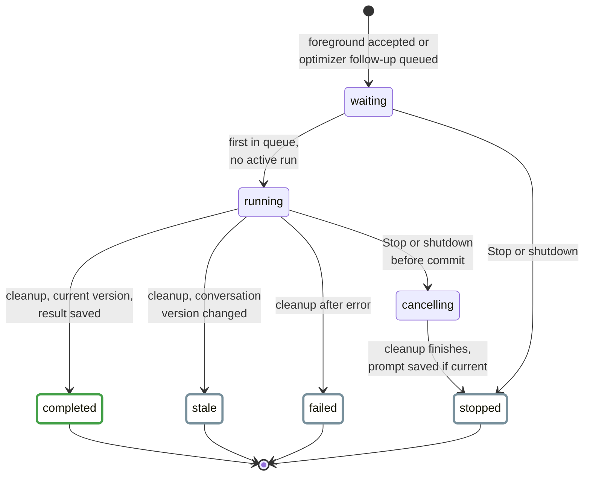
```mermaid
stateDiagram-v2
    [*] --> waiting: foreground accepted or<br/>optimizer follow-up queued
    waiting --> running: first in queue,<br/>no active run
    waiting --> stopped: Stop or shutdown
    running --> completed: cleanup, current version,<br/>result saved
    running --> stale: cleanup, conversation<br/>version changed
    running --> failed: cleanup after error
    running --> cancelling: Stop or shutdown<br/>before commit
    cancelling --> stopped: cleanup finishes,<br/>prompt saved if current
    completed --> [*]
    stale --> [*]
    failed --> [*]
    stopped --> [*]

    classDef completedState fill:transparent,stroke:#43a047,stroke-width:3px
    classDef otherState fill:transparent,stroke:#78909c,stroke-width:3px
    class completed completedState
    class stale,failed,stopped otherState
```

**Figure 1. Run scheduling, cancellation, and terminal outcomes.**

</div>

The diagram shows the execution phases of `SessionRuns` and
`AgentSession.run`. These phases are derived from execution and finalization.
`cancelling` means cancellation was accepted and cleanup is still pending.
Once workspace cleanup finishes and committing the result begins,
`AgentRun.finishing` prevents further cancellation. A late Stop preserves the
committed outcome while the final history write and terminal event finish.

Each session executes one run at a time. Optimizer follow-ups wait in its FIFO
queue, and a second foreground request gets HTTP `409`. The process-wide
model-stream limit defaults to four.

Each run reserves a conversation version. Schedule updates and pending
proposal decisions advance it. An older result becomes stale even if the
schedule later returns to the same YAML.

## Architecture

The API, session, agent, workspace tools, and job monitors share the AI service
process. The browser, model provider, sandbox VM, and optimizer API are external.

<div class="ai-diagram" markdown="1" tabindex="0">

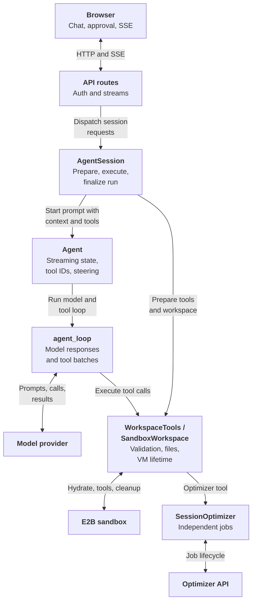
```mermaid
flowchart TB
    Browser[<b>Browser</b><br/>Chat, approval, SSE]
    Routes[<b>API routes</b><br/>Auth and streams]
    Session[<b>AgentSession</b><br/>Prepare, execute,<br/>finalize run]
    Agent[<b>Agent</b><br/>Streaming state,<br/>tool IDs, steering]
    Loop[<b>agent_loop</b><br/>Model responses<br/>and tool batches]
    Provider[<b>Model provider</b>]
    Workspace[<b>WorkspaceTools /<br/>SandboxWorkspace</b><br/>Validation, files,<br/>VM lifetime]
    E2B[<b>E2B sandbox</b>]
    Jobs[<b>SessionOptimizer</b><br/>Independent jobs]
    Optimizer[<b>Optimizer API</b>]

    Browser <-->|HTTP and SSE| Routes
    Routes -->|Dispatch session<br/>requests| Session
    Session -->|Start prompt with<br/>context and tools| Agent
    Agent -->|Run model and<br/>tool loop| Loop
    Loop <-->|Prompts, calls,<br/>results| Provider
    Session -->|Prepare tools<br/>and workspace| Workspace
    Loop -->|Execute tool calls| Workspace
    Workspace <-->|Hydrate, tools, cleanup| E2B
    Workspace -->|Optimizer tool| Jobs
    Jobs <-->|Job lifecycle| Optimizer

```

**Figure 2. Model execution, tool setup, and external services.**

</div>

Session ownership, run scheduling, and event delivery connect these
components as follows.

<div class="ai-diagram" markdown="1" tabindex="0">

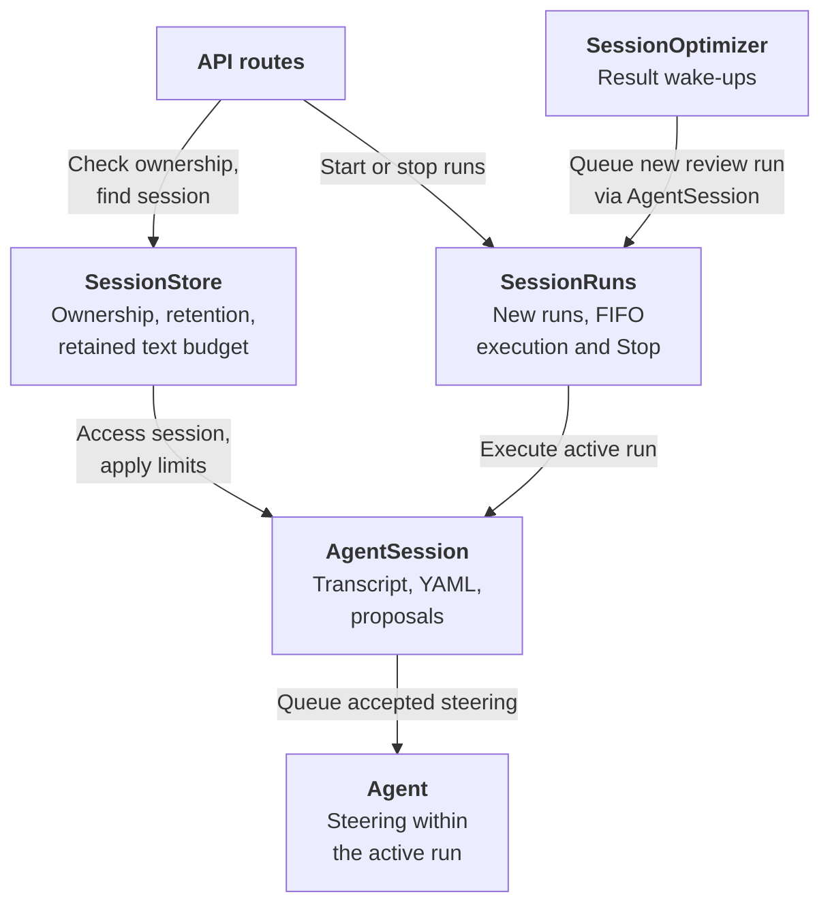
```mermaid
flowchart TB
    Routes[<b>API routes</b>]
    Store[<b>SessionStore</b><br/>Ownership, retention,<br/>retained text budget]
    Queue[<b>SessionRuns</b><br/>New runs, FIFO<br/>execution and Stop]
    Session[<b>AgentSession</b><br/>Transcript, YAML,<br/>proposals]
    Agent[<b>Agent</b><br/>Steering within<br/>the active run]
    Jobs[<b>SessionOptimizer</b><br/>Result wake-ups]

    Routes -->|Check ownership,<br/>find session| Store
    Store -->|Access session,<br/>apply limits| Session
    Routes -->|Start or stop runs| Queue
    Queue -->|Execute active run| Session
    Session -->|Queue accepted steering| Agent
    Jobs -->|Queue new review run<br/>via AgentSession| Queue

```

**Figure 3. Session ownership, run scheduling, and steering.**

</div>

The model and workspace execute within a run. `SessionOptimizer` owns its
monitor independently and queues a review run when a job ends.

<div class="ai-diagram" markdown="1" tabindex="0">

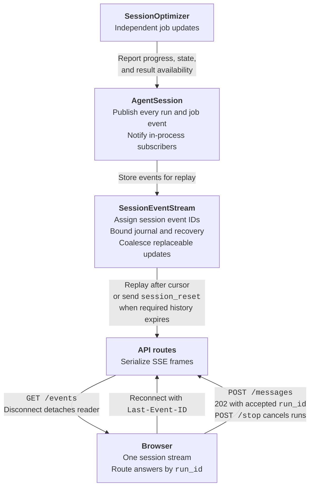
```mermaid
flowchart TB
    Session[<b>AgentSession</b><br/>Publish every run and job event<br/>Notify in-process subscribers]
    Jobs[<b>SessionOptimizer</b><br/>Independent job updates]
    Events[<b>SessionEventStream</b><br/>Assign session event IDs<br/>Bound journal and recovery<br/>Coalesce replaceable updates]
    Routes[<b>API routes</b><br/>Serialize SSE frames]
    Browser[<b>Browser</b><br/>One session stream<br/>Route answers by <code>run_id</code>]

    Jobs -->|Report progress, state,<br/>and result availability| Session
    Session -->|Store events for replay| Events
    Events -->|"Replay after cursor<br/>or send <code>session_reset</code><br/>when required history expires"| Routes
    Routes -->|"<code>GET /events</code><br/>Disconnect detaches reader"| Browser
    Browser -->|"Reconnect with <nobr><code>Last-Event-ID</code></nobr>"| Routes
    Browser -->|"<code>POST /messages</code><br/>202 with accepted <code>run_id</code><br/><code>POST /stop</code> cancels runs"| Routes
```

**Figure 4. One session stream delivers all run and optimizer events.**

</div>

Python paths below are relative to `nurse_scheduling/ai/`. Browser paths are
relative to `web-frontend/src/app/experimental-ai/`.

| Component and source | Responsibility |
| --- | --- |
| API routes<br/>`app.py` | Authenticate requests, invoke session operations, and serve HTTP and SSE responses. |
| `SessionStore`<br/>`sessions.py` | Enforce session ownership, expiry, retained text budgets, and versioned conversation commits. |
| `SessionRuns` / `AgentRun` / `RunSnapshot`<br/>`lifecycle.py` | Execute one run per session, queue background follow-ups, and keep ownership through cancellation and cleanup. Carry the conversation version used to authorize a commit. |
| `AgentSession` / `RunOutcome`<br/>`agent_session.py` | Prepare context, execute the agent, await cleanup, save the run, queue optimizer reviews, and publish public session events. |
| `RunOutput` / `RunEvents`<br/>`session_event_projection.py` | Project agent output and track partial responses. Attach run identity, batch text, and defer the terminal event until session finalization. |
| `Agent` / `AgentState`<br/>`agent.py`<br/>`agent_types.py` | Hold in-run messages, streaming state, pending tool call IDs, and queued steering. |
| `agent_loop`<br/>`agent_loop.py` | Repeat model responses and tool batches until the agent finishes. Record executed and refused calls through one result path. `AgentLoopConfig` groups steering, request projection, batch hooks, and tool budgets. |
| Transcript and context<br/>`transcript.py`<br/>`context.py` | Define ordered entries and retention. Select prior model messages once with their character usage and dropped count, then build provider input. |
| `WorkspaceTools` / `SandboxWorkspace`<br/>`workspace_tools.py`<br/>`workspace.py`<br/>`sandbox/` | Bind model tools to file operations, validate working YAML, and manage VM hydration, pause, resume, and teardown. |
| Optimizer tool adapter<br/>`optimizer_tool.py` | Define and validate model arguments, dispatch job operations, and format `AgentToolResult` content. |
| `SessionOptimizer`<br/>`optimizer.py` | Own remote jobs, progress, artifacts, late-submission cleanup, and result-review wake-ups. |
| `AgentSessionEvent` / `SessionEventStream`<br/>`session_events.py`, `session_event_stream.py` | Define public run and optimizer events, then retain bounded journal and recovery projections. The API frames them as SSE. |
| Browser `ChatLifecycle`<br/>`chatLifecycle.ts` | Track operation ownership and derive busy and Stop state. |
| Browser `useAiChat`<br/>`useAiChat.ts` | Own chat control and projection: send, queue, Stop, replayed answers, optimizer updates, and proposal decisions. Expose conversation snapshots and restore operations. The page owns rendering and browser storage. |
| Browser `useSessionEventStream`<br/>`useSessionEventStream.ts` | Own the SSE reader, replay cursor, reconnect delay, and teardown. Reader disconnect leaves server work running. |
| Browser `SessionEventRouter`<br/>`sessionEventRouter.ts` | Deliver typed `SessionEvent` values directly to chat handlers. Route by run ID and buffer early output until the POST acknowledgement identifies its answer. |
| Browser HTTP client<br/>`aiClient.ts` | Parse GET and compatibility POST SSE into the same typed `SessionEvent` values. Preserve run IDs, recovery snapshots, and replay cursors. |
| Browser transcript projection<br/>`chatTranscript.ts`, `assistantEvents.ts` | Create and resume responses, insert steering, replace replayed runs, and apply assistant output. The hook supplies IDs, timestamps, and operation ownership. |

## One Run at a Glance {#one-turn-at-a-glance}

Text and tool requests can share a model response. A run may contain several
model responses and tool batches before it reaches finalization.

<div class="ai-diagram" markdown="1" tabindex="0">

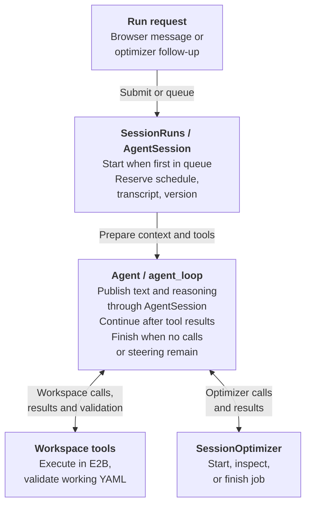
```mermaid
flowchart TB
    Start[<b>Run request</b><br/>Browser message or<br/>optimizer follow-up]
    StartRun[<b>SessionRuns / AgentSession</b><br/>Start when first in queue<br/>Reserve schedule,<br/>transcript, version]
    Step[<b>Agent / agent_loop</b><br/>Publish text and reasoning<br/>through AgentSession<br/>Continue after tool results<br/>Finish when no calls<br/>or steering remain]
    Tool[<b>Workspace tools</b><br/>Execute in E2B,<br/>validate working YAML]
    Job[<b>SessionOptimizer</b><br/>Start, inspect,<br/>or finish job]

    Start -->|Submit or queue| StartRun
    StartRun -->|Prepare context and tools| Step
    Step <-->|Workspace calls,<br/>results and validation| Tool
    Step <-->|Optimizer calls<br/>and results| Job
```

**Figure 5. Model and tool steps within one run.**

</div>

<div class="ai-diagram" markdown="1" tabindex="0">

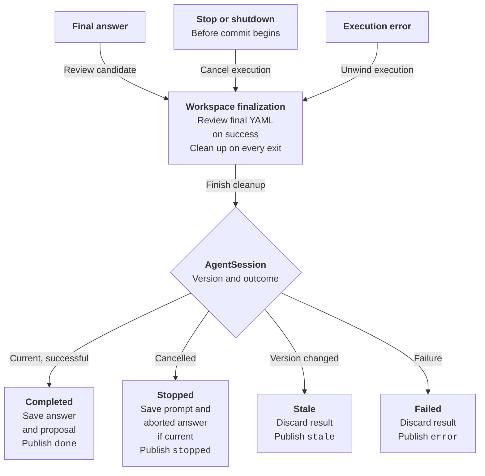
```mermaid
flowchart TB
    Answer[<b>Final answer</b>]
    Stop[<b>Stop or shutdown</b><br/>Before commit begins]
    Failure[<b>Execution error</b>]
    Cleanup[<b>Workspace finalization</b><br/>Review final YAML<br/>on success<br/>Clean up on every exit]
    Check{<b>AgentSession</b><br/>Version and outcome}
    Done[<b>Completed</b><br/>Save answer<br/>and proposal<br/>Publish <code>done</code>]
    Stopped[<b>Stopped</b><br/>Save prompt and<br/>aborted answer<br/>if current<br/>Publish <code>stopped</code>]
    Stale[<b>Stale</b><br/>Discard result<br/>Publish <code>stale</code>]
    Error[<b>Failed</b><br/>Discard result<br/>Publish <code>error</code>]

    Answer -->|Review candidate| Cleanup
    Stop -->|Cancel execution| Cleanup
    Failure -->|Unwind execution| Cleanup
    Cleanup -->|Finish cleanup| Check
    Check -->|Current, successful| Done
    Check -->|Cancelled| Stopped
    Check -->|Version changed| Stale
    Check -->|Failure| Error

```

**Figure 6. Cleanup and committing a run's outcome.** Terminal events follow
cleanup and the configured history write, then use the session stream in Figure 4.

</div>

| Browser action during a foreground run | Result |
| --- | --- |
| Queue the next message | HTTP `202` injects it at the next model boundary. If the run is closing, HTTP `409` makes the browser send it as a new run later. |
| Stop the current answer | The browser clears its locally queued messages and sends `POST /stop` (HTTP `202`). Its session stream remains open, and the UI waits for a terminal event confirming cleanup. The service cancels the active run and every queued follow-up run. Cleanup still finishes. |
| Start a second answer directly | HTTP `409` leaves the current run running. |
| Disconnect the session SSE stream | Detaches the reader. Runs and optimizer jobs continue. Reconnect with `Last-Event-ID` to recover output. |

The three paths below expand the model steps. [Retention and Context](#retention-and-context)
shows what each outcome keeps for later questions.

### Text-only response

<div class="ai-diagram" markdown="1" tabindex="0">

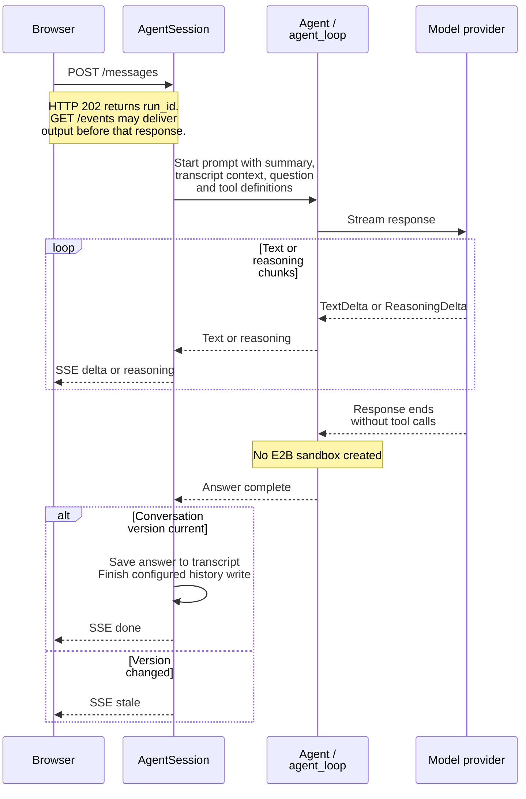
```mermaid
---
config:
  sequence:
    actorMargin: 12
    width: 140
    diagramMarginX: 4
    diagramMarginY: 8
    wrap: false
    wrapPadding: 4
---
sequenceDiagram
    participant Browser
    participant AI as AgentSession
    participant Agent as Agent /<br/>agent_loop
    participant Model as Model provider

    Browser->>AI: POST /messages
    Note over Browser,AI: HTTP 202 returns run_id.<br/>GET /events may deliver<br/>output before that response.
    AI->>Agent: Start prompt with summary,<br/>transcript context, question<br/>and tool definitions
    Agent->>Model: Stream response
    loop Text or reasoning chunks
        Model-->>Agent: TextDelta or ReasoningDelta
        Agent-->>AI: Text or reasoning
        AI-->>Browser: SSE delta or reasoning
    end
    Model-->>Agent: Response ends<br/>without tool calls
    Note over Agent: No E2B sandbox created
    Agent-->>AI: Answer complete
    alt Conversation version current
        AI->>AI: Save answer to transcript<br/>Finish configured history write
        AI-->>Browser: SSE done
    else Version changed
        AI-->>Browser: SSE stale
    end
```

**Figure 7. Streaming a text-only answer without a sandbox.**

</div>

**Provider retries.** A timeout is retried only before the provider delivers
its first streamed event. Once text, reasoning, usage, or a tool call arrives,
the request is not replayed because it could duplicate output or tool work.

### Workspace and model tools

#### Workspace execution

<div class="ai-diagram" markdown="1" tabindex="0">

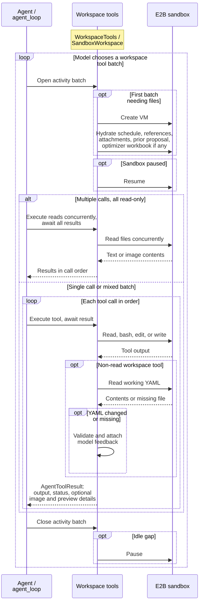
```mermaid
---
config:
  sequence:
    actorMargin: 12
    width: 140
    diagramMarginX: 4
    diagramMarginY: 8
    wrap: false
    wrapPadding: 4
---
sequenceDiagram
    participant Agent as Agent /<br/>agent_loop
    participant Workspace as Workspace tools
    participant E2B as E2B sandbox

    Note over Workspace: WorkspaceTools /<br/>SandboxWorkspace
    loop Model chooses a workspace tool batch
        Agent->>Workspace: Open activity batch
        opt First batch<br/>needing files
            Workspace->>E2B: Create VM
            Workspace->>E2B: Hydrate schedule, references,<br/>attachments, prior proposal,<br/>optimizer workbook if any
        end
        opt Sandbox paused
            Workspace->>E2B: Resume
        end
        alt Multiple calls, all read-only
            Agent->>Workspace: Execute reads concurrently,<br/>await all results
            Workspace->>E2B: Read files concurrently
            E2B-->>Workspace: Text or image contents
            Workspace-->>Agent: Results in call order
        else Single call or mixed batch
            loop Each tool call in order
                Agent->>Workspace: Execute tool, await result
                Workspace->>E2B: Read, bash, edit, or write
                E2B-->>Workspace: Tool output
                opt Non-read workspace tool
                    Workspace->>E2B: Read working YAML
                    E2B-->>Workspace: Contents or missing file
                    opt YAML changed<br/>or missing
                        Workspace->>Workspace: Validate and attach<br/>model feedback
                    end
                end
                Workspace-->>Agent: AgentToolResult:<br/>output, status, optional<br/>image and preview details
            end
        end
        Agent->>Workspace: Close activity batch
        opt Idle gap
            Workspace->>E2B: Pause
        end
    end

```

**Figure 8. Lazy sandbox creation, tool batches, and validation feedback.**

</div>

#### Tool events and model continuation

This sequence shows the events around the same tool executions above.

<div class="ai-diagram" markdown="1" tabindex="0">

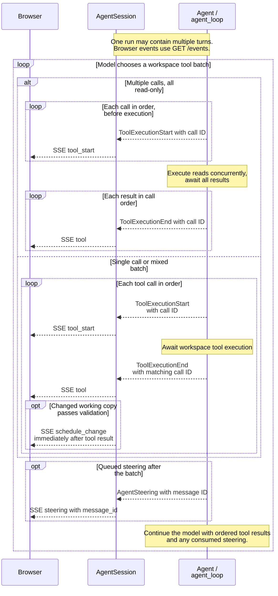
```mermaid
---
config:
  sequence:
    actorMargin: 12
    width: 140
    diagramMarginX: 4
    diagramMarginY: 8
    wrap: false
    wrapPadding: 4
---
sequenceDiagram
    participant Browser
    participant Session as AgentSession
    participant Agent as Agent /<br/>agent_loop

    Note over Session,Agent: One run may contain multiple turns.<br/>Browser events use GET /events.
    loop Model chooses a workspace tool batch
        alt Multiple calls, all read-only
            loop Each call in order, before execution
                Agent-->>Session: ToolExecutionStart with call ID
                Session-->>Browser: SSE tool_start
            end
            Note over Agent: Execute reads concurrently,<br/>await all results
            loop Each result in call order
                Agent-->>Session: ToolExecutionEnd with call ID
                Session-->>Browser: SSE tool
            end
        else Single call or mixed batch
            loop Each tool call in order
                Agent-->>Session: ToolExecutionStart<br/>with call ID
                Session-->>Browser: SSE tool_start
                Note over Agent: Await workspace tool execution
                Agent-->>Session: ToolExecutionEnd<br/>with matching call ID
                Session-->>Browser: SSE tool
                opt Changed working copy passes validation
                    Session-->>Browser: SSE schedule_change<br/>immediately after tool result
                end
            end
        end
        opt Queued steering after the batch
            Agent-->>Session: AgentSteering with message ID
            Session-->>Browser: SSE steering with message_id
        end
        Note over Agent: Continue the model with ordered tool results<br/>and any consumed steering.
    end

```

**Figure 9. Tool events and model continuation across batches.**

</div>

#### Final review and cleanup

<div class="ai-diagram" markdown="1" tabindex="0">

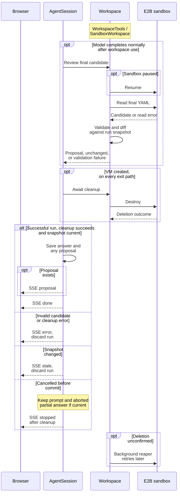
```mermaid
---
config:
  sequence:
    actorMargin: 12
    width: 140
    diagramMarginX: 4
    diagramMarginY: 8
    wrap: false
    wrapPadding: 4
---
sequenceDiagram
    participant Browser
    participant Session as AgentSession
    participant Workspace as Workspace
    participant E2B as E2B sandbox

    Note over Workspace: WorkspaceTools /<br/>SandboxWorkspace
    opt Model completes normally<br/>after workspace use
        Session->>Workspace: Review final candidate
        opt Sandbox paused
            Workspace->>E2B: Resume
        end
        Workspace->>E2B: Read final YAML
        E2B-->>Workspace: Candidate or read error
        Workspace->>Workspace: Validate and diff<br/>against run snapshot
        Workspace-->>Session: Proposal, unchanged,<br/>or validation failure
    end
    opt VM created,<br/>on every exit path
        Session->>Workspace: Await cleanup
        Workspace->>E2B: Destroy
        E2B-->>Workspace: Deletion outcome
    end
    alt Successful run, cleanup succeeds<br/>and snapshot current
        Session->>Session: Save answer and<br/>any proposal
        opt Proposal exists
            Session-->>Browser: SSE proposal
        end
        Session-->>Browser: SSE done
    else Invalid candidate<br/>or cleanup error
        Session-->>Browser: SSE error,<br/>discard run
    else Snapshot changed
        Session-->>Browser: SSE stale,<br/>discard run
    else Cancelled before commit
        Note over Session: Keep prompt and aborted<br/>partial answer if current
        Session-->>Browser: SSE stopped<br/>after cleanup
    end
    opt Deletion unconfirmed
        Workspace->>E2B: Background reaper<br/>retries later
    end

```

**Figure 10. Final candidate review, sandbox cleanup, and run outcomes.**

</div>

[Schedule Proposals](#schedule-proposals) covers approval and rejection after
the run.

The model can use `read`, `bash`, `edit`, and `write`. `read` handles text and
supported images. Workspace helpers inspect XLSX and PDF files. Tool output,
individual commands, tool rounds, and the full run are bounded. The provider
sees a schedule summary and reads full YAML through tools only when needed.

Hydration copies the files below into the sandbox. The model inspects and edits
them with the four basic tools, and runs the inspect helpers through `bash`.

| Sandbox path | Content |
| --- | --- |
| `/workspace/schedule.yaml` | The session schedule snapshot. |
| `/workspace/pending-proposal.yaml`, `/workspace/pending-proposal.diff` | The pending proposal's full candidate YAML and its frozen diff against the schedule snapshot used to create it, if any. Read-only reference, and the new diff is computed by the server at run end. |
| `/workspace/attachments/` | Uploaded files plus a `manifest.json` with safe paths and original filenames. |
| `/workspace/optimizer-results/optimized-schedule.xlsx` | A retained optimizer workbook, if any. |
| `/reference/` | Schema and guide references, plus `tools/inspect_xlsx.py` and `tools/inspect_pdf.py`. |

Uploads are available only in the run that received them. The sandbox has no
repository, retrieval access, outbound Internet access, browser storage access,
or provider, optimizer, or database credentials. Uploads and shell output remain
untrusted throughout validation and review.

**Sandbox retries.** Replay-safe E2B operations can be retried. Creation and
shell execution are not replayed after an uncertain response.

The background reaper also scans for overdue application-owned sandboxes.
To run one cleanup pass while the AI service is offline:

```sh
python -m nurse_scheduling.ai.sandbox.reap
```

The command needs `E2B_API_KEY` and exits nonzero if listing fails or deletion
remains unconfirmed. Schedule it externally if cleanup must continue during a
complete service outage.

### Optimizer Jobs and Events

#### Start and submission

<div class="ai-diagram" markdown="1" tabindex="0">

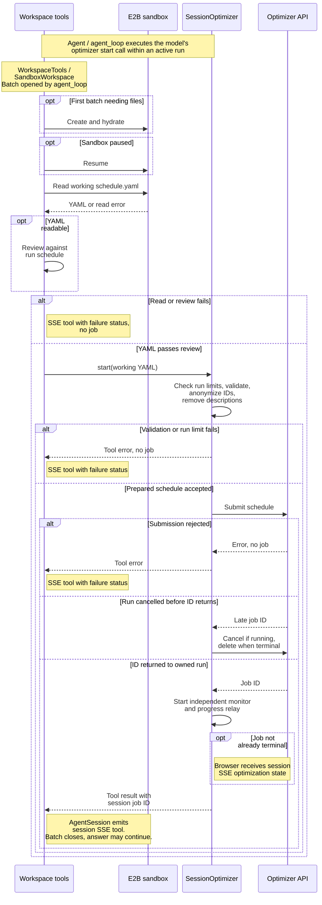
```mermaid
---
config:
  sequence:
    actorMargin: 12
    width: 140
    diagramMarginX: 4
    diagramMarginY: 8
    wrap: false
    wrapPadding: 4
---
sequenceDiagram
    participant Agent as Workspace tools
    participant E2B as E2B sandbox
    participant Jobs as SessionOptimizer
    participant API as Optimizer API

    Note over Agent,Jobs: Agent / agent_loop executes the model's<br/>optimizer start call within an active run
    Note over Agent: WorkspaceTools /<br/>SandboxWorkspace<br/>Batch opened by agent_loop
    opt First batch needing files
        Agent->>E2B: Create and hydrate
    end
    opt Sandbox paused
        Agent->>E2B: Resume
    end
    Agent->>E2B: Read working schedule.yaml
    E2B-->>Agent: YAML or read error
    opt YAML readable
        Agent->>Agent: Review against<br/>run schedule
    end
    alt Read or review fails
        Note right of Agent: SSE tool with failure status,<br/>no job
    else YAML passes review
        Agent->>Jobs: start(working YAML)
        Jobs->>Jobs: Check run limits, validate,<br/>anonymize IDs,<br/>remove descriptions
        alt Validation or run limit fails
            Jobs-->>Agent: Tool error, no job
            Note right of Agent: SSE tool with failure status
        else Prepared schedule accepted
            Jobs->>API: Submit schedule
            alt Submission rejected
                API-->>Jobs: Error, no job
                Jobs-->>Agent: Tool error
                Note right of Agent: SSE tool with failure status
            else Run cancelled before ID returns
                API-->>Jobs: Late job ID
                Jobs->>API: Cancel if running,<br/>delete when terminal
            else ID returned to owned run
                API-->>Jobs: Job ID
                Jobs->>Jobs: Start independent monitor<br/>and progress relay
                opt Job not<br/>already terminal
                    Note right of Jobs: Browser receives session<br/>SSE optimization state
                end
                Jobs-->>Agent: Tool result with<br/>session job ID
                Note right of Agent: AgentSession emits<br/>session SSE tool.<br/>Batch closes, answer may continue.
            end
        end
    end

```

**Figure 11. Starting an optimizer job from sandbox YAML.**

</div>

#### Background monitoring and result review

<div class="ai-diagram" markdown="1" tabindex="0">

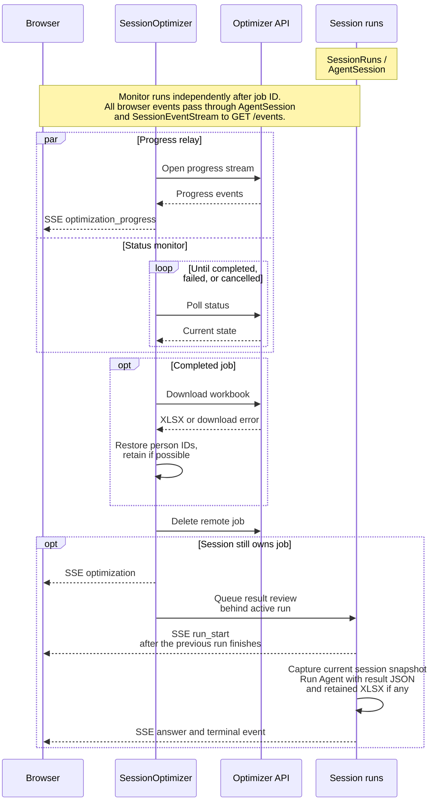
```mermaid
---
config:
  sequence:
    actorMargin: 12
    width: 140
    diagramMarginX: 4
    diagramMarginY: 8
    wrap: false
    wrapPadding: 4
---
sequenceDiagram
    participant Browser
    participant Jobs as SessionOptimizer
    participant API as Optimizer API
    participant Runs as Session runs

    Note over Runs: SessionRuns /<br/>AgentSession
    Note over Browser,Runs: Monitor runs independently after job ID.<br/>All browser events pass through AgentSession<br/>and SessionEventStream to GET /events.
    par Progress relay
        Jobs->>API: Open progress stream
        API-->>Jobs: Progress events
        Jobs-->>Browser: SSE optimization_progress
    and Status monitor
        loop Until completed, failed, or cancelled
            Jobs->>API: Poll status
            API-->>Jobs: Current state
        end
    end
    opt Completed job
        Jobs->>API: Download workbook
        API-->>Jobs: XLSX or download error
        Jobs->>Jobs: Restore person IDs,<br/>retain if possible
    end
    Jobs->>API: Delete remote job
    opt Session still owns job
        Jobs-->>Browser: SSE optimization
        Jobs->>Runs: Queue result review<br/>behind active run
        Runs-->>Browser: SSE run_start<br/>after the previous run finishes
        Runs->>Runs: Capture current session snapshot<br/>Run Agent with result JSON<br/>and retained XLSX if any
        Runs-->>Browser: SSE answer and terminal event
    end

```

**Figure 12. Background monitoring and queued result-review runs.**

</div>

#### Status and finish-now tools

<div class="ai-diagram" markdown="1" tabindex="0">

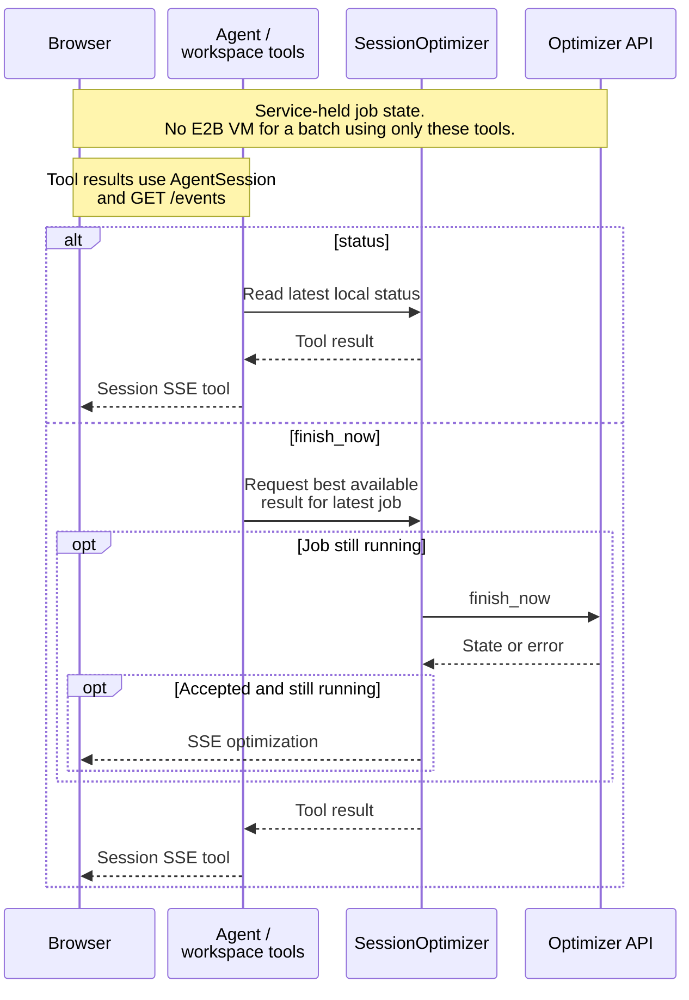
```mermaid
---
config:
  sequence:
    actorMargin: 12
    width: 140
    diagramMarginX: 4
    diagramMarginY: 8
    wrap: false
    wrapPadding: 4
---
sequenceDiagram
    participant Browser
    participant Agent as Agent /<br/>workspace tools
    participant Jobs as SessionOptimizer
    participant API as Optimizer API

    Note over Browser,API: Service-held job state.<br/>No E2B VM for a batch using only these tools.
    Note over Browser,Agent: Tool results use AgentSession<br/>and GET /events
    alt status
        Agent->>Jobs: Read latest local status
        Jobs-->>Agent: Tool result
        Agent-->>Browser: Session SSE tool
    else finish_now
        Agent->>Jobs: Request best available<br/>result for latest job
        opt Job still running
            Jobs->>API: finish_now
            API-->>Jobs: State or error
            opt Accepted and still running
                Jobs-->>Browser: SSE optimization
            end
        end
        Jobs-->>Agent: Tool result
        Agent-->>Browser: Session SSE tool
    end

```

**Figure 13. Inspecting or finishing an optimizer job without a sandbox.**

</div>

The `status` and `finish_now` actions use service-held job state and do not
create an E2B sandbox when they are the only tools in a batch. The optimizer
credential and reverse person-ID mapping stay in the AI service.

## Schedule Proposals

### Create a proposal

<div class="ai-diagram" markdown="1" tabindex="0">

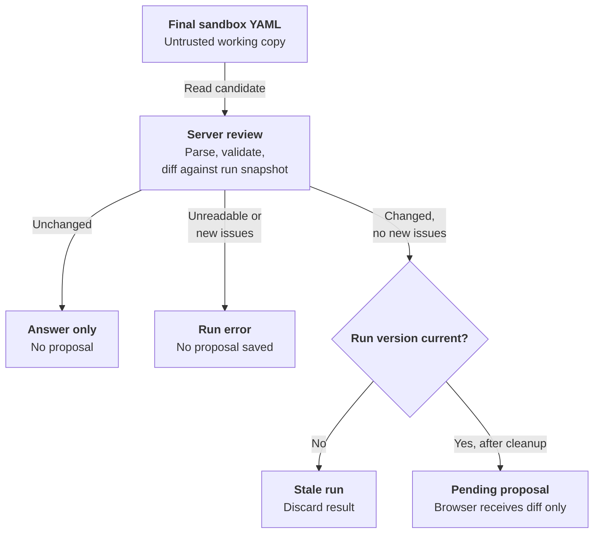
```mermaid
flowchart TB
    Working[<b>Final sandbox YAML</b><br/>Untrusted working copy]
    Review[<b>Server review</b><br/>Parse, validate,<br/>diff against run snapshot]
    Working -->|Read candidate| Review
    Review -->|Unchanged| Answer[<b>Answer only</b><br/>No proposal]
    Review -->|Unreadable or<br/>new issues| Fail[<b>Run error</b><br/>No proposal saved]
    Review -->|Changed,<br/>no new issues| Current{<b>Run version current?</b>}
    Current -->|No| Stale[<b>Stale run</b><br/>Discard result]
    Current -->|Yes, after cleanup| Pending[<b>Pending proposal</b><br/>Browser receives diff only]

```

**Figure 14. Reviewing sandbox YAML before saving a proposal.**

</div>

### Approve or discard a proposal

<div class="ai-diagram" markdown="1" tabindex="0">

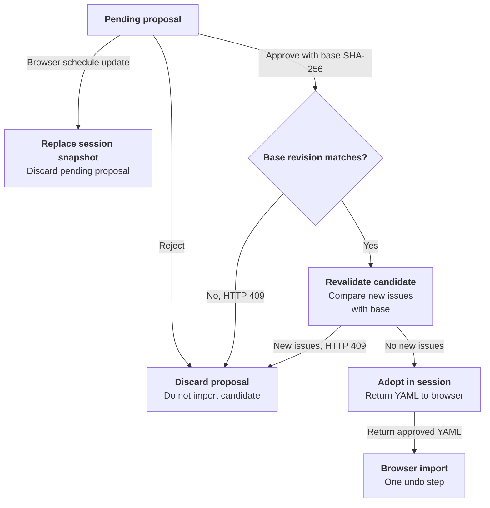
```mermaid
flowchart TB
    Pending[<b>Pending proposal</b>]
    Pending -->|Reject| Discard[<b>Discard proposal</b><br/>Do not import candidate]
    Pending -->|Browser schedule update| Updated[<b>Replace session snapshot</b><br/>Discard pending proposal]
    Pending -->|Approve with base SHA-256| Revision{<b>Base revision matches?</b>}
    Revision -->|No, HTTP 409| Discard
    Revision -->|Yes| Recheck[<b>Revalidate candidate</b><br/>Compare new issues<br/>with base]
    Recheck -->|New issues, HTTP 409| Discard
    Recheck -->|No new issues| Adopt[<b>Adopt in session</b><br/>Return YAML to browser]
    Adopt -->|Return approved YAML| Import[<b>Browser import</b><br/>One undo step]

```

**Figure 15. Approving, revalidating, or discarding a schedule proposal.**

</div>

A working-copy preview is provisional. The final proposal carries a diff;
only approval returns candidate YAML for the browser to import.

## Retention and Context

`AgentState.messages` holds the run's `user`, `assistant`, and `tool_result`
entries. Each assistant entry includes text, reasoning, tool calls, and a stop
reason. Proposal decisions add short `proposal_decision` action notes after
the run.

Each destination receives a projection of these entries. `context.py` builds
provider input, `RunOutput` projects agent events onto the public session contract, and the chat history
log stores ordered entries under the run. The log omits image bytes from tool
results.

The session transcript keeps prompts, answer text, stop reasons, and decisions.
Later runs never replay a disposable sandbox's tool exchanges. Model context
merges the responses between two prompts into the answer the user saw.
Trimming for retained text, the message cap, or the prompt budget removes whole
exchanges, so an answer or proposal decision is never left without its prompt.

`SessionStore` counts UTF-8 bytes in schedule snapshots, pending proposal YAML
and diffs, transcript text, and queued steering across live sessions.
`AI_MAX_SESSION_BYTES` defaults to 256 MiB. Client text that exceeds the budget
is refused with HTTP `429`. Completed runs instead trim older exchanges while
preserving the latest run and pending proposal, so retained text can exceed
the budget. This accounting does not measure total process RAM.

| Content | Later model context | Session transcript | Browser and export | Chat history log |
| --- | --- | --- | --- | --- |
| Answer text | Yes, within the history budget | Yes | Yes | Yes |
| Reasoning | No | No | Yes | Yes |
| Tool calls and results | Only within their run | No | Yes, by `tool_call_id` | Yes |
| Queued steering | Yes | Yes | Yes | Yes, in run order |
| Stopped answer | Prompt and an interruption note | Prompt and aborted partial answer | Partial output, stopped status, unfinished tools marked interrupted | Yes, `aborted` in a `cancelled` run |
| Failed or stale answer | No | No | Failed output with retry, or a stale notice | Yes, with run status |
| Attachment filenames | Yes, in the prompt note | Yes | Yes | Yes, in the prompt |
| Proposal decision | Yes | Yes | Yes | Yes, under the proposing run |

## Mapping to Pi

The agent/session boundaries and selected tool ports follow
[Pi v1.0.0][pi-release] (`a13d35a`). This comparison covers its public agent loop
and coding-agent session. Source links are pinned to the full release commit.
These are architectural counterparts, not identical APIs.
Each row lists shared behavior first, then what only one side has.

<div class="ai-pi-mapping" markdown="1">

| Component | Shared | Ours only | Pi only |
| --- | --- | --- | --- |
| `Agent` / `AgentState`<br/>Pi: [Agent][pi-agent], [AgentState][pi-state] | Streaming flag, pending tool call IDs, in-run messages, the steering queue, and refusal of a second concurrent prompt. | Context arrives per run, and the session commits its retained transcript after cleanup. `AgentRun`, not `Agent`, owns cancellation, so Stop also reaches queued runs and cannot interrupt cleanup. | State also holds the model, thinking level, tools, persistent transcript, and partial streaming message. The agent becomes idle only after awaited `agent_end` subscribers finish. |
| `agent_loop`<br/>Pi: [agentLoop][pi-loop] | Repeats model responses and tool batches. Steering enters after a tool batch, or continues the run when it arrives as the answer ends. Tool calls from a response cut off by the output limit fail without running. `AgentLoopConfig` groups loop options and hooks. | A batch runs concurrently only when every call is read-only. Round and call budgets end with an answer-only request, and a refused truncated batch spends a round. Each request passes through one context projection. | Parallel execution by default. The whole batch runs sequentially if configured globally or required by any tool in it. Supports before and after tool-call hooks and context transform hooks. Tool-result early termination requires every finalized tool result in the batch to set `terminate: true`. |
| `AgentTool` / `AgentToolResult`<br/>Pi: [AgentTool / AgentToolResult][pi-tools] | A model-facing definition bound to execution. Results carry model content, UI details, and explicit failure status. Start and end events correlate by tool call ID. | Tools receive raw JSON arguments, return text, an optional image, and an `ok` flag, and declare whether they are read-only. | Schema-validated parameters, the call ID, an abort signal, and partial-update callbacks. Tools throw or return `isError: true` on failure. `structuredContent` follows the tool's `outputSchema` for programmatic callers and is excluded from model input. |
| `AgentSession` / `RunOutput` / `AgentMessage`<br/>Pi: [AgentSession][pi-session], [AgentMessage][pi-messages] | An application layer over `Agent`. Runs produce `UserMessage`, `AssistantMessage`, and `ToolResultMessage` records shaped like Pi's messages, with Pi's stop reasons, persisted in order. Later model input excludes aborted answer content. | Snapshot-versioned commits after sandbox cleanup, schedule revisions, and proposal decision entries. The in-memory session keeps prompts, assistant text and stop reasons, and decisions. A stopped run retains its prompt and aborted partial answer. Later model context replaces that answer with an interruption note. The persisted log is an audit record keyed by run, not a resumable session. | An append-only, branchable JSONL session with model and label entries, automatic compaction into summary entries, automatic retry of retryable errors, and extensions. Aborted and error assistant messages stay in session history, but [provider message transformation][pi-replay] omits them from later model replay. [Context-edit entries][pi-recovery] can omit recovery attempts and their tool results from subsequent context while retaining the raw history. |
| `SessionRuns` / `AgentRun` / `RunSnapshot`<br/>Pi: [ActiveRun and run lifecycle][pi-agent] | One active run with a cancellation handle, finishing before the next run starts. | Per-session FIFO execution, queued background runs, Stop that also cancels queued runs, and a versioned commit capability. | The agent's own `AbortController`, passed to tools, with a single-run guard instead of a queue. |
| Steering queue<br/>Pi: [steer / followUp][pi-agent] | Queued input reaches the model at a boundary without starting a new run. | One queue serves both roles. It drains every message, deduplicates retried POSTs by ID, and closes atomically with the answer. Optimizer wake-ups enter `SessionRuns` as fresh runs. | Separate steering and follow-up queues, each draining one message at a time or all at once. |
| `WorkspaceTools` / `SandboxWorkspace`<br/>Pi: [read, bash, edit, write][pi-coding-tools] | Pi's default `read`, `bash`, `edit`, and `write` contracts and output behavior, ported under `ai/pi`. | A lazy, disposable E2B VM per run with hydration, pause and resume, YAML validation after each change, and teardown before commit. A shorter `read` description, fixed image limits with a source-pixel bound, and server command timeouts. | Tools act on the user's local working directory, which persists across runs. Image resize options can follow the active model's limits. Built-in `powershell`, `find`, `grep`, and `ls` tools are available beyond the default active four. Nested calls through [`ctx.executeTool()`][pi-nested-tools] share validation and hooks and carry parent tool call IDs. |
| `AgentSessionEvent` / `SessionEventStream`<br/>Pi: [AgentEvent][pi-events], [AgentSessionEvent][pi-session-events] | Typed text, reasoning, and tool events with call IDs and exactly one terminal outcome per run. | `AgentSession.subscribe` exposes one typed public event per publication to in-process listeners. `SessionEventStream` retains all run and job events for HTTP replay with `Last-Event-ID`. Disconnect detaches the reader. Explicit Stop cancels runs. | In-process subscribers receive agent, turn, message, and tool lifecycle events, including partial tool updates. Low-level `agent_end` marks the end of one loop run. `AgentSession` emits [`agent_settled`][pi-settled] after retries, compaction recovery, queued continuation work, and session boundary processing finish. |
| `SessionOptimizer`<br/>Pi: no first-class built-in counterpart | Exposed to the model as one `AgentTool`. | Independent remote jobs, progress, anonymization, late-submission cleanup, and fresh review runs. | Similar behavior could be implemented through extensions. |
| API routes / `SessionStore` / browser lifecycle<br/>Pi: nearest is [AgentSession][pi-session] | A session boundary that owns conversation lifetime. | HTTP authentication, cookie ownership, expiry, session text limits, shared SSE framing and recovery for GET and compatibility POST readers, a browser-owned schedule, and proposal approval. | Local single-user sessions stored on disk that can be resumed and branched. |

</div>

### Design decisions

The investigated alternatives below were not adopted:

- **Separate steering and follow-up queues.** The browser offers one queue
  action. Optimizer results start a fresh run because they can arrive after the
  run ends and must see the current schedule.
- **Summary compaction.** The model receives the current schedule
  summary on every run, so older exchanges carry less state than a coding
  transcript. Trimming the oldest complete exchanges avoids an extra provider
  call with its cost, latency, and failure mode.
- **Central schema validation of tool arguments.** The ported Pi tools already
  validate with Pi's wording and accept the compatibility shapes Pi's
  `prepareArguments` accepts, such as a legacy single edit. A generic schema
  check would reject those shapes first. A contract test instead requires every
  offered tool to refuse malformed arguments before any sandbox command, file
  change, or optimizer submission.
- **Recording failed attempts in the transcript.** Retry resends the question,
  so a recorded attempt would duplicate it in model context. The browser also
  replaces the failed pair on retry, so the question appears once and an old
  Retry button cannot resend it again. The chat history log keeps each
  attempt's outcome and ordered transcript as its lineage.

[pi-release]: https://github.com/earendil-works/pi/releases/tag/v1.0.0
[pi-agent]: https://github.com/earendil-works/pi/blob/a13d35a742c6ef8462812a28fbe1d8c8b7431c32/packages/agent/src/agent.ts#L188
[pi-state]: https://github.com/earendil-works/pi/blob/a13d35a742c6ef8462812a28fbe1d8c8b7431c32/packages/agent/src/types.ts#L382
[pi-loop]: https://github.com/earendil-works/pi/blob/a13d35a742c6ef8462812a28fbe1d8c8b7431c32/packages/agent/src/agent-loop.ts#L38
[pi-tools]: https://github.com/earendil-works/pi/blob/a13d35a742c6ef8462812a28fbe1d8c8b7431c32/packages/agent/src/types.ts#L424
[pi-session]: https://github.com/earendil-works/pi/blob/a13d35a742c6ef8462812a28fbe1d8c8b7431c32/packages/coding-agent/src/core/agent-session.ts#L362
[pi-session-events]: https://github.com/earendil-works/pi/blob/a13d35a742c6ef8462812a28fbe1d8c8b7431c32/packages/coding-agent/src/core/agent-session.ts#L190-L234
[pi-replay]: https://github.com/earendil-works/pi/blob/a13d35a742c6ef8462812a28fbe1d8c8b7431c32/packages/ai/src/api/transform-messages.ts#L201
[pi-settled]: https://github.com/earendil-works/pi/blob/a13d35a742c6ef8462812a28fbe1d8c8b7431c32/packages/coding-agent/src/core/agent-session.ts#L1775
[pi-events]: https://github.com/earendil-works/pi/blob/a13d35a742c6ef8462812a28fbe1d8c8b7431c32/packages/agent/src/types.ts#L514
[pi-messages]: https://github.com/earendil-works/pi/blob/a13d35a742c6ef8462812a28fbe1d8c8b7431c32/packages/agent/src/types.ts#L374
[pi-recovery]: https://github.com/earendil-works/pi/blob/a13d35a742c6ef8462812a28fbe1d8c8b7431c32/packages/coding-agent/src/core/agent-session.ts#L1208
[pi-nested-tools]: https://github.com/earendil-works/pi/blob/a13d35a742c6ef8462812a28fbe1d8c8b7431c32/packages/coding-agent/src/core/agent-session.ts#L702
[pi-coding-tools]: https://github.com/earendil-works/pi/tree/a13d35a742c6ef8462812a28fbe1d8c8b7431c32/packages/coding-agent/src/core/tools

## HTTP API

| Method | Path | Purpose |
| --- | --- | --- |
| `GET` | `/health`, `/ready` | Check service identity and readiness. |
| `GET` | `/capabilities` | Discover the app version, attachment limits, session lifetime, and authentication requirement. |
| `POST` | `/sessions` | Create a session from `schedule_yaml`. |
| `GET` | `/sessions/{id}` | Check a session's remaining lifetime. |
| `POST` | `/sessions/{id}/messages` | Start a foreground run from JSON or multipart input. Return HTTP `202` with `run_id`. |
| `POST` | `/sessions/{id}/messages/queue` | Queue steering text for the active run's next model boundary. |
| `POST` | `/sessions/{id}/stop` | Cancel active and queued runs. Return HTTP `202`. |
| `GET` | `/sessions/{id}/events` | One replayable SSE stream for every run and optimizer update. |
| `PUT` | `/sessions/{id}/schedule` | Replace the session snapshot and discard a pending proposal. |
| `POST` | `/sessions/{id}/proposal/approve` | Revalidate and adopt a proposal against its base revision. |
| `POST` | `/sessions/{id}/proposal/reject` | Discard a proposal. |
| `GET` | `/sessions/{id}/optimizations/{job_id}/xlsx` | Download a retained optimizer workbook. |

For multipart messages, send one `message` field and repeat the `files` field
for attachments. The message route acknowledges the accepted message.
The event route returns server-sent events.
`stop` and `messages/queue` return HTTP `202`. Creating a session sets its
owner cookie. Later session routes require that cookie.

Sessions expire after 48 hours of inactivity by default. Sending or queueing
a message, updating the schedule, or deciding a pending proposal renews the
window. Checking remaining lifetime does not. Session IDs are unguessable.

### Authentication

All session routes require a bearer key when authentication is configured.

`/health`, `/ready`, and `/capabilities` are public. Set `AI_AUTH_TOKEN` or
`AI_AUTH_TOKENS` to require a bearer key for session routes. The latter is a
JSON map from administrative IDs to keys. The IDs appear in operator records,
while clients send only the key. Docker Compose sets `AI_AUTH_REQUIRED=true`,
so it refuses to start without a valid key unless that setting is explicitly
disabled. Native local runs may leave authentication off. The
[configuration reference](reproduce/core.md#ai-backend-configuration) gives
defaults and validation rules.

### Streams and events

`POST /messages` returns HTTP `202` with `run_id`. `GET /events` stays open
across runs and carries every answer, tool result, optimizer update, and review
run. Each run ends with exactly one terminal event. The API frames events
with a session-wide ID:

```text
id: 42
event: delta
data: {"run_id":"…","text":"…"}

```

Reconnect with `Last-Event-ID: 42` to resume after that event. Events can arrive
before the POST response, so the browser correlates output by `run_id` rather
than HTTP response order. Tool events also carry `tool_call_id`, and consumed
steering carries its input's `message_id`.

#### Bounded replay

`SessionEventStream` keeps a replay journal and a recovery projection. Each is
limited to **1,000 main events, 100 progress entries, and 4 MiB of serialized
JSON per session**. Their combined retention is capped at **64 MiB across the
process**. These are event retention limits, not process RAM limits.

| Event class | Retention policy |
| --- | --- |
| Answer, reasoning, tool and run lifecycle, final proposal, optimizer state/result availability | Main events. Progress count pressure cannot evict them. Byte pressure prefers completed run output before active work. |
| `optimization_progress` | Keep the latest update per job in the separate progress allowance. |
| `context_usage`, `schedule_change` | Replace earlier updates for the same run. Replaced IDs do not count as lost required history. |
| Answer and reasoning fragments | Batch publication for up to 25 ms or 2,048 characters. Combine adjacent fragments in the recovery projection. |

If required replay history has expired, the stream sends `session_reset` with
the bounded recovery projection. The API adds `active_run_id` and the current
`proposal_diff`. The browser rebuilds matching answers and consumed steering
without duplicating them. `incomplete: true` reports that older output is also
missing from recovery, and the browser displays that loss.

#### Disconnect and Stop

Disconnect removes only the reader. `POST /stop` cancels active and queued runs,
and the terminal event follows cleanup. Optimizer jobs already owned by the
session continue independently and can queue a later result review.

For API consumers, explicit `Accept: text/event-stream` on `POST /messages`
reads the same journal until that run's terminal event. Disconnect still leaves
work running. The browser uses the persistent `GET /events` route.

Browser operation tokens prevent an older connection or callback from replacing
newer state. Each answer segment retains its `run_id`, including when its events
arrive before the message acknowledgement.

| Event | Meaning |
| --- | --- |
| `delta`, `reasoning`, `truncated` | Answer text, a separate reasoning stream, and a marker that the answer stopped at the output limit. |
| `tool_start`, `tool` | Tool request and completed result, correlated by `tool_call_id` and including success status. |
| `schedule_change`, `proposal` | Working-copy preview and final candidate diff. |
| `steering`, `history_trimmed` | Queued input consumed and prompt-history reduction. |
| `context_usage` | Selected history usage in serialized JSON characters: `used_chars` and `max_chars`. |
| `run_start` | A user or optimizer review run starts, identified by `run_id`. |
| `optimization`, `optimization_progress` | Job state/result availability and replaceable progress updates. |
| `session_reset` | Recovery snapshot after required replay history expires, with current proposal ownership and an expired-output flag. |
| `done`, `stopped`, `stale`, `error` | Terminal run outcomes. |

`context_usage` measures the retained history budget at the start of a run and after
successful completion. It does not measure provider tokens or the model's
total context window.

## Storage and Deployment

Session state, run scheduling, event replay, and optimizer monitors are
process-local. Run one AI backend instance until shared AI storage exists.
These stores are separate from the optimizer server's Redis store. A restart
loses active sessions even when PostgreSQL logging is enabled.

### Durable chat logging

PostgreSQL chat logging is optional for native runs and included in both
backend Compose variants. `chat_runs` keeps run metadata: status, error code,
model, timestamps, usage when available, and attachment count.
`chat_run_entries` stores each run's agent messages in order, keyed by
`(run_id, seq)`, with a `type` and a JSON `payload` holding the fields of the
matching `transcript.py` type. The prompt is written when the run starts, then
every model response, tool result, and queued steering message when it ends. A
later proposal decision is appended to the run that proposed it. Sessions keep
the administrative credential ID. Raw attachment files and images are not
stored, but tool results can contain schedule and attachment text. Entries can
contain staff information, so database access is for operators. History records
do not restore an active chat after a restart. Upgrading a database from the
earlier experimental `chat_turns` schema drops that history.

An unavailable configured database prevents startup. If its initial write
fails, the request returns HTTP `503` before contacting the provider. If the
final write fails, a completed live run reports `history_saved: false` and
logs the failure. Retention removes old runs according to
`AI_HISTORY_RETENTION_DAYS`. Backups need their own retention policy. Use the
optional pgAdmin Compose profile for inspection.

### Inspect chat history with pgAdmin

Start pgAdmin from `docker/` with the same Compose file and environment file
used by the deployment:

```sh
cd docker
docker compose --env-file .env -f compose.backend.yml \
  --profile inspection run --rm --service-ports pgadmin
```

For staging, replace `--env-file .env` with `--env-file .env.staging`.
If the deployment uses a process-local optimizer, replace
`compose.backend.yml` with `compose.backend.memory.yml` and keep the same
environment file and project name.

It listens on the backend host's loopback port `5050`. For a remote host,
forward that port with `ssh -L 5050:127.0.0.1:5050 user@backend-host`.
The [backend deployment guide](backend-deployment.md)
covers the Compose services and environment file.

Open `http://127.0.0.1:5050` and sign in with
`admin@nursescheduling.org` / `pgadmin`. Under **Nurse Scheduling**, connect
to **AI chat history** with database password `ai_history`. The server
definition is preloaded. In **Tools > Query Tool**, inspect recent entries:

```sql
SELECT r.started_at, s.auth_credential_id, r.status, r.model,
       e.seq, e.type, e.payload
FROM chat_runs AS r
JOIN chat_sessions AS s ON s.id = r.session_id
JOIN chat_run_entries AS e ON e.run_id = r.id
ORDER BY r.started_at DESC, e.seq
LIMIT 100;
```

Press Ctrl+C when finished. Compose removes the temporary pgAdmin container;
the PostgreSQL service and its `postgres-ai-data` volume remain intact.

### Proxy and credentials

The production NGINX proxy routes `/ai/*` to the AI service and other paths to
the optimizer API. It must disable response buffering for streaming routes.
With `proxy_pass http://ai:8001/;`, the trailing slash strips `/ai` before
FastAPI receives the request. Set `AI_COOKIE_SECURE=1` for a public HTTPS
browser route, even when the proxy talks to the container over HTTP. The
service only sees the proxy's plain-HTTP connection, so the flag is what marks
the owner cookie `Secure`. The CORS origin allowlist separately controls which
browser origins may make credentialed requests with it.

The complete schedule reaches the AI service, and selected content reaches
the model provider through tool results. Use approved services and anonymize
sensitive schedules as needed. The browser keeps the AI bearer key in memory
unless the user chooses to store it on the device. AI and optimizer keys are
configured independently. Keep `docker/.env` private.

## Tests

Run the affected AI checks from the [Core README](reproduce/core.md#focused-ai-checks).
Its [AI evaluation section](reproduce/core.md#ai-evaluation) covers the manual
case runner, selection, and reports.
