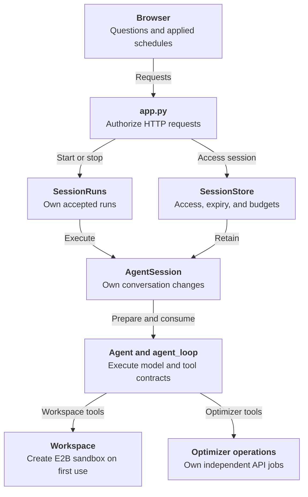
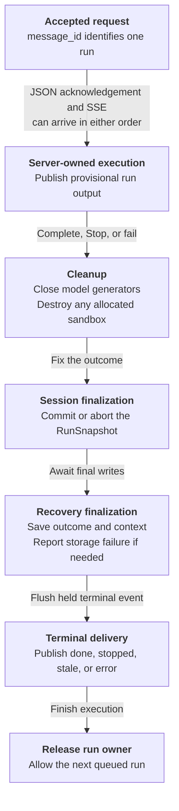
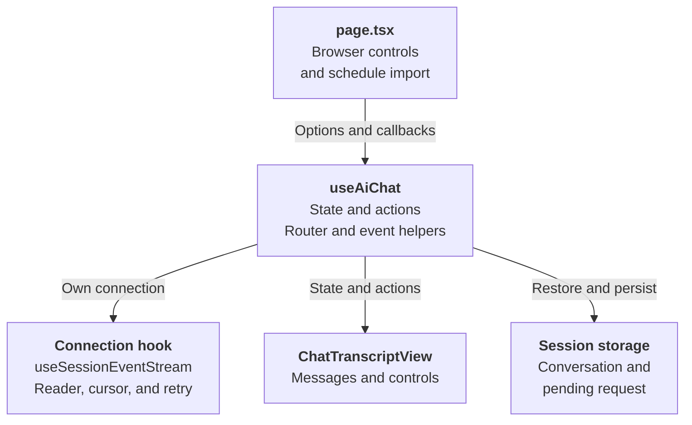
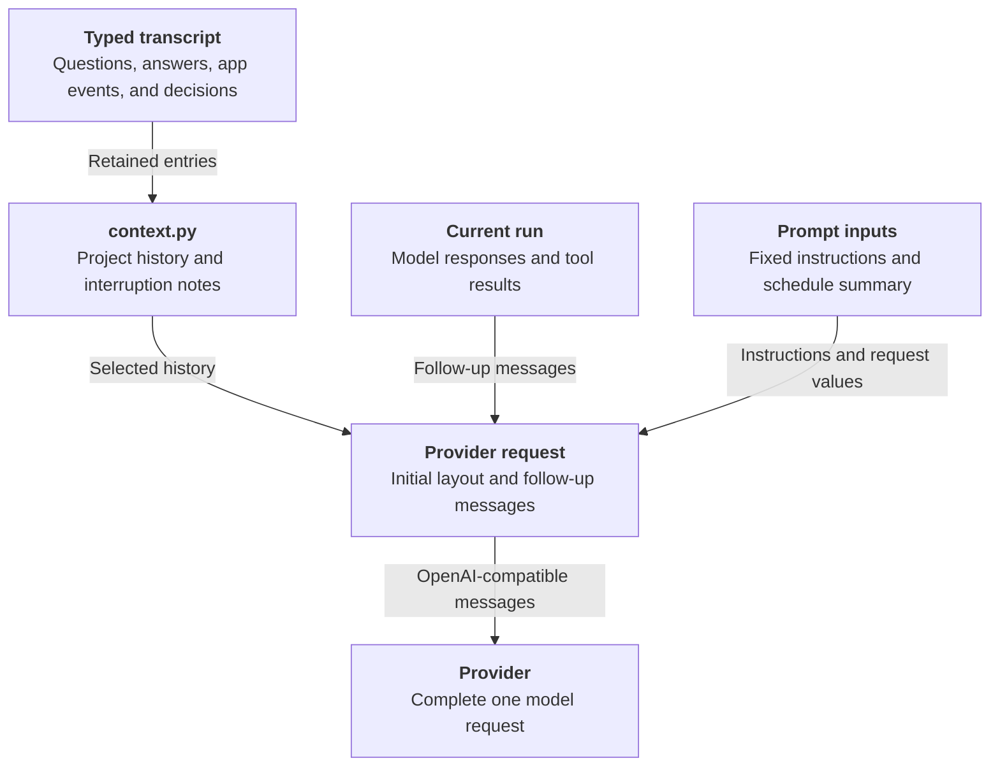
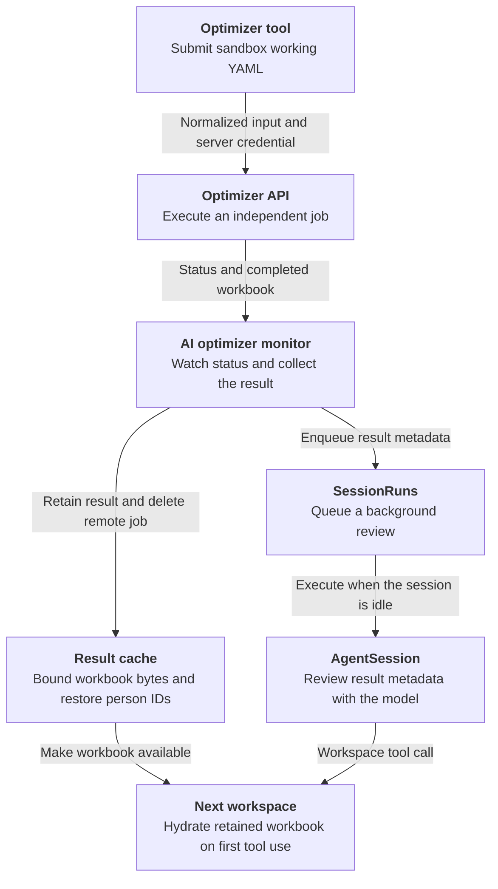
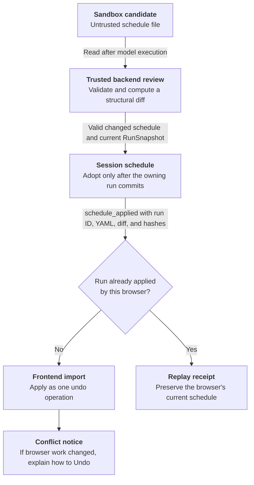

# Experimental AI Assistant Backend

The AI assistant is a separate FastAPI application that answers text questions
about one schedule snapshot. Its ASGI entry point is
`nurse_scheduling.ai_serve:app`. It does not import the optimization server or
use its Redis data.

File attachments are enabled by default. The frontend accepts arbitrary file
types and copies them into the disposable sandbox without executing them. The
assistant reads and edits the schedule in that sandbox. When a run finishes with
a valid changed schedule, the backend adopts it and the browser applies it.
Each run owns a workspace. It creates an E2B Cloud sandbox on the first
workspace tool call. This version excludes retrieval and repository access.

## Run locally

See the [core instructions](reproduce/core.md#run-locally) for this task.

## Architecture

Foreground questions and optimizer-result reviews use the same `AgentSession`
execution path. The HTTP routes authorize and validate requests before handing
them to the session. The model loop receives executable tool contracts with
their concurrency policy.

| Component | Responsibility |
| --- | --- |
| `app.py` | HTTP routes, authentication, and application startup and shutdown. |
| `agent_session.py` | Conversation changes, steering, applied schedules, and the shared run path. |
| `sessions.py`, `lifecycle.py` | `SessionStore` access and budgets, plus `SessionRuns` ownership through cleanup and persistence. |
| `agent.py`, `agent_loop.py`, `agent_types.py` | Observable execution state, the model loop, and executable tool contracts. |
| `workspace.py`, `workspace_tools.py` | Lazy sandbox allocation and hydration, tool binding, and trusted schedule review. |
| `transcript.py`, `context.py` | Typed conversation entries, provider requests, history selection, and application event presentation. |
| `optimizer.py`, `optimizer_tool.py`, `optimizer_http.py` | Job ownership and operations, model-facing arguments and replies, and HTTP transport. |
| `session_events.py`, `session_event_projection.py` | Typed public events, tool call identity, text batching, and terminal publication after finalization. |
| `recovery.py`, `history.py`, `session_event_stream.py` | Ordered persistence, bounded session replay, and restart recovery. |

<figure markdown="1" id="ai-components">

**Figure 1. Backend execution and resource owners.**


```mermaid
flowchart TB
    Browser["<b>Browser</b><br/>Questions and applied schedules"]
    Routes["<b>app.py</b><br/>Authorize HTTP requests"]
    Runs["<b>SessionRuns</b><br/>Own accepted runs"]
    Store["<b>SessionStore</b><br/>Access, expiry, and budgets"]
    Session["<b>AgentSession</b><br/>Own conversation changes"]
    Agent["<b>Agent and agent_loop</b><br/>Execute model and tool contracts"]
    Workspace["<b>Workspace</b><br/>Create E2B sandbox on first use"]
    Optimizer["<b>Optimizer operations</b><br/>Own independent API jobs"]
    Browser -->|Requests| Routes
    Routes -->|Start or stop| Runs
    Routes -->|Access session| Store
    Runs -->|Execute| Session
    Store -->|Retain| Session
    Session -->|Prepare and consume| Agent
    Agent -->|Workspace tools| Workspace
    Agent -->|Optimizer tools| Optimizer
```

</figure>

### Run completion

Foreground questions and optimizer-result reviews use the same owner. A
foreground request is rejected while another run owns the session. Background
reviews wait in queue order. A disconnected browser does not cancel that owner.

<figure markdown="1" id="ai-run-completion">

**Figure 2. Run output, cleanup, persistence, and terminal delivery.**


```mermaid
flowchart TB
    Accept["<b>Accepted request</b><br/>message_id identifies one run"]
    Execute["<b>Server-owned execution</b><br/>Publish provisional run output"]
    Cleanup["<b>Cleanup</b><br/>Close model generators<br/>Destroy any allocated sandbox"]
    Commit["<b>Session finalization</b><br/>Commit or abort the RunSnapshot"]
    Recovery["<b>Recovery finalization</b><br/>Save outcome and context<br/>Report storage failure if needed"]
    Terminal["<b>Terminal delivery</b><br/>Publish done, stopped, stale, or error"]
    Release["<b>Release run owner</b><br/>Allow the next queued run"]
    Accept -->|JSON acknowledgement and SSE<br/>can arrive in either order| Execute
    Execute -->|Complete, Stop, or fail| Cleanup
    Cleanup -->|Fix the outcome| Commit
    Commit -->|Await final writes| Recovery
    Recovery -->|Flush held terminal event| Terminal
    Terminal -->|Finish execution| Release
```

</figure>

`AgentRun.cancelled` records a cancellation request. `finishing` prevents a
late Stop from changing a result after cleanup has fixed its outcome. These
flags and queue ownership are separate from the browser's running, stopping,
and interrupted phases. `RunEvents` holds terminal events until finalization
finishes, including when recovery storage reports a failure.

### Frontend controller

The page owns credentials, composer files, speech, scrolling, and browser
download URLs. `useAiChat` owns chat state, saved conversation restoration,
message submission, steering, session expiry, and applied schedules.
`ChatTranscriptView` renders that state through explicit props and callbacks.

<figure markdown="1" id="ai-frontend">

**Figure 3. Frontend state, connection ownership, and rendering.**


```mermaid
flowchart TB
    Page["<b>page.tsx</b><br/>Browser controls<br/>and schedule import"]
    Controller["<b>useAiChat</b><br/>State and actions<br/>Router and event helpers"]
    Reader["<b>Connection hook</b><br/>useSessionEventStream<br/>Reader, cursor, and retry"]
    Transcript["<b>ChatTranscriptView</b><br/>Messages and controls"]
    Saved["<b>Session storage</b><br/>Conversation and<br/>pending request"]
    Page -->|Options and callbacks| Controller
    Controller -->|Own connection| Reader
    Controller -->|State and actions| Transcript
    Controller -->|Restore and persist| Saved
```


</figure>

The reader hook revokes callbacks from a closed connection and owns its retry
timer. Accepted deferred events remain scoped to the conversation. A cursor
reconnect continues the active reply after steering. A replacement snapshot
rebuilds the run from its original reply and preserves surrounding message
positions. `ChatLifecycle` owns browser operation phases and busy state.

### Session and model context

<figure markdown="1" id="ai-context">

**Figure 4. Retained conversation and the next provider request.**


```mermaid
flowchart TB
    Transcript["<b>Typed transcript</b><br/>Questions, answers, app events, and decisions"]
    Context["<b>context.py</b><br/>Project history and interruption notes"]
    Current["<b>Current run</b><br/>Model responses and tool results"]
    Prompt["<b>Prompt inputs</b><br/>Fixed instructions and schedule summary"]
    Request["<b>Provider request</b><br/>Initial layout and follow-up messages"]
    Provider["<b>Provider</b><br/>Complete one model request"]
    Transcript -->|Retained entries| Context
    Context -->|Selected history| Request
    Current -->|Follow-up messages| Request
    Prompt -->|Instructions and request values| Request
    Request -->|OpenAI-compatible messages| Provider
```

</figure>

`build_provider_messages` builds the initial layout. The model loop calls
`prepare_provider_request` for each follow-up, combining that layout with
current run entries. Session retention, model context selection, and event
replay have separate limits.

The browser receives an HTTP-only owner cookie and an unguessable session UUID.
Active sessions expire after 30 days of inactivity by default. Sending or
queueing a message or synchronizing a changed schedule renews that window. The browser can retain the conversation within its current
tab and verify the session without extending its lifetime.
The session records typed questions, assistant responses, and app events. Tool results and reasoning belong to the current run and are released
when it ends. Stop and failed runs retain their questions with an interruption
note. Later model context excludes claims from their discarded workspace.
Recovery stores typed entries, including their origin and interruption state.
Existing text history remains readable when the service restores older sessions.
New questions receive a JSON acknowledgement with their `run_id`. Foreground and
optimizer output use the same session GET event stream. Repeated requests with the
same `message_id` return the accepted run without executing the question again.
The browser buffers events received before acknowledgement and routes them by
`run_id`. A disconnected reader reconnects without cancelling server work.
Expired cursors receive a replacement `session_reset` snapshot. Replay has separate
event-count and serialized-byte limits for each session and for the process.
When an earlier snapshot cannot prove an acknowledged run is active or complete,
the browser requests `GET /sessions/{session_id}/events?reset=true`. The fresh
snapshot resolves expiry without rejecting a run accepted after the earlier reset.
Replacement replay keeps answers beside their original questions.
The service applies queued steering before each follow-up model request, including
requests after refused tool calls. It requires provider completion before tools
run and rejects conflicting finish reasons or further output after completion.

The backend stores the YAML snapshot and retained conversation turns. Each
provider request includes a schedule summary, recent history, and the current
question. The complete YAML stays in the sandbox until the model reads relevant
content through a tool. With PostgreSQL, uploaded source files survive restarts
and idle session eviction until the session expires. Removing a file detaches it
from future turns but preserves its archive. Without PostgreSQL,
they remain in process memory only. Conversation context keeps filenames and attachment markers,
while recovery entries can retain inspected document content and tool output.
The prompt gives the agent workspace paths for schedules and attachments.

Persisted uploads keep only metadata in live sessions and run snapshots.
Recovery and text-only responses do not read their bytes. Sandbox hydration
loads and delivers one file at a time, which limits attachment buffering to one
file per active sandbox. This adds a storage read and sandbox write per file.
Upload requests can still buffer files within the configured request limits.
Failed saves retain unsaved bytes for retry and count them against the memory
budget until a later state save succeeds.
Generated ZIPs and optimizer workbooks, original schedules, backend input YAML,
inspection context, and result metadata use the same session archive. Saved
downloads and optimizer workbooks are loaded on demand after recovery.

### Optimizer jobs and result reviews

The background status box has a **Cancel optimizer** control. It posts to
`/sessions/{id}/optimizations/{job_id}/cancel` and uses the AI service's existing
optimizer transport. The public job ID prevents a delayed click from cancelling
a newer job. Authentication and browser session ownership still apply. State
updates and the cancellation summary arrive on the session stream. Cancellation
uses no model call or sandbox, and cancelled jobs do not start a result review.
It leaves an active chat response running.

<figure markdown="1" id="ai-optimizer">

**Figure 5. Independent optimization and serialized result review.**


```mermaid
flowchart TB
    Tool["<b>Optimizer tool</b><br/>Submit sandbox working YAML"]
    Jobs["<b>Optimizer API</b><br/>Execute an independent job"]
    Monitor["<b>AI optimizer monitor</b><br/>Watch status and collect the result"]
    Cache["<b>Result cache</b><br/>Bound workbook bytes and restore person IDs"]
    Runs["<b>SessionRuns</b><br/>Queue a background review"]
    Review["<b>AgentSession</b><br/>Review result metadata with the model"]
    Workspace["<b>Next workspace</b><br/>Hydrate retained workbook on first tool use"]
    Tool -->|Normalized input and server credential| Jobs
    Jobs -->|Status and completed workbook| Monitor
    Monitor -->|Retain result and delete remote job| Cache
    Monitor -->|Enqueue result metadata| Runs
    Runs -->|Execute when the session is idle| Review
    Cache -->|Make workbook available| Workspace
    Review -->|Workspace tool call| Workspace
```

</figure>

The server-side `optimizer` tool submits a copy of the current sandbox working
YAML to the existing optimizer API. It replaces person IDs and removes
descriptions as the browser's Optimize and Export flow does, while retaining the
reverse ID mapping server-side. It returns immediately and keeps
the remote credential and job ID outside the sandbox. A process-local monitor
waits for terminal status, restores person IDs in the output workbook, retains
the size-bounded workbook for an authenticated browser download, deletes the
remote optimizer job, and starts a new assistant turn with result metadata.
The restored workbook is copied to
`/workspace/optimizer-results/optimized-schedule.xlsx` in that turn and later
chat turns while retained. It is separate from user attachments. The browser
keeps one replayable session stream open for foreground answers, optimizer status,
and background reviews. The event journal and recovery projection each retain up
to 1,000 required events, with a separate limit of 100 transient progress updates.
Each list's serialized size is limited to 4 MiB per session. Together, the lists
are limited to 64 MiB across the process. Expired cursors receive a replacement
snapshot. PostgreSQL stores accepted questions before execution and saves
non-progress publications through an asynchronous writer. It queues completed
model entries before tool execution.
Consecutive text fragments can share a storage row. The browser reattaches with
the same client message ID and replaces partial output with the snapshot.
It does not start another model run.
Foreground chat and optimization can proceed at the same time. Assistant turns
remain serialized per session. The Stop control cancels either a foreground or
background assistant turn and waits for the server outcome. It names the client
message ID so a question stopped before arrival cannot start later. After a
connection failure, the browser sends the Stop again before it reconnects. A delayed
Stop for an earlier message does not cancel a later turn. A Stop without a
message ID cancels every active assistant turn in the session. No Stop cancels
the independent optimizer run.

Sandbox and conversation state are separate. The backend copies the current
schedule to `/workspace/schedule.yaml` and searchable schema documentation to
`/reference`. It writes uploads below `/workspace/attachments` under safe paths
prefixed with their upload IDs. The backend then runs every command for that
user message in the same sandbox,
reads the candidate, and destroys the sandbox. A later run creates a new
sandbox when it calls a workspace tool. Only conversation history and the current schedule
remain in application state.

When a turn fails, its provisional activity remains visible but is not added to
model conversation history. Optional PostgreSQL logging retains failed turns
for operators. The chat asks the user to send a new message and offers no retry
button. Uploaded files stay available to that message. If an upload did not finish,
the question was not sent, and the chat asks the user to attach the files again.

## Reasoning and tool activity

Providers stream reasoning in a field of its own, either `reasoning_content` or
`reasoning`, and the adapter forwards it as a separate event. It is never joined
to the answer text, never stored in conversation history, and never sent back to
the provider, so it cannot leak into an assistant message and costs nothing on
later turns.

The `tool_start` event carries the tool name and arguments before execution, so
the UI and evaluation artifact retain a command even if the sandbox fails. A
later `tool` event carries its result and whether the call did what it was
asked. Sandbox backends return raw command output to the AI layer. The AI
`bash` adapter combines stdout and stderr, keeps the last 2,000 lines or 50 KB,
and stores the full output in the temporary sandbox when truncation occurs.
This display policy stays outside the provider-neutral sandbox interface.
The E2B adapter separately bounds combined stdout and stderr to 4 MiB while
receiving it. Exceeding that bound stops the stream, destroys the sandbox,
and fails the turn. File reads stream at most 16 MiB by default. Schedule
reads use the configured schedule limit, and ZIP reads use the download limit.

When one model response requests multiple reads, the reads run concurrently
and their results are returned in the model's original call order. Batches that
contain `bash`, `edit`, or `write` remain sequential so filesystem mutations
have deterministic ordering. E2B stays active for either kind of batch and
pauses again before the next provider reasoning turn.

An agent run spans the model/tool loop until the agent finishes. Pi uses a turn
for one model response and its tool results. VM lifecycle code uses run.

Agent runs default to a six-hour deadline (`AI_SANDBOX_TURN_TIMEOUT_SECONDS=21600`),
2,000 tool rounds and 6,000 tool calls (`AI_AGENT_MAX_TOOL_ROUNDS` and
`AI_AGENT_MAX_TOOL_CALLS`). The deadline includes provider responses, sandbox
operations and paused time.
Each optimizer follow-up is a separate run with its own limits. Stop still cancels
an active run.

Each run holds one `AI_MAX_CONCURRENT_REQUESTS` slot, four by default, from
its start until it ends. A run does not hold a slot while its optimizer job
solves. Other runs wait for a free slot, so four long runs can delay every other
session for up to the run deadline. Autonomous optimization can also chain
follow-up runs without a user message until the session reaches
`AI_OPTIMIZER_MAX_RUNS_PER_SESSION`. Raise the concurrency limit when a
deployment expects long runs, or lower the deadline and tool limits.

The VM active timeout is independent of the agent run deadline. It is one
hour, which is the E2B Hobby tier maximum. Timeout pauses the VM with memory
preserved. Each auto-resume restarts the one-hour countdown, and the
application pauses the VM after each tool batch. A long run reaches the timeout
only when the VM stays active for a full hour without a pause. If that happens
because an explicit pause failed, the next file or command request auto-resumes
the VM. The application sends no timeout refresh requests. A VM that the
application loses, for example after a backend crash, stays active for at most
one hour. Cleanup metadata keeps the full run deadline, and run completion or
cancellation destroys the VM.
See [E2B timeout after auto-resume](https://docs.e2b.dev/sandbox/auto-resume#timeout-after-auto-resume).

When a Bash command changes the schedule, the backend reads the working copy
and validates it outside the sandbox before emitting `schedule_change`. The
event contains that validated working copy. The browser compares it with the
previous working copy and renders the changed lines in red and green. These
intermediate previews do not change the session schedule. The final validated
candidate becomes the session schedule when the run commits.

## Recovery database upgrade

Deploy the matching client and server together for the session stream contract.
Migration `004_unified_session_recovery.sql` preserves the existing recovery
sessions, owners, expiry, schedules, accepted message IDs, named Stop
requests, and saved output. It converts independent foreground and background
cursors into publication order. Restored streams replace old browser cursors.
Typed snapshots preserve entry origin. Older text histories retain the information
available in their saved format, which cannot distinguish user text identical to
an application event.

Before upgrading, stop every old AI service instance and back up the PostgreSQL
database. Follow the [backup and restore runbook](backend-deployment.md#ai-chat-history-backup-and-restore). Apply the migration through service initialization, then start the matching
frontend. The migration runs in one transaction under the existing advisory lock.
Verify restoration of a saved session and retry its accepted message ID before
allowing traffic.

Migration `006_chat_uploads.sql` adds upload storage without changing existing
sessions. Files lost before this upgrade cannot be recovered. Database backups
now include original uploads. Rolling back to code before this migration loses
attachment references when that code next saves a session. Keep a backup of the
upgraded database before a rollback.

Migration `007_session_files.sql` preserves existing upload bytes and metadata
in `chat_files`. Removal records a timestamp instead of deleting a file. All
file types use the session expiry and cascade deletion. Older code expects the
previous table layout, so a rollback requires the matching database backup.

Reverting code alone cannot restore the old table layout. To roll back, stop the
new AI instances, restore the backup into an isolated database, and deploy the old
server and frontend against it. The backup does not include conversations written
after the upgrade. Keep the upgraded database until those records are no longer needed.

## Evaluation

See the [core instructions](reproduce/core.md#evaluation) for this task.

When a request supplies conflicting staffing totals and component counts, the
assistant asks which counts to keep before reading guides or the current
schedule. It proceeds directly when the user explicitly replaces the old counts.

The `staffing-conflicting-day-total` case checks clarification followed by the
user's chosen total. Both prompt versions passed 3/3. The added clause reduced
mean whole-conversation total tokens from 134,130 to 77,605, meeting the declared
20% reduction target. The `staffing-explicit-day-total-override` control passed
5/5 in both versions and used 4.7% more tokens with the clause. The equally
weighted case means decreased by 24%. These selected checks used
`unsloth/Qwen3.8-27B-NVFP4`, real E2B commands and four case jobs. They did not
submit optimizer jobs or establish a general cost or latency saving.

Workbook imports must retain the required `at most one shift per day` rule,
including imports that exclude optional staffing or rest rules. The import
guidance asks the agent to derive request weights from each cell's formatting
and build the proposal from the source in code. The
`workbook-import-first-valid-proposal` case improved from 0/3 to 3/3 against the
previous full prompt. Explained and unexplained workbook controls passed 3/3
in both versions. These checks used real provider requests and E2B commands
with four case jobs and did not submit optimizer jobs. Some runs still used
handwritten YAML, and one repaired generated-script errors. No cost saving or
universal use of the requested coding method is claimed.

A successful optimizer start ends the assistant turn. The server skips later
calls in the same batch and sends a fixed running update. An earlier startup
acknowledgement told the assistant to stop tool calls and return that update.
With the same full prompt, `optimizer-authorized-policy-change` improved from 4/5
to 5/5 against the acknowledgement before it. The forced end of turn made that
instruction redundant, so the acknowledgement now reports only the job and
wake-up behavior.

New-roster intake uses separate prompt steps for guide order, rest questions,
fairness questions and optional primary shift groups. Each step states its own
trigger and scope limits and has a separate evaluation witness. The combined
`new-schedule-policy-intake` case also checks rest and fairness together.
Declined-rule and explanation-only cases check that intake respects the user's scope.

## Agent capabilities

After an accepted edit to `/workspace/schedule.yaml`, the server refreshes
`/workspace/schedule-context.json` when the schedule can compile. Request
inspectors can then read new candidates and later edits in the same turn. Reverting
to the original YAML refreshes its context too. Invalid edits leave the previous
context unchanged, so inspectors still reject a source mismatch. Permitted
incomplete drafts remain available for direct YAML inspection. Saved optimizer
contexts keep the data from their submitted schedules.

With the same full prompt, `request-inspection-after-edit` improved from 0/3
to 3/3 and `request-inspection-after-creation` from 1/3 to 3/3. The read-only
`request-filtered-cross-month` control passed 3/3 in both versions. These
comparisons used real provider requests and E2B commands with four case jobs.
They measure inspector availability after accepted schedule changes.

The model receives Pi's four default coding tools: `read`, `bash`, `edit`, and
`write`. `read` provides bounded text-file inspection with offsets and returns
supported images as multimodal tool results. `edit`
applies one or more unique, non-overlapping exact-text replacements against the
same original file snapshot. `write` creates or overwrites one complete file.
`bash` remains available for searches, checks, and complex operations using
preinstalled Bash, Python with `ruamel.yaml` and PyYAML, ripgrep, grep, and diff. All
relative paths resolve from `/workspace`. The application hydrates separate
core, preference, and export schema documents under `/reference` for each turn.
Each document groups related variants so the model can retrieve the context for
one domain in one read instead of making a sequence of fine-grained lookups.

This follows the minimalism philosophy of the [Pi coding agent](https://pi.dev/):
prefer a small set of general file and shell capabilities with discoverable
documentation over a growing set of domain-specific tools. Nurse Scheduling
retains stricter service boundaries than a local coding agent. The workspace is
disposable, tool output is bounded, secrets and the stored schedule stay outside
it, and a trusted application validates every possible schedule change and the
final candidate.

Configured tool-round and tool-call limits bound the model-tool loop alongside
per-command and complete agent-turn deadlines.
One provider response may contain up to 32 tool calls. Read-only batches run at
most eight calls concurrently and keep results in call order. Mixed or mutating
batches run sequentially. A larger valid batch does not discard earlier workspace
changes or replay the provider request.

The model-facing tool schemas and behavior are Python ports pinned to
[Pi v1.0.0](https://github.com/earendil-works/pi/tree/a13d35a742c6ef8462812a28fbe1d8c8b7431c32/packages/coding-agent/src/core/tools).
The read tool recognizes JPEG, PNG, GIF, WebP, and BMP files. Its multimodal
result lets the model inspect an image extracted from another file. The sandbox
also includes optional helpers: `inspect_xlsx.py` reads every worksheet by
default and shows formulas alongside their last-saved cached values, while
`inspect_pdf.py` extracts text by page and can render a selected page. The agent
can write a focused parser in its sandbox when these helpers are insufficient.

The XLSX inspector accepts `--range B3:D8` with `--sheet`, or a sheet-qualified
range such as `--range "'Sheet name'!B3:D8"`. A range selects a finite rectangle
of at most 10,000 cells per sheet. It also accepts a single cell and absolute
references such as `$B$3:$D$8`. The existing row and column window options remain
available. Do not combine them or `--overview` with `--range`.

The `tool-xlsx-a1-range` case checks successful range execution and independently
known saved formula caches. With the full prompt unchanged, three runs per
version on `unsloth/Qwen3.8-27B-NVFP4` improved from 0/3 to 3/3 after adding the
range option. The `xlsx-formulas-and-caches` control passed 3/3 with both versions.
These checks used real provider requests and E2B commands with four case jobs.
They did not submit optimizer jobs or establish a token or latency saving.
The Nurse Scheduling adapter delegates file and command operations to
`SandboxBackend`. `AI_SANDBOX_COMMAND_TIMEOUT_SECONDS` defaults to 60 seconds
and caps each command at that duration. The agent can run many commands within
the separate turn deadline. E2B
returns completed stdout and stderr separately, so the adapter concatenates
them and cannot reproduce Pi's live
stream interleaving exactly. Nonzero and missing command exit codes produce
failed tool results that the agent can read before continuing. GIF detection
requires a complete GIF87a or GIF89a signature.

The v1.0.0 comparison covers all four tools, image detection and processing,
and head/tail truncation. Edit/write execution and image processing are unchanged
from the previous pin. Pi also adds programmatic Bash output and model-specific
image resize profiles. This service exposes model-facing results only and keeps
Pi's default 2000-pixel and 4.5 MB base64 image limits. Pillow replaces Photon's
image codec and rejects oversized source images before decoding. Pi's terminal
renderers and middle truncation are not used by these tools.

## Autonomous roster validation

The prompt encourages an optimization and inspection loop for usable rosters.
For scheduling edits alone, the agent offers the loop. Acceptance authorizes
continued work within the agreed requirements, without permission at each
iteration. The optimizer can test the working copy before the run finishes. The
run then applies the validated schedule.

The agent confirms missing rest and fairness policy before constructing a roster.
After a successful
optimizer start, the host emits a running message and ends the current exchange.
It skips remaining tool calls in that batch and preserves queued user messages.
The optimizer completion starts a review turn with the new submitted source and
workbook. The agent inspects whether the result meets the user's goals, then
adjusts within the agreed requirements or retries optimization if needed.
It stops when the result is ready or further progress needs a user decision.
Draft, explanation and explicit no-optimization requests retain their scope.

The 77-word clause replaces 315 words of mixed instructions.
`optimization-loop-offer-after-edit` improved from 0/3 to 3/3 against the previous
full prompt. Acceptance, refusal, outcome, authorized retry, draft and read-only
cases passed 3/3 with the new wording. These checks measure initiative rather
than the older automatic-only contracts. The unchanged immediate-start diagnostic
passed 2/3, and the detailed automatic-policy-retry smoke offered another solve
instead of starting it. Provider and E2B calls were live. Completion fixtures
used checked assignments and exported workbooks, without HTTP optimizer jobs.

## Schedule change lifecycle

A finished run that changed the schedule commits its validated schedule as the
session schedule. The backend then emits `schedule_applied` with the YAML, the
structural diff, and the SHA-256 of the run's starting schedule (`base_sha256`)
and of the new schedule (`sha256`). The browser applies each run's result once
through the normal YAML import path as one undo step. If the browser schedule
changed during the response, it still replaces that schedule and shows a notice.
Undo restores the exact schedule held before replacement. A saved receipt keyed
by `run_id` prevents replay from applying the same result again after Undo or a
reload. The browser keeps its normalized YAML alongside the backend revision so
import formatting does not cause a conflict notice.

AI runs belong to the server and continue without a browser connection. Browser
edits, Undo, notices, and reconnects do not start, stop, or gate a run. Send
synchronizes the current browser YAML through `PUT /sessions/{id}/schedule`
before its next user-requested run, and records an app event for the agent.
Stop explicitly requests cancellation. Optimizer completion can start a server
review without a client connection. This separation replaces the earlier
approval and rejection flow, which tied server progress to browser decisions.

Each tool call that changes the working copy carries the trusted check text that
the model received in `schedule_check`. The transcript shows it as **Schedule
check passed** or **Schedule check failed**, so the browser shows every
validation result that the model saw.

<figure markdown="1" id="ai-schedule-changes">

**Figure 6. Trusted schedule review and browser application.**


```mermaid
flowchart TB
    Candidate["<b>Sandbox candidate</b><br/>Untrusted schedule file"]
    Validation["<b>Trusted backend review</b><br/>Validate and compute a structural diff"]
    Session["<b>Session schedule</b><br/>Adopt only after the owning run commits"]
    Replay{"Run already applied<br/>by this browser?"}
    Import["<b>Frontend import</b><br/>Apply as one undo operation"]
    Notice["<b>Conflict notice</b><br/>If browser work changed, explain how to Undo"]
    Keep["<b>Replay receipt</b><br/>Preserve the browser's current schedule"]
    Candidate -->|Read after model execution| Validation
    Validation -->|Valid changed schedule and current RunSnapshot| Session
    Session -->|schedule_applied with run ID, YAML, diff, and hashes| Replay
    Replay -->|No| Import
    Import --> Notice
    Replay -->|Yes| Keep
```

</figure>

Earlier versions asked the user to approve each change. Saved sessions can still
contain those decisions. They restore as the app events that the model received.

A run that fails, is cancelled, or is abandoned retains its user message and
an interrupted assistant entry. It discards its candidate and workspace
changes. Its provisional activity may remain visible in the browser.
Later model context replaces the interrupted assistant entry with
`ABORTED_RESPONSE_HISTORY` and excludes discarded workspace claims. A successful
run that only answers a question never changes the schedule.

If the final candidate fails trusted validation, the UI reports that every
schedule change from the turn was discarded and that the current schedule
was not changed. The failed turn retains its question and an interrupted
assistant entry, which later model context replaces with `ABORTED_RESPONSE_HISTORY`.

After a Bash command changes the candidate, the trusted application returns an
intermediate validation result so the model can repair it. The backend reads
the final file as untrusted input and applies authoritative validation and a
structural diff. Validation inside the sandbox is feedback only. It is never
the acceptance boundary.

The provider boundary uses OpenAI-compatible chat completions. The
[Cloudflare Tunnel example](https://github.com/j3soon/local-llm-notes/tree/main/examples/basic-secure-api/cloudflare)
shows one compatible deployment pattern.

A provider request gets three total attempts by default. Timeouts wait one
second before the second attempt and two seconds before the third. If text has
already reached the application, the next request includes that partial answer
and asks the model to continue without repeating it. This starts a new completion,
so continuation quality depends on the model. Reasoning is not sent back.
Incomplete tool calls are discarded. Tools run only after a complete response,
so an interrupted request cannot have executed them. Text and reasoning limits
apply across all attempts. Exhausted attempts report either "The AI provider
timed out before starting the response." or "The AI provider timed out while
streaming the response." The complete sandbox-turn deadline still applies across
provider attempts and may end a turn before every retry is available.

Replay-safe E2B requests also get three total attempts with exponential
backoff. This covers file reads and replacements, automatic resume, and sandbox
destruction. Auto-resume attempts also have an application-enforced control
request deadline. Idle pause is attempted once because it is optional and a
failed response cannot prove whether E2B accepted it. Retry logs include the
operation, sandbox ID, attempt, delay, and exception. Sandbox creation and Bash
execution are not replayed because a failed response cannot prove that the
original operation did not take effect.

## Configuration

See the [core instructions](reproduce/core.md#configuration) for this task.

## Run in the development container

See the [core instructions](reproduce/core.md#run-in-the-development-container) for this task.

## Run with Docker Compose

Follow the [Compose startup instructions](reproduce/core.md#run-with-docker-compose).

### Session recovery storage

PostgreSQL recovery storage is optional for native runs and included in both
backend Compose variants. Both variants use the `postgres-ai-data` volume and
no published database port. Native runs enable storage with
`AI_HISTORY_POSTGRES_URL`. Startup applies numbered migrations transactionally.
Recovery is the only database history.

### History entries and streaming

It saves the following data:

| Table | Stored data |
| --- | --- |
| `chat_sessions` | Owner cookie hash, credential ID, creation time, expiry, and a `state` with the schedule and the number of conversation entries that retention trimmed. |
| `chat_runs` | Run order, kind, client `message_id`, credential ID, model, status, error code, whether the run's messages joined the conversation (`committed`), the optional `schedule_change` application payload, attachment count, usage, and start and finish times. |
| `chat_session_entries` | Conversation entries in session order, keyed by `(session_id, seq)`: run messages and app events such as uploads and schedule changes. Run messages name their run. Each row has a `type` and a JSON `payload` holding the fields of the matching `transcript.py` type. |
| `chat_session_events` | Replayable session events except optimizer progress. Adjacent text fragments of one run share a row covering `event_id` through `last_event_id`. |
| `chat_run_stops` | Named Stop requests, including messages that have not arrived yet. |
| `chat_files` | Session file bytes as `bytea`, with a stable archive ID, kind, source run/job/upload ID, filename, media type, creation time, and removal time. Detached versions remain until session expiry. Active upload metadata and retry fingerprints stay in the session state. |

Sessions are saved when they are created. Each run saves the session state with
its prompt when it starts. As in Pi, each later message is saved when it ends, so
a crash keeps the finished tool calls and results of an interrupted run. App
events are saved as entries when they happen. The run's status and resulting
state commit in one transaction when it ends. Migration `005_run_schedule_change.sql`
adds the application payload to that transaction. Recovery republishes it before
the missing terminal event if a crash lost stream publication. Schedule updates save the state
as well. A per-session lock commits these writes in capture order, so an older
state never replaces a newer one. Each
state write also saves every entry that is not saved yet, so the trimmed-entry
count never skips an unsaved entry. Tool results can contain schedule and
attachment text, so entries and events can contain staff information. Original
uploads are stored with their session state and upload entries in one transaction.
Removal detaches the file with the updated state and preserves its bytes. An upload save failure
returns HTTP `503`. A retry with the same upload ID keeps the original file.
Generated downloads and optimizer files are stored too. Tool result images are not stored separately. Database
access is for operators.

Published events are written after delivery, combining adjacent text fragments
when writes fall behind. A failed batch is retried in order. A restored stream
continues its event IDs well past storage, so a browser cursor of the previous
process always receives a replacement snapshot. That snapshot also replaces the
newest stored run, which the browser may show with output that storage lacks.

A session expires after `AI_SESSION_TTL_SECONDS` of inactivity, 30 days by
default. Activity renews the expiry, so an active session can retain older
content. Startup and hourly maintenance delete expired sessions with all their files, runs,
entries, events, and Stop requests. Backups need their own retention policy.

An unavailable configured database prevents startup. A failed save of a new
session or run start returns HTTP `503` before contacting the provider. A failed
schedule update save returns HTTP `503`, and the browser sends the update again
with the next message. A failed final run write keeps the live answer,
emits a warning, and sets `history_saved: false` on `done`. The next state save
of that session writes the run outcome again. JSON values replace NUL characters,
which PostgreSQL cannot store, with U+FFFD.

When a request names a session that is not in memory, the service restores it
from storage for its owner cookie. As Pi's `buildSessionContext` does, restore
rebuilds the conversation from saved entries: app events and the messages of
committed runs. It then skips the entries that retention trimmed.
Failed and interrupted runs can retain safe conversation context. Stale runs
stay in the audit record only. Runs left running are reconciled with their saved terminal event. If no terminal
event was saved, they end with an error that names the restart. Their saved
question and output remain visible. A restart does not rerun model
calls or mutating tools. Active upload and download references are restored.
Finished optimizer workbooks remain available for download and follow-up inspection.

With PostgreSQL, a full store unloads the least recently used idle session
instead of returning HTTP `429`. A session stays loaded while a run, optimizer
job, state write, entry write, or event write is unfinished, and after a failed save until a
later save succeeds. Without PostgreSQL, a full store returns HTTP `429`.

Migration `004_unified_session_recovery.sql` preserves the existing recovery
sessions and converts their saved conversation and output to this schema.
See [Recovery database upgrade](#recovery-database-upgrade) for the transition
and rollback procedure. Use the optional pgAdmin Compose profile for inspection.
[Mapping to Pi](#mapping-to-pi) compares this storage with Pi's session storage.

Session replay uses one event journal and a replacement projection per session.
Each has event-count and serialized-byte limits, with a combined process-wide
byte cap. Event replay keeps at most 4 MiB of serialized events per session and
64 MiB for the process. It drops completed run output first and retains final
events longest. Without PostgreSQL, an incomplete reset snapshot sets
`incomplete: true`. These replay limits are separate from `AI_MAX_SESSION_BYTES`, which
bounds live schedule, transcript, receipt, unsaved or memory-only upload, and
download retention. Persisted upload sizes still count toward the attachment
limits, independently of retained memory.
PostgreSQL can supply output no longer retained by the in-memory projection.
Replay limits do not cap database retention.

#### Alignment with Pi v1.0.0

The reference is [Pi v1.0.0](https://github.com/earendil-works/pi/tree/a13d35a742c6ef8462812a28fbe1d8c8b7431c32),
checked out locally under the ignored `artifacts/pi-v1.0.0/` directory.
The survey covers both the coding agent and its separate durable package:

- [SessionManager](https://github.com/earendil-works/pi/blob/a13d35a742c6ef8462812a28fbe1d8c8b7431c32/packages/coding-agent/src/core/session-manager.ts)
  stores typed JSONL entries with an ID, parent ID, and timestamp.
  [AgentSession](https://github.com/earendil-works/pi/blob/a13d35a742c6ef8462812a28fbe1d8c8b7431c32/packages/coding-agent/src/core/agent-session.ts)
  saves regular messages on `message_end`.
- The [agent loop](https://github.com/earendil-works/pi/blob/a13d35a742c6ef8462812a28fbe1d8c8b7431c32/packages/agent/src/agent-loop.ts)
  updates the current assistant message as deltas arrive, then emits its final
  message. The provider [EventStream](https://github.com/earendil-works/pi/blob/a13d35a742c6ef8462812a28fbe1d8c8b7431c32/packages/ai/src/utils/event-stream.ts)
  queues live events and exposes a final result. That queue does not provide
  persistent browser replay.
- The [durable SQLite schema](https://github.com/earendil-works/pi/blob/a13d35a742c6ef8462812a28fbe1d8c8b7431c32/packages/durable/src/storage/sqlite/migrations.ts)
  stores identified entries with commit order, tasks with explicit status,
  and submissions with request IDs. Its [generation harness](https://github.com/earendil-works/pi/blob/a13d35a742c6ef8462812a28fbe1d8c8b7431c32/packages/durable/src/harness/generation.ts)
  appends completed assistant messages as entries. This is a separate execution
  framework, not the coding agent's JSONL persistence path.

| Pi principle | Project choice and reason |
| --- | --- |
| Keep content entries separate from live deltas. | Store combined content blocks and rebuild complete replay snapshots. Retain UI event kinds so tool activity, applied schedules, and steering keep their existing frontend behavior. |
| Give entries identity and order. | Use session-local conversation sequence numbers and timestamps. Keep one session event cursor separate from conversation identity. |
| Store task and submission state explicitly. | Keep unique client message IDs and explicit execution status in runs. Store accepted questions as typed conversation entries. The existing Stop records handle requests that arrive before acceptance. |
| Save completed messages. | Queue typed session entries when model responses end and save live publications through an asynchronous replay writer. Final outcome writes include the resulting state and pending entries. A failed recovery write produces a warning and remains eligible for retry. |
| Support session branches and a general durable task framework. | Keep linear conversations and the existing agent and optimizer workers. Branches, generic tasks, watches, documents, and Pi's SQLite runtime add machinery this app does not need. |
| Store content with associated metadata. | Keep one recovery history. Store reporting metadata on sessions and runs, without separate copies of questions and answers in audit tables. |

This aligns the storage and replay principles without importing Pi's runtime
or changing the frontend protocol. A browser disconnect leaves the accepted
agent running. A backend process crash recovers saved content and marks
interrupted work failed. It does not rerun model calls or mutating tools.

### Inspect chat history with pgAdmin

Start pgAdmin from `docker/` with the same Compose file and environment file
used by the deployment:

```sh
cd docker
docker compose --env-file .env -f compose.backend.yml \
  --profile inspection run --rm --service-ports pgadmin
```

For staging, replace `--env-file .env` with `--env-file .env.staging`.
If the deployment uses a process-local optimizer, replace
`compose.backend.yml` with `compose.backend.memory.yml` and keep the same
environment file and project name.

It listens on the backend host's loopback port `5050`. For a remote host,
forward that port with `ssh -L 5050:127.0.0.1:5050 user@backend-host`.
The [backend deployment guide](backend-deployment.md)
covers the Compose services and environment file.

Open `http://127.0.0.1:5050` and sign in with
`admin@nursescheduling.org` / `pgadmin`. Under **Nurse Scheduling**, connect
to **AI chat history** with database password `ai_history`. The server
definition is preloaded. In **Tools > Query Tool**, inspect recent entries:

```sql
SELECT e.created_at, e.session_id, e.seq, e.type, e.payload, r.kind,
       r.status, r.error_code, r.model, r.auth_credential_id
FROM chat_session_entries AS e
LEFT JOIN chat_runs AS r ON r.id = e.run_id
ORDER BY e.created_at DESC, e.seq DESC
LIMIT 100;
```

Press Ctrl+C when finished. Compose removes the temporary pgAdmin container;
the PostgreSQL service and its `postgres-ai-data` volume remain intact.

## Production path proxy

The backend Compose deployment routes Cloudflare Tunnel traffic through NGINX.
It sends `/ai/*` to the AI service and all other paths to the optimization API.
Disable response buffering on the streaming route. See the
[NGINX proxy buffering directive](https://nginx.org/en/docs/http/ngx_http_proxy_module.html#proxy_buffering).

```nginx
location /ai/ {
    proxy_pass http://ai:8001/;
    proxy_http_version 1.1;
    proxy_buffering off;
    proxy_cache off;
}
```

The Cloudflare public hostname must target `http://nginx:8080`. The trailing
slash on `proxy_pass` removes the public `/ai` prefix before the request reaches
FastAPI.

## Export saved chats

The single **Export Chat** control downloads a ZIP from the AI service.
The browser and operator command use the same Python archive writer.
See [Export saved AI chats](reproduce/core.md#export-saved-ai-chats) for the
one-command Docker and native database workflow. Export requires PostgreSQL history.

The Python formatter's HTML and Markdown match 52 TypeScript reference
documents across 26 cases, including the complete saved-event fixture.
The frozen reference hashes remain in the core export tests.

The Python ZIP writer is available through
`python -m nurse_scheduling.ai.export_chat SESSION_ID OUTPUT.zip` with
`AI_HISTORY_POSTGRES_URL` set. It includes `chat.html`, `chat.md`, `chat.json`,
`schedule.yaml`, `manifest.json`, and every archived file under `attachments/`.
Both documents link to those files. The manifest records their origin, creation
and removal times, byte counts, and SHA-256 hashes. The JSON keeps the saved
events, run status, and current session state, including unfinished work.

The writer uses one PostgreSQL repeatable-read snapshot for text, metadata, and
file contents. It reads file bytes in chunks of at most 1 MiB. HTTP delivery
uses a temporary disk file and closes it after completion or disconnect. Export
needs temporary disk space for the ZIP. The command writes atomically so a
failed export preserves an existing destination.

The browser first sends an authenticated `POST /sessions/{session_id}/export`.
It receives a five-minute download token bound to that session. Minting requires
the owner cookie. Redemption does not, because browsers do not always send the
cookie with the download navigation. The archive is read from storage, so a link
also works for a session that the service has not loaded.
The subsequent native `GET` streams the ZIP without a browser Blob. The token
uses the existing signing primitive with a separate export scope and never
contains the bearer credential. The request-limit middleware and route both
check it. A bearer-authenticated `GET` remains available for API clients.
Both responses use `Cache-Control: no-store`.
The browser opens its download tab during the click, before awaiting the POST,
so slow preparation does not lose popup permission. Preparation errors appear
in the chat. Native GET errors appear in the download tab, leaving the chat
available for retry. The ZIP is never buffered in JavaScript.

## HTTP API

Session creation and both foreground and queued messages include
`frontend_version`, the browser's build version. The AI service compares it with
its own build, logs a mismatch once per loaded session, and includes both versions
in the error record sent through Sentry's logging integration. The request still
runs. The browser shows the same warning as Optimize and Export below its token
controls. `/capabilities.app_version` identifies the AI service. The parent
`/info` version is a fallback for older deployments.

| Endpoint | Purpose |
| --- | --- |
| `GET /health` | Process and service identity check. |
| `GET /ready` | Required configuration accepted at startup. |
| `GET /capabilities` | Public attachment limits, session lifetime, and authentication requirement. |
| `POST /sessions` | Store a YAML snapshot and create a browser-owned session. |
| `GET /sessions/{id}` | Check the remaining session lifetime without renewing it. |
| `POST /sessions/{id}/export` | Authorize a native ZIP download with a short-lived, session-scoped token. |
| `GET /sessions/{id}/export` | Stream the complete chat ZIP with a bearer credential or the scoped download token. |
| `POST /sessions/{id}/uploads?upload_id={uuid}` | Retain one multipart file under a stable retry ID and return its metadata. Omitting the ID also accepts an unkeyed file batch. |
| `GET /sessions/{id}/uploads` | List retained file metadata. |
| `DELETE /sessions/{id}/uploads/{upload_id}` | Remove one retained file. |
| `POST /sessions/{id}/messages` | Stream one answer to a JSON `message`. |

The default limits are 32 retained files, 25 MB per file, and 200 MB of retained
source files per session. MB uses 1,000,000 bytes.
With PostgreSQL, `AI_MAX_ARCHIVE_BYTES` also limits the file bytes stored per
session, 1 GB by default. It counts every stored upload, generated ZIP, and
optimizer file, including removed files, because removal keeps the stored copy.
A full session refuses new uploads with HTTP 413. It keeps the answer without a
new generated ZIP, and an optimizer result that cannot be stored reports this
limit to the agent. Restore recounts the stored bytes from `chat_files`.
`/capabilities.file_attachments` publishes `max_files`, `max_bytes_per_file`,
and `max_bytes_per_session`.
The browser checks existing uploads and selected files against these limits.
It uploads one file per request, sequentially, before submitting the question.
A connection failure or server error is retried up to three times. Each file
uses one UUID in the `upload_id` query parameter across every attempt. A retry
returns the original metadata without adding another file or charging storage
again. The server rejects reuse with a different filename, media type, or content.
With PostgreSQL, upload IDs and file bytes survive restarts and stay archived
until the session expires. Removal detaches a file from active use. Without
PostgreSQL, uploads remain process-local and disappear on expiry, removal, or
restart. If an upload still fails, earlier
successful uploads remain in Session files. The question is not submitted, and
the retry asks only for the files that did not upload. Remove unused uploads to
free session capacity.
The backend bounds each streamed request body to the per-file limit plus
64 KiB for multipart overhead. NGINX permits 64 MiB per `/ai/` request.

Upload requests contain only repeated `files` fields. Other field names are
rejected. Uploads are refused while a response is active. Every turn can read
all retained files. PostgreSQL restores saved sessions after restarts. Live runs
and sandbox ownership remain process-local, so use one AI backend instance.

### Provider request layout

Providers reuse cached prompt work only for an identical request prefix. Each
request therefore keeps earlier content unchanged and puts changing state last:

1. The system message. It does not change during a chat.
2. The chat history. Each entry stays unchanged once it is stored.
3. The user's question, exactly as typed.
4. A status message, only when needed. History never keeps it.

The backend stores app events as separate `user` messages in history when they
happen. Each event starts with `[App event]`. Events record uploads, removals,
and schedule changes made in the app. An
upload event lists the original name, sandbox path, media type, and size of
each file. A schedule change is recorded only when the parsed schedule data
changes. Filenames stay out of the system prompt because they are untrusted
input.

The status message starts with `[Current status]`. It reports the current time,
the optimizer result path, and retained files whose upload event the
request does not contain. That happens when history was trimmed or when a
failed turn followed the upload.

When history passes `AI_MAX_HISTORY_CHARS`, the backend drops the oldest
messages until about half the budget remains. It keeps the newest completed
exchange. This keeps the request prefix unchanged for many turns between cuts.

Each assistant turn starts with a `model_input` event. Its `system` field
contains the system message. Its `messages` field lists the request messages
added since the last assistant reply, in order. Each entry has a `kind` of
`app`, `question`, `optimizer`, or `status`. An `app` entry also has its
absolute history `index`, so a client shows it once when a failed turn is
retried. App events and status messages also have a short `title`, such as
`Files Uploaded` or `Optimizer Result`. The chat shows it after the role
label and keeps the exact text collapsed. A foreground turn sends this event first in the message stream. A
background turn publishes it on the session event stream after `turn_start`.

`GET /health`, `GET /ready`, and `GET /capabilities` stay public so deployment
probes work and the frontend can discover authentication and attachment limits.
Capabilities reports whether bearer auth is active. When either AI key setting
is set, every session route requires `Authorization: Bearer <key>` and
returns `401` when the credential is missing or wrong. Native runs may leave the
key settings unset to serve locally without auth. Docker Compose sets
`AI_AUTH_REQUIRED=true` on the service, so its env file must explicitly set
`AI_AUTH_REQUIRED=false` and leave both key settings empty to serve without
authentication. Required mode refuses to start with a missing, blank, shorter
than 16 character, or non-ASCII key. `AI_AUTH_TOKEN` remains supported for
backward compatibility.

For example, create a session directly with:

```sh
curl -H "Authorization: Bearer ${AI_AUTH_TOKEN}" \
  -H "Content-Type: application/json" \
  --data '{"schedule_yaml":"description: test"}' \
  http://localhost:8001/sessions
```

## Security notes

- Keep `docker/.env` private. Git ignores it, while `docker/.env.example`
  contains only empty secret fields and documented defaults.
- The browser keeps the AI token in memory unless the user explicitly chooses
  to store it unencrypted on that device. A stored token is scoped to the AI
  endpoint that requested it. AI keys are independent from optimizer keys,
  although an operator may configure equal values.
- E2B Cloud is currently the only sandbox backend. The agent depends on the
  project `SandboxBackend` contract so a future self-hosted E2B or remote gVisor
  backend does not require changing model logic.
- The trusted application creates E2B sandboxes with outbound Internet access
  disabled. It does not pass the E2B key, model provider key, database
  credentials, host paths, or the stored schedule into the sandbox.
- Treat shell commands and every sandbox file as untrusted. A sandbox can only
  return a candidate schedule. Trusted validation, revision checks, and updates
  to the current schedule remain outside it.
- Use `AI_COOKIE_SECURE=0` only for local HTTP. Set it to `1` when the public
  browser route uses HTTPS, even if NGINX uses internal HTTP to the container.
  Secure deployments set the owner cookie to `SameSite=None`; the CORS origin
  allowlist still limits which browser origins may make credentialed requests.
- The allowlist accepts `nursescheduling.org` and its subdomains over HTTPS,
  and loopback origins over HTTP, as on the optimizer API. It refuses
  private-network origins such as `http://192.168.0.10:3000`, because any
  device on a shared network can serve one. Open a development frontend
  through `localhost` or `127.0.0.1`.
- The owner cookie contains an opaque UUID, not the provider key. It is not a
  replacement for future account authentication.
- The complete schedule is sent to the AI service. Relevant content is sent to
  the configured provider through model-facing tool results. Use approved
  services and anonymize sensitive schedules when required.
- Arbitrary uploads are bounded, assigned safe sandbox paths, and treated as
  untrusted data. Session requests authenticate before reading their bodies.
  The AI service checks declared and streamed body bytes before parsing JSON
  or multipart data. JSON bounds allow escaped schedules and messages. Only
  upload routes receive the larger attachment body budget.
  Configure a matching request-body limit at the public reverse
  proxy. Never add attachment execution to the sandbox workflow.
- The Pi-compatible `read` tool recognizes JPEG, PNG, GIF, WebP, and BMP content.
  It normalizes and bounds images before returning them to the model as
  multimodal tool results.
- The XLSX helper disables external links and reports formulas with their
  last-saved cached values. It does not recalculate formulas. The PDF inspector
  reports text-extraction and page-limit gaps, and its optional page rendering
  is bounded by a pixel budget. PDF helpers reject encrypted files.
- Assistant answers use a safe Markdown renderer. Raw HTML is disabled and
  remote Markdown images are omitted to prevent third-party requests.
- Provider HTTP errors return a searchable error ID to the browser. The backend
  logs the upstream response body under that ID after redacting common
  credential forms.
- A failed or cancelled turn retains its question and an interrupted assistant
  entry. Later model context uses `ABORTED_RESPONSE_HISTORY` instead of partial
  output and discarded workspace activity.

## Troubleshoot local development

See the [core instructions](reproduce/core.md#troubleshoot-local-development) for this task.

### Attachment capability discovery

See the [capability discovery instructions](reproduce/core.md#attachment-capability-discovery).

## Validate

Follow the [AI test instructions](reproduce/core.md#ai-tests).

## Mapping to Pi

The agent/session boundaries and selected tool ports follow
[Pi v1.0.0][pi-release] (`a13d35a`). This comparison covers its public agent loop
and coding-agent session. Source links are pinned to the full release commit.
These are architectural counterparts, not identical APIs.
Each row lists shared behavior first, then what only one side has.

<div class="ai-pi-mapping" markdown="1">

| Component | Shared | Ours only | Pi only |
| --- | --- | --- | --- |
| `Agent` / `AgentState`<br/>Pi: [Agent][pi-agent], [AgentState][pi-state] | Streaming flag, pending tool call IDs, in-run messages, the steering queue, and refusal of a second concurrent prompt. | Context arrives per run, and the session commits its retained transcript after cleanup. `AgentRun`, not `Agent`, owns cancellation, so Stop also reaches queued runs and cannot interrupt cleanup. | State also holds the model, thinking level, tools, persistent transcript, and partial streaming message. The agent becomes idle only after awaited `agent_end` subscribers finish. |
| `agent_loop`<br/>Pi: [agentLoop][pi-loop] | Repeats model responses and tool batches. Steering enters before each follow-up request, or continues the run when it arrives as the answer ends. Tool calls from a response cut off by the output limit fail without running. | A batch runs concurrently only when every call is read-only. Round and call budgets end with an answer-only request, and a refused truncated batch spends a round. Each request passes through one context projection. | Parallel execution by default. The whole batch runs sequentially if configured globally or required by any tool in it. Supports before and after tool-call hooks and context transform hooks. Tool-result early termination requires every finalized tool result in the batch to set `terminate: true`. |
| `AgentTool` / `AgentToolOutcome`<br/>Pi: [AgentTool / AgentToolResult][pi-tools] | A model-facing definition bound to execution. Results carry model content, UI details, and explicit failure status. Start and end events correlate by tool call ID. | Tools receive raw JSON arguments, return text, an optional image, and an `ok` flag, and declare whether they are read-only. | Schema-validated parameters, the call ID, an abort signal, and partial-update callbacks. Tools throw or return `isError: true` on failure. `structuredContent` follows the tool's `outputSchema` for programmatic callers and is excluded from model input. |
| `AgentSession` / `RunOutput` / `AgentMessage`<br/>Pi: [AgentSession][pi-session], [AgentMessage][pi-messages] | An application layer over `Agent`. Runs produce `UserMessage`, `AssistantMessage`, and `ToolResultMessage` records shaped like Pi's messages, with Pi's stop reasons, persisted in order. Later model input excludes aborted answer content. | Snapshot-versioned commits after sandbox cleanup, schedule revisions, and applied schedule entries. The in-memory session keeps prompts, assistant text and stop reasons, and schedule changes. A stopped run retains its prompt and aborted partial answer. Later model context replaces that answer with an interruption note. With PostgreSQL, a session continues after a restart or unload, but it cannot branch. | An append-only, branchable JSONL session with model and label entries, automatic compaction into summary entries, automatic retry of retryable errors, and extensions. Aborted and error assistant messages stay in session history, but [provider message transformation][pi-replay] omits them from later model replay. [Context-edit entries][pi-recovery] can omit recovery attempts and their tool results from subsequent context while retaining the raw history. |
| `SessionRuns` / `AgentRun` / `RunSnapshot`<br/>Pi: [ActiveRun and run lifecycle][pi-agent] | One active run with a cancellation handle, finishing before the next run starts. | Per-session FIFO execution, queued background runs, Stop that also cancels queued runs, and a versioned commit capability. A Stop can name a client message. It cancels only that message's run and also stops the message if it arrives later. Service shutdown leaves runs unfinished, so the restarted service reports them as interrupted. | The agent's own `AbortController`, passed to tools, with a single-run guard instead of a queue. |
| Steering queue<br/>Pi: [steer / followUp][pi-agent] | Queued input reaches the model at a boundary without starting a new run. | One queue serves both roles. It drains every message, deduplicates retried POSTs by ID, and closes atomically with the answer. Optimizer wake-ups enter `SessionRuns` as fresh runs. | Separate steering and follow-up queues, each draining one message at a time or all at once. |
| `WorkspaceTools` / `_LazySandboxTurn`<br/>Pi: [read, bash, edit, write][pi-coding-tools] | Pi's default `read`, `bash`, `edit`, and `write` contracts and output behavior, ported under `ai/pi`. | A lazy, disposable E2B VM per run with hydration, pause and resume, YAML validation after each change, and teardown before commit. A shorter `read` description, fixed image limits with a source-pixel bound, and server command timeouts. | Tools act on the user's local working directory, which persists across runs. Image resize options can follow the active model's limits. Built-in `powershell`, `find`, `grep`, and `ls` tools are available beyond the default active four. Nested calls through [`ctx.executeTool()`][pi-nested-tools] share validation and hooks and carry parent tool call IDs. |
| `AgentSessionEvent` / `SessionEventStream`<br/>Pi: [AgentEvent][pi-events], [AgentSessionEvent][pi-session-events] | Typed text, reasoning, and tool events with call IDs and exactly one terminal outcome per run. | `AgentSession.subscribe` exposes one typed public event per publication to in-process listeners. `SessionEventStream` retains all run and job events for HTTP replay with `Last-Event-ID`. With PostgreSQL, replay continues after a restart. Disconnect detaches the reader. Explicit Stop cancels runs. | In-process subscribers receive agent, turn, message, and tool lifecycle events, including partial tool updates. Low-level `agent_end` marks the end of one loop run. `AgentSession` emits [`agent_settled`][pi-settled] after retries, compaction recovery, queued continuation work, and session boundary processing finish. |
| `SessionRecovery` / `ChatHistory`<br/>Pi: [SessionManager][pi-session-manager], [durable storage][pi-durable] | Typed entries saved in session order, each message when it ends. A later process rebuilds the conversation from the saved entries. Client request IDs make a repeated submission return its existing run. | Optional PostgreSQL storage. Linear entries also hold app events. A run's messages join the conversation only when the run commits, so restore retains safe context from failed or interrupted runs and skips stale runs. The state holds the schedule and a count of entries that retention trimmed instead of compaction entries. Published events and named Stop requests are saved too, so a restart keeps the output that a browser saw. | Entries form a tree with branches, compaction summaries, model changes, and labels. The separate durable package stores generic tasks with explicit status. |
| `SessionOptimizer`<br/>Pi: no first-class built-in counterpart | Exposed to the model as one `AgentTool`. | Independent remote jobs, progress, anonymization, late-submission cleanup, and fresh review runs. | Similar behavior could be implemented through extensions. |
| API routes / `SessionStore` / browser lifecycle<br/>Pi: nearest is [AgentSession][pi-session] | A session boundary that owns conversation lifetime. | HTTP authentication, cookie ownership, expiry, session text limits, shared SSE framing and recovery for GET and compatibility POST readers, a browser-owned schedule, and automatic application of validated changes. With PostgreSQL, a request restores a saved session for its owner cookie, and a full store unloads the least recently used idle session. | Local single-user sessions stored on disk that can be resumed and branched. |

</div>

### Design decisions

The investigated alternatives below were not adopted, except where noted:

- **Separate steering and follow-up queues.** The browser offers one queue
  action. Optimizer results start a fresh run because they can arrive after the
  run ends and must see the current schedule.
- **Summary compaction.** The model receives the current schedule
  summary on every run, so older exchanges carry less state than a coding
  transcript. Trimming the oldest complete exchanges avoids an extra provider
  call with its cost, latency, and failure mode.
- **Central schema validation of tool arguments.** The ported Pi tools already
  validate with Pi's wording and accept the compatibility shapes Pi's
  `prepareArguments` accepts, such as a legacy single edit. A generic schema
  check would reject those shapes first. A contract test instead requires every
  offered tool to refuse malformed arguments before any sandbox command, file
  change, or optimizer submission.
- **Recording failed attempts in the transcript.** Failed and interrupted runs
  retain the question and an interruption note instead of replaying failed
  answer content. Retry starts a new run. The browser replaces the failed pair
  on retry, while the chat history log keeps each attempt's outcome and ordered
  transcript as its lineage.

[pi-release]: https://github.com/earendil-works/pi/releases/tag/v1.0.0
[pi-agent]: https://github.com/earendil-works/pi/blob/a13d35a742c6ef8462812a28fbe1d8c8b7431c32/packages/agent/src/agent.ts#L188
[pi-state]: https://github.com/earendil-works/pi/blob/a13d35a742c6ef8462812a28fbe1d8c8b7431c32/packages/agent/src/types.ts#L382
[pi-loop]: https://github.com/earendil-works/pi/blob/a13d35a742c6ef8462812a28fbe1d8c8b7431c32/packages/agent/src/agent-loop.ts#L38
[pi-tools]: https://github.com/earendil-works/pi/blob/a13d35a742c6ef8462812a28fbe1d8c8b7431c32/packages/agent/src/types.ts#L424
[pi-session]: https://github.com/earendil-works/pi/blob/a13d35a742c6ef8462812a28fbe1d8c8b7431c32/packages/coding-agent/src/core/agent-session.ts#L362
[pi-session-manager]: https://github.com/earendil-works/pi/blob/a13d35a742c6ef8462812a28fbe1d8c8b7431c32/packages/coding-agent/src/core/session-manager.ts
[pi-durable]: https://github.com/earendil-works/pi/blob/a13d35a742c6ef8462812a28fbe1d8c8b7431c32/packages/durable/src/storage/sqlite/migrations.ts
[pi-session-events]: https://github.com/earendil-works/pi/blob/a13d35a742c6ef8462812a28fbe1d8c8b7431c32/packages/coding-agent/src/core/agent-session.ts#L190-L234
[pi-replay]: https://github.com/earendil-works/pi/blob/a13d35a742c6ef8462812a28fbe1d8c8b7431c32/packages/ai/src/api/transform-messages.ts#L201
[pi-settled]: https://github.com/earendil-works/pi/blob/a13d35a742c6ef8462812a28fbe1d8c8b7431c32/packages/coding-agent/src/core/agent-session.ts#L1050
[pi-events]: https://github.com/earendil-works/pi/blob/a13d35a742c6ef8462812a28fbe1d8c8b7431c32/packages/agent/src/types.ts#L514
[pi-messages]: https://github.com/earendil-works/pi/blob/a13d35a742c6ef8462812a28fbe1d8c8b7431c32/packages/agent/src/types.ts#L374
[pi-recovery]: https://github.com/earendil-works/pi/blob/a13d35a742c6ef8462812a28fbe1d8c8b7431c32/packages/coding-agent/src/core/agent-session.ts#L1208
[pi-nested-tools]: https://github.com/earendil-works/pi/blob/a13d35a742c6ef8462812a28fbe1d8c8b7431c32/packages/coding-agent/src/core/agent-session.ts#L702
[pi-coding-tools]: https://github.com/earendil-works/pi/tree/a13d35a742c6ef8462812a28fbe1d8c8b7431c32/packages/coding-agent/src/core/tools
