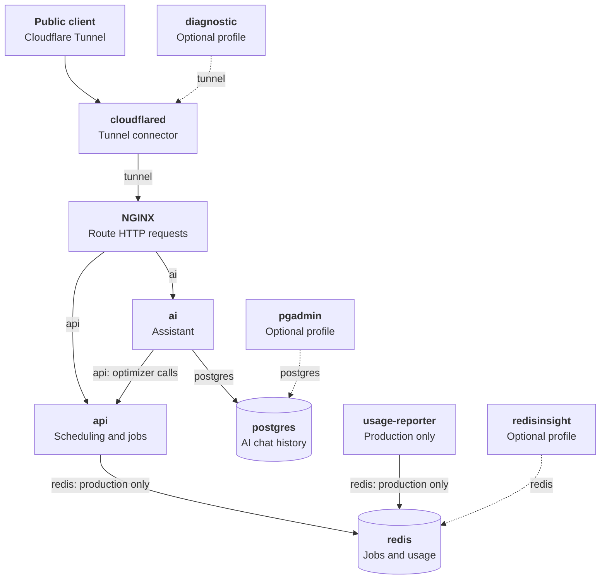

<!-- This file is mostly AI generated. -->

# Backend Containers and Networks

The production backend Compose variant uses five private networks, while the
memory variant uses four. Both connect services by name.
Docker assigns their addresses. Only the optional inspection UIs publish ports,
and those bind to host loopback. The frontend is deployed separately.

Solid lines show normal traffic. Dotted lines show optional inspection or
diagnostic profiles. The `api` and `ai` labels are distinct networks even though
both services use the same image. In the memory Compose variant, the API keeps
jobs in process, so Redis, RedisInsight, and the usage reporter are absent.

## NGINX routing

The Tunnel hostname points to `http://nginx:8080`. NGINX applies these rules
from [its configuration](../../../docker/nginx.backend.conf):

| Incoming path | Upstream | Path sent upstream |
| --- | --- | --- |
| `/ai/…` | `ai:8001` | `/…` (`/ai/` is replaced by `/`) |
| Every other path | `api:8000` | Unchanged |

NGINX sets `X-Forwarded-For` to Cloudflare's `CF-Connecting-IP`, falling back
to the direct peer address when that header is absent. The API and AI trust
proxy headers from local containers, so this deployment assumes those
containers are trusted. Neither service publishes its port to the host.
