# Build a Real Schedule

This guide rebuilds the bundled, anonymized 87-person ward schedule for
November 2025 entirely through the running web UI, starting from an empty
schedule. It is validated end-to-end: after the steps below, **Save and Load →
Download** produces a YAML file that matches the bundled example
(`large-ward-with-87-people-2025-11.yaml`), except for the `appVersion` stamp
and two group-date requests that the UI stores as single-date pairs (see
[Validate the result](#validate-the-result)).

People are anonymized as `P1` through `P87`. Group descriptions keep the
original ward's mix of English and Chinese labels.

In practice, a ward often starts with an Excel grid: people in rows, dates in
columns, and staffing levels, requests, roles, and previous-month shifts in or
around the sheet. This guide's companion files represent information
transcribed from that kind of source into the app's import formats. The YAML
download is the structured result, not the starting point for a ward.

## How the example is organized

The files preserve one ward's configuration. Use the numbers as an example to
review with your own scheduler, not as staffing targets for another ward.

- **Shift types:** `D`, `E`, and `N` separate day, evening, and night work.
  Their `+` variants have separate senior-nurse requirements. `D~`, `E~`, and
  `N~` keep student shifts distinct from counted nurse staffing.
- **Shift and people groups:** One request or rule can select several shifts or
  people. People can belong to overlapping groups, so review the rules they
  receive together.
- **Ward date groups:** `WORKDAY` and `FREEDAY` select dates for staffing and
  counts. `Freeday shift right` is reserved for a possible night-team rest rule
  and is not selected by a rule in this example.
- **November 4 split:** Nurses may change their primary Day, Evening, or Night
  team between months. `Before 4` allows a lower-penalty transition from the
  previous team. Some cross-team assignments become more costly from November
  4, once the new monthly team is expected to be established.

Weights express how strongly the optimizer scores a preference: positive
weights encourage it, negative weights discourage it, and `-inf` forbids it.
A large finite penalty is still a preference, not a prohibition. The
[Shift Requests](shift-requests.md),
[Shift Type Requirements](shift-type-requirements.md), and
[Shift Type Successions](shift-type-successions.md) pages explain how each rule
is applied. The exact finite weights are empirical priorities, not measured
clinical quantities.

## Prepare data from a ward schedule

If starting from a ward workbook instead of these supplied files:

1. Confirm the month, personnel list, roles, and daily staffing levels with
   the scheduler. Colors and abbreviations may encode group membership, but
   confirm ambiguous cases rather than inferring them from appearance.
2. Translate the ward's request notation. A `1` might mean `OFF` in one ward,
   while another uses `D`, `E`, and `N` directly. If formatting marks different
   request strengths, separate those cells before importing them.
3. Convert previous-month entries, such as `D2` or `O4`, to the history upload's
   `person,shift,repetition` rows. Check what each source abbreviation means.
4. Use the GUI to enter date groups, qualifications, staffing, and rules that
   the bulk imports do not contain. Review the result with the scheduler.

The supplied `people.txt` and CSV files have already been prepared for this
example. The app does not interpret arbitrary Excel colors or ward shorthand
on its own.

## Data files

The companion files in the `build-a-real-schedule/` directory make the large,
repetitive parts of the schedule importable in one action instead of hundreds
of cell edits:

- [`people.txt`](build-a-real-schedule/people.txt): the 87 person IDs.
- [`people-history.csv`](build-a-real-schedule/people-history.csv): previous-shift
  history for every person.
- [`shift-requests-strong.csv`](build-a-real-schedule/shift-requests-strong.csv):
  concrete person-date requests at weight `11000000000` (408 cells).
- [`shift-requests-moderate.csv`](build-a-real-schedule/shift-requests-moderate.csv):
  concrete person-date requests at weight `11000000` (90 cells).
- [`reference.yaml`](build-a-real-schedule/reference.yaml): the exact values for the
  shift types, groups, and rules that the app does not bulk-import. Create these
  in the UI, in the listed order, so the normalized YAML matches the bundled
  example.

The November 1–30 date range is entered on the Dates page in step 1; it is not
imported from a file.

## 1. Start from empty and set the dates

1. On the app home page, select **New Schedule**, then **Create empty schedule**,
   and confirm. The new schedule already includes the default *at most one shift
   per day* preference.
2. Open **Dates** and select **Set Date Range**.
3. Set the start date to `2025-11-01` and the end date to `2025-11-30` (30 days
   selected).
4. Leave **Import Taiwan holidays into date groups** unchecked; the ward defines
   its own `WORKDAY` and `FREEDAY` groups in step 5.
5. Select **Update**.

The app creates one date item per day (`01`–`30`) and the automatic groups
`ALL`, `WEEKDAY`, `WEEKEND`, and the weekday names.
For another ward or month, the Taiwan calendar import can be a starting point.
Confirm the resulting workday and freeday groups against the ward's actual
calendar before using them in staffing or fairness rules.

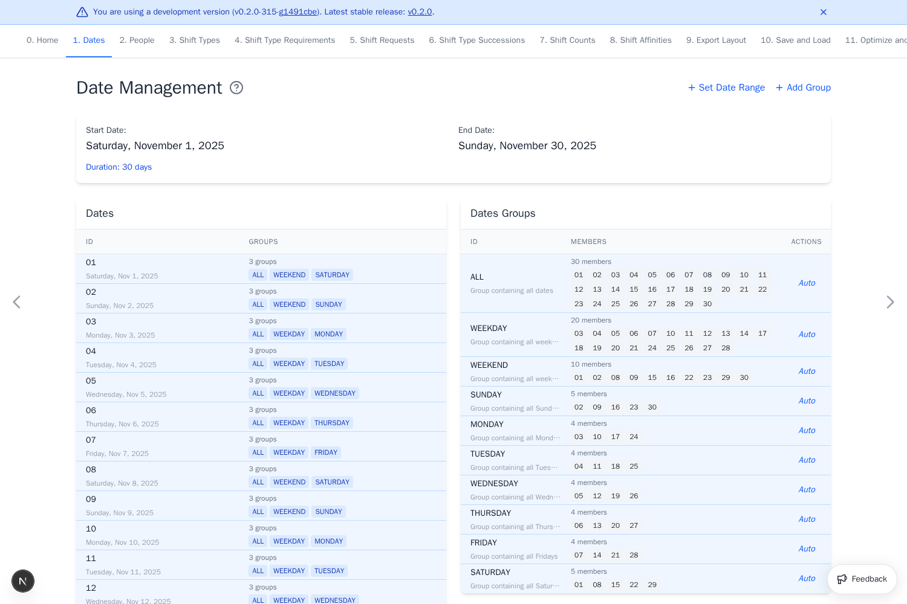

## 2. Create the shift types

Create the 11 shift types listed under `shiftTypes.items` in `reference.yaml`,
in that order: `D`, `D+`, `E`, `E+`, `N`, `N+`, `A`, `D~`, `E~`, `N~`, and `K`.
Open **Shift Types**, select **Add Shift Type**, enter the ID and description,
and select **Add**. Repeat for each shift type.

The automatic `OFF` shift type and `ALL` group are always present and cannot be
edited or deleted.

The `+` shifts have separate senior-nurse coverage requirements in step 9.
The ordinary `D`, `E`, and `N` slots can be filled by qualified non-student
nurses, including seniors. The `~` shifts are learning assignments. Students
do not count toward ordinary staffing. `K` means `上課` (required class
attendance), with `K` recalling the Mandarin initial sound `ㄎ` of `課`. It is
not ward staffing. These symbols are names for rules, so clarify a ward's
terminology before assigning them a meaning.

Then create the 5 shift-type groups listed under `shiftTypes.groups` in
`reference.yaml`, in that order: `Day`, `Day (w/o A, D~, K)`, `Evening`,
`Night`, and `Student Shifts`. Select **Add Group**, enter the ID and
description, select the member shift types, and select **Add**.

The broad `Day` group includes `A`, `D~`, and `K` because all occupy daytime
when evaluating shift succession. `Day (w/o A, D~, K)` contains only `D` and
`D+`, but no rule in this example currently selects that narrower group. It is
retained as part of the ward's configuration. Groups can represent different
questions and need not share identical membership.

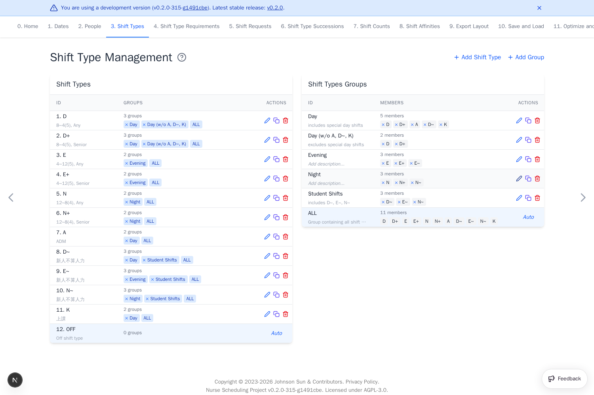

## 3. Add the 87 people

1. Open **People** and select **Upload People**.
2. Choose `people.txt`.

The upload adds all 87 people (`P1`–`P87`). Each appears under the automatic
`ALL` group.

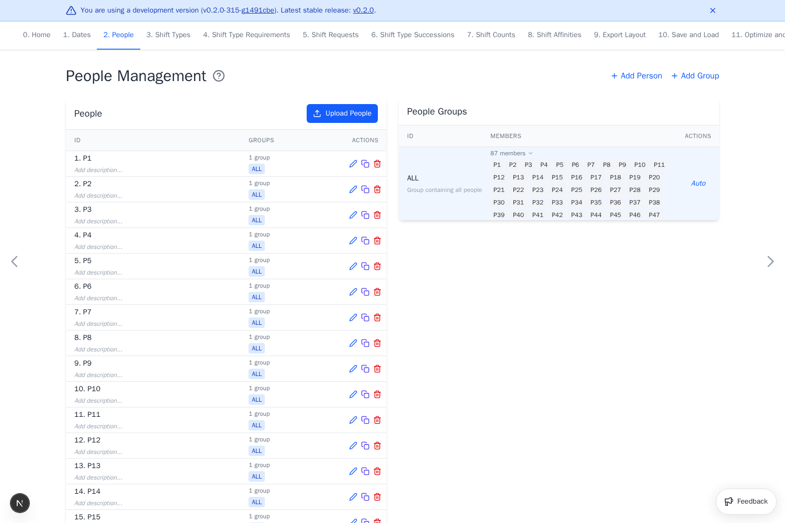

## 4. Add previous-shift history

1. Open **Shift Requests** and select **Quick Add Preference**.
2. Select **Upload People History (shorthand)** and choose `people-history.csv`.

Each row is `person,shift,repetition`. The history fills the `H-1`–`H-6`
columns so succession rules can reach back before November 1. A source workbook
may need abbreviation and repetition cleanup before it matches this format.

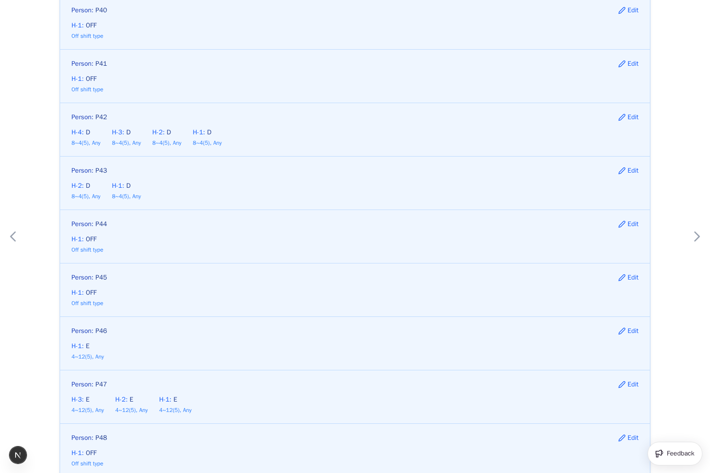

## 5. Create the date groups

The November 1–30 range is already set. Create the five ward date groups listed
under `dateGroups` in `reference.yaml`:

| ID | Members |
| --- | --- |
| `WORKDAY` | 20 workdays |
| `FREEDAY` | 10 freedays |
| `Freeday shift right` | 9 days |
| `Before 4` | `01`, `02`, `03` |
| `After 4` | `04`–`30` |

Open **Dates**, select **Add Group**, enter the ID and description, and select
the member dates (the **List view** checkbox list is easiest for many members).
Keep the creation order from `reference.yaml`.

`FREEDAY` contains the ten weekends in this month. `Freeday shift right`
contains the following dates for nine of them because November 30 falls at
the end of the schedule. A night shift crosses midnight, so an ordinary
calendar weekend may not give a night worker the same usable rest as a day
worker. The shifted group records a possible way to evaluate those days, but
this example intentionally does not connect it to an optimization rule. Keep
the basic schedule working before adding that advanced refinement.

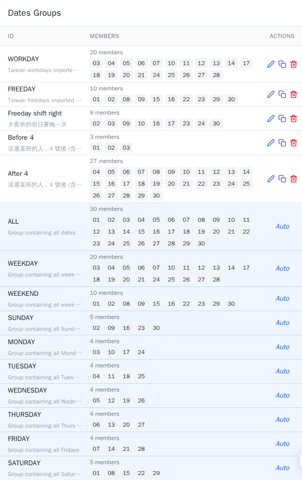

## 6. Create the people groups

Create the 13 ward people groups listed under `peopleGroups` in
`reference.yaml`, in that order: `Day People w/o A`, `Day People`,
`Evening People`, `Night People`, `Prev Day People w/o A`, `Prev Evening
People`, `Prev Night People`, `All Nurses w/o Students`, `Senior Nurses`,
`Head Nurses`, `Super Junior Nurses`, `Admin People`, and `Students`.

Open **People**, select **Add Group**, enter the ID and description, and select
the member people from `reference.yaml`. Groups may overlap; the automatic
`ALL` group always holds everyone.

Current Day, Evening, and Night groups represent primary teams for November.
The `Prev` groups represent previous-month teams and apply transition requests
early in the month. `Senior Nurses`, `Admin People`, and `All Nurses w/o
Students` select who can satisfy corresponding staffing requirements. Confirm
membership with the ward. An anonymized ID alone does not establish a role.

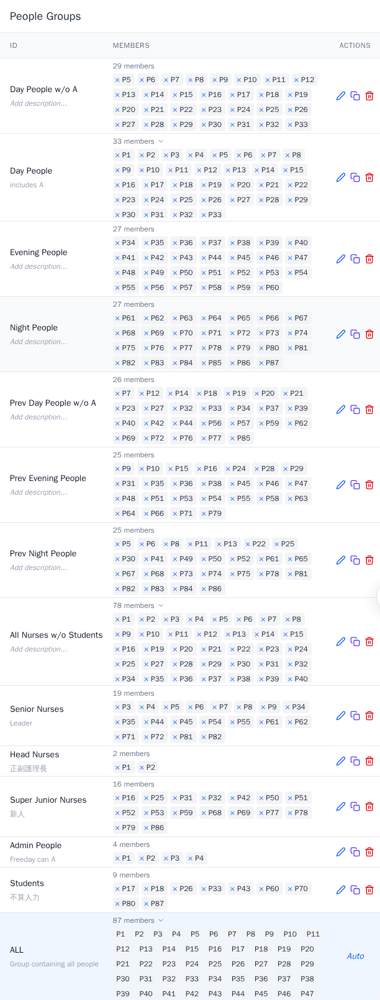

## 7. Import the concrete requests

The two CSVs hold every request for a specific person on a specific date.
Because a CSV upload applies one weight to every non-empty cell, the cells are
split by weight into two uploads.

1. Open **Shift Requests** and select **Quick Add Preference**.
2. Set **Weight** to `11000000000`, select **Upload Shift Requests**, and choose
   `shift-requests-strong.csv` (408 cells).
3. Set **Weight** to `11000000`, then select **Upload Shift Requests** and choose
   `shift-requests-moderate.csv` (90 cells).

Each row is one person; the columns line up with the displayed dates. Blank
cells are ignored, so the two uploads do not conflict.

The `11000000000` requests form a very strong, near-hard preference tier. The
`11000000` requests are a strong but lower-priority tier. These values are
empirical: their relative priority matters more than their exact digits. The
leading `11` makes the request tiers easy to find and retune together. In a
new ward, first confirm how the source marks each tier, then retune weights
against staffing and other rules after a trial optimization.

## 8. Add the group and person requests

Create the 33 shift requests listed under `shiftRequests` in `reference.yaml`
with **Quick Add Preference**. These are the requests the CSVs do not cover:

- 25 group-level requests (24 ward groups plus the `ALL` group), such as *Day
  People → Evening on `Before 4` and `After 4` at weight `-100000000`* and *Day
  People w/o A → `A` on `ALL` at weight `-inf`*.
- 8 person-level requests on `ALL` for `P1`–`P3`, such as *`P1` → `D` and `OFF`
  on `ALL`*.

For each entry, choose the shift type, set the weight (use the `-inf` / `inf`
controls for infinite weights), and click the group-row × date-column cell.
Red cells show discouraged or forbidden work.

The group requests discourage cross-team work with finite negative weights.
Early-month switching remains possible at a lower penalty while people move
from previous-month to current-month teams. Some penalties become much
stronger after November 3. The `-inf` requests prohibit specific combinations,
including student shifts for `All Nurses w/o Students`. Check the exact
weights and date selectors in `reference.yaml` before adapting them. `K` is
discouraged for everyone by default. Stronger individual requests in the CSV
mark the people and dates with required class attendance.

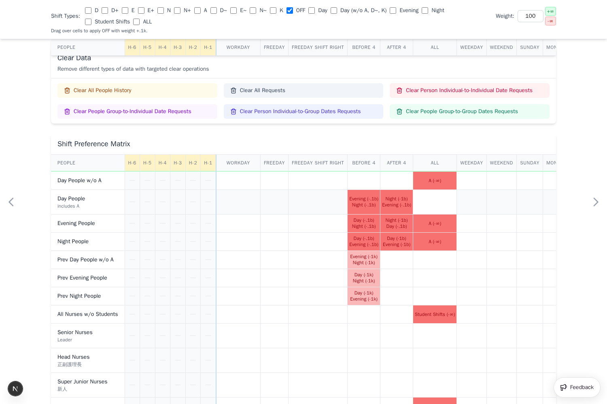

## 9. Add the staffing requirements

Create the 8 shift-type requirements listed under `requirements` in
`reference.yaml`. Open **Shift Type Requirements** and select **Add
Requirement** for each:

- Required and, where present, preferred counts, for example *`N` requires 12,
  prefers 13, qualified `All Nurses w/o Students`, dates `ALL`, weight
  `-1000000000000`*.
- Leave the weight at `-1` for the senior and admin minimums.

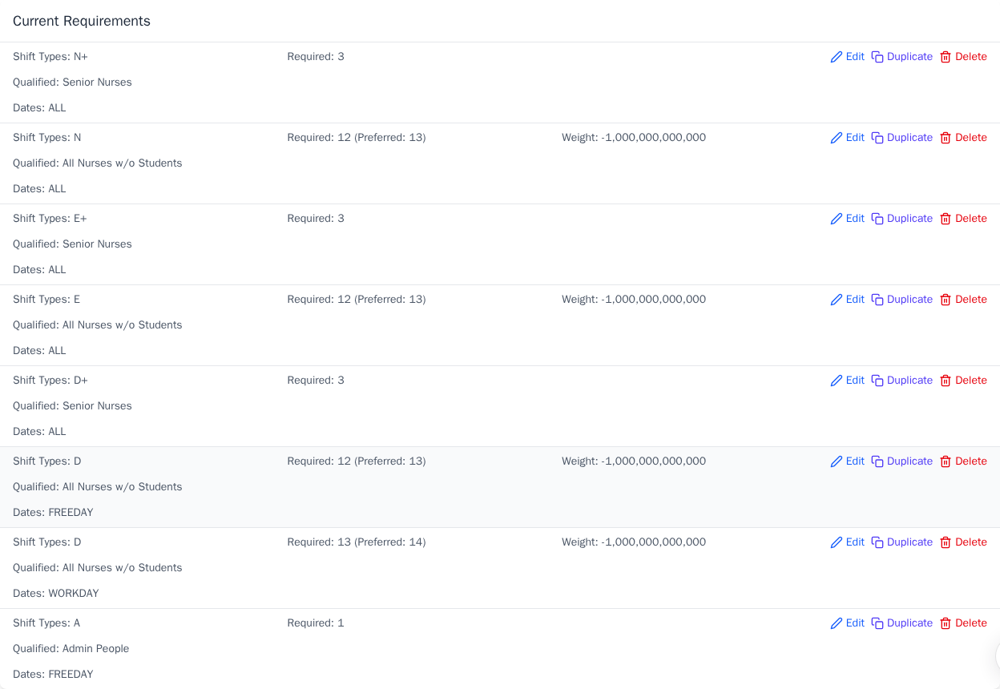

The `D`, `E`, and `N` requirements count non-student nurses. They use a hard
minimum one below the preferred level, with a very large penalty for missing
the preferred person. This gives the solver a narrow escape hatch if desired
staffing cannot be reached. `D` has separate workday and freeday levels because
ward demand can differ. The `+` requirements count senior nurses, and the
freeday `A` requirement uses `Admin People`. The headcounts come from the ward,
not from a universal staffing formula. The `+` slots are separate from the
ordinary slots: `N+` requiring three seniors is in addition to the `N`
minimum of 12, not part of that 12.

The GUI warns that 140 date/shift-type pairs have no fixed staffing
requirement: `A` on `WORKDAY`, plus `D~`, `E~`, `N~`, and `K` on `ALL`. Special
assignments need not have a daily headcount, but an undefined pair can be used
in unexpected quantities. Review whether other requests or rules adequately
control each one before optimizing. Add a requirement if they do not.

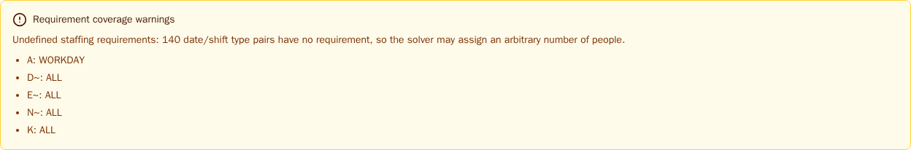

## 10. Add the succession rules

Create the 14 shift-type successions listed under `successions` in
`reference.yaml`. Open **Shift Type Successions** and add each pattern for
people `ALL` on dates `ALL`. These forbid sequences such as *Day then Night*
(weight `-inf`), limit consecutive shifts, and discourage *Night → Day*
(weight `-1000000000`).

Previous-shift history from step 4 lets a pattern crossing November 1 be
checked. The three two-shift transitions with `-inf` prevent combinations
with insufficient rest. Six consecutive working shifts are also prohibited.
Other transitions, such as Night then Day, may be physically possible but
disrupt the sleep cycle, so this ward applies a strong finite penalty. Smaller
weights discourage fragmented `OFF` days, long runs of work or leave, and
repeated switching. Positive weights favor consecutive shifts in the same
category or consecutive `OFF` days. The strength of sleep-cycle rules depends
on ward policy.

## 11. Add the workload counts

Create the 3 shift counts listed under `shiftCounts` in `reference.yaml`. Open
**Shift Counts** and add each, counting `OFF` with the expression `|x - T|^2`
at weight `-1000`:

- `All Nurses w/o Students` on `ALL`, target `11`.
- `Day People` and `Evening People` on `FREEDAY`, target `4`.
- `Night People` on `FREEDAY`, target `4`.

Each rule scores every selected person's own count. The squared expression
penalizes a larger gap from the target more strongly, promoting a fairer
distribution of days off. `11` and `4` are empirical starting points, not
fixed labor-policy constants. Inspect the resulting distribution and adjust
the targets for the month, staffing levels, and the ward's seniority policy.
The example does not include a rule comparing senior and junior days off. Add
one only if the ward asks for that policy.

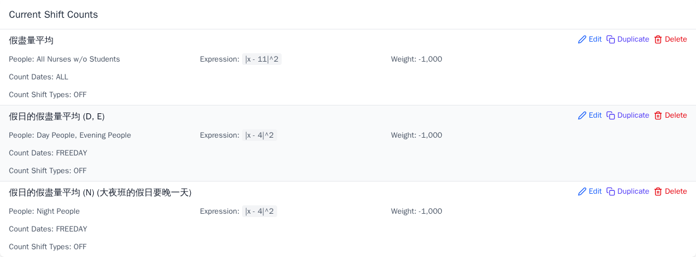

## Validate the result

1. Open **Save and Load** and select **Download**.
2. Compare the downloaded YAML to the bundled example. The `apiVersion`,
   `description`, `dates`, `people`, and `shiftTypes` sections match, and every
   preference matches once you group requests by person, shift type, and
   weight.

The download differs from the bundled example only in two ways, both expected:

- `appVersion` is stamped with the running app version.
- Two group-date requests (*Day People → Evening* and *Evening People → Day*,
  each on `Before 4` and `After 4`) are stored as two single-date requests
  instead of one multi-date request. The app merges concrete date items
  automatically but not date-group items, so the UI represents each as a
  pair. The scheduling effect is identical.

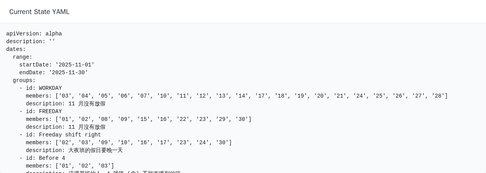

## Next steps

Before optimizing, have the scheduler review the roster and group memberships,
the dates in `WORKDAY` and `FREEDAY`, previous-shift history, staffing levels,
and every `-inf` rule. Also confirm which finite preferences may be traded off
when the schedule is crowded. Review every staffing coverage warning.

Build a new ward's schedule in stages: first confirm staffing, qualifications,
mandatory assignments, and rest constraints. Then add requests, team
preferences, and basic fairness. Run [Optimize and
Export](optimize-and-export.md), inspect assignments and `OFF` counts with the
scheduler, and tune the finite weights or targets. Add advanced rules, such as
night-team shifted freedays, only after the basic schedule works well.

For a recurring ward, update the dates, roster, history, and imports for the
new period, then review every group and rule again.
