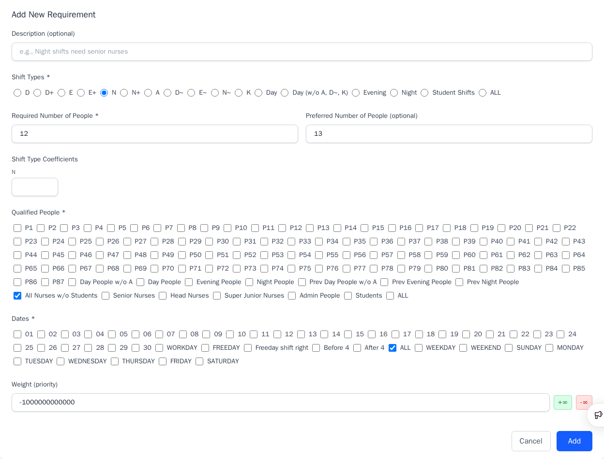
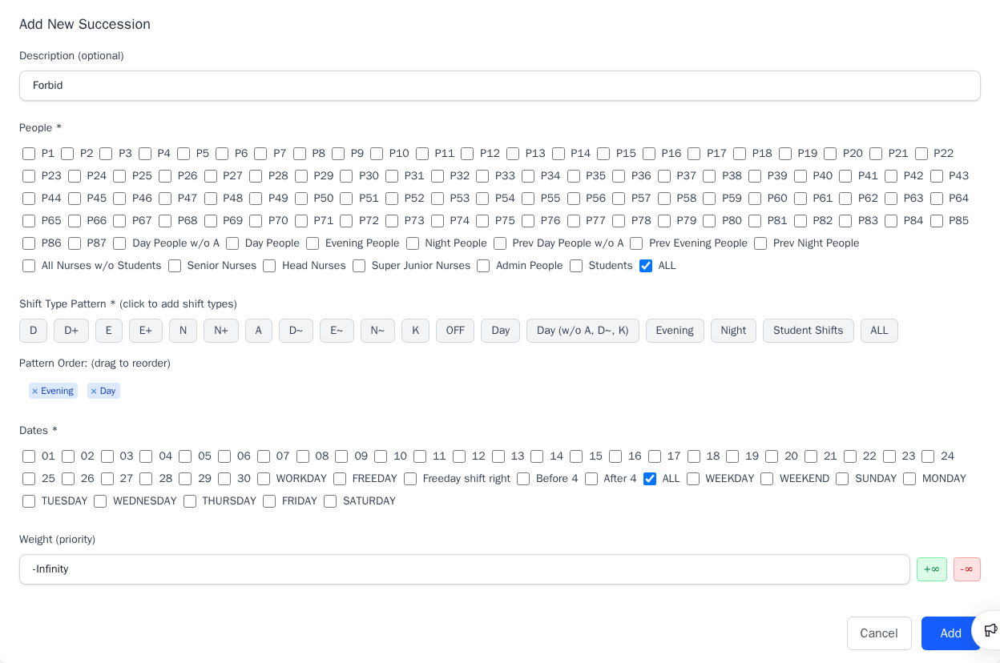

# Build a Real Schedule

This guide explains both **how** to rebuild the bundled, anonymized 87-person
ward schedule for November 2025 in the web UI and **why** the ward chose its
groups, staffing levels, requests, and weights. The guide focuses on the
rationale behind each step, including the ward's
workload, staff qualifications, rest policies, and preference priorities. These
explanations help users and AI assistants adapt the configuration to another
ward. The steps start from an empty schedule.
**Save and Load → Download** produces the same scheduling data as the bundled
example (`large-ward-with-87-people-2025-11.yaml`). The exported YAML is not
byte-for-byte identical: the running app stamps `appVersion` and can write
requests or fields in a different order. See
[Validate the result](#12-validate-the-result).

People are anonymized as `P1` through `P87`. Most group descriptions keep the
original ward's mix of English and Chinese labels. The imported calendar groups
use the app's descriptions.

## Input and output

The complete ward workflow starts with an **unfilled monthly schedule**,
usually an Excel workbook containing dates, people, staffing requirements,
and shift requests, with daily assignments not yet filled in. It may also
contain staff roles and previous-month shifts. Each ward uses its own layout
and notation, and may provide additional requirements as text.

This example starts with information already extracted from that source.
It focuses on constructing the scheduling configuration through the GUI and
using it to generate an optimized schedule. Extracting an arbitrary ward
workbook and converting the result into the ward's expected workbook are
outside the walkthrough's scope. The following summary explains how the
example's inputs and outputs relate to those tasks.

- **Dates, roles, and staffing:** Read the scheduling period, staff qualifications,
  monthly primary shifts, and required daily counts from the workbook and any
  accompanying instructions. If a cell color identifies a staff role, ask the
  scheduler which role that color denotes before assigning qualifications.
  If a heading says “Day,” ask whether it identifies nurses whose monthly
  primary shift is Day or a staffing count for daily Day assignments.
  Enter the confirmed values and the ward's rules through the GUI.
  `reference.yaml` supplies the values for this example.
- **People:** Copy the roster column, remove its heading and blank rows, and
  save one person per line as text or a single-column CSV without a header.
  `people.txt` emulates this extracted roster with anonymized IDs `P1`–`P87`.
- **Previous-shift history:** Convert the preceding shifts into
  `person,shift,repetition` rows, as in `people-history.csv`. Depending on the
  source notation, regular-expression replacement may handle this conversion
  without custom code. For example, if `4N` means four consecutive Night
  shifts for `P8`, convert it to `P8,N,4`; if `O` means `OFF`, convert `4O`
  to `P8,OFF,4`. Editors such as Notepad++ and VS Code support these
  replacements. The suitable method depends on the workbook's notation and
  the user's tools.
- **Shift requests:** Extract the person-by-date requests and separate them
  by strength. Excel text search, formatting search, or filters may help.
  For example, if red and black `1` cells both request `OFF` but carry
  different strengths, search by font color to separate them. Confirm what
  each mark and color means with the scheduler. Save each strength in a
  separate CSV, preserving person rows and date columns and leaving other
  cells blank, so each GUI upload can apply its own weight. The supplied
  strong and moderate request CSVs emulate this extraction. The app does
  not interpret Excel colors or ward shorthand.
- **Configuration and optimized schedule:** The GUI exports the configuration
  as YAML. The optimizer uses it to produce daily assignments. In the real
  workflow, these assignments must then be converted back to the ward's
  workbook layout and shift notation. For example, if the ward labels
  ordinary, senior, and student Day assignments as `D`, map `D`, `D+`, and
  `D~` to `D`. The solver distinguishes these shift types to enforce
  qualifications and staffing counts. This final conversion is outside the
  tutorial's scope and is skipped here. The tutorial ends when the optimized
  schedule satisfies the hard constraints and the scheduler considers its
  staffing, requests, and distribution of work and rest acceptable.

## Terminology

These terms follow the order of the GUI tabs:

- **Date range:** The period for which daily assignments are generated.
- **Date group:** A named set of dates for applying shared rules, such as
  workday staffing requirements or counting days off on freedays.
- **People:** The individuals who receive daily assignments.
- **People group:** A named set of people for applying shared qualifications
  or preferences. A person may belong to several groups.
- **Shift type:** A category of daily assignment, such as Day work or a day off.
- **Shift-type group:** A named set of shift types for applying shared rules,
  such as rest requirements after daytime work.
- **Shift-type requirement:** Required and optional preferred staffing counts
  for selected shifts and dates, with a list of people qualified to fill them.
- **People history:** Daily shifts immediately before the date range, used
  to check rest and work sequences across the month boundary.
- **Shift request:** A rule requiring, forbidding, rewarding, or discouraging
  selected assignments for a person or people group on selected dates.
- **Shift-type succession:** A rule allowing, forbidding, rewarding, or
  penalizing a sequence of shifts, such as Evening followed by Day.
- **Shift count:** A rule on the number of selected assignments per person,
  such as a target number of days off.
- **Shift affinity:** A rule encouraging or discouraging selected people
  working selected shifts on the same date. It can express preferences for
  working together or separately. This example uses no affinity rules.
- **Preference rule:** The app's general term for scheduling constraints and
  weighted objectives, including staffing requirements, requests, successions,
  counts, and affinities. Some are mandatory; others can be traded off during optimization.

## Ward conventions

These describe the ward's source information and monthly staffing practice,
rather than items created on a GUI tab.

- **Unfilled monthly schedule:** The ward's source workbook before daily
  assignments are completed. It contains dates, people, staffing requirements,
  and shift requests, and may include staff roles and previous-month shifts.
  Its layout and notation vary by ward; written instructions may supplement it.
- **Monthly primary shift:** Day, Evening, or Night designated as a nurse's
  primary shift category for the month. Daily assignments may differ to meet
  staffing needs or individual requests. For example, a nurse whose monthly
  primary shift is Night may work a Day shift when necessary.

- **Shift transition buffer:** The first few days of a month when a nurse
  changes monthly primary shift. Working the current primary shift immediately
  is preferred. When this is not possible, lower penalties allow continued
  work on the previous primary shift while sleeping hours adjust. This example
  uses November 1–3 (`Before 4`).

## Data files

The companion files in the `build-a-real-schedule/` directory make the large,
repetitive parts of the schedule importable in one action instead of hundreds
of cell edits:

- [`people.txt`](build-a-real-schedule/people.txt): the 87 person IDs.
- [`people-history.csv`](build-a-real-schedule/people-history.csv): previous-shift
  history for every person.
- [`shift-requests-strong.csv`](build-a-real-schedule/shift-requests-strong.csv):
  concrete person-date requests at weight `11b` (408 cells).
- [`shift-requests-moderate.csv`](build-a-real-schedule/shift-requests-moderate.csv):
  concrete person-date requests at weight `11m` (90 cells).
- [`reference.yaml`](build-a-real-schedule/reference.yaml): the exact values,
  including descriptions, for the shift types, groups, and rules that the app
  does not bulk-import. Follow the guide's tab order and the listed order for
  shift types, groups, staffing requirements, successions, and counts. The app
  sorts shift requests and may write fields in a different order when it
  exports YAML.

The November 1–30 date range is entered on the Dates page in step 1; it is not
imported from a file.

## 1. Start from empty and set the dates

1. On the app home page, select **New Schedule**, then **Create empty schedule**,
   and confirm. The new schedule already includes the default *at most one shift
   per day* preference.
2. Open **Dates** and select **Set Date Range**.
3. Set the start date to `2025-11-01` and the end date to `2025-11-30` (30 days
   selected).
4. Keep **Import Taiwan holidays into date groups** checked. This creates
   `WORKDAY` and `FREEDAY` with the descriptions in `reference.yaml`.
5. Select **Update**.

The app creates one date item per day (`01`–`30`), the automatic groups
`ALL`, `WEEKDAY`, `WEEKEND`, and the weekday names, plus the imported Taiwan
`WORKDAY` and `FREEDAY` groups.
For another ward or month, the Taiwan calendar import can be a starting point.
Confirm the resulting workday and freeday groups against the ward's actual
calendar before using them in staffing or fairness rules.


## 2. Create the date groups

The November 1–30 range is already set. The Taiwan calendar import creates
`WORKDAY` and `FREEDAY`. Create the other three groups listed under
`dateGroups` in `reference.yaml`:

- **`WORKDAY`**
  - **Members:** 20 workdays.
  - **Purpose:** Imported by **Import Taiwan holidays into date groups**. Contains weekdays excluding Taiwan holidays, plus make-up workdays, within the selected date range. Use this group when staffing requirements differ between workdays and freedays.
  - **Creation:** Created by **Import Taiwan holidays into date groups**.

- **`FREEDAY`**
  - **Members:** 10 freedays.
  - **Purpose:** Imported by **Import Taiwan holidays into date groups**. Contains weekends and Taiwan holidays, excluding make-up workdays, within the selected date range. Use this group for freeday staffing requirements and to balance days off on these dates.
  - **Creation:** Created by **Import Taiwan holidays into date groups**.

- **`Freeday shift right`**
  - **Members:** 9 days.
  - **Purpose:** A Night nurse must prepare or sleep before the next midnight shift. Shifting freedays one date later accounts for this timing when evaluating weekend rest. Using this group to optimize Night nurses' weekend rest is an advanced quality-of-life addition outside the scope of this example. It may be useful when the ward requests this policy.
  - **Creation:** Create manually with **Add Group**.

  In this ward's notation, `N Friday` starts at 00:00 on Friday and ends that
  morning. With `N Friday → OFF Saturday → OFF Sunday → N Monday`, the nurse
  has much of Friday free but must sleep or prepare on Sunday evening for Monday
  at 00:00. The nurse has Friday daytime and Saturday available, but must prepare for
  work on Sunday evening.

  With `N Saturday → OFF Sunday → OFF Monday → N Tuesday`, the nurse can use
  Saturday after work, enjoy Sunday, and prepare or sleep on Monday before the
  Tuesday midnight shift. `Freeday shift right` contains each calendar freeday
  shifted one date later. November 30 is omitted because December 1 is outside
  this schedule. Optimizing Night nurses' rest with this shifted group is an advanced
  quality-of-life addition outside the scope of this example. It may be useful
  when the ward requests this rest policy, after the basic requirements produce
  a usable schedule.

When the monthly primary shift changes between months, the nurse needs time
to adjust sleeping hours. A nurse whose monthly primary shift changes from
Night in October to Day in November may continue working Night during the
first few days of November.

- **`Before 4`**
  - **Members:** `01`, `02`, `03`.
  - **Purpose:** November 1–3 form a transition buffer when the monthly primary shift changes. Lower penalties allow a nurse to work the previous month's primary shift instead of the current month's primary shift while adjusting sleeping hours.
  - **Creation:** Create manually with **Add Group**.

- **`After 4`**
  - **Members:** `04`–`30`.
  - **Purpose:** From November 4, nurses are expected to work their current monthly primary shift. After the transition buffer, higher penalties are applied to shift types outside the nurse's monthly primary shift to discourage further changes in sleeping hours.
  - **Creation:** Create manually with **Add Group**.

Open **Dates**, select **Add Group**, enter the ID and description from
`reference.yaml`, switch the **Members** selector to **List view**, and check
the listed dates. This is easier for many members than the calendar view.
Hold the mouse button down and drag across adjacent checkboxes to select a run
of dates quickly. Check the selected members before saving.
Create `Freeday shift right`, `Before 4`, and `After 4` in that order.

`FREEDAY` contains the ten weekends in this month. There is no special holiday
in this November range, but confirm that the imported calendar matches the
ward's actual free days before using it elsewhere.


## 3. Add the 87 people

1. Open **People** and select **Upload People**.
2. Choose `people.txt`. It has one person ID per line and no heading. Wait for
   the upload confirmation before leaving the page.

The upload adds all 87 people (`P1`–`P87`). Each appears under the automatic
`ALL` group.


## 4. Create the people groups

Create the 13 ward people groups listed under `peopleGroups` in
`reference.yaml`, in that order: `Day People w/o A`, `Day People`,
`Evening People`, `Night People`, `Prev Day People w/o A`, `Prev Evening
People`, `Prev Night People`, `All Nurses w/o Students`, `Senior Nurses`,
`Head Nurses`, `Super Junior Nurses`, `Admin People`, and `Students`.

Shift requests can select individual person IDs, such as `P1`, or people
groups, such as `Night People`. A staffing requirement's qualified-people
list can likewise select people or people groups.

Open **People**, select **Add Group**, enter the ID and description, and select
the member people from `reference.yaml`. Groups may overlap; the automatic
`ALL` group always holds everyone. In the checkbox list, hold the mouse button
down and drag across adjacent people to select a run quickly. Review the
result before saving, especially where groups overlap.

- **`Day People w/o A`**
  - **Purpose:** Having Day as the monthly primary shift does not itself qualify a nurse for administrative work. Excluding administrative roles identifies the Day nurses who should not receive `A`.

- **`Day People`, `Evening People`, `Night People`**
  - **Purpose:** These groups contain nurses with Day, Evening, or Night as their current monthly primary shift. Preferences discourage shift types outside the monthly primary shift to reduce changes in sleeping hours. Their finite penalties still allow other assignments when needed for staffing or individual requests. `Day People` also includes administrative staff.

- **`Prev Day People w/o A`, `Prev Evening People`, `Prev Night People`**
  - **Purpose:** These groups record each nurse's previous monthly primary shift. As with `Freeday shift right`, they support an advanced optimization refinement. Nurses should preferably work their current primary shift immediately. If staffing or requests prevent this during November 1–3, the previous-month primary-shift rules slightly favor continuing the previous shift over another non-primary shift. For example, a nurse changing from Night to Day should work Day when possible. Otherwise, these rules favor Night over Evening. This allows flexibility without requiring a delayed transition.

- **`All Nurses w/o Students`**
  - **Purpose:** Students are learning alongside nurses and are not counted toward the nurse workforce needed for daily staffing. This group selects qualified nurses for the ordinary `D`, `E`, and `N` staffing requirements.

- **`Senior Nurses`**
  - **Purpose:** Each of `D+`, `E+`, and `N+` requires three senior nurses in addition to ordinary staffing. Restricting `D+`, `E+`, and `N+` to this group ensures that junior nurses cannot fill the senior slots.

- **`Head Nurses`**
  - **Purpose:** This group contains the head nurse `P1` and deputy head nurse `P2`. No rule selects this group in the example.

- **`Super Junior Nurses`**
  - **Purpose:** Some wards distinguish newly hired nurses (`新人`) from other junior nurses and students when setting qualifications or workloads. Rules for this additional category are outside the scope of this example.

- **`Admin People`**
  - **Purpose:** Administrative shift `A` is usually assigned to head nurses and the most senior staff among the senior nurses. This group identifies people qualified for `A`. The example sets an explicit `A` staffing requirement on freedays; workday `A` assignments are governed by shift requests rather than a daily staffing count. Shift requests also forbid Evening and Night assignments for this group.

- **`Students`**
  - **Purpose:** Students learn alongside nurses and do not count toward the nurse workforce needed for daily staffing. This group applies workday learning-shift preferences and freeday `OFF` preferences to all students.

A nurse in both `Senior Nurses` and `Night People` is eligible for senior
staffing slots and receives preferences for nurses whose monthly primary
shift is Night.

Confirm each nurse's role, seniority, and monthly primary shift with the ward.
A roster may list head and deputy head nurses first, followed by administrative,
Day, Evening, and Night staff. Staff within each block may appear in descending
seniority. A cell color or `*` after a name may mark a senior nurse. These
conventions vary by ward, so confirm them before creating the groups.

**Reuse this configuration for next month.**

1. Before importing the new roster, edit each previous-month group
   (`Prev Day People w/o A`, `Prev Evening People`, and `Prev Night People`).
   Use **Apply selection from another group → Replace** to copy members from
   `Day People w/o A`, `Evening People`, or `Night People`, respectively,
   then save. This preserves the previous month's primary-shift memberships.
2. Import the new roster. Existing people follow the imported order, new
   people are added, and names absent from the file move to the end. Review
   the upload message and delete people who have left the ward.
3. Edit the existing `Day People`, `Evening People`, and `Night People`
   groups for the new month. Add new staff to their role and primary-shift
   groups. The imported roster is usually ordered by current monthly primary shift,
   with Admin, Day, Evening, and Night staff in blocks. This makes current
   groups easy to select by dragging across checkboxes. Copying the previous
   groups before import avoids reconstructing them after their members are
   scattered across the new order.

Because these groups keep their IDs, existing preference rules continue
to select them.


## 5. Create the shift types

Create the 11 shift types listed under `shiftTypes.items` in `reference.yaml`,
in that order: `D`, `D+`, `E`, `E+`, `N`, `N+`, `A`, `D~`, `E~`, `N~`, and `K`.
Open **Shift Types**, select **Add Shift Type**, enter the ID and description,
and select **Add**. Repeat for each shift type.

The automatic `OFF` shift type and `ALL` group are always present and cannot be
edited or deleted.

The ward usually speaks in four broad categories: Day, Evening, Night, and
administrative work. Separate solver shift types let the same time of day have
different qualification and staffing rules. For example, one total Day count
would not guarantee senior coverage, and counting a student as an ordinary
Day nurse would overstate available staffing.

The `+` shifts have separate senior-nurse coverage requirements in step 6.
The ordinary `D`, `E`, and `N` slots can be filled by qualified non-student
nurses, including seniors. The `~` shifts are learning assignments. Students
do not count toward ordinary staffing. `K` means `上課` (required class
attendance), with `K` recalling the Mandarin initial sound `ㄎ` of `課`. It is
not ward staffing.

Other wards may also need `D-`, `E-`, and `N-` for easier or junior-only slots,
or `A+`, `A-`, and `A*` for different administrative roles or qualifications. Those types are
not present in this example. A suffix has no automatic meaning to the solver:
the staffing requirement and qualified-people group give it meaning.
Confirm each type's meaning and specify its qualified people in the staffing
requirements.

Ask what a ward means by “D” or “Day” before mapping its language to YAML.
It might mean the whole daytime category, the ordinary `D` slot, the senior
`D+` slot, or Day as a nurse's monthly primary shift. The same ambiguity can apply to
Evening and Night. If the distinction changes staffing, requests, or rest
rules, confirm it with the user rather than guessing from the symbol.

Then create the 5 shift-type groups listed under `shiftTypes.groups` in
`reference.yaml`, in that order: `Day`, `Day (w/o A, D~, K)`, `Evening`,
`Night`, and `Student Shifts`. Select **Add Group**, enter the ID and
description, select the member shift types, and select **Add**.

Define each shift-type group according to the policy it represents:

`Day` contains `A`, `D`, `D+`, `D~`, and `K`, while
`Day (w/o A, D~, K)` contains only `D` and `D+`.

- `Day`, `Evening`, and `Night` collect assignments with similar working
  hours. Administrative shift `A`, class `K`, and learning shift `D~` are
  included in `Day` when defining rest policies with shift-type successions.
  For example, the forbidden `Evening → Day` succession also forbids
  `Evening → K`, since class attendance occupies the following daytime.
- `Day (w/o A, D~, K)` identifies only ordinary and senior Day staffing.
  It excludes administrative work, classes, and student learning. This
  distinction allows a rule to select only `D` and `D+`. The current example
  intentionally uses the broader `Day` group in its requests and has no
  rule selecting this narrower group.
- `Student Shifts` collects `D~`, `E~`, and `N~` so one request can
  forbid all three learning shifts for non-student nurses.

For example, `D~` belongs to both `Day` and `Student Shifts`. The `Day`
group includes it in succession rules, while `Student Shifts` restricts it
to students through shift requests.


## 6. Add the staffing requirements

**Constraint priorities.** This guide uses the following terms:

- A **hard constraint** must be satisfied by every feasible schedule. For
  example, a required staffing minimum is a hard constraint. A shift request
  with weight `-inf` forbids that assignment.
- A **soft constraint** changes the objective score through a finite weight.
  Violating it is allowed. The optimizer selects assignments that maximize
  the combined score while satisfying all hard constraints.
- A **near-hard constraint** is a soft constraint with a large penalty for
  violations. It represents a requirement the ward expects to satisfy, with
  violations allowed when necessary. There is no fixed numerical threshold:
  its priority depends on the other weights and the number of scored events.
  For a desired headcount `n`, setting the required count to `n - 1`, the
  preferred count to `n`, and a large shortfall penalty is one example.

Positive finite weights reward preferred assignments or patterns. Negative
finite weights penalize discouraged assignments or patterns. Their values
specify relative priorities selected through scheduling experience and
adjusted after reviewing optimization results. The
[Shift Requests](shift-requests.md),
[Shift Type Requirements](shift-type-requirements.md), and
[Shift Type Successions](shift-type-successions.md) pages explain how each rule
is scored.

Open **Shift Type Requirements** and select **Add Requirement** for each row
below, in this order. Select one **Shift Types** option, enter **Required Number
of People**, select one **Qualified People** group and one **Dates** group,
then select **Add**. Set **Preferred Number of People** and **Weight** for the
four rows that show them. The Weight input appears only when preferred and
required counts differ. Leave **Description** blank. The senior and admin
rows use the app's default weight of `-1`. Leave **Shift Type Coefficients**
blank for all eight rows.

| Shift type | Required | Preferred | Qualified people | Dates | Weight |
| --- | ---: | ---: | --- | --- | ---: |
| `N+` | 3 | — | `Senior Nurses` | `ALL` | default `-1` |
| `N` | 12 | 13 | `All Nurses w/o Students` | `ALL` | `-1t` |
| `E+` | 3 | — | `Senior Nurses` | `ALL` | default `-1` |
| `E` | 12 | 13 | `All Nurses w/o Students` | `ALL` | `-1t` |
| `D+` | 3 | — | `Senior Nurses` | `ALL` | default `-1` |
| `D` | 12 | 13 | `All Nurses w/o Students` | `FREEDAY` | `-1t` |
| `D` | 13 | 14 | `All Nurses w/o Students` | `WORKDAY` | `-1t` |
| `A` | 1 | — | `Admin People` | `FREEDAY` | default `-1` |

The same values appear under `requirements` in `reference.yaml`.



Take these counts from the ward's workbook or head nurse. Each requirement
answers two questions: how many people are needed, and who can provide that
coverage. Specify ordinary and senior slots separately so their qualification
requirements remain visible. Avoid setting shift-type requirements on shift-type groups when individual
shift types can express the staffing need. Group requirements can accidentally
count unintended shifts or overlap with individual requirements.


The `D`, `E`, and `N` requirements count non-student nurses. They use a hard
minimum one below the preferred level, making preferred staffing a near-hard
constraint. The large penalty allows a one-person staffing shortfall
when the preferred count cannot be reached, while strongly discouraging it.
Making every desired count an absolute minimum could make
an understaffed month infeasible and difficult to diagnose. The one-person gap is intended for a staffing shortage. `D` uses separate
workday and freeday requirements because the ward's workload differs. The `+` requirements count senior nurses, and the
freeday `A` requirement uses `Admin People`. The headcounts come from the ward,
not from a universal staffing formula. The `+` slots are separate from the
ordinary slots: `N+` requiring three seniors is in addition to the `N`
minimum of 12, not part of that 12.

The GUI warns that 140 date/shift-type pairs have no fixed staffing
requirement: `A` on `WORKDAY`, plus `D~`, `E~`, `N~`, and `K` on `ALL`. These
assignments have no fixed daily count. Check whether the shift requests and
other rules sufficiently restrict who receives them and on which dates.
Add staffing requirements if the ward needs a daily count.


## 7. Add previous-shift history

1. Open **Shift Requests** and select **Quick Add Preference**.
2. Select **Upload People History (shorthand)** and choose `people-history.csv`.
   Wait for the confirmation that 87 history entries were processed before
   continuing. Keep **Quick Add Preference** open for the next step.

Each row is `person,shift,repetition`. The history fills the `H-1`–`H-6`
columns with shifts before November 1. Succession rules use these entries
to check sequences that begin in the previous month. Without this history, the solver cannot check a forbidden `Evening → Night`
transition or a six-day work run that starts in October and ends in November. `H-1` is October 31, the day immediately before this schedule.


## 8. Import the concrete requests

The two CSVs hold every request for a specific person on a specific date.
A CSV upload gives every non-empty cell the selected weight, so import
each strength tier separately. Blank cells have no effect.

1. Open **Shift Requests** and select **Quick Add Preference** if the quick-add
   panel is closed. Selecting the button again closes it.
2. Set **Weight** to `11b`, select **Upload Shift Requests**, and choose
   `shift-requests-strong.csv`. Wait for the confirmation that 408 shift
   preferences were processed.
3. Set **Weight** to `11m`, then select **Upload Shift Requests** and choose
   `shift-requests-moderate.csv`. Wait for the confirmation that 90 shift
   preferences were processed. For a quick visual check, `P5` on date `22`
   should show `OFF (+11m)`.

Each row is one person; the columns line up with the displayed dates. Blank
cells are ignored, so the two uploads do not conflict.

The Weight input accepts these shorthands. The downloaded YAML stores their
numeric values.

| Input | Value or effect |
| --- | --- |
| `k`, `m`, `b`, `t` | Thousand, million, billion, trillion. A number can precede each suffix, as in `-1b = -1,000,000,000`. |
| `11m` | `11,000,000`, the strong soft request tier used by `shift-requests-moderate.csv`. |
| `11b` | `11,000,000,000`, the near-hard request tier used by `shift-requests-strong.csv`. |
| `inf`, `infinity`, `∞`, or the `+∞` button | Positive infinity, a mandatory shift request. See [Shift Requests](shift-requests.md) for how positive infinity applies to shift groups. |
| `-inf`, `-infinity`, `-∞`, or the `-∞` button | Negative infinity, forbidding the selected assignment. |

Nurse requests matter, but not every request has the same urgency. `11m` is
the strong soft tier. `11b` is the lowest near-hard tier in this convention:
when near-hard requests conflict with staffing requirements, the selected
weights prioritize staffing over individual requests. A finite weight still permits that
tradeoff.

These request weights have been reused successfully across wards. Their
relative priority matters more than their exact digits, but the `11` prefix
deliberately makes request weights distinctive and easy to find or retune
together. Confirm their priority against the rest of a new ward's rules.

This example assumes the ward balanced the number of `11b` requests per
person before using the app, often through discussion while preparing the
empty schedule. The optimizer does not equalize those requests: someone with
two and someone with ten receive the same weight per request. If that
preparation is missing or the tier is unclear, start with `11m`, inspect how many requests are satisfied for each person, and only then promote selected requests to `11b`.

## 9. Add the group and person requests

Create the 35 shift requests listed under `shiftRequests` in `reference.yaml`
with **Quick Add Preference**. These are the 27 group-level and 8
person-level requests that the CSVs do not cover.

Ignoring the history columns, people groups appear above individual
people, and date groups appear to the left of individual dates. Prefer the
second and fourth quadrants:

- **Second quadrant, upper left (people group × date group):** Put
  reusable rules here. They continue to apply when the roster changes if
  group IDs retain their meanings and membership is updated. Most rules
  in this section use this quadrant.
- **First quadrant, upper right (people group × individual date):** Keep
  this empty when possible. A group rule tied to a specific date must be
  reconsidered each month.
- **Third quadrant, lower left (individual person × date group):** Keep
  this nearly empty. This example uses it to show descending `A` or `OFF`
  priorities for the head nurse `P1`, deputy head nurse `P2`, and most senior
  nurse outside those roles `P3`, with weights `10k`, `1k`, and `100`.
  For a cleaner reusable configuration, define a group for each role and
  put these rules in the second quadrant. When a person is deleted while
  adapting this configuration, rules selecting that person are removed too.
  They must then be added again for the replacement staff and are easy to
  overlook. Prefer leaving this quadrant empty.
- **Fourth quadrant, lower right (individual person × individual date):**
  Put that month's personal requests here. When moving to another month or
  ward, clear this quadrant and import the new requests. The CSV imports
  in step 8 populate it.

Keep **Quick Add Preference** open. For each entry under `shiftRequests` in
`reference.yaml`, select only its one shift type, enter its weight, and click
the cell where its people row meets its date column. The shift-type selection
and weight stay set after each click, so change them before the next entry.
For example, select `A`, set `-inf`, then click the `Day People w/o A` row in
the `ALL` column. Use the `-∞` or `+∞` buttons for infinite weights.
Red cells show discouraged or forbidden work. If you click a cell by mistake,
set the weight to `0`, choose that shift, and click the cell again to clear the
request.

Each set of entries serves a different purpose. The notation
`(dates, people, shift types)` lists the selectors in that order. Each
position may name an individual item or a group. For example,
`(ALL, Day People w/o A, A)` selects all dates, that people group, and
administrative shift `A`. Use `reference.yaml` for the exact selector
and weight of each entry:

- `(ALL, Day People w/o A, A)` has weight `-inf`. This keeps non-administrative Day
  nurses out of the administrative slot. `(ALL, Evening People, A)` and
  `(ALL, Night People, A)` also have weight `-inf`.
- For the current monthly primary-shift groups, discourage shifts
  outside each group's primary shift: `Day People` working Evening or Night,
  `Evening People` working Day or Night, and `Night People` working Day or
  Evening. Add a separate request for each group, other shift, and date group.
  All six combinations have weight `-100m` on `Before 4`. On `After 4`,
  `Day People` working Evening and `Evening People` working Day keep `-100m`.
  The other four combinations, in which Day or Evening people work Night or
  Night people work Day or Evening, receive `-1b`. Day and Evening work hours
  are easier to exchange when necessary. Night work requires a different
  sleep schedule, so changing between Night and daytime or evening work is
  more disruptive. Some wards also pay a bonus only when a nurse works at
  least a set number of Evening or Night shifts in a month. Assigning other
  shifts can leave that nurse below the threshold. These penalties favor
  the monthly primary shift and allow other assignments only when staffing
  or individual requests make them necessary. When a change is unavoidable,
  the lower penalties favor `Day People` working Evening or `Evening People`
  working Day.

- Each `Prev Day People w/o A`, `Prev Evening People`, and `Prev Night People`
  group has two `-1k` requests against shift types outside the previous monthly primary shift on
  `Before 4`. These discourage assignments outside the previous month's primary shift
  during November 1–3. Their finite weights allow a change when needed.
- `(ALL, All Nurses w/o Students, Student Shifts)` has weight `-inf`. This keeps
  learning shifts for students, whose work does not fill ordinary staffing.
  `(ALL, Admin People, Evening)` and `(ALL, Admin People, Night)` have
  weight `-inf`. Administrative work is reserved for staff with sufficient
  seniority. When they are not assigned `A`, they serve as Day staff. These
  rules keep them available for those roles rather than assigning them
  Evening or Night work.
- `(WORKDAY, Students, Student Shifts)` and `(FREEDAY, Students, OFF)`
  each have weight `1`. They prefer learning on workdays and `OFF` on
  freedays. Their small positive weights do not require either assignment.
- `(ALL, ALL, K)` has weight `-1b`. The ward intends
  `K` only for people explicitly requested to attend class, but `K` has no
  staffing minimum or built-in eligibility restriction. Without a default
  penalty, the optimizer could assign `K` to other people to improve unrelated
  scores. The `-1b` penalty suppresses such assignments. An explicit
  person-date request for `K` in the strong CSV earns `11b`, which outweighs
  that penalty and allows the requested class assignment.
- The ward sets separate requests for the head nurse `P1`, deputy head
  nurse `P2`, and senior nurse `P3`. `P1` cannot work `D` or `D+` and should
  focus on administrative shift `A`. An `A` or `OFF` assignment earns `10k`
  for `P1`, `1k` for `P2`, and `100` for `P3`. These descending weights express
  the ward's priority for assigning these people to administrative work.
  Giving each person the same reward for `OFF` as for `A` avoids favoring
  extra work merely to collect the `A` reward. Other rules can then determine
  whether the person works or rests. Confirm their duties and weights before
  applying these requests in another ward.

The negative finite weights are priorities, not absolute bans. In particular,
the first-days transition remains lower-penalty than some later cross-team
assignments. These requests discourage working outside the monthly primary shift while
allowing other shifts when needed for staffing. The penalty differences between
shift types were selected through scheduling experience. Review the
combined effect of all groups containing a person before changing a weight.
The app sorts exported shift requests by people and shift-type order, then by
weight. Their order in downloaded YAML can differ from `reference.yaml` or the
bundled example even when every selector and weight matches.


## 10. Add the succession rules

Create the 14 shift-type successions listed under `successions` in
`reference.yaml`, in that order. For each one, open **Shift Type Successions**
and select **Add Succession**. Enter its **Description**, check `ALL` under
**People**, and click the buttons under **Shift Type Pattern** in the listed
order. Repeated pattern members require repeated clicks. Check `ALL` under
**Dates**, enter the **Weight**, and select **Add**. Here `ALL` in a shift
pattern means any working shift. Previous-shift history from step 7 lets a
pattern crossing November 1 be checked.



In the following patterns, `ALL` means any working shift, not the
`WORKDAY` date group. An arrow separates consecutive dates.

- **`Day → Night`, `Evening → Night`, `Evening → Day` (`-inf`):**
  Forbid transitions with insufficient rest. The ward treats these as
  physically unsafe.
- **`ALL → ALL → ALL → ALL → ALL → ALL` (`-inf`):**
  Forbid six consecutive working shifts.
- **`OFF → ALL → OFF` (`-100`):** Discourage an isolated
  working day between days off. The ward generally prefers work to occur in
  consecutive days.
- **`Day → Day`, `Evening → Evening`, `Night → Night`,
  `OFF → OFF` (`1` each):** Reward consecutive assignments in the same
  shift-type group or consecutive days off.
- **`Night → Day`, `Night → Evening`, `Day → Evening`
  (`-1b` each):** Strongly discourage these changes in sleeping hours.
  They should occur only when staffing or other requirements make them
  necessary. When changing a nurse's sleeping hours, schedule `OFF` between
  the two working shifts if staffing permits, rather than assigning them on
  consecutive days.
- **`ALL → ALL → ALL → ALL → ALL` (`-1k`):** Five
  consecutive working days can be tiring. This ward discourages them, while
  forbidding a six-day run. Other wards may set a different limit.
- **`OFF → OFF → OFF → OFF → OFF` (`-10`):** Avoid
  assigning a long block of days off without a request. It can leave more
  consecutive working days elsewhere in the month. A nurse who wants such
  leave can request those dates explicitly.

The strength of a sleep-cycle rule depends on the ward's actual shift times
and rest policy. For example, Evening work ending at midnight followed by Night
work starting at midnight can mean roughly 16 consecutive working hours.
That insufficient-rest case warrants a prohibition. A Night-to-Day change may
be technically possible yet force an abrupt reversal of sleep and waking
hours, with severe fatigue resembling jet lag. The example strongly penalizes
it, and some wards may treat it as a near-hard constraint.

The remaining succession rules discourage long work runs and isolated days
off, or reward consecutive days in the same shift-type group. Their exact
weights are empirical and may vary across wards.


## 11. Add the workload counts

Create the 3 shift counts listed under `shiftCounts` in `reference.yaml`, in
that order. Open **Shift Counts** and select **Add Shift Count** for each.
Enter its **Description**, check its groups under **People**, select its
**Count Dates** group, and check `OFF` under **Count Shift Types**. Keep
**Expression** at `|x - T|^2`, enter its **Target Value**, set **Weight** to
`-1k`, and select **Add**. Leave **Count Shift Type Coefficients** blank:

- `All Nurses w/o Students` on `ALL`, target `11`.
- `Day People` and `Evening People` on `FREEDAY`, target `4`.
- `Night People` on `FREEDAY`, target `4`. This rule remains
  separate because an advanced version could count `Freeday shift right`
  instead. This example uses `FREEDAY` for all three groups. Its retained
  description mentions shifting Night freedays, but that refinement is not
  active in this rule.

Without fairness rules, staffing and request scores can concentrate work or
desirable days off on particular people. Two nurses can have the same monthly
`OFF` count but different numbers of weekend days off. The first rule balances total days off. The freeday rules
balance days off on dates in `FREEDAY`.

Each rule scores every selected person's own count. The squared expression
penalizes a larger gap from the target more strongly, promoting a fairer
distribution of days off. `11` and `4` are empirical starting points, not
fixed labor-policy constants. Adapt them to the month, staffing levels, and
the ward's seniority policy.
After an optimization run, inspect the average and distribution of total
`OFF` days and freeday `OFF` days. If either average is unexpectedly high or
low, adjust its target by one day, for example from `11` to `10` or from `4`
to `5`, then rerun. Staffing and requests determine which averages are
feasible.

Senior shifts may carry more responsibility or workload. Some wards therefore
want seniors to receive at least as much `OFF` or freeday rest as juniors, for
example ensuring no senior gets fewer than the junior with the most. That is
a separate fairness policy between groups. This example only balances counts
within the selected groups. If the ward wants seniors to receive more rest, split the count rules by
seniority and give head or senior nurses a higher `OFF` target than other
nurses. Run the optimizer and adjust these targets until the resulting
schedule meets the ward's policy.


## 12. Validate the result

1. Open **Save and Load** and select **Download**.
2. Check that it has 87 people, 5 ward date groups, 13 ward people groups,
   11 added shift types, 5 shift-type groups, and 183 preferences: the default
   one-shift-per-day rule, 8 staffing requirements, 157 shift requests, 14
   successions, and 3 shift counts. In the requests, check both `Before 4`
   and `After 4`, plus the `11b` and `11m` CSV tiers. The downloaded YAML
   stores these weights as `11,000,000,000` and `11,000,000`.
3. Compare the values in the downloaded YAML with the bundled example. The
   `apiVersion`, `description`, `dates`, `people`, and `shiftTypes` sections
   should match. All 183 preferences should have the same values, although
   requests and fields can appear in a different order. `appVersion` records
   the running app version and can also differ.

   Contributors can run the semantic comparison from `web-frontend/` after
   saving the download as `artifacts/exported-schedule.yaml`:

   ```sh
   bun scripts/compare-schedule-yaml.mjs ../core/tests/testcases/real/large-ward-with-87-people-2025-11.yaml ../artifacts/exported-schedule.yaml
   ```


## 13. Optimize and review the schedule

Before optimizing, have the scheduler review the roster and group memberships,
the dates in `WORKDAY` and `FREEDAY`, previous-shift history, staffing levels,
and every `-inf` rule. Also confirm which finite preferences may be traded off
when the schedule is crowded. Review every staffing coverage warning.

1. Open **Optimize and Export**. Leave **Backend** at `Auto` or choose an
   online compatible server, then select **Check all** and wait for
   **Server: Online**. Check the available solver and its timeout range.
2. For a quick feasibility check, enter `300` in **Solver Timeout** and select
   **Optimize and Download**. For this example, a backend showing claimed
   performance around `40` can usually find a feasible schedule within that
   run. For a more reliable schedule that usually satisfies all near-hard
   shift requests, set the timeout to `900` seconds and run again. See
   [Optimize and Export](optimize-and-export.md) for server credentials,
   timeout settings, and download options.
3. Review the downloaded workbook with the scheduler. Check daily ordinary
   and senior staffing, unmet requests, and each person's total and freeday
   `OFF` counts. In the default output, a blank assignment cell means `OFF`,
   and `[X]` marks an unmet individual person-date request. Open the **Notes**
   worksheet to see each marked cell and the unmet request's weight.
4. A feasible schedule should normally be found for this example. If none is
   found, check hard staffing counts, qualifications, mandatory requests,
   and forbidden successions for conflicts. A common beginner error is to
   use `inf` or `-inf` for a near-hard request. Use a large finite weight
   instead. If a feasible schedule has unacceptable trade-offs, revise its
   finite weights or count targets and run again.

`OPTIMAL` means the solver proved the best score for the configured model.
`FEASIBLE` means it found a schedule without proving that score best. For a
real ward, the schedule's usefulness matters more than this status.
The ward staff who decide the schedule may have priorities that are not
written in the source workbook. The requirements,
requests, and weights entered in the app are the objective given to the
optimizer. They must express those criteria faithfully. For example, if the
ward wants senior nurses to receive more days off but no rule represents
that priority, an `OPTIMAL` result can still give them too little rest. A
poor result may need more solve time, but a persistent mismatch calls for
revising the specified rules. This guide explains why the example's rules were chosen, so readers can
express those ward priorities in the app.

For this 87-person case, a backend with claimed performance around `40`
usually makes little further
improvement after 15–30 minutes, even without an `OPTIMAL` proof. Review the
schedule with the ward and stop when all near-hard constraints are satisfied
and its staffing, requests, and distribution of work and rest are acceptable.
Hard constraints are satisfied by every feasible result. Conversion to the
ward's workbook is outside this tutorial.

## Next steps

Build a new ward's schedule in stages: first confirm staffing, qualifications,
mandatory assignments, and rest constraints. Then add requests, team
preferences, and basic fairness. Run [Optimize and
Export](optimize-and-export.md), inspect assignments and `OFF` counts with the
scheduler, and tune the finite weights or targets. Add advanced rules, such as
night-team shifted freedays, only after the basic schedule works well.

For a recurring ward, update the dates, roster, history, and imports for the
new period, then review every group and rule again.
