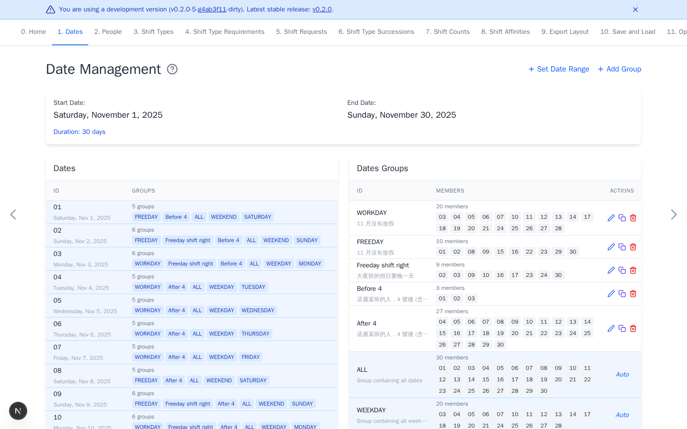

# Dates

[Open Dates](https://nursescheduling.org/dates){ .md-button .md-button--primary }

Dates define the scheduling period. Setting the range is required. Custom date
groups are optional and can be added later.

## Real scenario example

An anonymized ward schedules November 1 through 30, 2025. `WORKDAY` and
`FREEDAY` separate staffing days. `Before 4` and `After 4` let later rules use
different priorities around a team change on November 4.

## Set the range

1. Select **Set Date Range**.
2. Enter the first and last date.
3. Review the warnings. Holiday import is optional.
4. Select **Update**.

The app creates one date item per day and automatic groups such as `ALL`,
`WEEKDAY`, `WEEKEND`, and weekday names.

!!! warning "Changing an established range"

    Rules lose references to dates that disappear. References can also be
    removed when the generated date ID format changes. Review every rule after
    changing the range.

## Add date groups

Groups let later rules target several dates at once. Skip this step when the
automatic groups cover your needs or you are unsure. You can add a group later,
then select it in new or edited staffing and preference rules.

1. Select **Add Group**.
2. Enter a descriptive ID, such as `odd` for odd-numbered dates or `After 4`
   for dates on or after a cutoff.
3. Select the member dates. Drag across dates for repeated selection.
4. Select **Add**.

Automatic groups cannot be renamed or deleted.

## Import Taiwan calendar groups

Holiday import can create or replace editable `WORKDAY` and `FREEDAY` groups.
Use it only when these groups match the workplace calendar. It supports ranges
within `2023-01-01` through `2026-12-31`. Follow the in-app warning for Labor
Day in 2023 and 2024, then adjust May 1 when needed.

Continue with [People](people.md).
