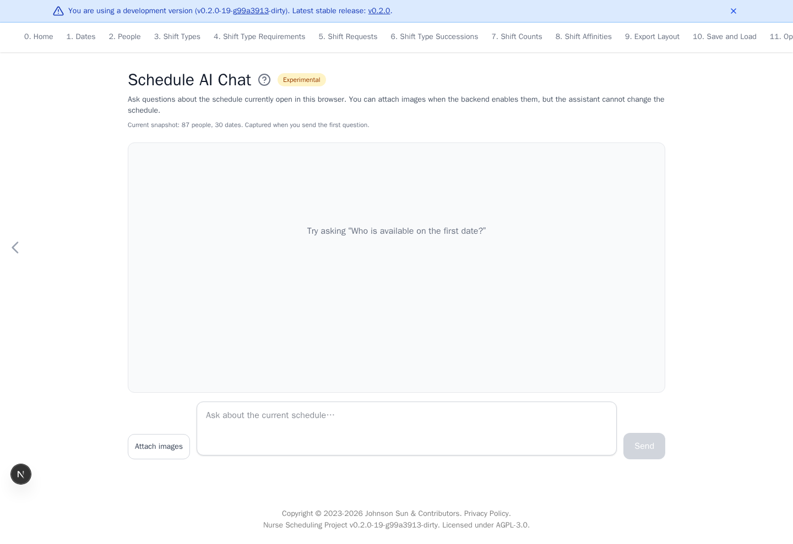

# Experimental AI Chat

[Open Experimental AI](https://nursescheduling.org/experimental-ai){ .md-button .md-button--primary }

!!! warning "Experimental"
    AI answers may be incorrect. Verify them against the schedule before use.

The hosted assistant is an API-key-gated beta. See
[AI Beta Access](https://github.com/j3soon/nurse-scheduling#ai-beta-access)
to request access.

This page answers questions about the schedule currently open in the browser.
A question can include files of any type when **Attach files** is available.
The assistant can inspect common text, image, PDF, and spreadsheet formats in
its temporary workspace. The assistant can propose changes to the schedule,
which apply only after you approve them. The assistant can also run the
optimizer and review its result.

## Build from ward requirements

Use [Build a Real Schedule](build-a-real-schedule.md) for the app workflow and
the 87-person example. If file attachment is available and the source contains
no sensitive data, ask the assistant to inspect the workbook. Have it list the
people, dates, staffing levels, requests, history, and any unclear
notation before proposing a schedule change. A `1`, a color, or a short shift
code can mean different things in different wards. Confirm those meanings and
group memberships with the person preparing the schedule.

Work in stages. First establish staffing, qualifications, required assignments,
and rest rules. Then add nurse requests, monthly shift-team preferences, and
fairness targets. After each proposed change, review the diff before approving
it. Run the optimizer, inspect coverage and the distribution of days off, and
ask for empirical adjustments. Values such as 11 `OFF` days or a particular
weight are examples to tune, not defaults for every ward.

The assistant can inspect an attached workbook and propose schedule changes,
but it cannot click through the app or run its upload controls for you. Use the
[People](people.md) and [Shift Requests](shift-requests.md) pages for bulk
imports. Read the [privacy policy](https://github.com/j3soon/nurse-scheduling/blob/dev/PRIVACY.md#experimental-ai)
before attaching any ward records.

## Ask the assistant to optimize

Ask the assistant to optimize the current schedule and describe the result or
improve a specific outcome. The assistant starts the run in the background, so
you can continue chatting while it solves.

- Ask it to **finish now** to request the best solution currently available.
- A small status indicator remains above the message box while optimization is
  running.
- A background assistant command also shows a running indicator there, even
  when tool details are hidden.
- When the run ends, the chat records its outcome, score, solver and timeout,
  backend URL and version, and any claimed performance. It offers the result
  workbook as a download. The
  assistant receives the score and a copy of the workbook in its workspace. It
  can inspect relevant spreadsheet sections to answer questions about the result,
  including in later chat turns while the result remains available.
- The assistant wakes automatically and replies in a new turn.
- The assistant may propose a YAML change and run the optimizer again. The
  changed YAML still requires your approval before it replaces the schedule in
  the browser.

The optimizer runs for up to 300 seconds (five minutes) by default. Ask the
assistant for a different timeout when needed. A deployment may set another
default. One chat may start 50 optimizer runs by default.

Optimizer completion reports explain when an automatic request audit is unavailable.
Custom export text outside bracketed annotations can prevent the audit.

Before submission to the optimizer, the AI service applies the same basic
anonymization as **Optimize and Export**: it replaces person IDs and removes
description fields. It restores person IDs in the downloaded workbook. Dates,
shifts, groups, and rules can still reveal sensitive information.

Each run records the exact YAML revision it used. If the browser schedule
changes before the result returns, the assistant can distinguish that older
result from the current accepted schedule.

## Review a proposed change

Ask for a change, such as renaming a person or adding a shift request, and the
assistant proposes one instead of changing the schedule itself.

1. Ask for the change in the usual way.
2. Read **Proposed schedule change**, which lists every difference between your
   current schedule and the proposal.
3. Select **Approve** to apply it, or **Reject** to discard it.
4. An approved proposal replaces the schedule in one step, so
   <kbd>Ctrl</kbd>+<kbd>Z</kbd> reverts the whole change.

## See what the assistant did

**Chat history context** below the message box shows the portion of the server's
conversation history budget selected for the next turn. It excludes instructions,
schedule data, tools, and attachments. If the server does not report usage, the
chat displays **unavailable**. Update the AI server to enable the percentage.

When the provider reports token usage, the line also shows **Tokens:
used / limit**. It counts the tokens of the latest model request, including
instructions, tool output, and the reply. A turn with long tool output can
therefore use many more tokens than its history percentage suggests.
The server reads the limit from the provider's model metadata. If the provider
does not report a limit, the chat shows **unavailable** for the limit.

Small grey rows under an answer record how it was produced. They stay collapsed
until you select one.

- **Reasoning** shows the model's own thinking for that step.
- The `bash` tool shows the command the assistant ran and its bounded output.
  The assistant may read task-sized schedule references from the temporary
  sandbox when it needs schema guidance.
- **schedule edit** shows the changed lines after a Bash command changes the
  temporary schedule. Red lines were removed and green lines were added. This
  is a preview only. The current schedule still changes only after you approve
  the final proposal.
- A row marked `failed` means that step changed nothing. This is the usual
reason an answer arrives without a proposal.
- The `optimizer` tool shows whether the assistant started, checked, or asked
  the current optimization to finish.

Long output is revealed a portion at a time with **Show more**. Clear
**Show reasoning** or **Show tool activity** near the top of the page to hide
either kind. The choice is remembered on this browser.

Approval is refused when the schedule changed after the proposal was made. Ask
again so the assistant works from what you now have.

If a turn fails, read the error below the chat. A provider error can include an
HTTP status and an error ID to share when reporting the problem. A schedule
validation error explains the invalid value or field. Failed validation discards
that turn's edits and keeps your current schedule.

## Real scenario example

For the anonymized 87-person ward example, load
`large-ward-with-87-people-2025-11.yaml`, then open **Experimental AI**. Confirm
that the snapshot shows 87 people and 30 dates before asking a question.

The blue development-version banner appears only in non-release builds.

## Ask about a schedule

1. Finish editing or load the intended schedule.
2. Open **Experimental AI**.
3. Confirm the displayed people and date counts.
4. If **Attach files** is available, optionally select files and confirm the
   displayed names. Remove an incorrect file with its **×** button.
5. Enter a question and select **Send**. Press <kbd>Enter</kbd> to send or
   <kbd>Shift</kbd>+<kbd>Enter</kbd> for a new line. Where browser speech
   recognition is available, select the microphone to dictate the question.
6. While the assistant is working, enter another message and select **Queue**
   to steer the same turn after its next tool call. This does not cancel work
   already in progress.
7. Select **Stop** to interrupt a response in progress.
8. If you scroll up in a long conversation, use the floating down-arrow button
   to return to the composer and latest message.

The animated **Thinking** indicator means the assistant is waiting for its
first response text.

Assistant answers render Markdown, including headings, lists, links, code, and
tables. Use the copy icon at the top-right of a code block to copy its contents.
Raw HTML is ignored. Remote images written in an answer are not loaded.
Use **HTML** under **Export chat** for a styled, standalone transcript, or
**Markdown** for a plain-text transcript. Export runs in the browser. The export
also lists the uploaded files by name and size, includes a proposal that is
waiting for approval, and notes an optimization that is still running without
its changing score.

When the assistant creates files for download, it puts them in one ZIP archive.
Use **Download files (ZIP)** below its answer. The archive and its uncompressed
contents are each limited to 50 MB by default. Downloads remain available while
the chat session exists, subject to the service memory limit. A workspace path
printed in an answer is not itself a download link. Each message uses a fresh
temporary workspace, and other files created during a response disappear when
that workspace closes.
Use **Remove ZIP** after saving a file you no longer need in the chat. This frees
session storage for new files and removes that ZIP's download button.

## Ask how to use the app

The assistant runs inside the existing Nurse Scheduling app and can explain
which page and visible control to use for a task. For example, ask how to add a
person, upload schedule YAML, configure a rule, or start optimization. It can
guide you through those controls, but it cannot navigate, click, or upload for
you. It can always start optimization itself. An unavailable optimizer API
reports a tool error instead.

Files attached with **Attach files** remain available for later questions in the
same chat. The **Uploaded files** panel lists their names and sizes. Use **Remove**
when a file is no longer needed. Uploading a file with a name already in the list
keeps both files and adds a number to the new name, such as `ward (1).csv`.
The panel sits on the right on large screens and can be collapsed on smaller screens.
The file count and per-file size limits apply to retained uploads, and their bytes
share the service's session memory budget. A chat message can mention a removed
file, so upload it again if a later question needs it.
To replace the schedule currently open in the app directly, use **Upload** on
**Save and Load**.

The browser uploads one YAML snapshot when it creates the chat session. Later
questions in that session use the same service-held snapshot. The current
browser tab preserves the transcript when you switch pages or reload. A chat
expires after 48 hours without a message. Each new message renews that period,
and the page reports when a preserved chat has expired.
