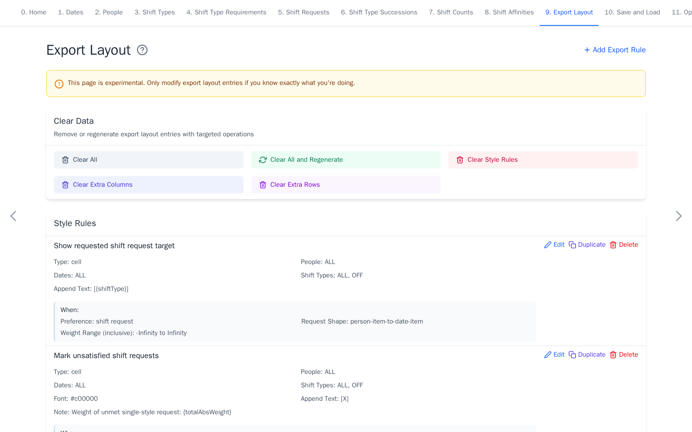

# Export Layout

[Open Export Layout](https://nursescheduling.org/export-layout){ .md-button .md-button--primary }

Export Layout controls workbook formatting and summaries when **Prettify XLSX**
is enabled. The default layout already marks weekends, requests, history, and
common counts. This page is optional. Skip it when the default workbook is
sufficient.

## Real scenario example

The anonymized ward does not define a custom export layout. The app generates
the default style rules for requested and unmet shifts, which are sufficient
for its workbook.

!!! warning "Experimental"

    Keep the default layout for the first run. Download a YAML backup before
    making extensive changes.

## Customize the layout

- **Style** changes selected cells, rows, columns, or history areas.
- **Extra Column** adds a per-person count over selected dates and shifts.
- **Extra Row** adds a per-date count over selected people and shifts.

Use `#RRGGBB` color values. Count coefficients are optional and default to `1`.
Rules apply in displayed order within each section, so later styles can change
earlier ones.

Select **Add Export Rule** to create a rule. Use the clear and regenerate
controls to recover the default layout when an experiment is no longer useful.
Renaming or deleting people, dates, or shifts updates layout references. For a
custom summary, an **Extra Column** can count one shift across `ALL` dates for
each person.

The solver model is unchanged by export layout rules. Continue with
[Save and Load](save-and-load.md) or [Optimize and Export](optimize-and-export.md).
