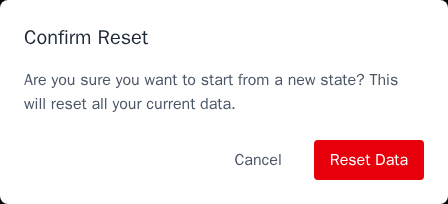
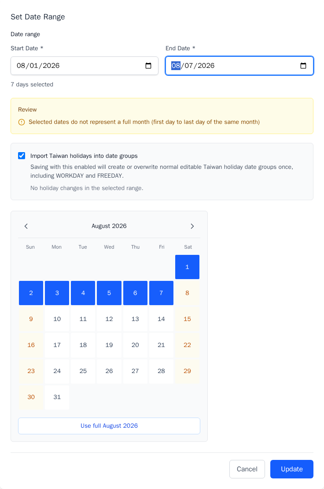
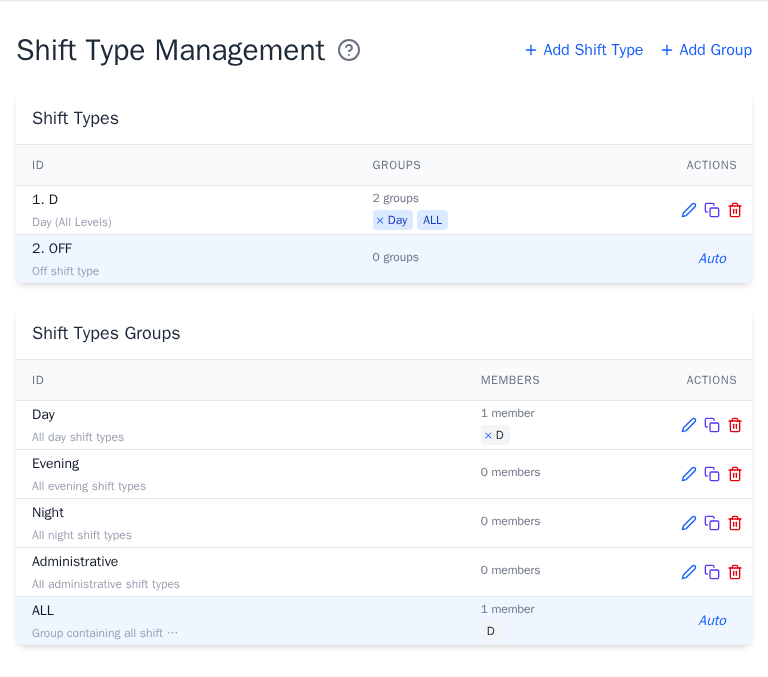
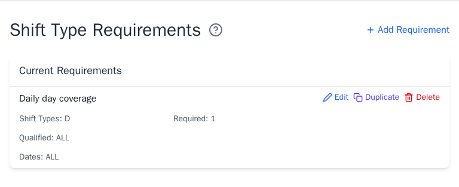
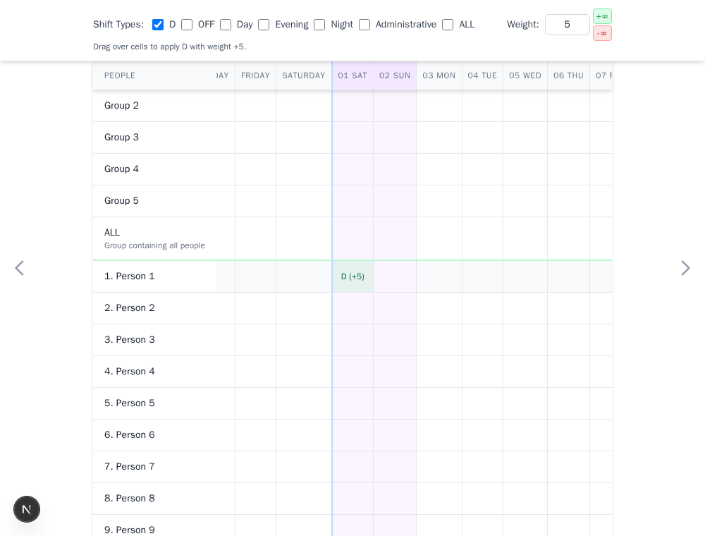
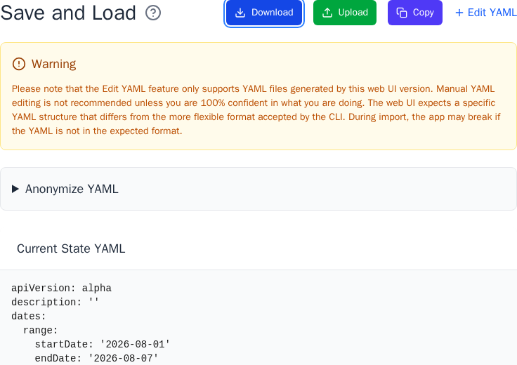
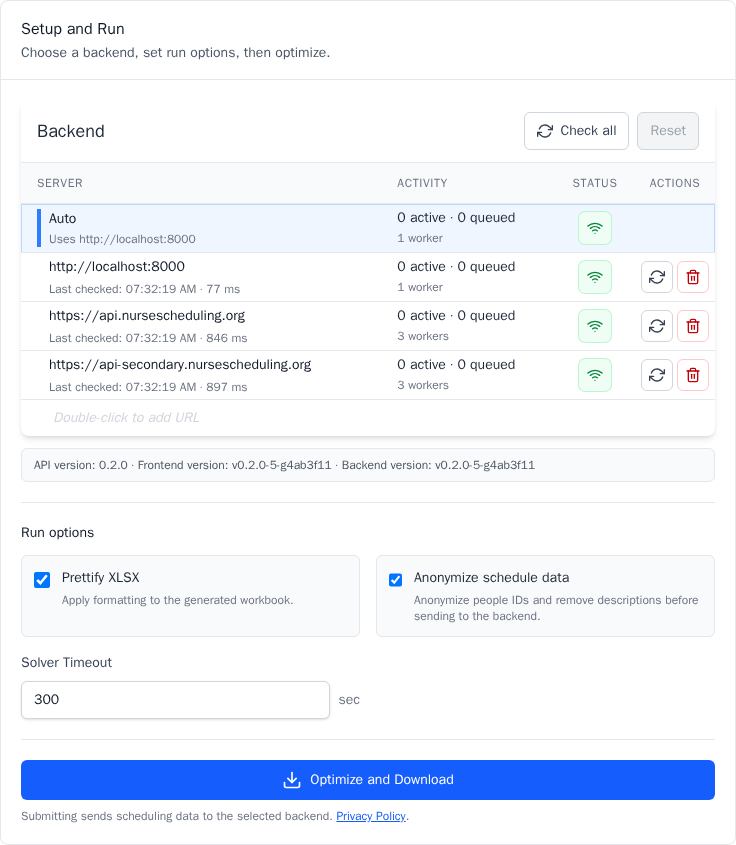
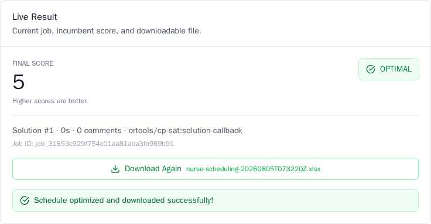
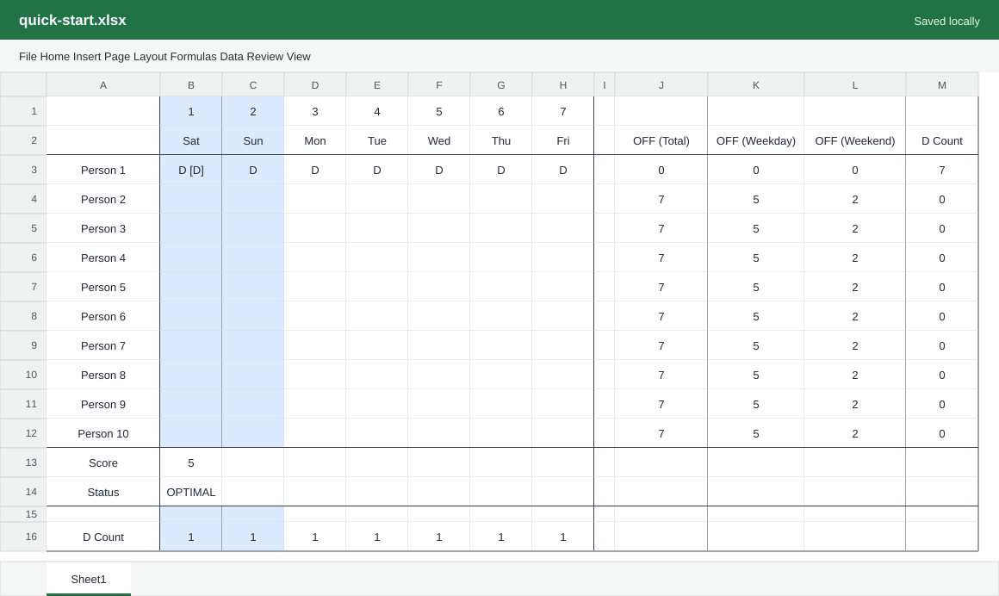

# Quick Start

This walkthrough creates a small test schedule, saves a backup, and downloads
an optimized workbook. It was validated with the frontend and backend running
locally.

!!! warning "Protect scheduling data"

    Use test names until your organization approves this system. The hosted
    app stores the schedule in your browser and sends it to the selected
    optimization server. It also uses Google Analytics and Sentry for
    analytics, replay, and error reporting. Error reports may attach partly
    anonymized scheduling YAML. **Anonymize schedule data** does not remove
    every potentially sensitive field. Read the full [privacy
    policy](https://github.com/j3soon/nurse-scheduling/blob/dev/PRIVACY.md).

## 1. Start a schedule

1. Open the [Nurse Scheduling app](https://nursescheduling.org/).
2. Select **New Schedule**, then **Reset Data**.
3. Select **Continue**.

Resetting replaces the current browser data with starter people and shift
types. Download a YAML backup first when replacing useful work.

## 2. Choose the dates

1. On **Dates**, select **Set Date Range**.
2. Enter the first and last scheduling dates.
3. Keep **Import Taiwan holidays into date groups** enabled only when those
   groups match your workplace calendar.
4. Select **Update**.

The app creates one date item per day and common groups such as `ALL`,
`WEEKDAY`, and `WEEKEND`.

## 3. Check people and keep one shift

1. On **People**, leave the starter people unchanged for this test.
2. On **Shift Types**, delete every working shift except `D`.
3. For a real schedule, manage people and qualification groups on the
   [People](people.md) page. Keep workplace shifts and create groups such as
   `Day` or `Night` when several shifts share rules.

The `ALL` groups and `OFF` shift type are maintained automatically.

## 4. Add minimum staffing

1. On **Shift Type Requirements**, select **Add Requirement**.
2. Select one shift type or shift-type group.
3. Enter **Required Number of People**.
4. Select the qualified people or a people group.
5. Select the dates or a date group.
6. Select **Add**.

For this test, choose shift `D`, required `1`, qualified `ALL`, and dates `ALL`.
For a real schedule, define every staffed shift and date. The coverage warning
lists missing pairs that the solver may otherwise fill arbitrarily.

## 5. Add a request

1. On **Shift Requests**, select **Quick Add Preference**.
2. Choose shift `D` and enter weight `5`.
3. Select a person and date cell. Drag across cells to apply the same request
   to several dates.

Positive weights prefer the selected shift. Negative weights avoid it. Larger
absolute values have higher priority.

## 6. Save a backup

1. On **Save and Load**, select **Download**.
2. Keep the YAML file with the scheduling records for this period.
3. To restore it later, select **Upload** and choose the same file.

Do not edit the YAML by hand unless you understand the web app's expected
format.

## 7. Optimize and download

1. On **Optimize and Export**, confirm **Server: Online**.
2. Leave **Prettify XLSX** and **Anonymize schedule data** enabled for the first
   run.
3. Keep the default timeout unless the schedule needs more solve time.
4. Select **Optimize and Download**.

The first online compatible server is selected in **Auto** mode. Submitting
sends the schedule to that server. Anonymization applies to the outbound YAML.
The downloaded workbook restores the original people IDs.

When the run succeeds, the browser downloads an XLSX file. **Download Again**
is available on the result panel while that result remains open.

## 8. Review the workbook

Open the XLSX and confirm:

- every person and date is present
- each staffed shift has the required coverage
- the individual request from this walkthrough was satisfied or marked `[X]`

Adjust the rules and optimize again when the result needs improvement. See
[Interpret the result](optimize-and-export.md#interpret-the-result) for cell
annotations and summaries.

Next, open the guide for the page you want to refine:

- [Staffing requirements](shift-type-requirements.md)
- [Requests](shift-requests.md)
- [Optional rules](shift-type-successions.md)
- [Optimization and workbook results](optimize-and-export.md)
