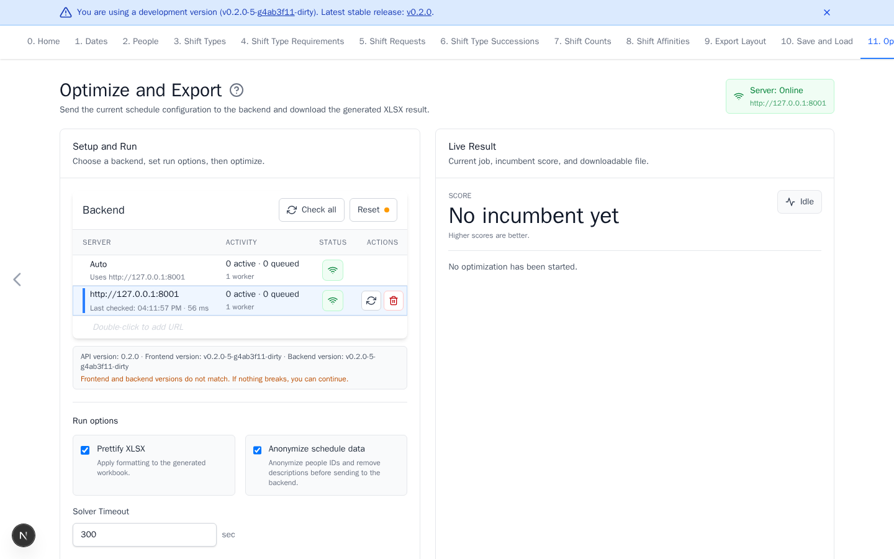

# Optimize and Export

[Open Optimize and Export](https://nursescheduling.org/optimize-and-export){ .md-button .md-button--primary }

This page sends the schedule to a solver and downloads the XLSX result. Server
selection and submission are required. Workbook formatting, anonymization, and
timeout changes are optional.

## Real scenario example

For the anonymized 87-person ward, confirm an approved backend is online,
leave workbook formatting and anonymization enabled, and allow enough solve
time for the larger model. The screenshot shows the configuration before a run
starts.

## Before submitting

- Resolve undefined staffing coverage.
- Review duplicate coverage and remove unintended overlap.
- Check hard requests, successions, and counts for conflicts when those optional
  rules are used.
- Download a current [YAML backup](save-and-load.md).

## Run optimization

1. Use **Auto** for the first online compatible backend, or select an approved
   server explicitly.
2. Optional: keep **Prettify XLSX** enabled to apply Export Layout.
3. Optional: review **Anonymize schedule data**. Keep it enabled unless there
   is an approved reason to send original people IDs.
4. Optional: change the timeout when the default is unsuitable.
5. Select **Optimize and Download**.

Anonymization applies to YAML sent to the server. Dates, groups, shifts, and
rules may remain sensitive. The browser restores original people IDs in the
downloaded workbook.

Stay on the page until download or cancellation. Optional controls are **Get
Results Now**, which asks the backend to finish with its best result so far,
and **Cancel**, which stops the job without a workbook.

## Interpret the result

`OPTIMAL` means the solver proved the best score for this model. A feasible
result can still be useful when the timeout ends first. Compare scores only
between runs of the same model.

Rows in the workbook are people. Date cells contain shift IDs, and a plain
blank means `OFF`. For individual-person to individual-date requests, the
default layout appends `[shift]` and adds `[X]` when the request is unmet.
Count summaries appear at the edges. **Score** and **Status** appear below the
schedule.

## Fix common problems

| Problem | What to do |
| --- | --- |
| Optimize is disabled | Add dates, at least one person, and one shift. Wait for the server check. |
| Server is offline or incompatible | Select **Check all**, start the approved backend, or select another compatible server. |
| Undefined staffing | Add a requirement for every listed date and working shift. |
| Duplicate staffing | Remove unintended overlap. Intentional layered requirements all apply. |
| Result is infeasible | Check hard staffing, requests, successions, counts, and qualified people. Relax one rule at a time. |
| Timeout returns a feasible result | Review it as an unproven best result, or increase the timeout and retry. |
| Download fails | Use **Download Again**, allow site downloads, then retry. |
