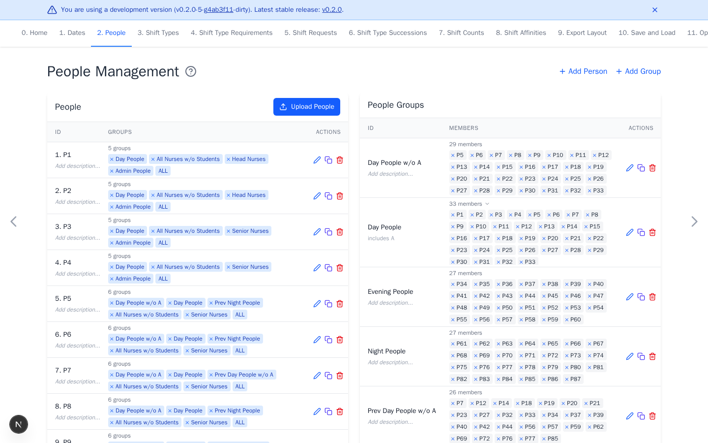

# People

[Open People](https://nursescheduling.org/people){ .md-button .md-button--primary }

Adding people is required. Groups are optional and can be added later when a
rule needs to target several people together. Use recognizable IDs that do not
expose unnecessary personal information.

## Real scenario example

An anonymized ward contains 87 people named `P1` through `P87`. Groups such as
`Day People`, `Evening People`, `Night People`, `Senior Nurses`, and `Students`
are reused in staffing and preference rules.



## Add people

- Keep at least one person. The starter people are sufficient for an initial
  test.
- For a real schedule, double-click starter IDs to replace them with the actual
  roster. Select **Add Person** for additional entries.
- Optional: add descriptions or drag rows to control workbook order.

Deleting or renaming a person updates references in preferences and export
layout rules. Review affected rules after a change.

## Add people groups

Groups make later qualification, request, count, and affinity rules easier to
target. Skip groups when you are unsure. You can add them later, then select
them in new or edited rules.

1. Select **Add Group**.
2. Enter a descriptive ID, such as `Senior Nurses` or `Students`.
3. Select the member people, then select **Add**.

Groups may overlap. The automatic `ALL` group always contains every person.

## Upload people

Upload a `.txt` or `.csv` file with one person ID per line. Both extensions use
the same newline parser. It trims each line, then ignores blank lines and lines
whose trimmed text begins with `#`. Commas and quotation marks are literal ID
characters. The upload does not parse CSV fields.

```text
P1
P2
# Temporary staff below
P3
```

The upload accepts at most 1000 IDs after removing blank lines and comments,
and rejects duplicate IDs. Listed existing IDs are reordered, while new IDs
are added. Existing people omitted from the file are appended in their
original order and are not deleted.

Optional previous-shift history is managed on [Shift Requests](shift-requests.md).
Continue with [Shift Types](shift-types.md).
