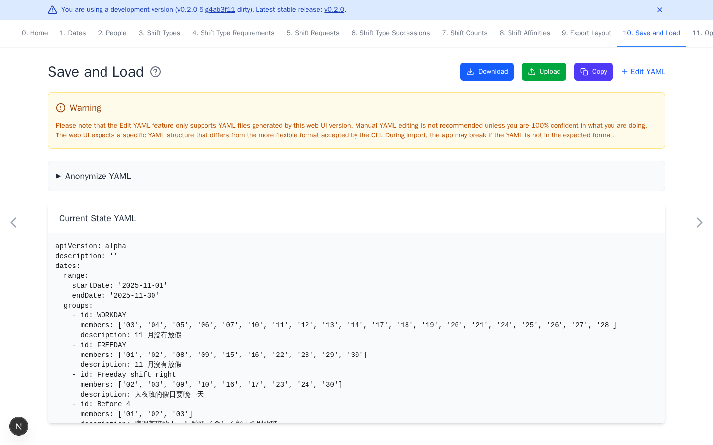

# Save and Load

[Open Save and Load](https://nursescheduling.org/save-and-load){ .md-button .md-button--primary }

The app stores the schedule and up to 50 recent states in this browser. Browser
cleanup, private browsing, another device, or **New Schedule** can make that
data unavailable. This page is optional for a first test, but downloading a
backup is strongly recommended for useful work.

## Real scenario example

The anonymized ward YAML contains the November 2025 range, 87 people, shift
groups, and 181 preference rules. After upload, the preview confirms the dates
and groups before any page is edited.

## Back up and restore

- **Download** saves the current schedule as YAML.
- Optional **Upload** replaces the current schedule with a selected YAML file.
- Optional **Copy** copies the same YAML to the clipboard.
- Optional **Edit YAML** is only for users who understand the web app schema.

Keep one backup for each useful scheduling period. After an upload, review the
dates, people, shifts, and requirements before optimizing. Prefer the app
version that created the file when a version warning appears.

## Download anonymized YAML

**Anonymize YAML** creates a separate download and does not change browser
data. Free-text descriptions remain unchanged. Review the result before
sharing it because dates, groups, shifts, histories, preferences, and export
configuration can remain sensitive.

The hosted app also uses analytics and error reporting. Read the full [privacy
policy](https://github.com/j3soon/nurse-scheduling/blob/dev/PRIVACY.md) before
using real scheduling data.
