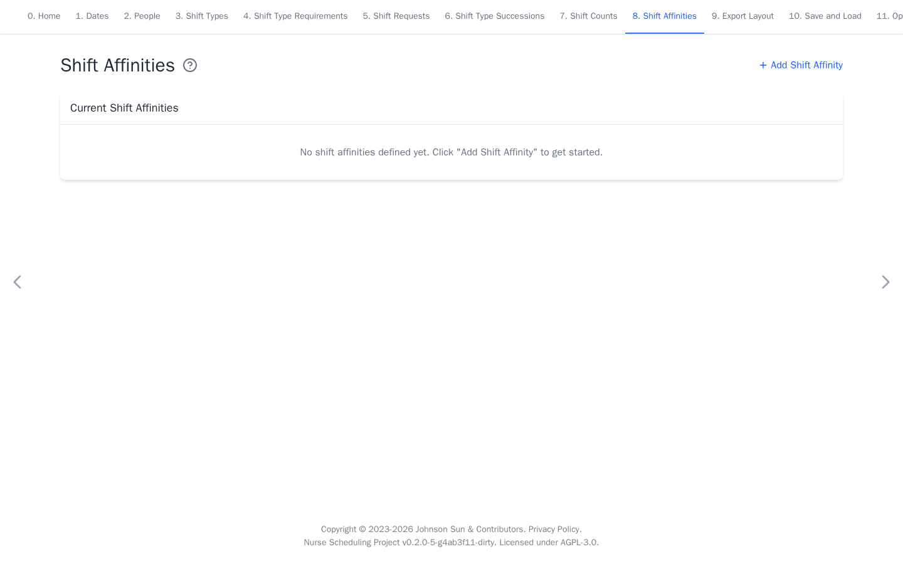

# Shift Affinities

[Open Shift Affinities](https://nursescheduling.org/shift-affinities){ .md-button .md-button--primary }

Affinities encourage or discourage selected people working on the same date.
This page is optional. Skip it when no working-together rule is needed.

## Real scenario example

The anonymized 87-person ward uses no affinity rules. Its staffing, requests,
successions, and counts are sufficient, so this page remains empty.

## Add an affinity

1. Select **Add Shift Affinity**.
2. Select dates, **People 1**, **People 2**, and shift types.
3. Use a positive weight to encourage matches or a negative weight to
   discourage them.
4. Select **Add**.

A match means the selected people work any selected shift on the same date.
When a shift group is selected, they need not work the same concrete member
shift. Use one concrete shift when that distinction matters.

Every top-level entry in **People 1** is checked with every top-level entry in
**People 2**. Individual IDs form individual pairs. A selected group remains
one collective condition and matches when any member on each side works a
selected shift. It does not create a separate rule for every member pair.
Avoid overlapping selectors when a person should not match themselves.
