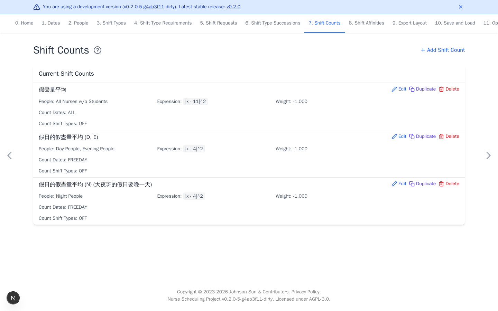

# Shift Counts

[Open Shift Counts](https://nursescheduling.org/shift-counts){ .md-button .md-button--primary }

Count rules control workload totals for each selected person. This page is
optional. Skip it when staffing requirements alone describe the workload.

## Real scenario example

The anonymized ward prefers 11 `OFF` days for each non-student nurse. Separate
rules prefer four freedays for day, evening, and night teams. Each uses squared
distance with weight `-1000`, so closer counts score better.

## Add a count rule

1. Select **Add Shift Count**.
2. Select people, dates, and shifts to count.
3. Choose an expression and target `T`.
4. Set the weight and select **Add**.

| Expression | Meaning |
| --- | --- |
| `x >= T` | At least `T` matching shifts |
| `x <= T` | At most `T` matching shifts |
| `x = T` | Exactly `T` matching shifts |
| `x > T` or `x < T` | Strict bound |
| <code>&#124;x - T&#124;^2</code> | Prefer a count close to `T` |

A people group expands to its members, and the rule is evaluated separately
for each person. Shift coefficients change how selected assignments contribute
to `x`. Coefficients are optional. Leave them at `1` for an ordinary count.

Use finite weights when a target may be traded against other preferences. Use
infinity only for a limit that must not be violated.
