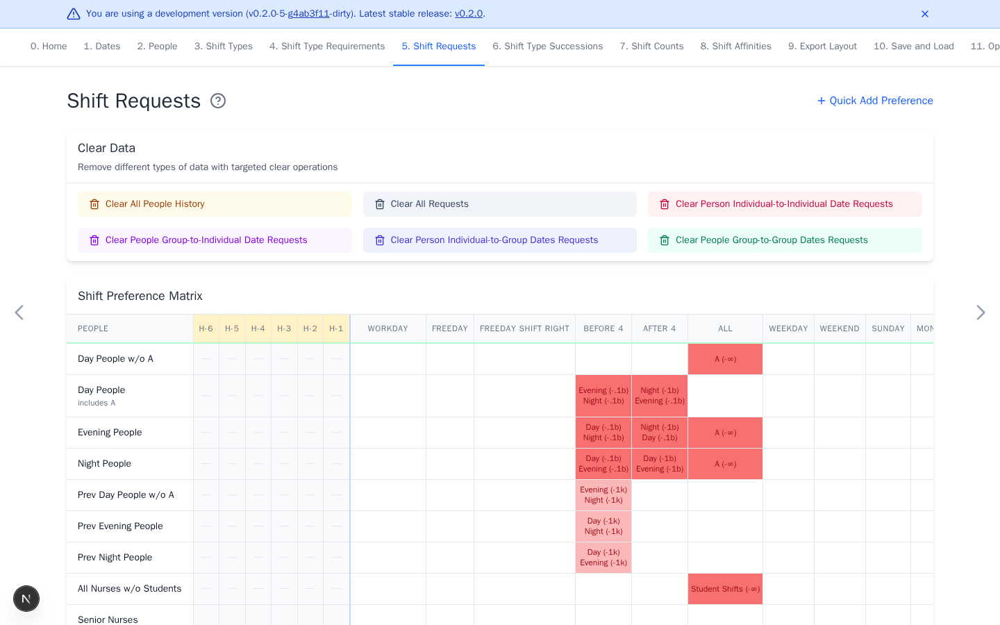

# Shift Requests

[Open Shift Requests](https://nursescheduling.org/shift-requests){ .md-button .md-button--primary }

Requests record preferred or avoided assignments for people and dates. This
page is optional. Skip it when the schedule has no individual preferences.

## Real scenario example

The anonymized ward uses group requests to keep day, evening, and night teams
on their usual shift families. Red cells show discouraged or forbidden work.
History columns `H-1` through `H-6` let succession rules cross into November.



## Add requests

- Select a matrix cell to edit detailed requests.
- Select **Quick Add Preference**, choose shifts and a weight, then click or
  drag across cells for repeated entries.
- Positive weights prefer a shift. Negative weights avoid it.
- Green cells are positive, red are negative, and yellow contain both.

Use finite weights for normal priorities. A `+∞` request should normally target
one concrete shift. On a multi-member group that does not cover every working
shift, it requires every member shift simultaneously and usually conflicts
with one shift per day. A group covering every working shift, including the
automatic `ALL` group, instead requires any non-`OFF` shift. A `-∞` request on
a group forbids every member. Conflicting hard requests make the schedule
infeasible.

## Add previous-shift history

Columns such as `H-1` describe shifts immediately before the date range. They
let [succession rules](shift-type-successions.md) cross the schedule boundary.
Select a history cell to edit it.

## Upload requests

Open **Quick Add Preference** and set the weight first. Upload one row per
current person with no header. The first column is the exact person ID. Later
columns match displayed dates and contain a shift ID or remain empty.

```text
P1,D,,N
P2,,E,
```

Every current person must appear exactly once. IDs must not contain commas.
Upload is merge-only. Non-empty cells add or update the selected shift and
weight. Blank cells do nothing. Clear existing requests first for replacement
behavior.

For history upload, use one row per current person with no header. Columns are
person ID, shift ID, and repetition count. The upload replaces each person's
history.

```text
P1,N,2
P2,D,1
```
