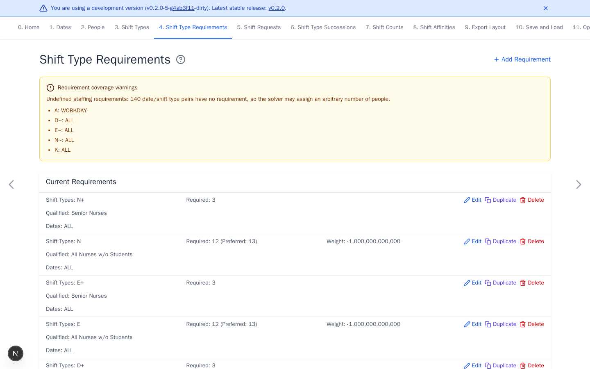

# Shift Type Requirements

[Open Shift Type Requirements](https://nursescheduling.org/shift-type-requirements){ .md-button .md-button--primary }

Requirements define staffing and who may work each staffed shift. Add coverage
for the working shifts and dates you need. Preferred staffing and coefficients
are optional refinements.

## Real scenario example

The anonymized ward requires three senior nurses on `N+` every day. It also
sets `N` to a minimum of 12 and a preferred level of 13 from `All Nurses w/o
Students`. Similar rules cover day and evening shifts.

The warning lists special shifts without fixed staffing totals. Review every
warning. Leave a pair undefined only when other rules intentionally control it.

## Add coverage requirements

1. Select **Add Requirement**.
2. Select one shift type or group.
3. Enter **Required Number of People**.
4. Select **Qualified People** and **Dates**.
5. Select **Add**.

## Staffing behavior

- With no preferred value, required is an exact staffing level.
- With a preferred value, required is the hard minimum and preferred is the
  hard maximum. The weight penalizes the gap from preferred.
- **Qualified People** forbids everyone else from the selected shifts and
  dates. Use `ALL` when everyone is eligible.
- A shift group has one aggregate total across its member shifts.

## Refine staffing

Set **Preferred Number of People** and a negative weight when staffing may vary
between a hard minimum and maximum. Leave it empty for an exact requirement.

Shift-type coefficients change how assignments contribute to that aggregate.
Leave them at `1` unless the workplace rule requires another contribution.
Do not define overlapping coefficients for a shift and a group containing it.

## Resolve warnings

Add a requirement for every undefined date and working-shift pair. Review
duplicate coverage and remove unintended overlap. Intentional layered
requirements are valid, and the solver applies all of them.

Continue with [Shift Requests](shift-requests.md) or go directly to
[Optimize and Export](optimize-and-export.md).
