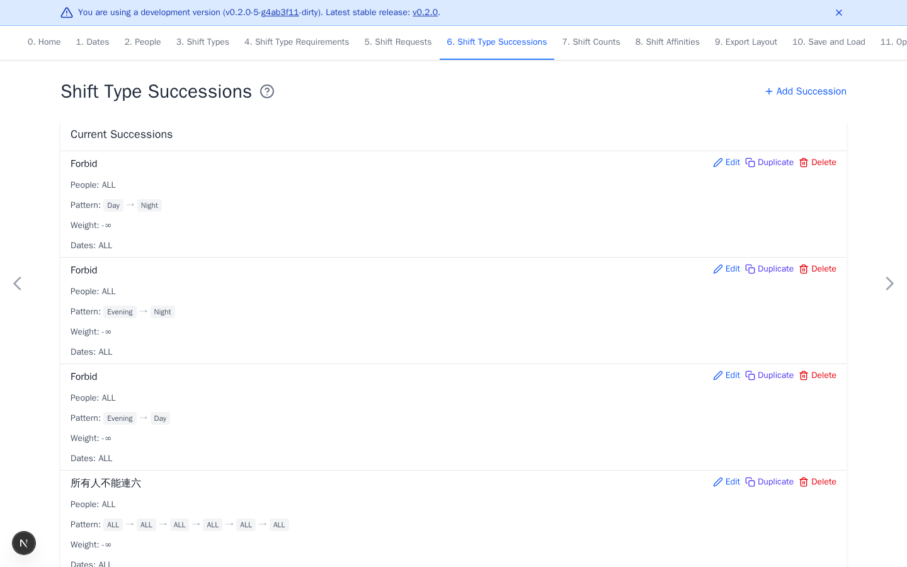

# Shift Type Successions

[Open Shift Type Successions](https://nursescheduling.org/shift-type-successions){ .md-button .md-button--primary }

Successions encourage or discourage an ordered pattern of at least two shifts.
This page is optional. Skip it when shift order does not need a rule.

## Real scenario example

The anonymized ward forbids `Day` then `Night`, `Evening` then `Night`, and
`Evening` then `Day` for everyone. It also forbids six consecutive working
days. Each rule applies on `ALL` dates.

## Add a succession

1. Select **Add Succession**.
2. Select the people or groups.
3. Select shifts in pattern order. Drag to reorder the pattern.
4. Select the dates where it should be evaluated. A pattern window is checked
   only when every date in that window belongs to the selection.
5. Set the weight and select **Add**.

A positive weight encourages the pattern. A negative weight discourages it.
Negative infinity forbids it.

Add previous shifts on [Shift Requests](shift-requests.md#add-previous-shift-history)
when the rule must cross the start of the scheduling period.

Use concrete shifts when the exact sequence matters. A shift group lets any
member satisfy that pattern position.
