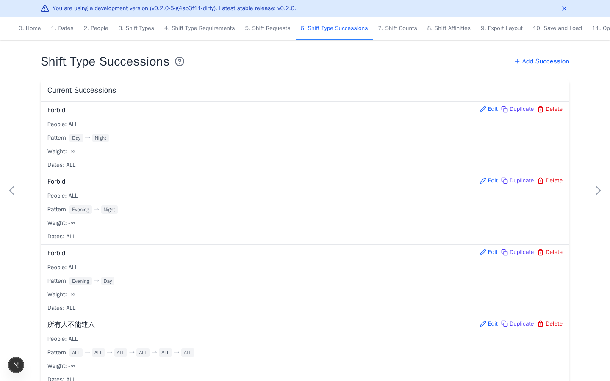

# Shift Type Successions

[Open Shift Type Successions](https://nursescheduling.org/shift-type-successions){ .md-button .md-button--primary }

Successions encourage or discourage an ordered pattern of at least two shifts.
This page is optional. Skip it when shift order does not need a rule.

## Real scenario example

The anonymized ward forbids `Day` then `Night`, `Evening` then `Night`, and
`Evening` then `Day` for everyone. It also forbids six consecutive working
days. These are rest and feasibility rules. `Night` then `Day` is possible but
disrupts the sleep cycle, so the ward gives it a strong finite penalty rather
than forbidding it. Each rule applies on `ALL` dates.

## Add a succession

1. Select **Add Succession**.
2. Select the people or groups.
3. Select shifts in pattern order. Drag to reorder the pattern.
4. Select the dates where it should be evaluated. A pattern window is checked
   only when every scheduled date in that window belongs to the selection.
5. Set the weight and select **Add**.

A positive weight encourages the pattern. A negative weight discourages it.
Negative infinity forbids it.

Decide which transitions truly cannot be worked with sufficient rest and
which are undesirable but negotiable. For the latter, tune finite penalties
to the ward's sleep-cycle policy. Smaller preferences can reward repeated
shifts in the same category or consecutive `OFF` days and discourage
fragmented rest.

Add previous shifts on [Shift Requests](shift-requests.md#add-previous-shift-history)
when the rule must cross the start of the scheduling period. A window must
include at least one date in the scheduling period. Patterns completed entirely
in history do not affect its feasibility or score.

Use concrete shifts when the exact sequence matters. A shift group lets any
member satisfy that pattern position.
