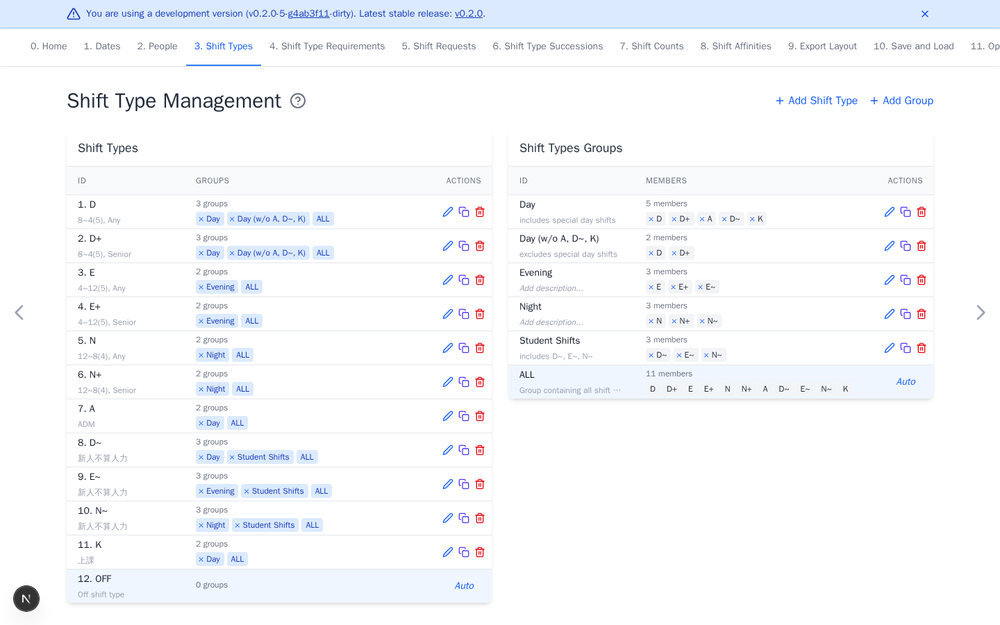

# Shift Types

[Open Shift Types](https://nursescheduling.org/shift-types){ .md-button .md-button--primary }

Adding at least one working shift type is required. Groups are optional and can
be added later when several shifts share a rule. Keep IDs short, such as `D`,
`E`, and `N`.

## Real scenario example

An anonymized ward uses day, evening, and night shifts with senior variants
such as `D+`. `D~`, `E~`, and `N~` identify student shifts that do not count as
regular staffing. Groups let later rules target an entire shift family.

## Add working shifts

1. Delete starter shifts the workplace does not use.
2. Select **Add Shift Type** for each missing working shift.

Optional: drag rows into the preferred workbook order.

`OFF` is the automatic no-work shift and should not be recreated. `ALL` is an
automatic group. Renaming or deleting a shift updates references throughout
preferences and export layout rules.

## Add shift groups

A group makes later rules easier to target across several shift types. Skip
groups when you are unsure. You can add them later, then select them in new or
edited rules.

1. Select **Add Group**.
2. Enter a descriptive ID, such as `Day`.
3. Select the member shift types, then select **Add**.

In a staffing requirement, selecting a group creates one aggregate total
across its member shifts. Create separate requirements when every concrete
shift needs its own staffing level.

Empty groups have no effect. Review group membership after deleting member
shifts. Continue with [Shift Type Requirements](shift-type-requirements.md).
