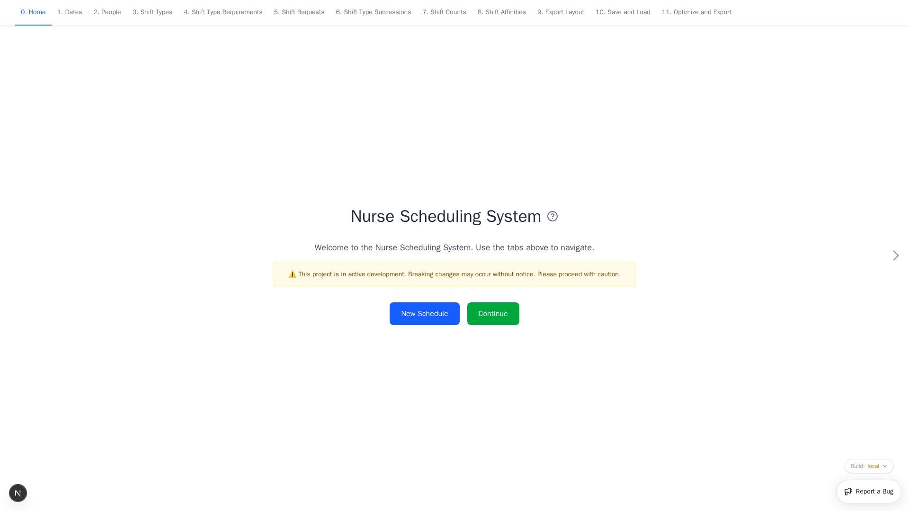

# Nurse Scheduling User Guide

Create a staff schedule in the browser, apply workplace rules, and export the
result to Excel.

[Open Nurse Scheduling](https://nursescheduling.org/){ .md-button .md-button--primary }
[Get a working result](user-guide/get-started.md){ .md-button }

## Home

Use **New Schedule** to replace browser data with the starter schedule. Back up
useful work first. Use **Continue** to open Dates without resetting anything.
The build selector at the lower right switches between available app builds.

## Guide by app page

| App page | What it controls |
| --- | --- |
| [Dates](user-guide/dates.md) | Scheduling period and reusable date groups |
| [People](user-guide/people.md) | People, qualifications, teams, and history |
| [Shift Types](user-guide/shift-types.md) | Working shifts and reusable shift groups |
| [Shift Type Requirements](user-guide/shift-type-requirements.md) | Staffing levels and qualifications |
| [Shift Requests](user-guide/shift-requests.md) | Preferred and avoided assignments |
| [Shift Type Successions](user-guide/shift-type-successions.md) | Encouraged or forbidden sequences |
| [Shift Counts](user-guide/shift-counts.md) | Workload targets and limits |
| [Shift Affinities](user-guide/shift-affinities.md) | Working together or apart |
| [Export Layout](user-guide/export-layout.md) | Workbook styles and summaries |
| [Save and Load](user-guide/save-and-load.md) | YAML backup, restore, and inspection |
| [Optimize and Export](user-guide/optimize-and-export.md) | Solver selection and XLSX download |

See [Screen and Control Reference](user-guide/reference.md) for shared controls,
keyboard shortcuts, weights, and automatic entries.

!!! warning "Active development"

    Breaking changes can occur. Back up each useful schedule as YAML and check
    the [privacy and data-handling guidance](user-guide/save-and-load.md#download-anonymized-yaml)
    before entering real information.

Developers and operators can use the [Developer Guide](developer-guide/index.md).
