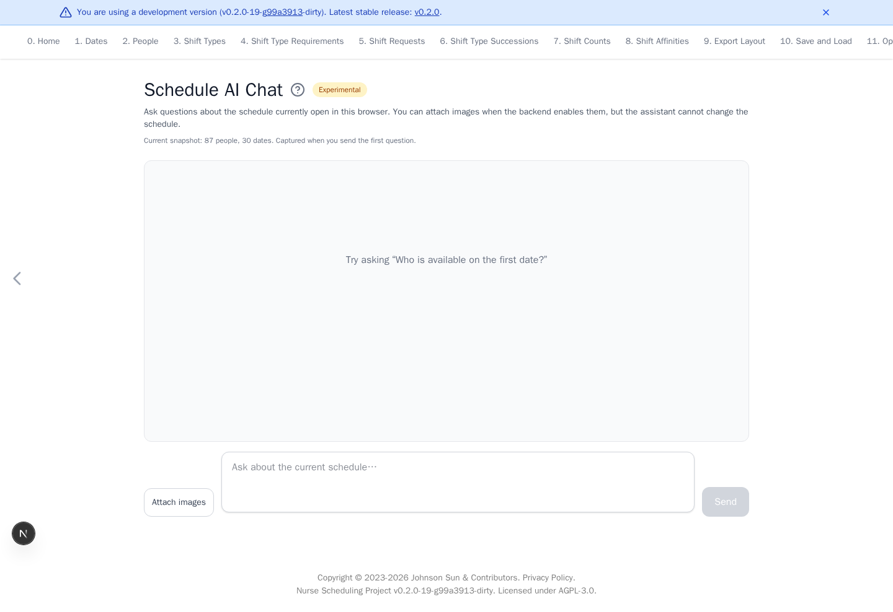

# Experimental AI Chat

[Open Experimental AI](https://nursescheduling.org/experimental-ai){ .md-button .md-button--primary }

!!! warning "Experimental"
    AI answers may be incorrect. Verify them against the schedule before use.

This page answers questions about the schedule currently open in the browser.
When enabled by the AI backend, PNG, JPEG, and WebP images can accompany a
question. The assistant cannot change the schedule or run optimization.

## Real scenario example

For the anonymized 87-person ward example, load
`large-ward-with-87-people-2025-11.yaml`, then open **Experimental AI**. Confirm
that the snapshot shows 87 people and 30 dates before asking a question.

The blue development-version banner appears only in non-release builds.

## Ask about a schedule

1. Finish editing or load the intended schedule.
2. Open **Experimental AI**.
3. Confirm the displayed people and date counts.
4. If **Attach images** is available, optionally select images and confirm the
   previews. Remove an incorrect image with its **×** button.
5. Enter a question and select **Send**. Press <kbd>Enter</kbd> to send or
   <kbd>Shift</kbd>+<kbd>Enter</kbd> for a new line.
6. Select **Stop** to cancel a response in progress.

The browser uploads one YAML snapshot when it creates the chat session. Later
questions in that session use the same backend-owned snapshot. Reload the page
to begin a new chat from the latest schedule.

## Data and limitations

The complete schedule YAML is sent to the configured AI backend and model
provider. Attached images are also sent to that provider for the current
question. They are not retained in backend chat history. People IDs,
descriptions, rules, dates, and images may be sensitive. Use only an approved
provider and anonymize sensitive data first when required.

Chat sessions use unguessable identifiers but do not have account
authentication yet. Sessions are stored in AI-backend memory and disappear
when that process restarts. Model answers may be incorrect, so verify them
against the schedule.
